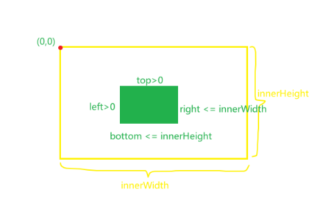

## [【DocumentFragment】](https://github.com/pro-collection/interview-question/issues/722)

> 详见`./documentFragmentApi.html`

`DocumentFragment` 是 Web API 中的一部分，它是 DOM （文档对象模型）的一个非常轻量级的节点，代表一组 DOM 节点的集合。

- 它不是一个真实存在于 DOM 中的实体
- 通常用来作为**临时**的 DOM 节点仓库。
- 一旦整个 `DocumentFragment` 插入到 DOM 的一个**永久节点**上，那么在 `DocumentFragment` 内进行的更改将会触发 DOM 的重新渲染。

### 特点和用途

- 轻量级：`DocumentFragment` **不会引起布局重排**，因为其不是真实渲染的一部分。
- 节点集合：可以在 `DocumentFragment` 中节点集合进行分组，这个集合可以一次性插入到 DOM 的某一部分中。
- **性能优化**：通过在一个 `DocumentFragment` 中构建好一大块 DOM 树，然后将它整体插入到主 DOM 中，从而减少重排次数，提高效率。
- **事件不冒泡**：因为 `DocumentFragment` 不是真实渲染的一部分，所以它的事件不会冒泡到上层的 DOM 元素，除非它被插入到了 DOM 中。

### 使用场景

- 批量操作：当你想要一次性添加多个节点到 DOM 树中时，使用 `DocumentFragment` 可以将这些节点预先堆放在一个轻量级对象中，然后一次性添加。
- 离屏操作：如果你需要创建复杂的 DOM 结构，可以通过 `DocumentFragment` 在不触发页面重排和重绘的情况下进行。
- 内容填充：在填充 DOM 元素内容之前，可以先创建一个 `DocumentFragment` 完成所有节点的添加和排序，然后把它添加到 DOM 树中。
- 避免内存泄漏：在某些情况下，它可以作为防止因移动节点而造成的内存泄漏的一个办法。

## 【如何判断 dom 元素是否在可视区域】

<!-- 【热度: 846】 -->

### 1. getBoundingClientRect() ⽅法



```js{2,6}
function isInViewport(element) {
  const rect = element.getBoundingClientRect()
  const { top, left, bottom, right } = rect
  const height = window.innerHeight || document.documentElementclientHeight
  const width = window.innerWidth || document.documentElement.clientWidth
  return top >= 0 && left >= 0 && bottom <= height && right <= width
}
// 示例
const element = document.getElementById('my-element');
if (isInViewport(element)) {
  console.log('在可视区域')
} else {
  console.log('不在可视区域')
}
```

### 2. IntersectionObserver API

- 该 API 可以观察元素与其祖先元素或视⼝交叉的情况，并且可以设置回调函数，当元素的可⻅性发⽣变化时会调⽤该回调函数。
- 使⽤ IntersectionObserver API 的优点是可以减少不必要的计算和事件监听，提⾼了性能

```js{3,11,13}
function callback(entries, observer) {
  entries.forEach((entry) => {
    if (entry.isIntersecting) {
      console.log('Element is in viewport')
    } else {
      console.log('Element is not in viewport')
    }
  })
}

const observer = new IntersectionObserver(callback)
const element = document.getElementById('my-element')
observer.observe(element)
```

## 【在表单校验场景中， 如何实现⻚⾯视⼝滚动到报错的位置】

- 滚动指定位置：`element.scrollIntoView({ block: "center", behavior: "smooth" });`
  ::: example
  blogs/business/validationForm
  :::
