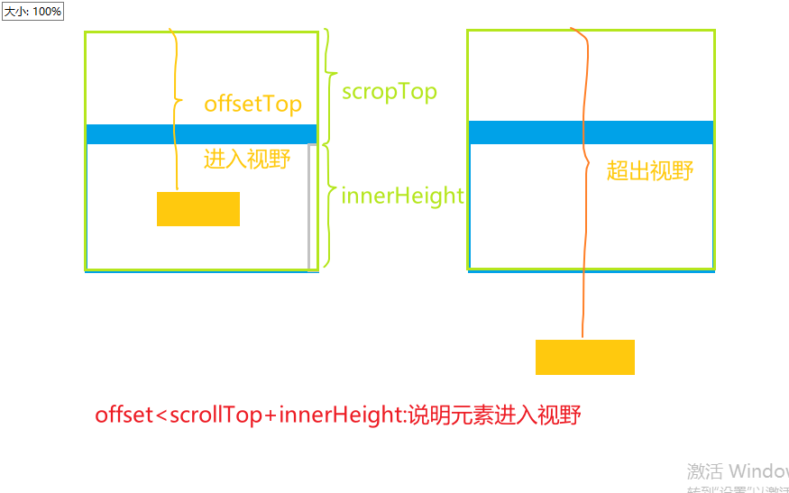

## 【图⽚懒加载⽅式】

图⽚懒加载可以延迟图⽚的加载，只有当图⽚即将进⼊视⼝范围时才进⾏加载。这可以⼤⼤减轻⻚⾯的加载时间，并降低带宽消耗，提⾼了⽤⼾的体验。

### 1. [Intersection Observer API](https://blog.csdn.net/Zbz00720/article/details/139025413)

- `Intersection Observer API` 是⼀种⽤于异步检查 **⽂档中元素与视⼝叠加程度**的 API。可以将其⽤于检测图⽚是否已经进⼊视⼝，并根据需要进⾏相应的处理。
- observer 观察者对象在观察元素是否进入视口、祖先元素的时候，不管元素是否进入，都会触发观察者对象的回调函数
- `isIntersecting`:true 当前元素进入视口，false 当前元素离开视口

```js{2,3,7}
var box = document.querySelector('.img')
var observer = new IntersectionObserver(callback, {
  root: this.container,//父元素
  threshold: 1.0,
})
// 对元素进行监听
function callback(entries) {
  entries.forEach(() => {
    if (entry.isIntersecting) {
      // ...元素进入父元素视口
    }
  })
}
const items = [...document.querySelectorAll('.item')]
items.forEach(function (it) {
  observer.observe(it) //观察指定DOM对象
})
```

::: example
blogs/business/dom/lazyImage/intersectionObserver
:::

### 2. ⾃定义监听器

- 可以通过⾃定义监听器来实现懒加载时，要应该避免在滚动事件处理程序中频繁进⾏图⽚加载，因为这可能会影响性能。
- 应在**滚动停⽌时**进⾏图⽚加载。
- [前置知识点](https://blog.csdn.net/lph159/article/details/142134594)

| 属性                                                                       | 说明                                                                                                                                                                  | 图解                                              |
| -------------------------------------------------------------------------- | --------------------------------------------------------------------------------------------------------------------------------------------------------------------- | ------------------------------------------------- |
| `scrollTop`                                                                | 元素顶部与文档顶部之间的距离，也就是滚动条**滚动的距离**。                                                                                                            |                                                   |
| `window.innerHeight`                                                       | 浏览器窗口的内部高度(包括滚动条),会随着浏览器窗口的放大缩小变化                                                                                                       |                                                   |
| `clientHeight`                                                             | 获取屏幕可视区域的高度，包含元素的高度+内边距;<br/>**不包含**水平滚动条，边框和外边距                                                                                 |  |
| `clientWidth`                                                              | 获取屏幕可视区域的宽度。该属性包括内边距 padding；<br/>**不包括**边框 border、外边距 margin 和垂直滚动条（如果有的话）。                                              |                                                   |
| `offsetHeight`                                                             | 元素的 offsetHeight 是一种元素 CSS 高度的衡量标准，<br/>**包括**元素的边框、内边距和元素的水平滚动条（如果存在且渲染的话）                                            |  |
| [`offsetTop`](https://blog.csdn.net/qq_42816270/article/details/138028929) | 表示元素顶部到其 offsetParent 元素内边框的距离，而 offsetParent 是最近的定位父元素或最近的 table、td、th、body 元素。当元素没有定位父元素时，offsetParent 默认为 body |        |
| 判断元素是否进入父元素视口                                                 | `offsetTop < window.innerHeight + scrollTop`                                                                                                                          |             |
| `clientX/clientY `                                                         | 鼠标相对于浏览器文档显示区的水平 X 坐标,不包括工具栏和滚动条                                                                                                          |                                                   |

详见`lazyImage/scrollListener.html`

```js{6,7,13}
function lazyLoad() {
  const images = document.querySelectorAll(".lazy");
  const scrollTop = window.pageYOffset;
  images.forEach((img) => {
    console.log('【 img 】-32', img.offsetTop, scrollTop, window.innerHeight)
    if (img.offsetTop < window.innerHeight + scrollTop) {
      img.src = img.dataset.src;
      // img.classList.remove("lazy");
    }
  });
}
let lazyLoadThrottleTimeout;// 防抖
document.addEventListener("scroll",
  function () {
    if (lazyLoadThrottleTimeout) {
      clearTimeout(lazyLoadThrottleTimeout);
    }
    lazyLoadThrottleTimeout = setTimeout(lazyLoad, 1000);//停止滚动后执行
  }
)
```

## 【如何判断 dom 元素是否在可视区域】

<!-- 【热度: 846】 -->

### 1. getBoundingClientRect() ⽅法

```js{2,6}
function isInViewport(element) {
  const rect = element.getBoundingClientRect()
  const { top, left, bottom, right } = rect
  const height = window.innerHeight || document.documentElementclientHeight
  const width = window.innerWidth || document.documentElement.clientWidth
  return top >= 0 && left >= 0 && bottom <= height && right <= width
}
// 示例
const element = document.getElementById('my-element');
if (isInViewport(element)) {
  console.log('在可视区域')
} else {
  console.log('不在可视区域')
}
```

### 2. IntersectionObserver API

- 该 API 可以观察元素与其祖先元素或视⼝交叉的情况，并且可以设置回调函数，当元素的可⻅性发⽣变化时会调⽤该回调函数。
- 使⽤ IntersectionObserver API 的优点是可以减少不必要的计算和事件监听，提⾼了性能

```js{3,11,13}
function callback(entries, observer) {
  entries.forEach((entry) => {
    if (entry.isIntersecting) {
      console.log('Element is in viewport')
    } else {
      console.log('Element is not in viewport')
    }
  })
}

const observer = new IntersectionObserver(callback)
const element = document.getElementById('my-element')
observer.observe(element)
```

## 【虚拟滚动加载原理及实现】

### 1. 普通滚动渲染

::: example
blogs/business/dom/virtualScroll/generalRender
:::

- 如下如可以看出，渲染花了很多时间：
  

为何两次 console.log 的结果时间差异巨大?

- 在 JS 的`Event Loop`中，当 JS 引擎所管理的执行栈中的事件以及所有微任务事件全部执行完后，**才会触发渲染线程对页面进行渲染**
- 第一个 console.log 的触发时间是在页面进行**渲染之前**，此时得到的间隔时间为 JS 运行所需要的时间
- 第二个 console.log 是放到 setTimeout 中的，它的触发时间是在**渲染完成**，在下一次 Event Loop 中执行的

### [2. 虚拟列表](https://juejin.cn/post/6844903982742110216)

#### 原理

- 虚拟列表其实是按需显示的一种实现，即**只对可见区域进行渲染**，对非可见区域中的数据不渲染或部分渲染的技术，以此减少 DOM 操作的数量和提高渲染性能。
- 实现虚拟滚动
  - 监听滚动事件，了解当前滚动位置。
  - 根据滚动位置计算当前应该渲染哪些列表项（即在视口内的项目）。
  - 只渲染那些项目 ，并用占位符（比如一个空的 div）占据其它项目应有的位置，保持滚动条大小不变。
  - 当用户滚动时，重新计算并渲染新的项目。


#### 列表项固定高度

::: example
blogs/business/dom/virtualScroll/virtualScrollListener
:::

#### 列表项动态高度

为了使页面平滑滚动，我们可以在可见区域的上方和下方渲染额外的项目，在滚动时给予一些缓冲，避免出现短暂的白屏现象。所以将屏幕分为三个区域：

- 可视区域上方：above
- 可视区域：screen
- 可视区域下方：below


::: example
blogs/business/dom/virtualScroll/virtualScrollListenerDynamic
:::

```vue{3,4,68,72,76,92,100,156,159}
<template>
  <div ref="list" :style="{ height }" class="infinite-list-container" @scroll="scrollEvent($event)">
    <div ref="phantom" class="infinite-list-phantom"></div>
    <div ref="content" class="infinite-list">
      <div class="infinite-list-item" ref="items" :id="item._index" :key="item._index" v-for="item in visibleData">
        <slot ref="slot" :item="item.item">{{ item._index }}</slot>
      </div>
    </div>
  </div>
</template>

<script>
export default {
  name: 'VirtualList',
  props: {
    //所有列表数据
    listData: {
      type: Array,
      default: () => []
    },
    //预估高度
    estimatedItemSize: {
      type: Number,
      required: true
    },
    // 缓冲区数据与可视区数据的比例
    bufferScale: {
      type: Number,
      default: 1
    },
    //容器高度 100px or 50vh
    height: {
      type: String,
      default: '300px'
    }
  },
  data() {
    return {
      //可视区域高度
      screenHeight: 0,
      //起始索引
      start: 0,
      //结束索引
      end: 0,
      //用于列表项渲染后存储每一项的高度以及位置信息，
      positions: [
        // {
        //   top:0,
        //   bottom:100,
        //   height:100
        // }
      ]
    }
  },
  computed: {
    _listData() {
      return this.listData.map((item, index) => {
        return {
          _index: `_${index}`,
          item
        }
      })
    },
    visibleCount() {
      return Math.ceil(this.screenHeight / this.estimatedItemSize)
    },
    // 可视区上方渲染条数
    aboveCount() {
      return Math.min(this.start, this.bufferScale * this.visibleCount)
    },
    // 可视区下方渲染条数
    belowCount() {
      return Math.min(this.listData.length - this.end, this.bufferScale * this.visibleCount)
    },
    // 真实渲染数据
    visibleData() {
      let start = this.start - this.aboveCount
      let end = this.end + this.belowCount
      return this._listData.slice(start, end)
    }
  },
  created() {
    this.initPositions()
    window.vm = this
  },
  mounted() {
    this.screenHeight = this.$el.clientHeight
    this.start = 0
    this.end = this.start + this.visibleCount
  },
  // 由于需要在渲染完成后，获取列表每项的位置信息并缓存，所以使用钩子函数updated来实现
  updated() {
    this.$nextTick(function () {
      if (!this.$refs.items || !this.$refs.items.length) {
        return
      }
      //获取真实元素大小，修改对应的尺寸缓存
      this.updateItemsSize()
      //更新列表总高度
      let height = this.positions[this.positions.length - 1].bottom //列表高度实际就等于列表中最后一项的底部距离列表顶部的位置。
      this.$refs.phantom.style.height = height + 'px'
      //更新真实偏移量
      this.setStartOffset()
    })
  },
  methods: {
    // 在初始时根据estimatedItemSize对positions进行初始化。
    initPositions() {
      this.positions = this.listData.map((d, index) => ({
        index,
        height: this.estimatedItemSize, //预估高度
        top: index * this.estimatedItemSize,
        bottom: (index + 1) * this.estimatedItemSize
      }))
    },
    //获取列表起始索引
    getStartIndex(scrollTop = 0) {
      // 由于缓存数据本身就是有顺序的，所以获取开始索引的方法可以考虑通过二分查找的方式来降低检索次数：
      return this.binarySearch(this.positions, scrollTop) //二分法查找
      // 元素底部位置等于滚动条位置的时候，即索引开始位置
      // let item = this.positions.find((i) => i && i.bottom > scrollTop)
      // return item.index
    },
    binarySearch(list, value) {
      let start = 0
      let end = list.length - 1
      let tempIndex = null

      while (start <= end) {
        let midIndex = parseInt((start + end) / 2)
        let midValue = list[midIndex].bottom //
        if (midValue === value) {
          return midIndex + 1
        } else if (midValue < value) {
          start = midIndex + 1
        } else if (midValue > value) {
          if (tempIndex === null || tempIndex > midIndex) {
            tempIndex = midIndex
          }
          end = end - 1
        }
      }
      return tempIndex
    },
    //获取列表项的当前尺寸
    updateItemsSize() {
      let nodes = this.$refs.items
      nodes.forEach((node) => {
        let rect = node.getBoundingClientRect()
        let height = rect.height
        let index = +node.id.slice(1)
        let oldHeight = this.positions[index].height
        let dValue = oldHeight - height
        //存在差值
        if (dValue) {
          this.positions[index].bottom = this.positions[index].bottom - dValue
          this.positions[index].height = height
          // 更新后续项的位置信息
          for (let k = index + 1; k < this.positions.length; k++) {
            this.positions[k].top = this.positions[k - 1].bottom
            this.positions[k].bottom = this.positions[k].bottom - dValue
          }
        }
      })
    },
    //获取当前的偏移量
    setStartOffset() {
      let startOffset
      if (this.start >= 1) {
        let size =
          this.positions[this.start].top -
          (this.positions[this.start - this.aboveCount] ? this.positions[this.start - this.aboveCount].top : 0)
        startOffset = this.positions[this.start - 1].bottom - size
      } else {
        startOffset = 0
      }
      this.$refs.content.style.transform = `translate3d(0,${startOffset}px,0)`
    },
    //滚动事件
    scrollEvent() {
      //当前滚动位置
      let scrollTop = this.$refs.list.scrollTop
      // let startBottom = this.positions[this.start - ]
      //此时的开始索引
      this.start = this.getStartIndex(scrollTop)
      //此时的结束索引
      this.end = this.start + this.visibleCount
      //此时的偏移量
      this.setStartOffset()
    }
  }
}
</script>

<style scoped>
.infinite-list-container {
  overflow: auto;
  position: relative;
  -webkit-overflow-scrolling: touch;
}

.infinite-list-phantom {
  position: absolute;
  left: 0;
  top: 0;
  right: 0;
  z-index: -1;
}

.infinite-list {
  left: 0;
  right: 0;
  top: 0;
  position: absolute;
}

.infinite-list-item {
  padding: 5px;
  color: #555;
  box-sizing: border-box;
  border-bottom: 1px solid #999;
  /* height:200px; */
}
</style>
```

### 3.使⽤ IntersectionObserver 来实现

```js{8,9,20,35,37,42,43}
class VirtualScroll {
  constructor(container, itemHeight, totalItems, renderItem) {
    this.container = container;
    this.itemHeight = itemHeight;
    this.totalItems = totalItems;
    this.renderItem = renderItem;
    // 初始化观察对象
    this.observer = new IntersectionObserver(this.onIntersection.bind(this), {
      root: this.container,//父容器元素
      threshold: 1.0,
    });
    this.items = new Map();
    this.init();
  }
  // 填充初始屏幕的元素
  init() {
    for (let i = 0; i < this.totalItems; i++) {
      const placeholder = this.createPlaceholder(i);
      this.container.appendChild(placeholder);
      this.observer.observe(placeholder);//观察元素的视口状态
    }
  }
  // 创建占位元素
  createPlaceholder(index) {
    const placeholder = document.createElement("div");
    placeholder.style.height = `${this.itemHeight}px`;
    placeholder.style.width = "100%";
    placeholder.dataset.index = index; // store indexreturn placeholder;
  }
  //
  onIntersection(entries) {
    entries.forEach((entry) => {
      const index = entry.target.dataset.index;
      // 当元素进入视口时,渲染列表项
      if (entry.isIntersecting) {
        const rendered = this.renderItem(index);
        this.container.replaceChild(rendered, entry.target);
        this.items.set(index, rendered);
      } else if (this.items.has(index)) {
        // 当元素离开视口时,换回占位符
        const placeholder = this.createPlaceholder(index);
        this.container.replaceChild(placeholder, this.items.get(index));
        this.observer.observe(placeholder);
        this.items.delete(index);
      }
    });
  }
}
// 渲染列表项
function renderItem(index) {
  const item = document.createElement("div");
  item.classList.add("item");
  item.textContent = `Item ${index}`;
  item.dataset.index = index;
  item.style.height = "30px"; // Same as your itemHeight in VirtualScroll
  return item;
}
// 使用示例
const container = document.getElementById("scroll-container");
const itemHeight = 30; // Height of each item
const itemCount = 1000; // Total numberof items you have
const virtualScroll = new VirtualScroll(container, itemHeight, itemCount, renderItem);
```

### [4.requestAnimationFrame 时间分片](https://juejin.cn/post/6844903938894872589)

::: example
blogs/business/dom/virtualScroll/requestAnimationFrameList
:::
