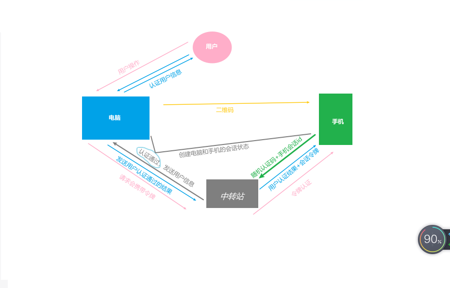

<!--
 * @Description: https://gitee.com/yanleweb/interview-question/issues/I7W2KU
 * @Date: 2024-08-23 16:04:10
 * @LastEditTime: 2024-11-01 15:23:42
-->

# 业务场景

<https://juejin.cn/post/7401060368087728166?searchId=202410142012222C5A2537F9C76AD11A25>

<!-- 1. ⽤⼾访问**系统1** 的受保护资源，系统 1 发现⽤⼾未登录，跳转⾄ **sso 认证中⼼**，**并将⾃⼰的地址作
为参数**
2. sso认证中⼼ 发现⽤⼾未登录，将⽤⼾引导⾄**登录⻚⾯**
3. ⽤⼾输⼊⽤⼾名密码提交登录申请
4. sso 认证中⼼校验⽤⼾信息，创建⽤⼾与 sso 认证中⼼之间的会话，称为全局会话，同时创建授权
令牌
5. sso 认证中⼼**带着令牌跳转会最初的请求地址**（系统 1）
6. 系统 1 拿到令牌，去 sso 认证中⼼校验令牌是否有效
7. sso 认证中⼼校验令牌，返回有效，注册系统 1
8. 系统 1 使⽤该令牌创建与⽤⼾的会话，称为局部会话，返回受保护资源
9. ⽤⼾访问**系统 2** 的受保护资源
10. 系统 2 发现⽤⼾未登录，跳转⾄ **sso 认证中⼼**，并将⾃⼰的地址作为参数
11. sso 认证中⼼发现⽤⼾已登录，**跳转回系统 2 的地址，并附上令牌**
12. 系统 2 拿到令牌，去 sso 认证中⼼校验令牌是否有效
13. sso 认证中⼼校验令牌，返回有效，注册系统 2
14. 系统 2 使⽤该令牌创建与⽤⼾的局部会话，返回受保护资源 -->

## 2. JS 执⾏ 100 万个任务， 如何保证浏览器不卡顿？

- 浏览器主线程一次只能处理一个任务（任务按照队列执行）,当遇到长任务（执行超过 50 毫秒，就会被称为长任务(Long Task)）时，需要等长任务执行完才能进行下一步操作，这个过程就会造成阻塞

### 普通长任务

- 执行之后页面会一直处于卡顿空白，然后最后结果闪出来
  ::: example
  blogs/business/longTask-长任务/web-worker/generalLongTask
  :::

### 方案 1：web worker 越过主线程阻塞问题

<!--
::: example
blogs/business/longTask-长任务/web-worker/webWorker
::: -->

- 详见`docs\blogs\business\longTask-长任务\web-worker\index.html`
- `web worker`是**运行在 Main 线程之外的一个线程**，叫做 worker 线程。我们可以把一些计算量大的任务放到 worker 中去处理。

  ```html{14,16,18}
  <!DOCTYPE html>
  <html lang="en">
    <head>
      <meta charset="UTF-8" />
      <title>web worker示例</title>
      <style></style>
    </head>
    <body>
      <script>
        // 主线程代码
        let body = document.querySelector('body') //获取某个真实的dom元素
        const params = { start: 0, end: 100000 }
        // --------------- worker Start ---------------
        const worker = new Worker('./worker.js') // 创建一个新的Web Worker
        // 向子线程通过 postMessage 发送消息，
        worker.postMessage(params) //100000 向Web Worker发送消息
        // 通过 onmessage 监听子线程返回的数据。
        worker.onmessage = function (event) {
          const result = event.data
          let div = document.createElement('div')
          div.innerHTML = '子线程任务完成：' + result
          body.appendChild(div)
          console.log('子线程任务完成：', result)
        }
        // --------------- worker End ---------------
        // -- 主线程任务
        let mainDiv = document.createElement('div')
        mainDiv.innerHTML = '主线程任务'
        body.appendChild(mainDiv)
      </script>
    </body>
  </html>
  ```

- 适用于不需要实时通讯的场景

  ```js{10}
  // worker.js
  onmessage = function (event) {
    console.log('【 onmessage 】-2', '子线程任务开始')
    const { start, end } = event.data
    let sum = 0
    for (let i = start; i <= end; i++) {
      sum += i
    }
    setTimeout(() => {
      postMessage(sum) // 任务完成向主线程发送消息
    }, 3000)
  }
  ```

- 如果需要实时通信结果，依然会被卡死

  ```js{7}
  // worker.js
  onmessage = function (event) {
  const { start, end } = event.data
  let sum = 0
    for (let i = start; i <= end; i++) {
      sum = i + 1
      postMessage(sum) // 实时向主线程发送消息，依然会被卡死
    }
  }
  ```

### 方案 2：（推荐）利用 requestAnimationFrame 实现任务调度

#### 一个 100 万个函数硬执行

- 详见`docs\examples\blogs\business\longTask\requestAnimationFrame\test.html`
- 执行下面的代码，页面会一直处于卡顿，然后最后结果闪出来

```html
<!DOCTYPE html>
<html lang="en">
  <head>
    <meta charset="UTF-8" />
    <title>一个 100 万个函数硬执行</title>
  </head>
  <body>
    <p id="result"></p>
    <script>
      const $result = document.getElementById('result')
      /* ==============================  长任务 - Start ============================== */
      const bigArray = Array.from({ length: 1000000 }, (_, i) => i + 1)
      // 定义一个处理函数，例如对数组中的每个元素进行平方操作
      function processChunk(chunk) {
        return `chunk: ${chunk}`
      }

      for (const item in bigArray) {
        $result.innerText = processChunk(item)
      }
      //  ==============长任务 - End ================
    </script>
  </body>
</html>
```

#### [使用 chunkSize 来对长任务进行切分](https://blog.csdn.net/qq_53109172/article/details/135320963)

- `requestAnimationFrame(callback)`触发的时机是**浏览器在下次重绘之前调用指定的回调函数更新动画**
- `cancelAnimationFrame`：取消 requestAnimationFrame 执行
- 在大多数遵循 W3C 建议的浏览器中，回调函数执行次数通常与浏览器屏幕刷新次数相匹配，这个时间取决于当前电脑的刷新率，如果为**60Hz（1s 执行 60 次，每次消耗时间是 16.7ms 左右）**，如果是 120Hz 那就是 8.3ms 执⾏⼀次
- requestAnimationFrame() 运行在后台标签页或者隐藏的 `<iframe>` 里时，会被**暂停调用**以提升性能和电池寿命
- requestAnimationFrame 也是个定时器，它的执行是一次性的，也属于**宏任务**，但不同于 setTimeout ，它的时间不需要⼈为指定，这个时间取决于当前电脑的刷新率，如果是 60Hz ，那么就是 16.7ms 执⾏⼀次，

```html{26,31,35,37,41}
 <!-- 详见`docs\examples\blogs\business\longTask\requestAnimationFrame\3.processArrayWithDynamicChunkSize.html` -->
<!DOCTYPE html>
<html lang="en">
  <head>
    <meta charset="UTF-8" />
    <title>使用 chunkSize动态 来对长任务进行切分</title>
  </head>

  <body>
    <p id="result"></p>
    <script>
      const $result = document.getElementById('result')
      const bigArray = Array.from({ length: 1000000 }, (_, i) => i + 1) // 假设有一个包含大量元素的数组
      let index = 0
      // 定义业务处理函数，对数组中的每个元素执行一次
      function bizTask() {
        if (index < bigArray.length) {
          const result = `chunk: ${bigArray[index]}`
          $result.innerText = result
          index++
        }
      }
      let chunkSize = 1000 // 初始的 chunkSize
      // 动态调整 chunkSize 的优化方式
      function processArrayWithDynamicChunkSize() {
        function processChunkWithRAF() {
          const startTime = performance.now() // 记录每次轮询的开始时间
          // 每chunkSize一个轮询
          for (let i = 0; i < chunkSize; i++) {
            bizTask() //业务任务
          }
          const endTime = performance.now() // 记录每次轮询的结束时间
          const timeTaken = endTime - startTime // 计算处理时间
          // 根据处理时间动态调整 chunkSize
          if (timeTaken > 16) {
            chunkSize = Math.floor(chunkSize * 0.9) // 减小10%，如果处理时间超过一帧的时间（16毫秒），则减小 chunkSize
          } else if (timeTaken < 16) {
            chunkSize = Math.floor(chunkSize * 1.1) // 增加10% （如果处理时间远小于一帧的时间（8毫秒），则增加 chunkSize）
          }
          // 开始下一个轮询
          if (index < bigArray.length) {
            requestAnimationFrame(processChunkWithRAF) // 第n次轮询，继续处理下一个小块
          }
        }
        requestAnimationFrame(processChunkWithRAF) // 第1次轮询：开始处理大数组
      }
      // 开始调用
      processArrayWithDynamicChunkSize()
    </script>
  </body>
</html>
```

## 5. 在表单校验场景中， 如何实现⻚⾯视⼝滚动到报错的位置

> 详见`docs\examples\blogs\business\validationForm.html`

- 滚动指定位置：`element.scrollIntoView({ block: "center", behavior: "smooth" });`

## 6. [检测网页是否为空闲状态](https://www.jb51.net/javascript/318807ud9.htm)

> 详见`docs\examples\blogs\business\检测网页是否为空闲状态`

1. 监听⿏标移动事件 `mousemove` ；
2. 监听键盘按下事件 `mousedown` ；
3. 监听页面隐藏情况 `visibilitychange` ；
4. 在⽤⼾进⼊⽹⻚后，设置延时跳转，如果触发以上事件，则移除延时器，并重新开始。

## 8. [前端⽇志埋点 SDK 设计思路](https://zhuanlan.zhihu.com/p/497413927)

### （1）StatisticSDK 方法实现

#### 数据发送方法 `navigator.sendBeacon()`

- navigator.sendBeacon() ⽅法会在后台异步地发送数据，不会阻塞⻚⾯的其他操作,即使⻚⾯正在卸载或关闭，该⽅法也可以继续发送数据，确保数据的可靠性。
- navigator.sendBeacon() ⽅法⽀持**跨域**发送数据。
- navigator.sendBeacon() ⽅法发送的数据是以 **POST 请求**的形式发送到服务
  器
  ::: example
  blogs/business/SDK/index
  :::

```js{15,25,33,44,57}
// StatisticSDK.js
class StatisticSDK {
  constructor(productID, baseURL) {
    console.log('【 StatisticSDK-初始化 】-3', productID, baseURL)
    this.productID = productID
    this.baseURL = baseURL
    this.performanceURL = '/sdk-performance' //接口路径 'http://performance/'
    this.errorURL = '/sdk-error'
    this.eventURL = '/sdk-event'
    //
    this.initErrorListenner() // 初始化错误监控
    this.initPerformance() //初始化性能上报
  }
  // 1.数据发送:使⽤navigator.sendBeacon 来发送请求
  send(query = {}, url) {
    console.log('【 StatisticSDK-数据发送 】-9', query)
    query.productID = this.productID
    let data = new URLSearchParams()
    for (const [key, value] of Object.entries(query)) {
      data.append(key, value)
    }
    navigator.sendBeacon(url || this.baseURL, data)
  }
  // 2.⽤⼾⾏为与⽇志上报
  event(key, value = {}) {
    this.send({ event: key, ...value }, this.eventURL)
  }
  // PV（页面访问次数）、UV（页面访问人数）
  pv() {
    this.event('pv')
  }
  // 3.性能上报（比如页面加载时间、白屏时间等。）
  initPerformance() {
    // 页面首次渲染时间FP(firstPaint)：
    // const {domLoading,navigationStart,domContentLoadedEventEnd,navigationStart}=performance.timing
    // const fp = domLoading - navigationStart
    // DOM加载完成：DCL(DOMContentEventLoad)
    // const dcl = domContentLoadedEventEnd-navigationStart
    // 图片、样式等外链资源加载完成：L(Load)=loadEventEnd-navigationStart
    console.log('【 initPerformance 】-27', performance.timing)
    this.send({ event: 'performance', performanceTiming: JSON.stringify(performance.timing) }, this.performanceURL)
  }
  // 4.错误上报
  error(err, errInfo = {}) {
    const { message, stack } = err
    this.send(
      {
        event: 'error',
        message,
        stack,
        ...errInfo
      },
      this.errorURL
    )
  }
  // 4-1.错误上报分两类
  initErrorListenner() {
    // console.log('【 StatisticSDK-错误上报 】-41')
    // ① 第1类：dom 操作错误与JS错误报警，也是常说的运⾏时报错，该类报错直接可以通过addEventListener('error')监控即可；
    window.addEventListener('error', (error) => {
      // console.log('【 StatisticSDK-运⾏时报错 】-44', error)
      this.error(error)
    })
    // ② （待验证）第2类：Promise内部抛出的错误是⽆法被error捕获到的，这时需要⽤ unhandledrejection 事件。
    window.addEventListener('unhandledrejection', (event) => {
      console.log('【 StatisticSDK-Promise内部错误 】-44', event)
      this.error(new Error(event.reason), { type: 'unhandledrejection' })
    })
  }
}
export default StatisticSDK
```

### （2）组件错误上报

- 错误组件示例`ErrorCapturedDemo.vue`

```vue{7}
<template>
  <div>
    <div>我是子组件：组件渲染报错时会被父组件的onErrorCaptured捕获</div>
  </div>
</template>
<script setup>
handlePromiseError2() //运行未申明的方法
</script>
```

#### 全局挂载挂载`errorHandler`

```js{5,7,10}
// src/index.ts
// ...
import { createApp } from 'vue'
import App from '@/App.vue'
import StatisticSDK from './StatisticSDK'

window.insSDK = new StatisticSDK('sdk-12345') //全局挂载
const app = createApp(App)
// 渲染错误处理
app.config.errorHandler = (error, vm, info) => {
  window.insSDK.event('error', { remark: '全局-组件渲染报错' })
  console.error('【 全局-组件渲染报错处理 】-116', error, vm, info)
}
```

#### 组件内部处理`onErrorCaptured`

- 当引用的**子组件**渲染错误时才会走 onErrorCaptured
- 自身的渲染错误不会走 onErrorCaptured

```vue{5,9}
<template>
  <ErrorCapturedDemo></ErrorCapturedDemo>
</template>
<script setup>
import { onMounted, onErrorCaptured } from 'vue'
import ErrorCapturedDemo from './ErrorCapturedDemo.vue'

// 子组件渲染错误处理
onErrorCaptured((error, vm, info) => {
  console.error('【 子组件-渲染错误 】-47', error, vm, info)
  window.insSDK.error('error', { ...error, remark: '子组件渲染错误' })
  return false
})
</script>
```

## [indexedDB](https://deepinout.com/javascript/javascript-questions/110_hk_1709940124.html)

- open 方法返回一个 IDBOpenDBRequest 对象，同时这是一个**异步**操作，open 操作并不会立马打开数据库或者开启事务，我们可以通过监听`request`的事件来进行相应的处理。
- `open(name,version)`：open 方法传入两个参数，第一个参数是数据库的名字，第二个参数是数据库的版本号(**整数**)。
- 当你创建或升级一个现有的数据库版本的时候，将会触发一个`onupgradeneeded`事件，并在事件中传入`IDBVersionChangeEvent`，我们可以通过 event.target.result 来获取到 IDBDatabase 对象，然后通过这个对象来进行数据库的版本升级操作

::: example
blogs/business/indexedDB/index
:::

## 大文件上传

### 分片上传

- 把⼤⽂件进⾏分段 ⽐如 10M，发送到服务器携带⼀个标志，**可以使⽤当前的时间戳，⽤于标识⼀个完整的⽂件**
- 服务端保存各段⽂件
- 浏览器端所有分⽚上传完成，发送给服务端⼀个合并⽂件的请求
- 服务端根据⽂件标识、类型、各分⽚顺序进⾏⽂件合并
- 删除分⽚⽂件
  ::: example
  blogs/business/largeFileUpload/upload
  :::
  详见`docs\examples\blogs\business\largeFileUpload\sliceUpload.js`

```js{4,6,15,16,17,18,23,39}
// 分片上传
export function sliceUpload(file) {
  const num = 10 //分⽚⼤⼩10M
  const chunkSize = num * 1024 * 1024 //10M
  let chunks = [], //保存分⽚数据
    fileTag = +new Date(), //使用时间戳，⽤于标识⼀个完整的⽂件
    name = file.name,
    chunkCount = 0, //分片总数
    sendChunkCount = 0 //已发送分片数
  // 超过大小进行文件拆分
  if (file.size > chunkSize) {
    let start = 0
    let end = 0
    //拆分⽂件
    while (end < file.size) {
      end += chunkSize //截取的结束位置
      let blob = file.slice(start, end) //切割分片
      start += chunkSize //截取的开始位置
      //截取的数据为空 则结束
      if (!blob.size) {
        break //拆分结束
      }
      chunks.push(blob) //保存分段数据
    }
  } else {
    chunks.push(file.slice(0))
  }
  chunkCount = chunks.length //分⽚的个数
  //没有做并发限制，较⼤⽂件导致并发过多，
  // tcp 链接被占光 ，需要做下并发控制，⽐如只有4个在请求在发送
  for (let i = 0; i < chunkCount; i++) {
    const fd = new FormData() //构造FormData对象
    fd.append('f1', chunks[i])
    fd.append('index', i)
    xhrSend(fd, function () {
      //保存分片成功的回调
      sendChunkCount += 1
      //上传完成，发送合并请求
      if (sendChunkCount === chunkCount) {
        console.log('上传完成，发送合并请求')
        var formD = new FormData()
        formD.append('type', 'merge')
        formD.append('fileTag', fileTag)
        formD.append('chunkCount', chunkCount)
        formD.append('filename', name)
        xhrSend(formD)
      }
    })
  }
}
// 发送请求
function xhrSend(fd, cb) {
  var xhr = new XMLHttpRequest() //创建对象
  xhr.open('POST', 'http://localhost:8100/', true)
  xhr.onreadystatechange = function () {
    console.log('state change', xhr.readyState)
    if (xhr.readyState == 4) {
      console.log(xhr.responseText)
      cb && cb()
    }
  }
  xhr.send(fd) //发送
}

//绑定提交事件
// document.getElementById('btn-submit').addEventListener('click', sliceUpload)

```

### 断点续传

详见`docs\examples\blogs\business\largeFileUpload\sliceUploadContinue.js`

```js{29,32,33,34,43,72,77}
// 断点续传
function sliceUpload(file) {
  const num = 10 //分⽚⼤⼩10M
  const chunkSize = num * 1024 * 1024 //10M
  let chunks = [], //保存分⽚数据
    fileTag = +new Date(), //使用时间戳，⽤于标识⼀个完整的⽂件
    name = file.name,
    chunkCount = 0, //分片总数
    sendChunkCount = 0 //已发送分片数
  // 超过大小进行文件拆分
  if (file.size > chunkSize) {
    //拆分⽂件
    let start = 0,
      end = 0
    while (end < file.size) {
      end += chunkSize //截取的结束位置
      let blob = file.slice(start, end) //切割分片
      start += chunkSize //截取的开始位置
      //截取的数据为空 则结束
      if (!blob.size) {
        break //拆分结束
      }
      chunks.push(blob) //保存分段数据
    }
  } else {
    chunks.push(file.slice(0))
  }
  chunkCount = chunks.length //分⽚的个数
  let uploadedInfo = getUploadedFromStorage() //获得已上传的分段信息
  for (let i = 0; i < chunkCount; i++) {
    console.log('index', i, uploadedInfo[i] ? '已上传过' : '未上传')
    if (uploadedInfo[i]) { //对⽐分段
      sendChunkCount = i + 1 //记录已上传的索引
      continue //如果已上传则跳过
    }
    const fd = new FormData() //构造FormData对象
    fd.append('fileTag', fileTag)
    fd.append('f1', chunks[i])
    fd.append('index', i)
    xhrSend(fd, function () {
      //保存分片成功的回调
      sendChunkCount += 1 //将成功信息保存到本地
      setUploadedToStorage(index) //记录已上传的数据
      //上传完成，发送合并请求
      if (sendChunkCount === chunkCount) {
        console.log('上传完成，发送合并请求')
        let formD = new FormData()
        formD.append('type', 'merge')
        formD.append('fileTag', fileTag)
        formD.append('chunkCount', chunkCount)
        formD.append('filename', name)
        xhrSend(formD)
      }
    })
  }
}
// 发送请求
function xhrSend(fd, cb) {
  let xhr = new XMLHttpRequest() //创建对象
  xhr.open('POST', 'http://localhost:8100/', true)
  xhr.onreadystatechange = function () {
    console.log('state change', xhr.readyState)
    if (xhr.readyState == 4) {
      console.log(xhr.responseText)
      cb && cb()
    }
  }
  xhr.send(fd) //发送
}

//获得本地缓存的数据
function getUploadedFromStorage() {
  return JSON.parse(localforage.getItem(saveChunkKey) || '{}')
}

//写⼊缓存
function setUploadedToStorage(index) {
  let obj = getUploadedFromStorage()
  obj[index] = true
  localforage.setItem(saveChunkKey, JSON.stringify(obj))
}

```

## [如何实现⽹⻚加载进度条？](https://maimai.cn/article/detail?fid=1846750090&efid=IdmfyobQZPezeUGjGeOkIQ)

### 监听静态资源加载情况

- 可以使⽤ `window.performance.getEntries()` ⽅法获取⻚⾯上所有的资源加载信息。如每个资源的加载状态，计算加载时间等来实现
  详见`docs\examples\blogs\business\progress\progress.html`

### 实现进度条

1. 自定义
   ::: example
   blogs/business/progress/progress
   :::
2. 使⽤第三⽅库，如 nprogress
<!--

- https://juejin.cn/post/7307057492059471899
- https://juejin.cn/post/7401060368087728166?searchId=202410142012222C5A2537F9C76AD11A25#heading-4
- https://juejin.cn/post/7422848805044371471
  -->

## [扫码登录实现⽅式](https://developer.baidu.com/article/details/3352196)

扫码登录的实现原理核⼼是基于⼀个中转站，该中转站通常由应⽤提供商提供，⽤于维护⼿机和 PC 之
间的会话状态。
整个扫码登录的流程如下：

1. ⽤⼾在 PC 端访问应⽤，并选择使⽤扫码登录⽅式。此时，应⽤⽣成⼀个**随机的认证码**，并将该认证
   码通过⼆维码的形式显⽰在 PC 端的⻚⾯上。
2. ⽤⼾打开⼿机上的应⽤，并选择使⽤扫码登录⽅式。此时，应⽤会打开⼿机端的相机，⽤⼾可以对
   着 PC 端的⼆维码进⾏扫描。
3. ⼀旦⽤⼾扫描了⼆维码，⼿机上的应⽤会向应⽤提供商的**中转站**发送⼀个请求，请求包含之前⽣成
   的**随机认证码和⼿机端的⼀个会话 ID**。
4. 中转站验证认证码和会话 ID 是否匹配，如果匹配成功，则该中转站将 **⽤⼾的⾝份信息发送给应⽤**，
   并创建⼀个 PC 端和⼿机端之间的会话状态。
5. 应⽤使⽤收到的⾝份信息对⽤⼾进⾏认证，并创建⼀个与该⽤⼾关联的会话状态。同时，应⽤ **返回⼀个通过认证的响应给中转站**。
6. 中转站将该响应返回给⼿机端的应⽤，并携带⼀个⽤于表⽰该会话的令牌，此时⼿机和 PC 之间的认
   证流程就完成了。
7. 当⽤⼾在 PC 端进⾏其他操作时，应⽤将会话令牌附加在请求中，并通过中转站向⼿机端的应⽤发起
   请求。⼿机端的应⽤使⽤会话令牌（也就是之前⽣成的令牌）来识别并验证会话状态，从⽽允许⽤
   ⼾在 PC 端进⾏需要登录的操作。
   

## 如何⽤ canvas 来做电影院选票功能

- `canvas.getContext('2d')`：
  - getContext 方法指定参数 2d，表示该 canvas 节点用于生成 2D 图案（即平面图案）。
  - 如果参数是 webgl，就表示用于生成 3D 图像（即立体图案）
- canvas 画布提供了一个用来作图的平面空间，该空间的每个点都有自己的坐标，x 表示横坐标，y 表示竖坐标。
  - **原点(0, 0)位于图像左上角**，x 轴的正向是原点向右，y 轴的正向是原点向下。
- `fillRect(x, y, width, height)`方法用来绘制矩形，它的四个参数分别为矩形左上角顶点的 x 坐标、y 坐标，以及矩形的宽和高。
- `fillStyle` 属性用来设置矩形的填充色。
  ::: example
  blogs/business/movies
  :::
