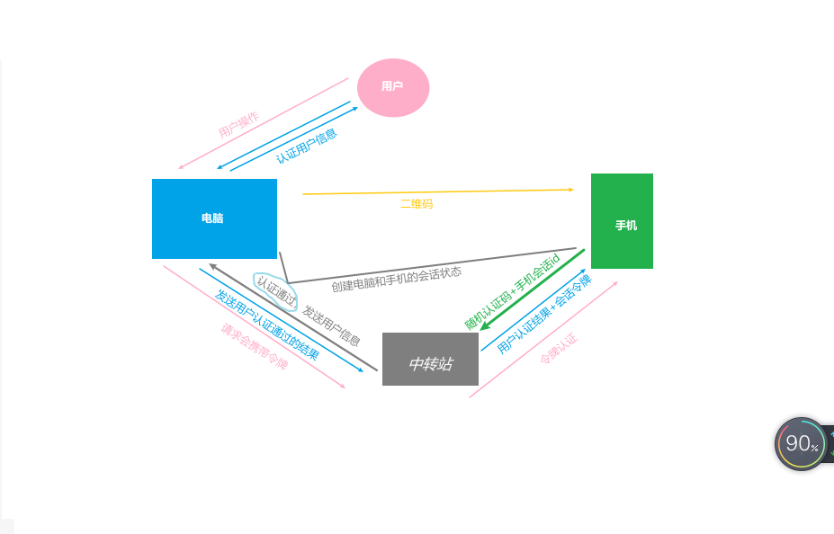

<!--
 * @Description:
 * @Date: 2024-11-12 17:30:33
 * @LastEditTime: 2024-11-15 16:34:37
-->

## [【扫码登录实现⽅式】](https://developer.baidu.com/article/details/3352196)

扫码登录的实现原理核⼼是基于⼀个中转站，该中转站通常由应⽤提供商提供，⽤于维护⼿机和 PC 之
间的会话状态。
整个扫码登录的流程如下：

1. ⽤⼾在 PC 端访问应⽤，并选择使⽤扫码登录⽅式。此时，应⽤⽣成⼀个**随机的认证码**，并将该认证
   码通过⼆维码的形式显⽰在 PC 端的⻚⾯上。
2. ⽤⼾打开⼿机上的应⽤，并选择使⽤扫码登录⽅式。此时，应⽤会打开⼿机端的相机，⽤⼾可以对
   着 PC 端的⼆维码进⾏扫描。
3. ⼀旦⽤⼾扫描了⼆维码，⼿机上的应⽤会向应⽤提供商的**中转站**发送⼀个请求，请求包含之前⽣成
   的**随机认证码和⼿机端的⼀个会话 ID**。
4. 中转站验证认证码和会话 ID 是否匹配，如果匹配成功，则该中转站将 **⽤⼾的⾝份信息发送给应⽤**，
   并创建⼀个 PC 端和⼿机端之间的会话状态。
5. 应⽤使⽤收到的⾝份信息对⽤⼾进⾏认证，并创建⼀个与该⽤⼾关联的会话状态。同时，应⽤ **返回⼀个通过认证的响应给中转站**。
6. 中转站将该响应返回给⼿机端的应⽤，并携带⼀个⽤于表⽰该会话的令牌，此时⼿机和 PC 之间的认
   证流程就完成了。
7. 当⽤⼾在 PC 端进⾏其他操作时，应⽤将会话令牌附加在请求中，并通过中转站向⼿机端的应⽤发起
   请求。⼿机端的应⽤使⽤会话令牌（也就是之前⽣成的令牌）来识别并验证会话状态，从⽽允许⽤
   ⼾在 PC 端进⾏需要登录的操作。
   

## 【HTTP 是⼀个⽆状态的协议，那么 Web 应⽤要怎么保持⽤⼾的登录态呢？】

### 实现登录态的几种形式：

#### 1. cookie

- 服务器可以通过 HTTP 响应头中的`Set-Cookie`字段通知浏览器存储 Cookie
- 缺点：⽤⼾可以通过 `document.cookie`进行修改， 伪造登陆凭证

#### 2. session

- 仅发给客⼾端⼀个 session key ，然后在⾃⼰维护⼀个 key-value 表，如果请求中有 key ，并且在表中可以找到对应的 value ，则视为合法请求调⽤ 接⼝，验证通过后颁发 sessionID
- 这样即使⾃⾏修改了 sessionID ，也没有对应的记录，也⽆法获取数据
- 缺点：如果存在多个服务器如负载均衡时，每个服务器的状态表必须同步，或者抽离出来统⼀管理，如使⽤ Redis 等服务。

#### 3. 令牌机制(JWT)

`JSON Web Token`（简称 JWT）, 是以 JSON 格式存储信息的 Token
|JSON Web Token |描述 |
|---|--|
| 头部|存储 Token 的**类型和签名算法**（上图中，类型是 jwt ，加密算法是 HS256 ） |
|负载|是 Token**要存储的信息**（如存储了⽤⼾姓名和昵称信息）|
|签名|是由指定的算法，将**转义后的头部和负载**，**加上密钥⼀同加密**得到的|
|`.` |最后将这三部分⽤`.` 连接，就可以得到了⼀个 Token 了。|

使⽤ `JWT` 维护登陆态，服务器不再需要维护状态表，他**仅给客⼾端发送⼀个加密的数据 token** ，每次请求都带上这个加密的数据，**再解密验证是否合法即可**。由于是加密的数据，即使⽤⼾可以修改， 命中⼏率也很⼩。

##### Node 中 JWT 的使⽤

- 第⼀步，在你的 `/login` 路由中使⽤ `jsonwebtoken` 中间件⽤于⽣成 token

```js{1}
const jwt = require('jsonwebtoken')
let token = jwt.sign(
  {
    name: username
  },
  config.secret,
  {
    expiresIn: '24h'
  }
)
res.cookie('token', token)
```

- 第⼆步，在 Node 的⼊⼝⽂件 `app.js `中注册 `express-jwt` 中间件⽤于验证 token

```js{1,3}
const expressJwt = require('express-jwt')
app.use(
  expressJwt({
    secret: config.secret,
    getToken: (req) => {
      return req.cookies.token || null
    }
  }).unless({
    path: ['/login']
  })
)
```

- 如果 getToken 返回 null ，中间件会抛出 UnauthorizedError 异常

```js{3}
app.use(function (err, req, res, next) {
  //当token验证失败时会抛出如下错误
  if (err.name === 'UnauthorizedError') {
    res.status(401).json({
      status: 'fail',
      message: '⾝份校验过期，请重新登陆'
    })
  }
})
```
<!-- 
### 如何实现单点登录

- 假设我们在电脑和⼿机都使⽤同⼀个⽤⼾登陆，对于服务器来说，这两次登陆⽣成的 token 都是合法的，尽管他们是同⼀个⽤⼾。所以两个 token 不会失效。
- 要实现单点登陆，服务器只需要维护⼀张**userId 和 token 之间映射关系的表**。每次登陆成功都刷新 token 的值。
- 在处理业务逻辑之前，使⽤解密拿到的 userId **去映射表中找到 token** ，**和请求中的 token 对⽐** 就能校验是否合法了。 -->

### cookie 使⽤流程总结 登录 / 注册请求：

- 浏览器发送⽤⼾名和密码到服务器。 服务器验证通过后，在响应头中设置 cookie，附带登录认证信息（⼀般为 jwt）。
- 浏览器收到 cookie 保存下来。 后续请求，浏览器会⾃动将符合的 cookie 附带到请求中；
- 服务器验证 cookie 后，允许其他操作完成业务流程。

## [【OAuth2.0 是什么登录⽅式】](https://www.processon.com/diagraming/67359e2d25e8fb30af37cd16)

- OAuth2.0 并不是⼀种特定的登录⽅式，⽽是⼀种**授权框架**，⽤于授权 **第三⽅应⽤** 访问⽤⼾的资源。它被⼴泛应⽤于⾝份验证和授权的场景中。
- OAuth2.0 通过引⼊授权服务器、资源服务器和客⼾端等⻆⾊，**实现了⽤⼾授权和资源访问的分离**。
- 具体流程如下：
  1. ⽤⼾向客⼾端发起请求，请求访问某个资源。
  2. 客⼾端将⽤⼾**重定向**到授权服务器，并携带⾃⼰的⾝份凭证（客⼾端 ID）。
  3. ⽤⼾在授权服务器登录，并授权客⼾端访问特定的资源。
  4. 授权服务器验证⽤⼾⾝份，并⽣成 **访问令牌（`Access Token`）**。
  5. 授权服务器将访问令牌发送给客⼾端。
  6. 客⼾端使⽤访问令牌向资源服务器请求访问资源。
  7. 资源服务器验证访问令牌的有效性，并根据权限决定是否允许访问资源。
  8. 资源服务器向客⼾端返回请求的资源。
     
     在这个过程中，OAuth2.0 通过访问令牌实现了⽤⼾和资源服务器之间的⾝份授权和资源访问分离。客⼾端⽆需知道或存储⽤⼾的凭证（如⽤⼾名和密码），⽽是使⽤**访问令牌**代表⽤⼾向资源服务器请求资源，提供了更安全和便捷的授权⽅式。

## 【单点登录 SSO 是如何实现的？】

> 单点登录：`Single Sign On`，简称`SSO`。⽤⼾只要登录⼀次，就可以访问 **所有相关信任应⽤** 的资源。企业 ⾥⾯⽤的会⽐较多，有很多内⽹平台，但是只要在⼀个系统登录就可以。

### 实现⽅案

- 单⼀域名：可以把 cookie 种在**根域名**下实现单点登录
- 多域名：常⽤ `CAS`来解决，新增⼀个认证中⼼的服务。`CAS（Central Authentication Service）`是实现 SSO 单点登录的框架
- CAS 实现单点登录的流程：
  1. ⽤⼾访问系统 A，判断未登录，则直接跳到认证中⼼⻚⾯
  2. 在认证中⼼⻚⾯输⼊账号，密码，⽣成**令牌**，重定向到 系统 A
  3. 在系统 A 拿到令牌到认证中⼼去认证，认证通过，则建⽴对话
  4. ⽤⼾访问系统 B，发现没有有效会话，则重定向到认证中⼼
  5. 认证中⼼发现有全局会话，新建令牌，重定向到系统 B
  6. 在系统 B 使⽤令牌去认证中⼼验证，验证成功后，建议系统 B 的局部会话。

### [举例](https://www.processon.com/diagraming/67359052d3ba651985762e49)

下⾯是举例来详细说明 CAS 实现单点登录的流程：  
**⼀、第⼀次访问系统 A**

1. ⽤⼾访问系统 A (www.app1.com)， 跳转认证中⼼ client(www.sso.com)， 然后输⼊⽤⼾名，密码登录，
2. 然后认证中⼼ serverSSO 把 cookieSSO 种在认证中⼼的域名下 (www.sso.com)， 重定向到系统 A，并且带上⽣成 ticket 参数 `(www.app1.com?ticket =xxx`)
3. 系统 A (www.app1.com?ticket =xxx)请求系统 A 的后端 serverA ，serverA 去 serverSSO 验证，通
   过后，将 cookieA 种在 www.app1.com下

**⼆、第⼆次访问系统 A**：直接携带 cookieA 去访问后端，验证通过后，即登录成功。

**三、第三次访问系统 B**

1. 访问系统 B (www.app2.com)， 跳转到认证中⼼ client(www.sso.com)， 这个时候会把认证中⼼的 cookieSSO 也携带上，
2. 发现⽤⼾已登录过，则直接重定向到系统 B（www.app2.com）， 并且带上⽣成的 ticket 参数（`www.app2.com?ticket =xxx`）
3. 系统 B (www.app2.com?ticket =xxx)请求系统 B 的后端 serverB，serverB 去 serverSSO 验证，通过后，将 cookieB 种在www.app2.com下
   <!--  -->
   
   注意 cookie ⽣成时机及种的位置：

- cookieSSO，SSO 域名下的 cookie
- cookieA，系统 A 域名下的 cookie
- cookieB，系统 B 域名下的 cookie

## 【常⻅的登录鉴权⽅式有哪些？】

前端登录鉴权的⽅式主要有以下⼏种：

> 1.  **基于 Session Cookie 的鉴权：**

- `cookie`: ⽤⼾在登录成功后，服务器会⽣成⼀个包含⽤⼾信息的 Cookie，并返回给前端。**前端在后续的请求中会⾃动携带这个 Cookie，在服务器端进⾏验证和识别⽤⼾⾝份。**
- `Session ID`，将这个 Session ID 返回给前端。**前端在后续的请求中需要携带这个 Session ID**，服务器通过 Session ID 来验证⽤⼾⾝份。

> 2.  **单点登录`（Single Sign-On，SSO）`**

- 单点登录是⼀种将多个应⽤系统进⾏集成的认证⽅式。⽤⼾只需登录⼀次，即可在多个系统中完成认证，避免了重复登录的⿇烦。
- 常⻅的单点登录协议有 `CAS（Central Authentication Service）`、SAML（Security Assertion Markup Language）等。

> 3.`OAuth2.0`

- OAuth2.0 是⼀个**授权框架**，⽤于 **授权第三⽅应⽤** 访问⽤⼾的资源。它通过授权服务器颁发令牌（Token），使得第三⽅应⽤可以代表⽤⼾获取资源的权限，⽽⽆需知道⽤⼾的真实凭证。

> 4. `OpenID Connect（OIDC）`

- OIDC 是基于 OAuth2.0 的⾝份验证协议，通过在认证和授权过程中引⼊⾝份提供者，使得⽤⼾可以使⽤第三⽅⾝份提供者（如 Google、Facebook 等）进⾏登录和授权，从⽽实现⽤⼾⾝份验证和授权的功能。

> 5. `LDAP（Lightweight Directory Access Protocol）`

- LDAP 是⼀种⽤于访问和维护分布式⽬录服务的协议。在登录鉴权中，LDAP 常⽤于验证⽤⼾的⾝份信息，如⽤⼾名和密码，通过与 LDAP 服务器进⾏通信来进⾏⽤⼾⾝份验证。

> 6.  `2FA（Two-Factor Authentication）`

- ⼆次验证是⼀种提供额外安全层的⾝份验证⽅式。与传统的⽤⼾名和密码登录不同，2FA 需要⽤⼾**提供第⼆个验证因**素，如⼿机验证码、指纹识别、硬件令牌等，以提⾼账⼾的安全性。

## 【token 进⾏⾝份验证了解多少？】

### token 概念和作⽤

- Token 是⼀种⽤于⾝份验证和授权的令牌。在 Web 应⽤程序中，当⽤⼾进⾏登录或授权时，服务器会
  ⽣成⼀个 Token 并将其发送给客⼾端。客⼾端在后续的请求中将 Token 作为⾝份凭证携带，以证明⾃⼰
  的⾝份。
- Token 可以是⼀个字符串，通常是经过加密和签名的，以确保其安全性和完整性。服务器收到 Token
  后，会对其进⾏**解析和验证**，以验证⽤⼾的⾝份并授权对特定资源的访问权限。

### Token 的使⽤具有以下特点：

- **⽆状态**：服务器不需要在数据库中存储会话信息，所有必要的信息都包含在 Token 中。
- **可扩展性**：Token 可以存储更多的⽤⼾信息，甚⾄可以包含⾃定义的数据。
- **安全性**：Token 可以使⽤加密算法进⾏签名，以确保数据的完整性和安全性。
- **跨域⽀持**：Token 可以在跨域请求中通过**在请求头中添加`Authorization`字段**进⾏传递。
  Token 在前后端分离的架构中⼴泛应⽤，特别是在 RESTful API 的⾝份验证中常⻅。它⽐传统的基于
  Cookie 的会话管理更灵活，并且适⽤于各种不同的客⼾端，例如 Web、移动应⽤和第三⽅接⼊等。

### Token token ⼀般在客⼾端存在哪⼉

- `Cookie`：Token 可以存储在客⼾端的 Cookie 中。服务器在响应请求时，可以将 Token 作为⼀个 Cookie 发送给客⼾端，客⼾端在后续的请求中会⾃动将 Token 包含在请求的 Cookie 中发送给服务器。
- `localStorage/sessionStorage`：Token 也可以存储在客⼾端的 `localStorage` 或 `sessionStorage`中。这些是 HTML5 提供的客⼾端存储机制，可以在浏览器中⻓期保存数据。
- `Web Storage API`：除了 Local Storage 和 Session Storage，Token 也可以使⽤ Web Storage API 中的其他存储机制，⽐如 `IndexedDB`、`WebSQL` 等。
- 请求头：Token 也可以包含在客⼾端发送的请求头中，⼀般是在 `Authorization` 头中携带 Token。

需要注意的是，⽆论将 Token 存储在哪个地⽅，都需要采取相应的安全措施，如 **HTTPS 传输**、**加密存储**等，以保护 Token 的安全性。

### 存放在 cookie 就安全了吗？

存放在 Cookie 中相对来说是⽐较常⻅的做法，但是并不是最安全的⽅式。存放在 Cookie 中的 Token 可能存在以下安全⻛险：

- **跨站脚本攻击（XSS）**：如果⽹站存在 XSS 漏洞，攻击者可以通过注⼊恶意脚本来获取⽤⼾的 Cookie 信息，包括 Token。攻击者可以利⽤ Token 冒充⽤⼾进⾏恶意操作。
- **跨站请求伪造（CSRF）**：攻击者可以利⽤ CSRF 漏洞，诱使⽤⼾在已经登录的情况下访问恶意⽹站，该⽹站可能利⽤⽤⼾的 Token 发起伪造的请求，从⽽执⾏未经授权的操作。
- **不可控的访问权限**：将 Token 存放在 Cookie 中，意味着浏览器在每次请求中都会⾃动携带该 Token。如果⽤⼾在使⽤公共计算机或共享设备时忘记退出登录，那么其他⼈可以通过使⽤同⼀个浏览器来访问⽤⼾的账⼾。

### 如何增加 Token 的安全性

- 使⽤ HttpOnly 标识：将 Cookie 设置为 `HttpOnly`，可以防⽌ XSS 攻击者通过脚本访问 Cookie。但是也就意味着客⼾端⽆法获取 token 来设置 CORS 头部。
- 使⽤ `Secure` 标识：将 Cookie 设置为 Secure，只能在通过 HTTPS 协议传输时发送给服务器，避免明⽂传输。
- 设置 Token 的过期时间：可以设置 Token 的过期时间，使得 Token 在⼀定时间后失效，减少被滥⽤的⻛险。
- 使⽤其他存储⽅式：考虑将 Token 存储在其他地⽅，如 Local Storage 或 Session Storage，并采取加密等额外的安全措施保护 Token 的安全性。

### cookie 和 token 的关系

- 关系：**Token 存储在 Cookie**
- Cookie 和 Token 是两种不同的概念，但它们在⾝份验证和授权⽅⾯可以有关联。
- Cookie 是**服务器**在 HTTP 响应中通过 `Set-Cookie` 标头发送给客⼾端的⼀⼩段数据。客⼾端浏览器将 Cookie 保存在本地，然后在每次对该服务器的后续请求中将 Cookie 作为 HTTP 请求的⼀部分发送回服务器。Cookie 通常⽤于在客⼾端和服务器之间维护会话状态，以及存储⽤⼾相关的信息。
- **Token 是⼀种⽤于⾝份验证和授权的令牌**。它是⼀个包含⽤⼾⾝份信息的字符串，通常是服务器⽣成并返回给客⼾端。客⼾端在后续的请求中将 Token 作为⾝份凭证发送给服务器，服务器通过验证 Token 的有效性来确认⽤⼾的⾝份和权限。
- Cookie 和 Token 可以结合使⽤来实现⾝份验证和授权机制。服务器可以`将 Token 存储在 Cookie 中`，然
  后发送给客⼾端保存。客⼾端在后续的请求中将 Token 作为 Cookie 发送给服务器。服务器通过验证 Token 的有效性来判断⽤⼾的⾝份和权限。这种⽅式称为**基于 Cookie 的⾝份验证**。
- 另外，也可以将 Token **直接存储在请求的标头`Headers`中**，⽽不是在 Cookie 中进⾏传输，这种⽅式称为**基于 Token 的⾝份验证**。

需要注意的是，Token 相对于 Cookie 来说更加灵活和安全，可以实现跨域⾝份验证，以及客⼾端和服
务器的完全分离。⽽ Cookie 则受到⼀些限制，如跨域访问限制，以及容易受到 XSS 和 CSRF 攻击等。因
此，在实现⾝份验证和授权机制时，可以选择使⽤ Token 替代或辅助 Cookie
