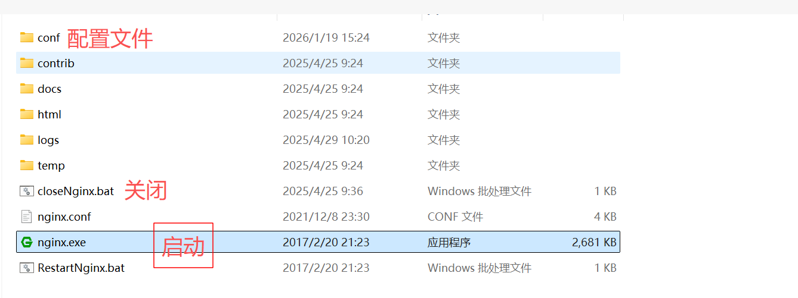
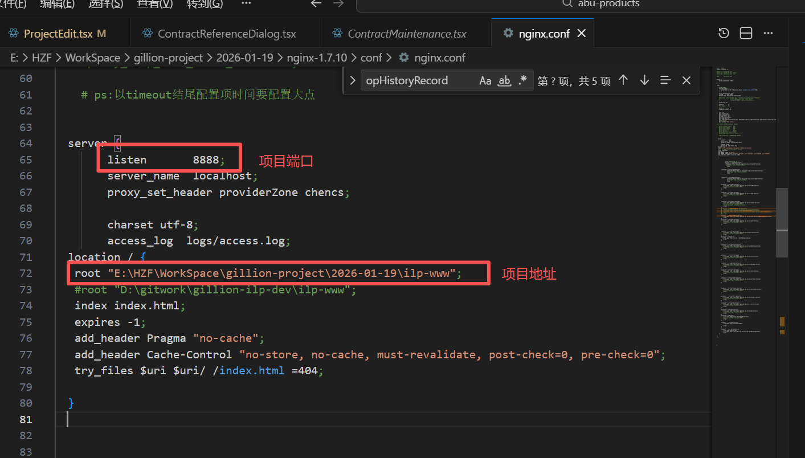

## 启动

- 
- 点击启动程序后，在浏览器输入对应的端口即可访问
## [Nginx 如何为不同前端资源配置缓存策略？如何强制刷新特定资源？](https://github.com/pro-collection/interview-question/issues/1148)

```conf{9,15,21,26,33}
server {
    listen 80;
    server_name example.com;
    root /path/to/frontend;

    # 1. 带哈希的静态资源（永久缓存）
    location ~* \.\w{8,16}\.(js|css|png|jpg|jpeg|webp|svg)$ {
        expires 365d;
        add_header Cache-Control "public, max-age=31536000, immutable";
    }

    # 2. 无哈希的静态资源（短期+协商）
    location ~* \.(png|jpg|jpeg|ico|woff2?)$ {
        expires 7d;
        add_header Cache-Control "public, max-age=604800, must-revalidate";
    }

    # 3. 入口文件与 HTML（协商缓存）
    location = /index.html {
        expires -1;
        add_header Cache-Control "no-cache, must-revalidate";
    }

    # 4. API 接口（无缓存）
    location /api {
        add_header Cache-Control "no-store, no-cache";
        expires -1;
        proxy_pass http://backend;
    }

    # SPA 路由支持（配合 History 模式）
    location / {
        try_files $uri $uri/ /index.html;
    }
}
```

## [前端静态资源加载超时，Nginx 可通过哪些配置优化？](https://github.com/pro-collection/interview-question/issues/1147)

### 一、延长关键超时时间

```conf{8,28}
# nginx.conf 全局配置
worker_processes auto;
worker_connections 10240;
multi_accept on;

http {
    # 【压缩配置（减小传输体积）】
    gzip on;
    gzip_comp_level 5; # 压缩级别 1-9（5 为平衡值）
    gzip_min_length 1024;  # 仅压缩 >1KB 的文件（小文件压缩收益低）
    gzip_types text/html text/css application/javascript;
    gzip_static on;

    # 【优化文件读取效率】
    open_file_cache max=10000 inactive=30s;
    open_file_cache_valid 60s;
    open_file_cache_min_uses 2;

    server {
        listen 80;
        server_name example.com;

        # 【超时配置-延长关键超时时间】
        # 1. 客户端与服务器建立连接的超时（握手阶段）
        client_header_timeout 120s; # 等待客户端发送请求头的超时（默认 60s，延长至 2 分钟）
        client_body_timeout 120s; # 等待客户端发送请求体的超时（默认 60s）

        # 2. 服务器向客户端发送响应的超时（传输阶段，核心！）
        send_timeout 300s; # 大文件传输时，服务器发送数据的超时（默认 60s，延长至 5 分钟）

        # 3. 长连接保持时间（复用连接，减少重复握手开销）
        keepalive_timeout 120s; # 连接空闲后保持的时间（默认 75s，延长至 2 分钟）
        keepalive_requests 200; # 单个长连接可处理的请求数（默认 100，提高至 200）

        # 请求体大小限制
        client_max_body_size 100m;

        # 【静态资源优化】
        location ~* \.(js|css|png|jpg|jpeg|webp|mp4)$ {
            root /path/to/frontend;
            # 启用零拷贝与 TCP 优化
            sendfile on; # 零拷贝：直接从磁盘读取文件发送到网络，跳过用户态-内核态数据拷贝（核心优化！）
            tcp_nopush on;  # 配合 sendfile 使用，积累数据后一次性发送，减少网络包数量（提升大文件传输效率）
            tcp_nodelay off;  # 禁用 Nagle 算法（减少小数据包延迟，适合动态内容，但大文件建议关闭）
            expires 30d;  # 浏览器缓存，减少重复请求
        }

        # 视频等大资源单独配置
        location /videos {
            client_max_body_size 500m;
            add_header Accept-Ranges bytes;
        }
    }
}
```
