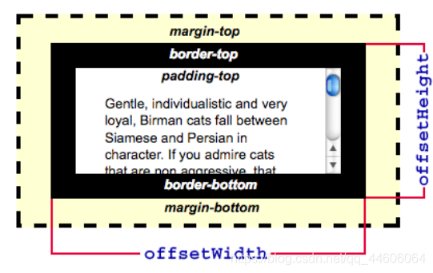
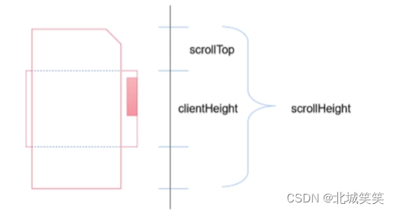

<!--
 * @Description:
 * @Date: 2024-10-11 18:10:58
 * @LastEditTime: 2024-11-05 13:58:21
-->

## [HTMLElement 的属性](https://blog.csdn.net/lph159/article/details/142134594)

| 属性                                                                                  | 说明                                                                                                                                                                                            | 图解                                    |
| ------------------------------------------------------------------------------------- | ----------------------------------------------------------------------------------------------------------------------------------------------------------------------------------------------- | --------------------------------------- |
| `window.innerHeight`                                                                  | 浏览器窗口的内部高度(包括滚动条),会随着浏览器窗口的放大缩小变化                                                                                                                                 |                                         |
| `clientWidth`/`clientHeight`                                                          | • `clientWidth = el.width + padding`; • 获取屏幕可视区域的**宽度/高度**，包含元素的**宽度/高度**+内边距`padding`； • **不包含**边框、外边距和垂直/水平滚动条（如果有的话）              |  |
| `offsetWidth`/`offsetHeight`                                                          | • `offsetWidth = el.width + padding + border + scrollbar`; • 元素的 offsetHeight 是一种元素 CSS 高度的衡量标准， • **包括**元素的**边框+内边距+元素的水平滚动条**（如果存在且渲染的话） |  |
| [`offsetLeft/offsetTop`](https://blog.csdn.net/qq_42816270/article/details/138028929) | 元素相对于**最近定位父级元素 offsetParent**的坐标，或最近的 `table、td、th、body`元素。 当元素没有定位父元素时，offsetParent 默认为 body                                                    |        |
| [offsetX/offsetY](https://blog.csdn.net/eleanor_wong/article/details/90550056)        | offsetX 和 offsetY 表示（鼠标位置）相对于**最近父级元素的坐标**（**无论父级是否定位**）（不管是谁触发）                                                                                         | -                                       |
| `clientX/clientY `                                                                    | 鼠标相对于浏览器文档显示区的水平 X 坐标,不包括工具栏和滚动条                                                                                                                                    |
| `scrollTop`                                                                           | 元素顶部与文档顶部之间的距离，也就是滚动条 **滚动的距离当滚动条位于容器底部时，以下条件成立`scrollTop + clientHeight  = scrollHeight;`**。                                                  |         |
| 判断元素是否进入父元素视口                                                            | `offsetTop < window.innerHeight + scrollTop`                                                                                                                                                    |             |

## 【HTML5 新特性、语义化】

### 概念

HTML5 的语义化指的是`合理正确的使用语义化的标签来创建页面结构`。(正确的标签做正确的事)

### 语义化标签

| 标签    | 描述                                                                       |
| ------- | -------------------------------------------------------------------------- |
| header  | 用于定义文档或文档节的**头部**，通常包含标题、导航链接和其他头部内容       |
| footer  | 用于定义文档或文档节的**尾部**，通常包含版权信息、作者信息和其他尾部内容。 |
| nav     | 用于定义导航**链接**的集合                                                 |
| main    | 定义页面的**主要内容**                                                     |
| article | 用于定义独立的内容块，如博客**文章**、新闻报道等                           |
| section | 用于定义文档中的节，表示文档的**某个区域或功能块**                         |
| aside   | 定义与页面主内容 minor 的内容 ,如**侧边栏**                                |

::: example
blogs/css/html/html5Layput
:::

### 语义化的优点

- 在没 CSS 样式的情况下，页面整体也会呈现很好的**结构**效果
- **代码**结构清晰，易于阅读，
- 利于开发和维护，方便其他设备解析（如屏幕阅读器）根据语义渲染网页。
- 有利于搜索引擎优化（**`SEO`**），搜索引擎爬虫会根据不同的标签来赋予不同的权重

## 【script 标签上有哪些常⽤属性，分别作⽤是啥？】

| 属性        | 描述                                                                                                                                           |
| ----------- | ---------------------------------------------------------------------------------------------------------------------------------------------- |
| src         | • 指定要引⼊的外部 JavaScript ⽂件的 URL； • 下载并 **执⾏** 指定的外部脚本⽂件；                                                          |
| async(可选) | • ⽤于指⽰浏览器**异步加载脚本的同时继续解析 HTML ⽂档**，不会阻塞其他资源的**加载**； • 但下载完成后脚本的 **执⾏** 还是会阻塞 DOM 渲染； |
| defer(可选) | • ⽤于指⽰浏览器**延迟执⾏脚本**； • 在 HTML **解析完成**之后、DOMContentLoaded 事件触发之前执⾏，不阻塞 HTML 的解析                       |
| type        | • 指定脚本语⾔的 `MIME` 类型。通常是 `text/javascript` 或者 `module` （⽤于 ES6 模块）。 • 默认为 JavaScript 类型。                        |
| charset     | 指定外部脚本⽂件的字符编码。 如`charset="UTF-8"`                                                                                               |
