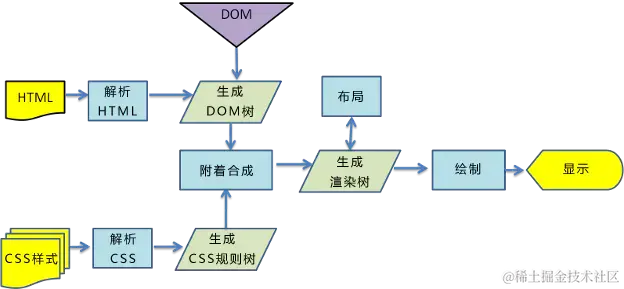
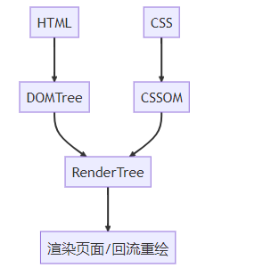
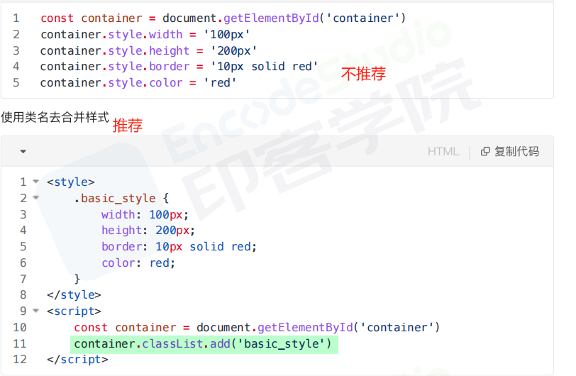
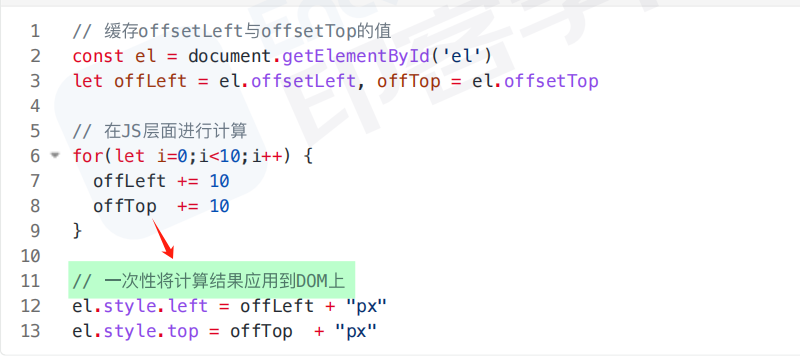
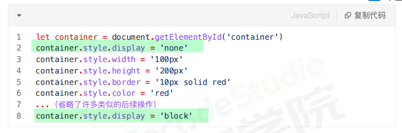

# 回流和重绘

## 【基础概念】

- 回流:布局引擎会根据各种样式计算每个盒子在页面上的**大小与位置**
- 重绘:当计算好盒模型的位置、大小及其他属性后，浏览器根据每个盒子特性进行**绘制**

## 【浏览器解析渲染机制】

|                                       |                                         |
| ------------------------------------- | --------------------------------------- |
|  |  |

- 解析 HTML 深度优先遍历，生成 DOM 树（`DOM Tree`）；解析 CSS，生成 CSSOM 树（`CSS Rule Tree`）
  > - DOM 树由 dom 元素及属性节点组成，树的根是 document 对象
  > - 浏览器 CSS 解析器对 CSS 解析规则是**从右到左匹配查找**，如果选择器嵌套层数太多会造成 CSS Tree 加载变慢
- 将 DOM 树和 CSSOM 树结合，生成渲染树(`Render Tree`)
- `Layout`(回流):根据生成的渲染树，进行回流(Layout)，得到节点的几何信息(**位置，大小**)
- `Painting`(重绘):根据渲染树以及回流得到的几何信息，得到节点的绝对像素  
  (遇到 `<script>`（即 js 代码）则暂停渲染,优先加载并执行 JS 代码,完成再继续)
- Display:将像素发送给 GPU，展示在页面上

## 【触发时机】

### 回流触发时机

当页面**布局和几何信息发生变化**的时候，就需要回流，如下面情况:

- 添加或删除可见的 DOM 元素
- 元素的**位置**发生变化
- 元素的 **尺寸（大小）** 发生变化(包括外边距、内边框、边框大小、高度和宽度等)。
- **内容**发生变化，比如文本变化或图片被另一个不同尺寸的图片所替代
- **页面一开始渲染的时候**(无法避免)
- **浏览器的窗口尺寸变化**(因为回流是根据视口的大小来计算元素的位置和大小的)
- 还有一些容易被忽略的操作：获取一些需要即时计算的特定属性的值（见【浏览器优化机制】）
  > - `offsetTop`、`offsetLeft`、 `offsetWidth`、`offsetHelgh`、 `scralTop`、`scrolLeft`、`scrollWidth`、`scrollHeight`、`clientTop`、`clientLeft`、`clientWidth`、`clientHeight`
  > - 这些属性有一个共性，就是**需要通过即时计算得到**。因此浏览器为了获取这些值，也会进行回流，除此还包括 `getComputedstyle` 方法，原理是一样的

### 重绘触发时机

- **触发回流一定会触发重绘**(重绘不一定会触发回流)
- 颜色的修改
- 文本方向的修改
- 阴影的修改

## 【浏览器优化机制】

- 由于每次重排都会造成额外的计算消耗，因此大多数浏览器都会通过**队列化修改并批量执行**来优化重排过程。
- 浏览器会将修改操作放入到队列里，直到过了一段时间或者操作达到了一个值，才清空队列
- **当你获取布局信息的操作的时候，会强制队列刷新**，包括前面讲到的 offsetTop 等方法都会返回最新的数据，因此浏览器不得不清空队列，触发回流重绘来返回正确的值

## 【如何避免或减少重排和重绘】

- 尽量避免频繁使用 style，而是使用修改 class 的方式
  
- 尽量只修改 `position：absolute` 或 `fixed` 元素，对其他元素影响不大
- 避免使用 table 布局，table 中每个元素的大小以及内容的改动，都会导致整个 table 的重新计算
- 在使用 JavaScript 动态插入多个节点时,可以使用 `DocumentFragment`,创建后一次插入,就能避免多次的渲染性能
- 对于那些复杂的动画，对其设置` position:fixed/absolute` ，尽可能地使元素脱离文档流从而减少对其他元素的影响
- ~~使用 css3 硬件加速，可以让 transform、opacity、filters 这些动画不会引起回流重绘~~
- 避免使用 CSS 的 JavaScript 表达式
- 对于 resize 和 scroll 进行防抖节流处理
- 集中改变样式，不要一条一条地修改 DOM 的样式。
  
- 不要把 DOM 结点的属性值放在循环里当成循环里的变量。
- 为动画的 HTML 元件使用 fixed 或 absoult 的 position，那么修改他们的 CSS 是不会 reflow 的。
<!-- - 动画开始 GPU 加速，translate 使用 3D 变化 -->
- 离线操作:通过设置元素属性 display:none ，将其从页面上去掉，然后再进行后续操作，这些后续操作也不会触发回流与重绘，这个过程称为离线操作,结束后再显示
  
