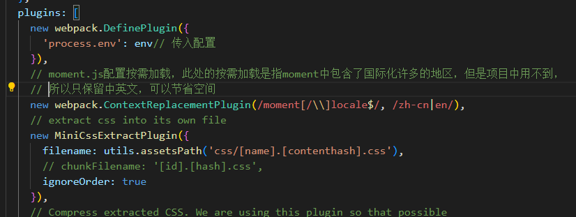
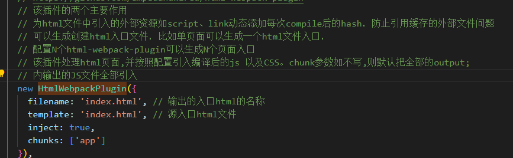
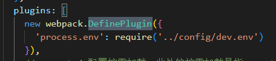
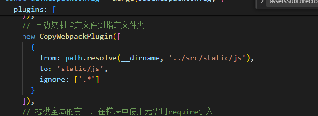
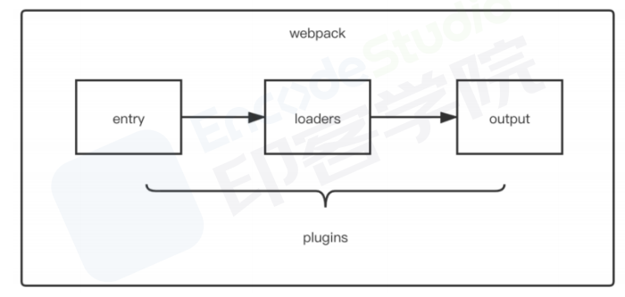
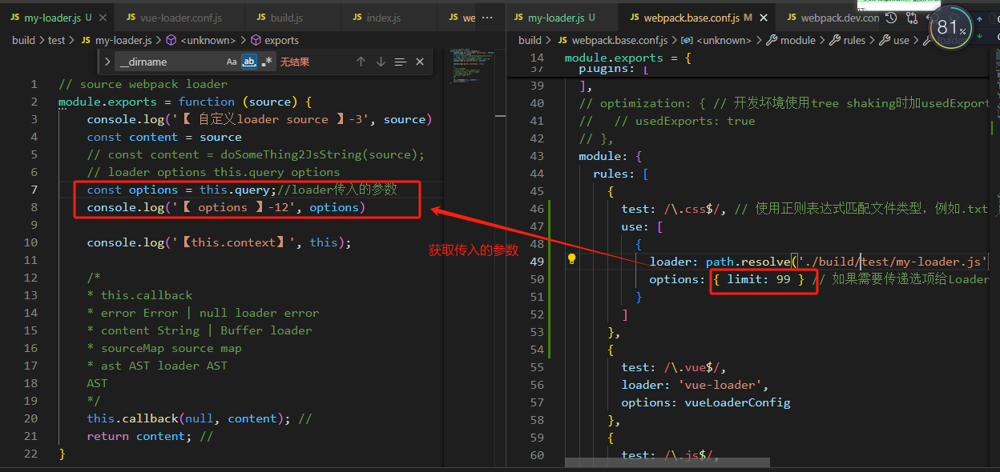
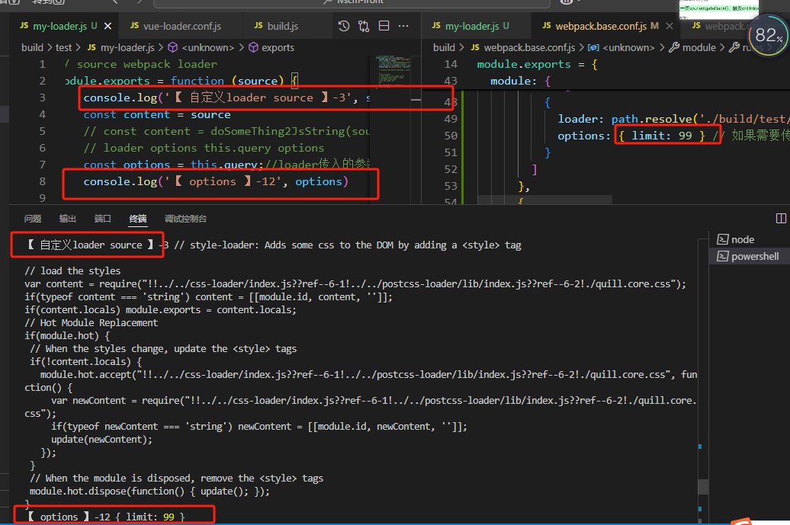
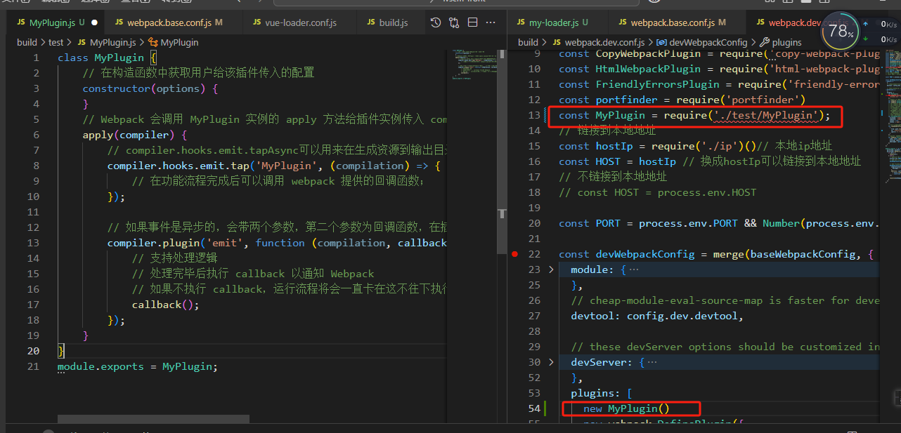

参考资料：

- [Webpack5 入门到原理](https://www.bilibili.com/video/BV14T4y1z7sw)

Webpack 本身功能是有限的：只能处理 `js` 资源，一旦遇到 `css` 等其他资源就会报错。

- 开发模式：仅能编译 JS 中的 `ES Module` 语法
- 生产模式：能编译 JS 中的 `ES Module` 语法，还能压缩 JS 代码  
  所以我们学习 `Webpack`，就是主要学习如何处理其他资源。

---

- node 环境 16+
- 初始化 package.json 文件： `npm init -y`
- 下载 webpack 依赖：`npm i webpack webpack-cli -D`

## （一）基础配置

### 1. 五大核心概念

| 标题        |                  | 作用                                                                                          |
| ----------- | ---------------- | --------------------------------------------------------------------------------------------- |
| ① `entry`   | 入口             | 指示 Webpack 从哪个文件开始打包                                                               |
| ② `output`  | 输出             | 指示 Webpack 打包完的文件输出到哪里去，如何命名等                                             |
| ③ `module`  | 加载器           | **webpack 本身只能处理 js、json 等资源**，<br/>其他资源需要借助 module 中配置 loader 才能解析 |
| ④ `plugins` | 插件             | 扩展 Webpack 的功能                                                                           |
| ⑤ `mode`    | 模式，主要有两种 | 开发模式：`development`<br>生产模式：`production`                                             |

## （二）loader

### 1. 安装配置

- loader 用于对**模块的"源代码"进行转换**，在 import 或"加载"模块时预处理文件
  > webpack 做的事情，仅仅是分析出各种模块的**依赖关系**，然后形成资源列表，最终打包生成到指定的文件中。
- 在 webpack 内部中，任何文件都是模块，不仅仅只是 js 文件。默认情况下，在遇到 import 或者 require 加载模块的时候，**webpack 只支持对 js 和 json 文件打包**，像 css、sass、png 等这些类型的文件的时候，webpack 则无能为力，**这时候就需要配置对应的 loader 进行文件内容的解析**
- **Loader**在`module.rules`中配置，他作为模块的解析规则而存在。 rules 是一个数组的形式，每一项都是一个`Object`，属性如下：
  |配置|解析|
  |---|---|
  |`test`|对象属性 test 为匹配的规则(匹配文件类型)，一般情况为正则表达式属性|
  |`use`|针对匹配到文件类型，调用对应的 loader 进行处理|
  |`options`|使用的参数|

```js{5,6,10}
module.exports = {
  module: {
    rules: [
      {
        test: /\.css$/,
        use: [
          { loader: 'style-loader' },
          {
            loader: 'css-loader',
            options: {
              modules: true
            }
          },
          { loader: 'sass-loader' }
        ]
      }
    ]
  }
}
```

### 2. 有哪些常见的 Loader？他们是解决什么问题的？

- 同一个任务的 loader 可以同时挂载多个，处理顺序为:**从右到左，从下往上**

  | loader            | 作用                                                                                                                                                                                                                  |
  | ----------------- | --------------------------------------------------------------------------------------------------------------------------------------------------------------------------------------------------------------------- |
  | `css-loader`      | 加载 CSS，支持模块化、压缩、文件导入等特性<br/>**css-loader 只是负责将 css 文件进行一个解析，而并不会将解析后的 css 插入到页面中**                                                                                    |
  | `style-loader`    | 把`css-loader`生成的内容，用 style 标签挂载到页面 head 中                                                                                                                                                             |
  | `less-loader`     | 解析 `less`、`sass`、`stylus`等预处理器编写 css 样式                                                                                                                                                                  |
  | `image-loader`    | 加载并且压缩图片文件                                                                                                                                                                                                  |
  | `file-loader`     | 把识别出的资源模块，**移动到指定的输出目目录**，并且返回这个资源在输出目录的地址(字符串) ,在代码中通过相对 URL 去引用输出的文件                                                                                       |
  | `url-loader `     | 和 file-loader 类似，可以处理`file-loader` 所有的事情，但是遇到**图片格式的模块**，可以选择性的把图片转成 base64 格式的字符串，并打包到 js 中,<br/>能在**文件很小的情况下**以 `base64` 的方式把文件内容注入到代码中去 |
  | babel-loader      | 把 ES6 转换成 ES5                                                                                                                                                                                                     |
  | eslint-loader     | 通过 ESLint 检查 JavaScript 代码                                                                                                                                                                                      |
  | source-map-loader | 加载额外的 Source Map 文件，以方便断点调试                                                                                                                                                                            |

- `css-loader`
  - 如果只通过 `css-loader` 加载文件，这时候页面代码设置的样式并没有生效，原因在于，**css-loader 只是负责将 css 文件进行一个解析，而并不会将解析后的 css 插入到页面中**
  - 如果我们希望再完成插入 style 的操作，那么我们还需要另外一个 loader ，就是 `style-loader`
- `file-loader`

```js
// 处理图片
// 过去在 Webpack4 时，我们处理图片资源通过 `file-loader` 和 `url-loader` 进行处理
// 现在 Webpack5 已经将两个 Loader 功能内置到 Webpack 里了，我们只需要简单配置即可处理图片资源
const obj = {
  test: /\.(png|jpe?g|gif|webp)$/, //匹配图片格式
  type: 'asset', //设置type: 'asset'
  parser: {
    dataUrlCondition: {
      // 小于10kb的图片会被base64处理打包到dist,大于10k的话不会打包到dist,而是发请求获取
      // 优点，减少请求次数，缺点：体积会变大
      maxSize: 10 * 1024 //最大10kb
    }
  },
  generator: {
    // 输出图片名称,存放到dist/static/images文件下下
    // [hash:10] hash值取前10位,为图片生成唯一id
    filename: 'static/images/[hash:10][ext][query]'
  }
}
```

- `url-loader`

```js{12}
rules: [
 //...,
  {
    test: /\.(png|jpe?g|gif)$/,
    use: {
      loader: "url-loader",
      options: {
        // placeholder [name]
        name: "[name]_[hash].[ext]",  // [ext]
        outputPath: "./images"
        publicPath: './images', // url
        limit: 100  // 100 base64
      }
    }
  }
]
```

## （三）插件 plugins

- webpack 中的 plugin 赋予其各种灵活的功能，例如**打包优化、资源管理、环境变量注入**等，它们会运行在 webpack 的不同阶段(钩子/生命周期)，贯穿了 webpack 整个编译周期
- **目的在于解决 loader 无法实现的其他事**
  

### 在项⽬中， 使⽤过哪些 webpack plugin, 说⼀下他们的作⽤

| 插件名称               | 作用                                                                                                                                                                                                         | 示例                            |
| ---------------------- | ------------------------------------------------------------------------------------------------------------------------------------------------------------------------------------------------------------ | ------------------------------- |
| `HtmlWebpackPlugin`    | 在打包结束后，**自动生成一个 html 文件**，并将打包后的 js 模块资源自动**注入到 HTML**中。                                                                                                                    |  |
| `MiniCssExtractPlugin` | 将 CSS 代码提取到单独的文件中，而不是内联到 JavaScript 中。                                                                                                                                                  |  |
| `CopyWebpackPlugin`    | 将指定的文件或目录(from)复制到输出目录(to) <br/>● from:设置从哪一个源中开始复制 <br/>● to:复制到的位置，可以省略，会默认复制到打包的目录下<br/> ● globOptions:设置一些额外的选项，其中可以编写需要忽略的文件 |  |
| `clean-webpack-plugin` | 删除(清理)构建目录                                                                                                                                                                                           |
| `DefinePlugin`         | 允许在编译时创建配置的**全局对象**，是一个 webpack**内置的插件**，不需要安装                                                                                                                                 |  |

<!-- 
 -->

- 一般情况，通过配置文件导出对象中 plugins 属性传入 **new 实例对象**。

### [plugins-Eslint 配置](https://juejin.cn/post/7115405551130902541/)

### [plugins-Bable 配置](https://juejin.cn/post/7254812719350267961)

## （四）说说 Loader 和 Plugin 的区别?编写 Loader，Plugin 的思路?

### Loader 和 Plugin 的区别

| **区别** | **loader**                                                                                                                                       | plugin                                                                                                                          |
| -------- | ------------------------------------------------------------------------------------------------------------------------------------------------ | ------------------------------------------------------------------------------------------------------------------------------- |
| 概念     | **loader 是文件加载器**，<br/>能够加载资源文件，并对这些文件进行一些处理，<br/>诸如编译、压缩等，最终一起打包到指定的文件中                      | plugin 赋予了 webpack 各种灵活的功能，<br/>例如打包优化、资源管理、环境变量注入等，<br/>**目的是解决 loader 无法实现的其他事**  |
| 运行时机 | loader 运行在**打包文件之前**                                                                                                                    | plugins 在**整个编译周期**都起作用                                                                                              |
|          | 对于 loader，实质是一个转换器，将 A 文件进行编译形成 B 文件，**操作的是文件**，<br/>比如将 Ascss 或 A.less 转变为 B.css ，**单纯的文件转换过程** | 在 Webpack 运行的生命周期中会广播出许多事件，Plugin 可以监听这些事件，<br/>在合适的时机通过 Webpack 提供的 API **改变输出结果** |

- 从整个运行时机上来看，如下图所示:
  

### [编写 loader](https://blog.csdn.net/Tyro_java/article/details/140078505)

- 在编写 loader 前，我们首先需要了解 loader 的本质
- **其本质为函数**，函数中的 this 作为上下文会被 webpack 填充,因此我们**不能将 loader 设为一个箭头函数**
- 函数接受一个参数，为 webpack 传递给 loader 的文件源内容，对其进行处理或转换，然后输出处理后的代码
- 函数中 this 是由 webpack 提供的对象，能够获取当前 loader 所需要的各种信息
- 函数中有异步操作或同步操作，异步操作通过 `this.callback` 返回，**返回值要求为 string 或者 Buffer**
  代码如下所示:
  - 创建一个名为 my-loader.js 的文件,在 webpack.config.js 文件中，配置 Loader
  - 编写好之后,确保 Webpack 配置正确无误后，运行 Webpack 来查看 Loader 是否工作。  
    可以运行`webpack --config webpack.config.js`看能否正常运行
    
    输出结果  
    
- 一般在编写 loader 的过程中，保持功能单一，避免做多种功能
- 如 less 文件转换成 css 文件也不是一步到位，而是 less-loader、css-loader、style-loader 几个 loader 的链式调用才能完成转换

### 编写 plugin

关于 plugin 整个编译生命周期钩子，有如下:

| 钩子          |                                                     |     |
| ------------- | --------------------------------------------------- | --- |
| entry-option  | 初始化 option                                       |     |
| run           |                                                     |     |
| compile       | 真正开始的编译，在创建 compilation 对象之前         |     |
| compilation   | 生成好了 compilation 对象                           |     |
| make          | 从 entry 开始递归分析依赖，准备对每个模块进行 build |     |
| after-compile | 编译 build 过程结束                                 |     |
| emit          | 在将内存中 assets 内容写到磁盘文件夹之前            |     |
| after-emit    | 在将内存中 assets 内容写到磁盘文件夹之后            |     |
| done          | 完成所有的编译过程                                  |     |
| failed        | 编译失败的时候                                      |     |


webpack 编译会创建两个核心对象:

- `compiler`:包含了**webpack 环境的所有的配置信息**，包括 options，loader 和 plugin，和 webpack 整个生命周期相关的**钩子**
- `compilation`:作为 plugin 内置事件回调函数的参数，包含了当前的**模块资源、编译生成资源、变化的文件**以及被跟踪依赖的状态信息。
  当检测到一个文件变化，一次新的 Compilation 将被创建
- 如果自己要实现 plugin，也需要遵循一定的规范:
  - **插件必须是一个函数或者是一个包含 apply 方法的对象，这样才能访问 compiler 实例**
  - 传给每个插件的 compiler 和 compilation 对象都是同一个引用，因此不建议修改。
  - 异步的事件需要在插件处理完任务时调用回调函数`callback`通知 Webpack 进入下一个流程，不然会卡住

```js{5,7,12,14,16}
class MyPlugin {
  // 在构造函数中获取用户给该插件传入的配置
  constructor(options) {}
  // Webpack 会调用 MyPlugin 实例的 apply 方法给插件实例传入 compiler 对象
  apply(compiler) {
    // compiler.hooks.emit.tapAsync可以用来在生成资源到输出目录之前执行代码。
    compiler.hooks.emit.tap('MyPlugin', (compilation) => {
      // 在功能流程完成后可以调用 webpack 提供的回调函数；
    })

    // 如果事件是异步的，会带两个参数，第二个参数为回调函数，在插件处理完任务时需要调用回调函数通知webpack，才会进入下一个处理流程。
    compiler.plugin('emit', function (compilation, callback) {
      // 支持处理逻辑
      // 处理完毕后执行 callback 以通知 Webpack
      // 如果不执行 callback，运行流程将会一直卡在这不往下执行
      callback()
    })
  }
}
module.exports = MyPlugin
```

## （四）开发服务器&自动化

```js
// 【六】开发服务器：使用devServer的话开发指令需要用：npx webpack serve
// 自动监测代码变化，自动进行编译（不会打包到dist，是在内存中临时打包的）
    devServer: {
        host: 'localhost', // 启动服务器域名
        port: '3000', // 启动服务器端口号
        open: true // 是否自动打开浏览器
    },
```

## （五）完整配置代码

webpack.config.js

```js{32,42,51,73,94,113}
// Node.js的核心模块，专门用来处理文件路径
const path = require('path')
const ESLintWebpackPlugin = require('eslint-webpack-plugin')
const HtmlWebpackPlugin = require('html-webpack-plugin')

module.exports = {
  // 【一】入口
  // 相对路径和绝对路径都行
  entry: './src/main.js',
  // 【二】输出
  output: {
    // path: 文件输出目录，必须是绝对路径
    // path.resolve()方法返回一个绝对路径
    // __dirname 当前文件的文件夹绝对路径
    path: path.resolve(__dirname, 'dist'),
    // filename: 入口文件打包输出的文件名
    filename: 'static/js/main.js' //js文件放置于js文件下
    // 开启devServer模式下clean可以不需要，因为devServer不会打包到dist
    // clean原理,在打包前,将path整个目录内容清空,再进行打包（wep4需要用插件）
    // clean: true // 自动将上次打包目录资源清空
  },
  // 【三】 加载器
  module: {
    rules: [
      // loader官方文档：https://webpack.docschina.org/loaders/
      // loader作用：帮助webpack识别不能识别的语言，如css等
      // 1.处理样式
      // ① css-loader
      {
        test: /\.css$/, // 用来匹配 .css 结尾的文件
        // use 数组里面 Loader 执行顺序是从右到左，从下到上
        use: ['style-loader', 'css-loader']
      },
      // ② less-loader
      {
        test: /\.less$/,
        // loader:'xxx',//只能写一个，use可以多个
        use: [
          //use可以多个
          'style-loader',
          'css-loader',
          'less-loader' // 将less编译成css文件
        ]
      },
      // ③ sass-loader
      {
        test: /\.s[ac]ss$/,
        use: [
          'style-loader',
          'css-loader',
          'sass-loader' // 将sass编译成css文件
        ]
      },
      // ④ stylus-loader
      // {
      //     test: /\.styl$/,
      //     use: [
      //         'style-loader',
      //         'css-loader',
      //         'stylus-loader' // 将stylus编译成css文件
      //     ]
      // }
      // 2.处理图片
      // 过去在 Webpack4 时，我们处理图片资源通过 `file-loader` 和 `url-loader` 进行处理
      // 现在 Webpack5 已经将两个 Loader 功能内置到 Webpack 里了，我们只需要简单配置即可处理图片资源
      {
        test: /\.(png|jpe?g|gif|webp)$/, //匹配图片格式
        type: 'asset', //设置type: 'asset'
        parser: {
          dataUrlCondition: {
            // 小于10kb的图片会被base64处理打包到dist,大于10k的话不会打包到dist,而是发请求获取
            // 优点，减少请求次数，缺点：体积会变大
            maxSize: 10 * 1024 //最大10kb
          }
        },
        generator: {
          // 输出图片名称,存放到dist/static/images文件下下
          // [hash:10] hash值取前10位,为图片生成唯一id
          filename: 'static/images/[hash:10][ext][query]'
        }
      },
      // 3.处理字体图标等其他资源
      {
        test: /\.(ttf|woff2?|map4|map3|avi)$/,
        type: 'asset/resource', //只写asset会转成base54，加上resource会对文件原封不动地输出
        generator: {
          filename: 'static/media/[hash:8][ext][query]' //输出名称
        }
      },
      // 4.处理js：babel-loader
      {
        test: /\.js$/,
        exclude: /node_modules/, // 排除node_modules代码不编译
        loader: 'babel-loader'
        // 写到babel.config.js中，方便修改
        // options:{
        //     presets: ['@babel/preset-env'] //: 一个智能预设，允许您使用最新的 JavaScript。
        // }
      }
    ]
  },
  // 【四】 插件
  plugins: [
    // 1.配置eslint插件
    new ESLintWebpackPlugin({
      // 指定检查文件的根目录
      context: path.resolve(__dirname, 'src')
      // 配置写在项目根目录下的.eslintrc.js和.eslintignore中，系统会自动识别这两个文件
    }),
    // 2.配置html插件
    // 该插件将为你生成一个 HTML5 文件， 在 body 中使用 `script` 标签引入你所有 webpack 生成的 bundle。 只需添加该插件到你的 webpack 配置中
    // npm i html-webpack-plugin -D ：https://webpack.docschina.org/plugins/html-webpack-plugin/
    new HtmlWebpackPlugin({
      // 以 public/index.html 为模板创建文件
      // 新的html文件有两个特点：1. 内容和源文件一致 2. 自动引入打包生成的js等资源
      template: path.resolve(__dirname, 'public/index.html') //设置源文件
    })
  ],
  // 【六】开发服务器：使用devServer的话开发指令需要用：npx webpack serve
  // 自动监测代码变化，自动进行编译（不会打包到dist，是在内存中临时打包的）
  devServer: {
    host: 'localhost', // 启动服务器域名
    port: '3000', // 启动服务器端口号
    open: true // 是否自动打开浏览器
  },
  // 【五】模式
  mode: 'development' // 开发模式
} // typeof 对于基本数据类型来说，除了null都可以显示正确的类型；
```
