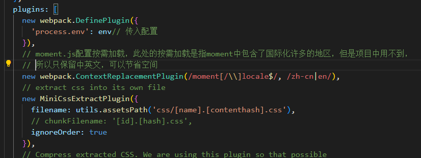

参考资料：

- [Webpack5 入门到原理](https://www.bilibili.com/video/BV14T4y1z7sw)

Webpack 本身功能是有限的:只能处理 `js` 资源，一旦遇到 `css` 等其他资源就会报错。

- 开发模式：仅能编译 JS 中的 `ES Module` 语法
- 生产模式：能编译 JS 中的 `ES Module` 语法，还能压缩 JS 代码  
  所以我们学习 `Webpack`，就是主要学习如何处理其他资源。

---

- node 环境 16+
- 初始化 package.json 文件： npm init -y
- `npm i webpack webpack-cli -D`:下载 webpack 依赖

## （一）基础配置

### 1. 五大核心概念

| 标题      |                  | 作用                                                                                |
| --------- | ---------------- | ----------------------------------------------------------------------------------- |
| ① entry   | 入口             | 指示 Webpack 从哪个文件开始打包                                                     |
| ② output  | 输出             | 指示 Webpack 打包完的文件输出到哪里去，如何命名等                                   |
| ③ loader  | 加载器           | **webpack 本身只能处理 js、json 等资源**，其他资源需要借助 loader，Webpack 才能解析 |
| ④ plugins | 插件             | 扩展 Webpack 的功能                                                                 |
| ⑤ mode    | 模式，主要有两种 | 开发模式：development<br>生产模式：production                                       |

## （二）loader

### 1. 安装配置

- **Loader**在`module.rules`中配置，也就是说他作为模块的解析规则而存在。 类型为数组，每一项都是一个`Object`，里面描述了对于什么类型的文件（`test`），使用什么加载(`loader`)和使用的参数（`options`）
- 以 file-loader 为例
  - （1）安装
  - （2）配置

```js
// 处理图片
// 过去在 Webpack4 时，我们处理图片资源通过 `file-loader` 和 `url-loader` 进行处理
// 现在 Webpack5 已经将两个 Loader 功能内置到 Webpack 里了，我们只需要简单配置即可处理图片资源
const obj = {
  test: /\.(png|jpe?g|gif|webp)$/, //匹配图片格式
  type: 'asset', //设置type: 'asset'
  parser: {
    dataUrlCondition: {
      // 小于10kb的图片会被base64处理打包到dist,大于10k的话不会打包到dist,而是发请求获取
      // 优点，减少请求次数，缺点：体积会变大
      maxSize: 10 * 1024 //最大10kb
    }
  },
  generator: {
    // 输出图片名称,存放到dist/static/images文件下下
    // [hash:10] hash值取前10位,为图片生成唯一id
    filename: 'static/images/[hash:10][ext][query]'
  }
}
```

### 2. 有哪些常见的 Loader？他们是解决什么问题的？

| loader            | 作用                                                                                        |
| ----------------- | ------------------------------------------------------------------------------------------- |
| css-loader        | 加载 CSS，支持模块化、压缩、文件导入等特性                                                  |
| style-loader      | 把 CSS 代码注入到 JavaScript 中，通过 DOM 操作去加载 CSS。                                  |
| image-loader      | 加载并且压缩图片文件                                                                        |
| file-loader       | 把文件输出到一个文件夹中，在代码中通过相对 URL 去引用输出的文件                             |
| url-loader        | 和 file-loader 类似，但是能在**文件很小的情况下**以 `base64` 的方式把文件内容注入到代码中去 |
| babel-loader      | 把 ES6 转换成 ES5                                                                           |
| eslint-loader     | 通过 ESLint 检查 JavaScript 代码                                                            |
| source-map-loader | 加载额外的 Source Map 文件，以方便断点调试                                                  |

## （三）插件 plugins



### [1. Eslint 配置](https://juejin.cn/post/7115405551130902541/)

### 2.[Bable 配置](https://juejin.cn/post/7254812719350267961)

## （四）开发服务器&自动化

```js
// 【六】开发服务器：使用devServer的话开发指令需要用：npx webpack serve
// 自动监测代码变化，自动进行编译（不会打包到dist，是在内存中临时打包的）
    devServer: {
        host: 'localhost', // 启动服务器域名
        port: '3000', // 启动服务器端口号
        open: true // 是否自动打开浏览器
    },
```

## （五）完整配置代码

webpack.config.js

```js{32,42,51,73,94,113}
// Node.js的核心模块，专门用来处理文件路径
const path = require('path')
const ESLintWebpackPlugin = require('eslint-webpack-plugin')
const HtmlWebpackPlugin = require('html-webpack-plugin')

module.exports = {
  // 【一】入口
  // 相对路径和绝对路径都行
  entry: './src/main.js',
  // 【二】输出
  output: {
    // path: 文件输出目录，必须是绝对路径
    // path.resolve()方法返回一个绝对路径
    // __dirname 当前文件的文件夹绝对路径
    path: path.resolve(__dirname, 'dist'),
    // filename: 入口文件打包输出的文件名
    filename: 'static/js/main.js' //js文件放置于js文件下
    // 开启devServer模式下clean可以不需要，因为devServer不会打包到dist
    // clean原理,在打包前,将path整个目录内容清空,再进行打包（wep4需要用插件）
    // clean: true // 自动将上次打包目录资源清空
  },
  // 【三】 加载器
  module: {
    rules: [
      // loader官方文档：https://webpack.docschina.org/loaders/
      // loader作用：帮助webpack识别不能识别的语言，如css等
      // 1.处理样式
      // ① css-loader
      {
        test: /\.css$/, // 用来匹配 .css 结尾的文件
        // use 数组里面 Loader 执行顺序是从右到左，从下到上
        use: ['style-loader', 'css-loader']
      },
      // ② less-loader
      {
        test: /\.less$/,
        // loader:'xxx',//只能写一个，use可以多个
        use: [
          //use可以多个
          'style-loader',
          'css-loader',
          'less-loader' // 将less编译成css文件
        ]
      },
      // ③ sass-loader
      {
        test: /\.s[ac]ss$/,
        use: [
          'style-loader',
          'css-loader',
          'sass-loader' // 将sass编译成css文件
        ]
      },
      // ④ stylus-loader
      // {
      //     test: /\.styl$/,
      //     use: [
      //         'style-loader',
      //         'css-loader',
      //         'stylus-loader' // 将stylus编译成css文件
      //     ]
      // }
      // 2.处理图片
      // 过去在 Webpack4 时，我们处理图片资源通过 `file-loader` 和 `url-loader` 进行处理
      // 现在 Webpack5 已经将两个 Loader 功能内置到 Webpack 里了，我们只需要简单配置即可处理图片资源
      {
        test: /\.(png|jpe?g|gif|webp)$/, //匹配图片格式
        type: 'asset', //设置type: 'asset'
        parser: {
          dataUrlCondition: {
            // 小于10kb的图片会被base64处理打包到dist,大于10k的话不会打包到dist,而是发请求获取
            // 优点，减少请求次数，缺点：体积会变大
            maxSize: 10 * 1024 //最大10kb
          }
        },
        generator: {
          // 输出图片名称,存放到dist/static/images文件下下
          // [hash:10] hash值取前10位,为图片生成唯一id
          filename: 'static/images/[hash:10][ext][query]'
        }
      },
      // 3.处理字体图标等其他资源
      {
        test: /\.(ttf|woff2?|map4|map3|avi)$/,
        type: 'asset/resource', //只写asset会转成base54，加上resource会对文件原封不动地输出
        generator: {
          filename: 'static/media/[hash:8][ext][query]' //输出名称
        }
      },
      // 4.处理js：babel-loader
      {
        test: /\.js$/,
        exclude: /node_modules/, // 排除node_modules代码不编译
        loader: 'babel-loader'
        // 写到babel.config.js中，方便修改
        // options:{
        //     presets: ['@babel/preset-env'] //: 一个智能预设，允许您使用最新的 JavaScript。
        // }
      }
    ]
  },
  // 【四】 插件
  plugins: [
    // 1.配置eslint插件
    new ESLintWebpackPlugin({
      // 指定检查文件的根目录
      context: path.resolve(__dirname, 'src')
      // 配置写在项目根目录下的.eslintrc.js和.eslintignore中，系统会自动识别这两个文件
    }),
    // 2.配置html插件
    // 该插件将为你生成一个 HTML5 文件， 在 body 中使用 `script` 标签引入你所有 webpack 生成的 bundle。 只需添加该插件到你的 webpack 配置中
    // npm i html-webpack-plugin -D ：https://webpack.docschina.org/plugins/html-webpack-plugin/
    new HtmlWebpackPlugin({
      // 以 public/index.html 为模板创建文件
      // 新的html文件有两个特点：1. 内容和源文件一致 2. 自动引入打包生成的js等资源
      template: path.resolve(__dirname, 'public/index.html') //设置源文件
    })
  ],
  // 【六】开发服务器：使用devServer的话开发指令需要用：npx webpack serve
  // 自动监测代码变化，自动进行编译（不会打包到dist，是在内存中临时打包的）
  devServer: {
    host: 'localhost', // 启动服务器域名
    port: '3000', // 启动服务器端口号
    open: true // 是否自动打开浏览器
  },
  // 【五】模式
  mode: 'development' // 开发模式
} // typeof 对于基本数据类型来说，除了null都可以显示正确的类型；
```
