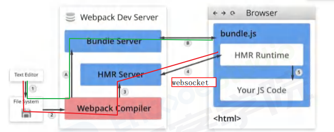
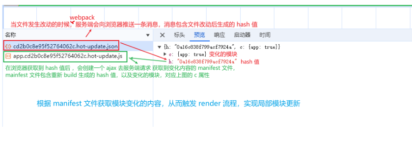
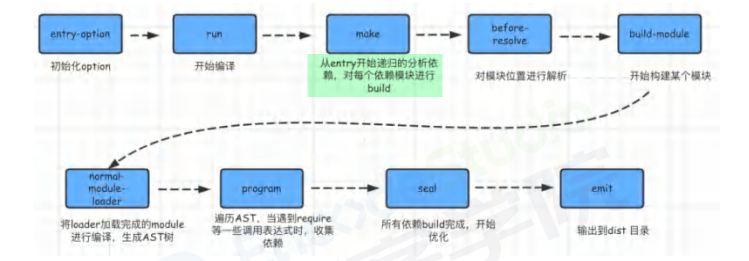

<!--
 * @Description:
 * @Date: 2024-11-15 17:43:05
 * @LastEditTime: 2024-11-18 13:54:16
-->

## 【说说你对 webpack 的理解?解决了什么问题?】

- webpack 是一个用于现代 JavaScript 应用程序的**静态模块打包工具**
- 解决的问题
  - 支持 通过**模块化**的方式来开发
  - 支持 使用一些**高级的特性**来加快我们的开发效率或者安全性，比如通过 ES6+、TypeScript 开发脚本逻辑，通过 `sass`、`less` 等方式来编写 css 样式代码
  - 支持 监听文件的变化来并且反映到浏览器上，提高开发的效率
  - 支持 HTML 和 CSS 这些资源文件需要被模块化的问题
  - 支持 开发完成后需要**将代码进行压缩、合并以及其他相关的优化**

## 【webpack 的热更新 HMR 是如何做到的?原理是什么】

### HMR 是什么

- HMR 全称 `Hot Module Replacement` ，可以理解为**模块热替换**，指在应用程序运行过程中，替换、添加、删除模块，而**无需重新刷新整个应用**
- webpack 配置开启热模块

```js
const webpack = require('webpack')
module.exports = {
  // ...
  devServer: {
    hot: true // HMR
    // hotOnly: true
  }
}
```

### 实现原理


|名称|说明|
|---|---|
|`Webpack Compile`|将 JS 源代码编译成 bundle.js|
|`HMR Server`|用来将热更新的文件输出给 `HMR Runtime`|
|`Bunde Server`|**静态资源文件服务器**，提供文件访问路径|
|`HMR Runtime`|**socket 服务器**，会被注入到浏览器，更新文件的变化|
|`bundle.js`|构建输出的文件|

- 在`HMR Runtime` 和`HMR Server`之间建立 websocket，即图上 4 号线，用于实时更新文件变化
- 上面图中，可以分成两个阶段:

  - 启动阶段为上图 `1-2-A-B`  
    在编写未经过 webpack 打包的源代码后，`Webpack Compile` 将**源代码(Your js Code)和 HMR Runtime** 一起编译成 bundle 文件，传输给 Bundle Server 静态资源服务器
  - 更新阶段为上图 `1-2-3-4`
  - **当某一个文件或者模块发生变化时，webpack 监听到文件变化对文件重新编译打包，编译生成唯一的 hash 值，这个 hash 值用来作为下一次热更新的标识**
    <!-- - 根据变化的内容生成两个补丁文件:manifest(包含了 hash 和 chundId ，用来说明变化的内容)和 chunk.js 模块 -->
    - 由于 socket 服务器在 HMR Runtime 和 HMR Server 之间建立 websocket 链接，**当文件发生改动的时候，webpack 服务端会向浏览器推送一条消息，消息包含文件改动后生成的 hash 值**，
    - 在浏览器获取到 hash 值后 ，会创建一个 ajax 去服务端请求 **获取到变化内容的 manifest 文件**，mainfest 文件包含重新 build 生成的 hash 值，以及变化的模块，对应下图的 c 属性
    - 浏览器根据 manifest 文件**获取模块变化的内容**，从而触发 render 流程，实现局部模块更新
      

### 总结

关于 webpack 热模块更新的总结如下:

- 通过 webpack-dev-server 创建两个服务器:**提供静态资源的服务(express)**和 **Socket 服务**
- express server 负责直接提供静态资源的服务(打包后的资源直接被浏览器请求和解析)
- socket server 是一个 websocket 的长连接，双方可以通信
- 当 socket server 监听到对应的模块发生变化时，会生成两个文件.json(manifest 文件)和.js 文件(update chunk)
- 通过长连接，socket server 可以直接将这两个文件主动发送给客户端(浏览器)
- 浏览器拿到两个新的文件后，通过 HMR runtime 机制，加载这两个文件，并且针对修改的模块进行更新

### 个人理解

- webpack 监听到文件变化对文件重新编译打包，编译生成唯一的 hash 值
- webpack 服务端将**包含 hash 值相关的消息**推送给浏览器
- 在浏览器获取到 hash 值后 ，去服务端请求 **获取到变化内容的 manifest 文件**，mainfest 文件包含重新 build 生成的 hash 值，以及变化的模块
- 浏览器根据 manifest 文件**获取模块变化的内容**，从而触发 render 流程，实现局部模块更新

## 【webpack 的构建流程】

3.1.运行流程
webpack 的运行流程是一个串行的过程，它的工作流程就是将各个插件串联起来，在运行过程中会广播事件，插件只需要监听它所关心的事件，就能加入到这条 webpack 机制中，去改变 webpack 的运作，使得整个系统扩展性良好。  
从启动到结束会依次执行以下三大步骤:

- **初始化流程**:从配置文件和 Shell 语句中**读取与合并参数**，并初始化需要使用的插件和配置插件等**执行环境所需要的参数**
- **编译构建流程**:从 `Entry` 发出，针对每个 Module 串行调用对应的 `Loader` 去翻译文件内容，再找到该 Module 依赖的 Module，**递归**地进行编译处理
- 输出流程:**对编译后的 Module 组合成 Chunk，把 Chunk 转换成文件，输出到文件系统**
  

## 【webpack proxy 工作原理?为什么能解决跨域?】

- 在开发阶段， `webpack-dev-server` 会启动一个**本地开发服务器**，所以我们的应用在开发阶段是独立运行在 `localhost` 的一个端口上；而后端服务又是运行在另外一个地址上  
  所以在开发阶段中，由于**浏览器同源策略的原因**，当本地访问后端就会出现**跨域请求**的问题
- 通过设置 webpack proxy 实现代理请求后，相当于浏览器与服务端中添加一个代理者  
  **当本地发送请求的时候，代理服务器响应该请求，并将请求转发到目标服务器**，  
  **目标服务器响应数据后，再将数据返回给代理服务器，最终再由代理服务器将数据响应给本地**
- proxy 工作原理实质上是利用`http-proxy-middleware` 这个 http 代理中间件，实现请求转发
  给其他服务器
- **在代理服务器传递数据给本地浏览器的过程中，两者同源**，并不存在跨域行为，这时候浏览器就能正常接收数据
- 注意:**服务器与服务器之间请求数据并不会存在跨域行为，跨域行为是浏览器安全策略限制**

## 【Webpack 如何打包运⾏时 chunk，且在项⽬⼯程中，如何去加载这个运⾏时 chunk ?】

### Webpack 如何打包运⾏时 chunk

- Webpack 打包运⾏时 chunk 的⽅式可以通过`optimization.runtimeChunk`选项来配置。
- 通过设置`optimization.runtimeChunk`为`'single'`，将会把**所有的 webpack 运⾏时代码打包为⼀个单独的 chunk**。

```js{4}
module.exports = {
  // ...
  optimization: {
    runtimeChunk: 'single'//把所有的webpack运⾏时代码打包为⼀个单独的chunk。
  }
}
```

### 在项⽬⼯程中加载运⾏时 chunk 有两种⽅式：

#### 1. 通过`script`标签加载

- 可以使⽤`HtmlWebpackPlugin`插件来 **⾃动将运⾏时 chunk 添加到 HTML ⽂件中**。
- 在 webpack 配置⽂件中添加以下配置：

```js{5,7}
const HtmlWebpackPlugin = require('html-webpack-plugin')
module.exports = {
  // ...
  plugins: [
    new HtmlWebpackPlugin({
      // ...
      chunks: ['runtime', 'app']//指定了要加载的 chunk
    })
  ]
}
```

- 上述配置中，chunks 选项指定了要加载的 chunk，包括**运⾏时** `chunk（'runtime'）`和其他的业务代码`chunk（'app'）`。**最终⽣成的 HTML ⽂件会⾃动引⼊这些 chunk。**

#### 2. 通过 import 语句动态加载

可以使⽤动态导⼊的⽅式来加载运⾏时 chunk。在需要加载运⾏时 chunk 的地⽅，使⽤以下代码：

```js
import(/* webpackChunkName: "runtime" */ './path/to/runtime').then((runtime) => {
  // 运⾏时 chunk 加载完成后的逻辑
})
```

- 上述代码中，通过 `import()`函数动态加载运⾏时 chunk，通过 `webpackChunkName` 注释指定**要加载的 chunk 名称**（这⾥是'runtime'）。加载完成后，可以进⾏相关逻辑处理。

#### 总结

**Webpack 可以通过 `optimization.runtimeChunk` 选项配置打包运⾏时 chunk，可以通过 `script` 标签加载或者使⽤`动态导⼊`的⽅式来加载运⾏时 chunk**。

### 如果只想把某⼏个⽂件打包成运⾏时加载， 该如何处理呢？

- 如果想将某⼏个⽂件打包成运⾏时加载，可以使⽤ Webpack 的 `entry` 配置和 `import()` 语法来实现。
- ⾸先，在 Webpack 的配置⽂件中，**将这⼏个⽂件指定为单独的 entry 点**。例如：

```js{5}
module.exports = {
  // ...
  entry: {
    main: './src/main.js',//业务代码的⼊⼝⽂件
    runtime: './src/runtime.js'//想要打包成运⾏时加载的⽂件。
  }
}
```

- 上述配置中， `main.js` 是业务代码的⼊⼝⽂件，` runtime.js` 是你想要打包成运⾏时加载的⽂件。
- 然后，在你的业务代码中，通过 `import()` 动态导⼊这些⽂件。例如：

```js{2,5}
function loadRuntime() {
  return import('./runtime.js')
}
// 使⽤动态导⼊的⽅式加载运⾏时⽂件
loadRuntime().then((runtime) => {
  // 运⾏时⽂件加载完成后的逻辑
})
```

- 使⽤ import() 会返回⼀个 `Promise` ，可以通过 `.then()` 来处理⽂件加载完成后的逻辑。
- 最后，使⽤ Webpack 进⾏打包时，会根据配置的 entry 点和 import() 语法⾃动将这⼏个⽂件打包成运⾏时加载的模块。运⾏时模块会在需要时动态加载并执⾏。
- 注意：在使⽤ import() 动态导⼊⽂件时，需要确保你的环境⽀持 **Promise 和动态导⼊语法**。
- 除了 entry 的⽅式可以处理⾃⼰申明的 runtime ⽂件以外， 还可以直接在 `import('xx')` 的时
  候申明；
  例如：
  ```js{1}
  import(/* webpackChunkName: "runtime" */ './path/to/runtime').then((runtime) => {
    // 运⾏时 chunk 加载完成后的逻辑
  })
  ```

上⾯的⽅式， 可以在也可以达到同样的效果， 只是在 import 的时候申明 runtime ⽂件名称⽽已

## 【与 webpack 类似的工具还有哪些?区别?】

| 工具     | 优点                                                                                                                                                                                                                                                               | 缺点                                                                                                             | 适用场景                                            |
| -------- | ------------------------------------------------------------------------------------------------------------------------------------------------------------------------------------------------------------------------------------------------------------------ | ---------------------------------------------------------------------------------------------------------------- | --------------------------------------------------- |
| Rollup   | ● 代码效率更简洁、效率更高<br>● 默认支持 Tree-shaking                                                                                                                                                                                                              | 加载其他类型的资源文件或者支持导入 CommonJS 模块，又或是编译 ES 新特性，这些额外的需求 Rollup 需要使用插件去完成 | 在用于打包 JavaScript 库,其打包出来的代码更小、更快 |
| Parcel   | ● 支持以任意类型文件作为打包入口<br>● 支持自动安装依赖 <br>● 能够零配置加载其他类型的资源文件，无须像 webpack 那样配置对应的 loader<br>● 由于打包过程是多进程同时工作，**构建速度会比 webpack 快**，输出文件也会被压缩，并且**样式代码也会被单独提取到单个文件中** |                                                                                                                  |                                                     |
| Snowpack | ● 应用程序每个文件构建一次，就可以永久缓存，文件更改时， Snowpack 会重新构建该单个文件<br>● 在重新构建每次变更时没有任何的时间浪费，只需要在浏览器中进行 HMR 更新                                                                                                  |                                                                                                                  |                                                     |
| vite     | ● 快速的冷启动<br>● 即时的模块热更新<br>● 真正的按需编译                                                                                                                                                                                                           |                                                                                                                  |                                                     |
| webpack  | ● 一切皆模块<br>● 按需加载                                                                                                                                                                                                                                         |                                                                                                                  |                                                     |

### Rollup

- Rollup 是一款 ES Modules 打包器，从作用上来看，Rollup 与 Webpack 非常类似。**不过相比于 Webpack，Rollup 要小巧的多**，现在很多我们熟知的库都使用它进行打包，比如:Vue、React 和 three.js 等
- Rollup 的优点:
  - 代码效率更简洁、效率更高
  - 默认支持 Tree-shaking
- 但缺点也十分明显，加载其他类型的资源文件或者支持导入 CommonJS 模块，又或是编译 ES 新特性，这些额外的需求 Rollup 需要使用插件去完成
- 综合来看， rollup 并不适合开发应用使用，因为需要使用第三方模块，而目前第三方模块大多数使用 CommonJs 方式导出成员。并且 rollup 不支持 HMR ，使开发效率降低。
- 但是**在用于打包 JavaScript 库**时，rollup 比 webpack 更有优势，因为**其打包出来的代码更小、更快**，其存在的缺点可以忽略

### Parcel

- Parcel ，是一款完全零配置的前端打包器，它提供了“傻瓜式”的使用体验，只需了解简单的命令，就能构建前端应用程序
- Parcel 跟 Webpack 一样**都支持以任意类型文件作为打包入口**，"但建议使用 HTML 文件作为入口，该 HTML 文件像平时一样正常编写代码、引用资源
- 执行命令后， Parcel 不仅打包了应用，同时也启动了一个开发服务器，跟 webpack DevServer-样
- 跟 webpack 类似，也支持模块热替换，但用法更简单同时， Parcel 有个十分好用的功能:**支持自动安装依赖**，像 webpack 开发阶段突然使用安装某个第三方依赖，必然会终止 dev server 然后安装再启动。而 Parcel 则免了这繁琐的工作流程同时， **Parcel 能够零配置加载其他类型的资源文件，无须像 webpack 那样配置对应的 loader**
- 由于打包过程是多进程同时工作，**构建速度会比 webpack 快**，输出文件也会被压缩，并且**样式代码也会被单独提取到单个文件中**

### Snowpack

- Snowpack，是一种闪电般快速的前端构建工具，专为现代 Web 设计，较复杂的打包工具(如 Webpack 或 Parcel )的替代方案，利用 JavaScript 的本机模块系统，避免不必要的工作并保持流畅的
- 开发体验开发阶段，每次保存单个文件时，Webpack 和 Parcel 都需要重新构建和重新打包应用程序的整个 bundle 。而 Snowpack **为你的应用程序每个文件构建一次，就可以永久缓存，文件更改时， Snowpack 会重新构建该单个文件**

### vite

- vite ，是一种新型前端构建工具，能够显著提升前端开发体验
- 它主要由两部分组成:
  - 一个开发服务器，它基于 原生 ES 模块 提供了丰富的内建功能，如速度快到惊人的**模块热更新 HMR**
  - 一套构建指令，它使用 Rollup 打包你的代码，并且它是预配置的，可以输出用于生产环境的优化过的静态资源
- 其作用类似 webpack+ webpack-dev-server ，其特点如下:
  - 快速的冷启动
  - 即时的模块热更新
  - 真正的按需编译
- **vite 会直接启动开发服务器，不需要进行打包操作**，也就意味着不需要分析模块的依赖、不需要编译，因此启动速度非常快
- 利用**现代浏览器支持 ES Module 的特性，当浏览器请求某个模块的时候，再根据需要对模块的内容进行编译**，这种方式大大缩短了编译时间
- 在热模块 HMR 方面，当修改一个模块的时候，仅需让浏览器重新请求该模块即可，无须像 webpack 那样需要把该模块的相关依赖模块全部编译一次，效率更高

### webpack

- 相比上述的模块化工具， webpack 大而全，很多常用的功能做到开箱即用。有两大最核心的特点:**一切皆模块**和**按需加载**
- 与其他构建工具相比，有如下优势:
- 智能解析:**对 CommonJS、AMD、ES6 的语法做了兼容**
- 万物模块:对 js、css、图片等资源文件都支持打包
- 开箱即用:HRM、Tree-shaking 等功能
- 代码分割:可以将代码切割成不同的 chunk，实现按需加载，降低了初始化时间
- 插件系统，具有强大的 Plugin 接口，具有更好的灵活性和扩展性
- 易于调试:支持 SourceUrs 和 SourceMaps
- 快速运行:webpack 使用异步 10 并具有多级缓存，这使得 webpack 很快且在增量编译上更加快
- 生态环境好:社区更丰富，出现的问题更容易解决
