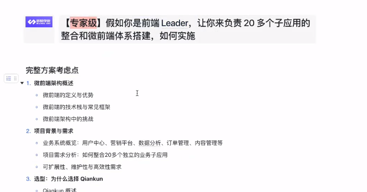
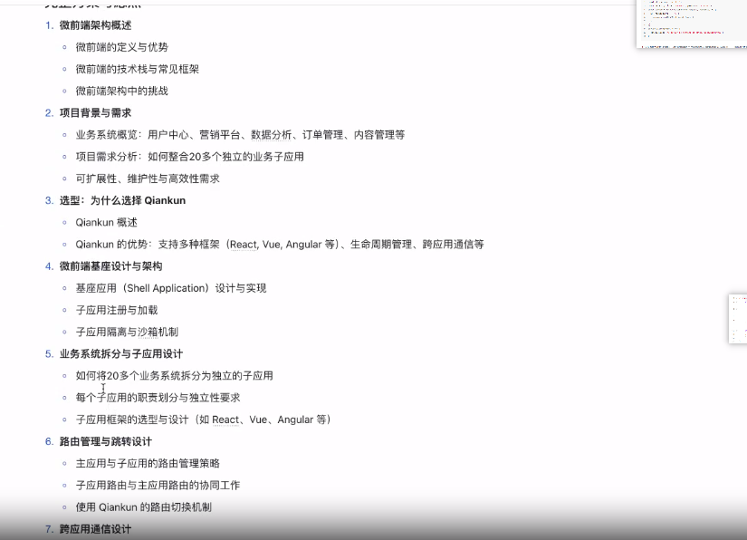
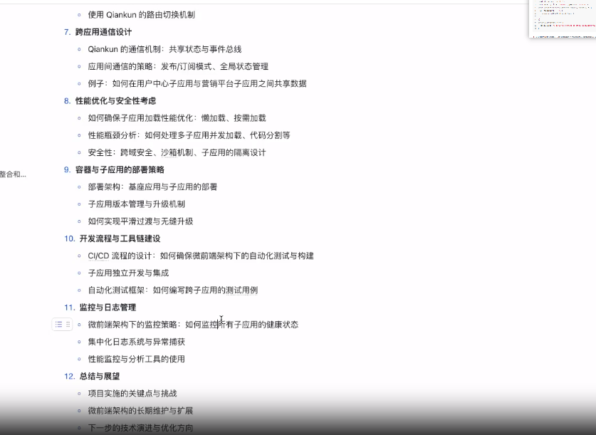

# 微前端

## 没有微前端时候的痛点。

1. 项目代码量非常大，巨石项目
1. 不同技术栈，导致维护成本很高
1. .复用层

### 解决方案

1. iframe 实现
1. single-spa、qiankun，不同子项目子应用接入到统一平台
1. 微前端体系设计
   
   
   

## iframe

## 优点

- 独立性:每个子应用都有自己的生命周期和上下文，彼此之间不会互相影响。
- 简单实现:实现简单，基本的 HTML 页面即可使用 iframe 嵌入。

### 缺点

- 性能问题:iframe 本身会产生较大的性能开销，尤其是在存在多个嵌套应用时，容易导致页面加载变慢。
- 隔离性差:由于嵌入的页面是完全独立的，无法轻松实现应用间的通信和共享状态。
- 跨域问题:iframe 中的内容和主页面通常会存在跨域问题，这增加了开发和运维的复杂性。
