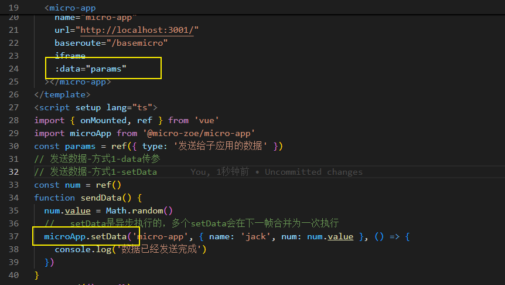

# [Micro-app](https://jd-opensource.github.io/micro-app/docs.html#/)

## 创建主应用

- 引入微前端
  
- 配置微前端页面
  
- 配置微前端信息
  
- 发送数据
  

## 创建子应用

- 配置跨域（vite 默认支持）
  
- 配置 history 路由
- 接收数据
  

  ## 待解决问题

- 为什么使用微前端
  - 子应用可以独立开发，独立部署，互不影响
- 子应用未登录如何处理？
- 如何加载子应用的指定页面(头部隐藏菜单)
- 路由刷新问题怎么解决
