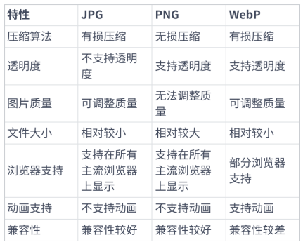
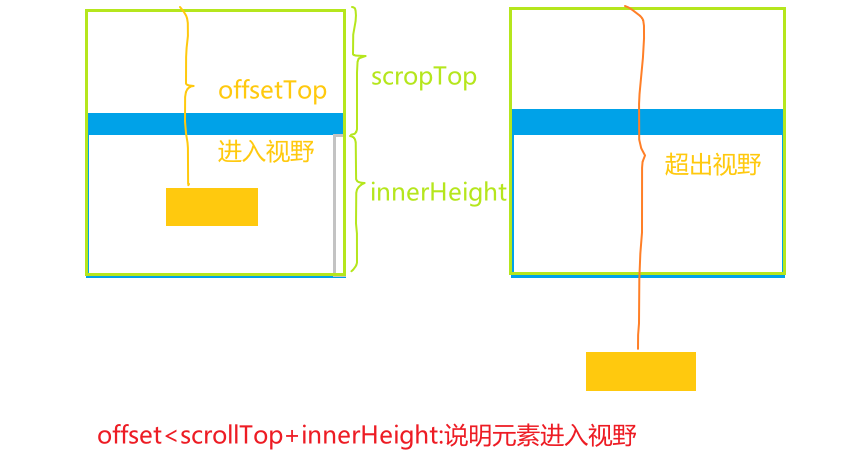

# web 系统⾥⾯,如何对图⽚进⾏优化？

图⽚优化是提升⽤⼾体验、提⾼⽹站性能、减少流量消耗和增加搜索引擎曝光度的关键因素。

## 选择合适的图⽚格式



## 图⽚压缩

webpack 对图⽚进⾏压缩，可以使⽤[`file-loader`和`image-webpack-loader`](/blogs/framework/performance/webpack.html#_10-%E5%8E%8B%E7%BC%A9%E5%9B%BE%E7%89%87-image-webpack-loader)

## 雪碧图（CSS Sprites）

- 雪碧图是⼀种 **将多个⼩图⽚合并为⼀个⼤图⽚** 的技术。
- 原理：通过 CSS 的 `background-image` 和 `background-position` 属性，将所需的⼩图⽚显⽰在指定的位置上
- 可以使⽤ webpack 插件`webpack-spritesmith` 完成⾃动化处理雪碧图合成
- 通过将多个⼩图⽚合并成⼀张⼤图⽚，可以减少浏览器发送的请求次数，从⽽提⾼⻚⾯加载速度。

```scss{2,8,13,16}
div {
  background: url(path/to/output/sprite.png) no-repeat;//⼩图⽚合并的⼤图⽚
}
/* 设置⼩图标在雪碧图中的位置和⼤⼩ */
.icon-facebook {
  width: 32px;
  height: 32px;
  background-position: 0 0; /* 该⼩图标在雪碧图中的位置*/
}
.icon-twitter {
  width: 32px;
  height: 32px;
  background-position: -32px 0; /* 该⼩图标在雪碧图中的位置 */
}
/** 使用
<div class="icon icon-facebook"></div>
*/
```

## 使⽤ base64 格式

优势

- **减少 HTTP 请求数量**
- **减少图⽚⽂件的⼤⼩**
  > Base64 编码的字符串通常会更⼩，因此可以减少图⽚⽂件的⼤⼩，从⽽减少了⽹⻚的总体积，加快了⽹⻚加载速度
- 简化部署和维护

劣势：

- 增加了⽂本⽂件的体积
- ⽆法使⽤缓存
  > 由于 Base64 图⽚被嵌⼊到了 CSS 或 HTML ⽂件中，如果图⽚内容有更新，那么整个⽂件都需要重新加载，⽽⽆法使⽤缓存

适用场景

- 建议复⽤性很强, 变更率较低，且 `⼩于 10KB` 的图⽚⽂件， 可以考虑 base64
- webpack 可以使用插件： `url-loader` 或 `file-loader`

## 图⽚懒加载

- 图⽚懒加载可以延迟图⽚的加载，**只有当图⽚即将进⼊视⼝范围时才进⾏加载**。这可以⼤⼤减轻⻚⾯的加载时间，并降低带宽消耗，提⾼了⽤⼾的体验。

### [(1)Intersection Observer API](https://blog.csdn.net/Zbz00720/article/details/139025413)

- `Intersection Observer API` 是⼀种⽤于异步检查 ⽂档中元素与视⼝叠加程度的 API。可以将其⽤于**检测图⽚是否已经进⼊视⼝**，并根据需要进⾏相应的处理。
- `observer` 观察者对象在观察元素是否进入视口、祖先元素的时候，不管元素是否进入，都会触发观察者对象的回调函数
- `isIntersecting`：`true` 当前元素进入视口，`false` 当前元素离开视口
- `observer.unobserve(lazyImage)`：停止观察特定的 DOM 节点

```js{3,4,11,18}
var box = document.querySelector('.img')
// 创建观察者对象
var observer = new IntersectionObserver(callback, {
  root: this.container,//父元素
  threshold: 1.0,//当被观察者进入视口百分之多少时触发观察者
})
// 对元素进行监听
function callback(entries) {
  entries.forEach(() => {
    // 元素进入父元素视口
    if (entry.isIntersecting) {
      // ...
    }
  })
}
const items = [...document.querySelectorAll('.item')]
items.forEach(function (it) {
  observer.observe(it) //观察指定DOM对象
})
```

::: example
blogs/framework/performance/lazyImage/intersectionObserver
:::

### (2)⾃定义监听器

- 核心思想：通过 src 加载一张本地的默认图片，然后通过 data-url 引入真实的地址。当图片进入视口以后，使用 data-url 的图片地址，替换 src 的图片地址。实现图片只有进入视口时才加载的效果。
- 可以通过⾃定义监听器来实现懒加载时，要应该避免在滚动事件处理程序中频繁进⾏图⽚加载，因为这可能会影响性能。
- 应在**滚动停⽌时**进⾏图⽚加载。
  

详见`lazyImage/scrollListener.html`

```js{6,7,13}
function lazyLoad() {
  const images = document.querySelectorAll(".lazy");
  const scrollTop = window.pageYOffset;
  images.forEach((img) => {
    // 判断图片进入视口
    if (img.offsetTop < window.innerHeight + scrollTop) {
      img.src = img.dataset.src;
      // img.classList.remove("lazy");
    }
  });
}
let lazyLoadThrottleTimeout;// 防抖
document.addEventListener("scroll",
  function () {
    if (lazyLoadThrottleTimeout) {
      clearTimeout(lazyLoadThrottleTimeout);
    }
    lazyLoadThrottleTimeout = setTimeout(lazyLoad, 1000);//停止滚动后执行
  }
)
```

## 响应式加载图⽚

- `<picture>`元素内部有多个 `<source>` 元素，每个 `<source>` 元素通过`srcset` 属性指定了**对应分辨率下的图⽚链接**。
- `media` 属性可以⽤来指定在哪个分辨率下应⽤对应的图⽚。
- 如果没有任何 `<source>` 元素匹配当前设备的分辨率，那么就会使⽤`img` 元素的 src 属性指定的图⽚链接。

```html{2,3}
<div>
  <picture>
    <source media="(min-width: 1200px)" srcset="./img/large-image.png" />
    <source media="(min-width: 768px)" srcset="./img/768px.png" />
    
  </picture>
</div>
```

::: example
blogs/framework/performance/picture
:::

- 也可以使⽤ webpack 的 `responsive-loader` 插件

## 渐进式加载图⽚

- 实现渐进式加载的主要思想是**先加载⼀张较低分辨率的模糊图⽚**，然后逐步加载更⾼分辨率的图⽚
- 使⽤ JavaScript 监听图⽚的加载事件，**在⾼分辨率图⽚加载完成后，将其替换低分辨率图⽚的 src 属性**，以实现渐进式加载的效果。

```html{6}

<script>
const image = document.querySelector('img');
// 监听⾼分辨率图⽚加载完成事件
image.addEventListener('load', () => {
  image.src = image.dataset.src;  // 替换低分辨率图⽚的src属性
});
</script>
```

## 图标类型资源推荐使⽤ [iconfont](https://www.iconfont.cn/)

## 使⽤ CDN 加载图⽚

## 图⽚预加载

- 图⽚预加载可以使⽤原⽣ JavaScript 实现，也可以使⽤现成的 JavaScript 库，如 `Preload.js`、`LazyLoad.js` 等。
