<!--
 * @Description:
 * @Date: 2025-07-01 17:55:08
 * @LastEditTime: 2025-07-22 13:57:35
-->

[使用 Chrome Performance 进行性能调优](https://www.bilibili.com/video/BV1Pr4y1N7QZ/?spm_id_from=333.337.search-card.all.click&vd_source=9d75580d0b23d1137d56e03a996ac726)
## 认识Performance
- 快捷键`Ctrl+E`开始录制
- Frames:FPS
- Expericence:项目中交互不合理的地方

### 队列任务
- 计时是从点击开始录制开始算
  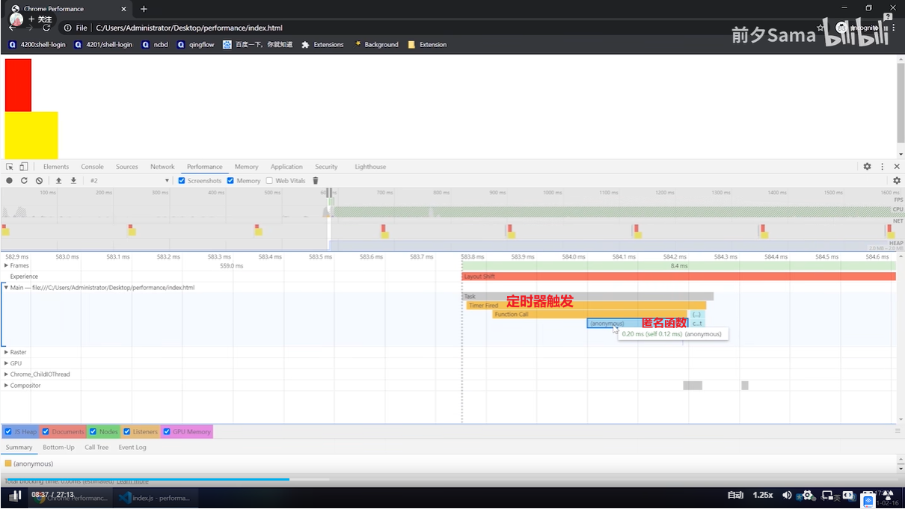
  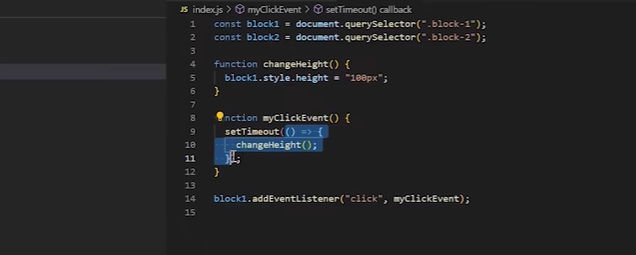
- **Task 为当前队列任务**（第二个 Task 为定时器）
  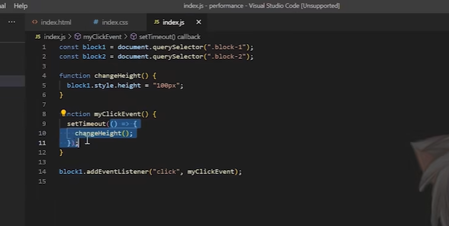
  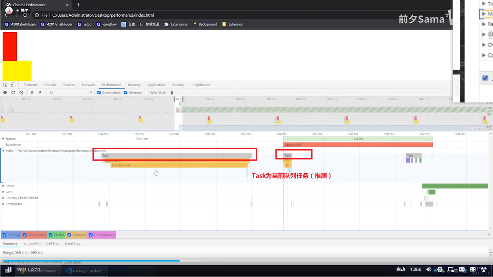
  anonymous：匿名函数
- 重排会体现在 Main 中   
  重排会体现在 Main 当中(一次事件循环中，只会触发一次重排(大概率))
  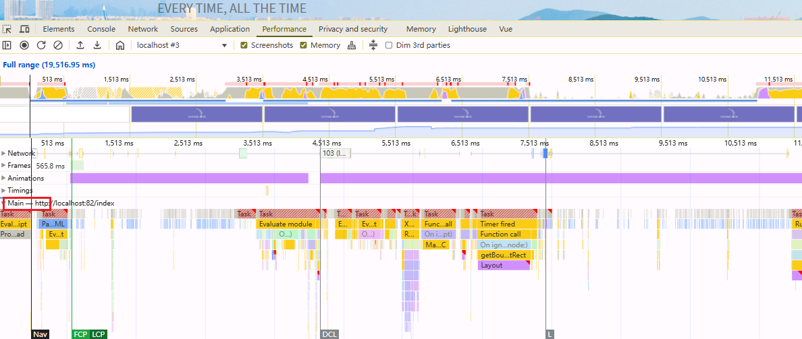

### eventLoop

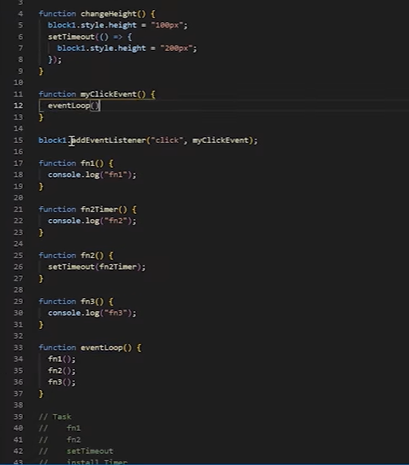
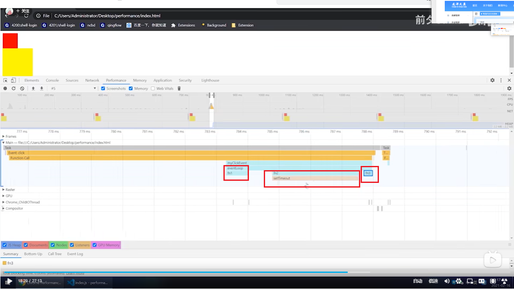

::: example
blogs/framework/performance/tools/eventLoop
:::

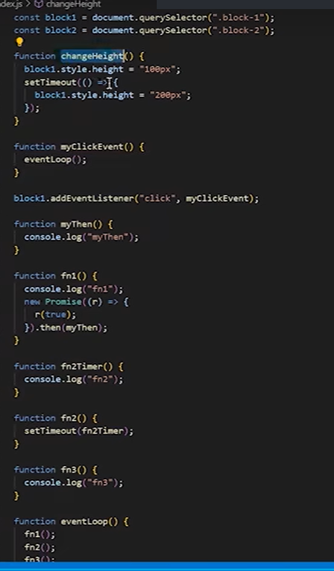

### callTree
- callTree记录任务的时间树，可以分析出哪个任务耗时长
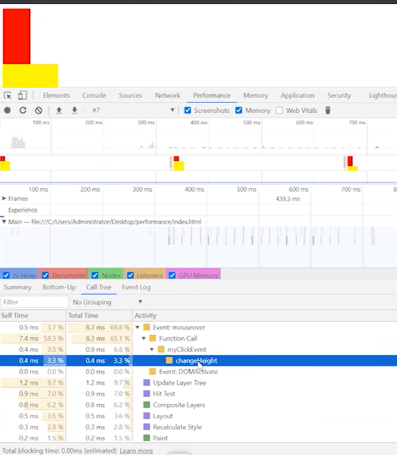
- 数组任务
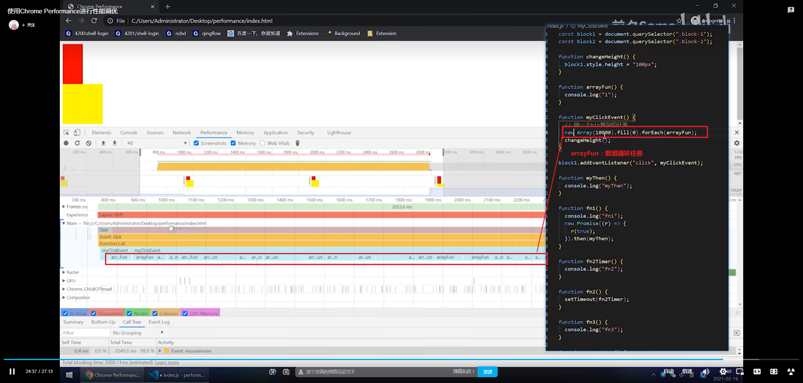
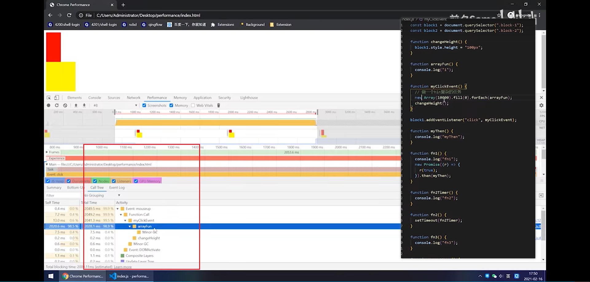

## 实战——列表复选框卡顿优化
### 示例页面
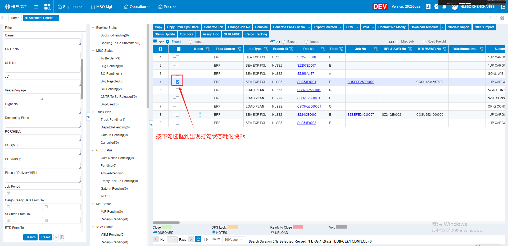
- 问题：勾选复选框后卡顿很久才勾选上
- 排查
1. performance查看耗时时间
  - 按下勾选框到出现打勾状态耗时快2s
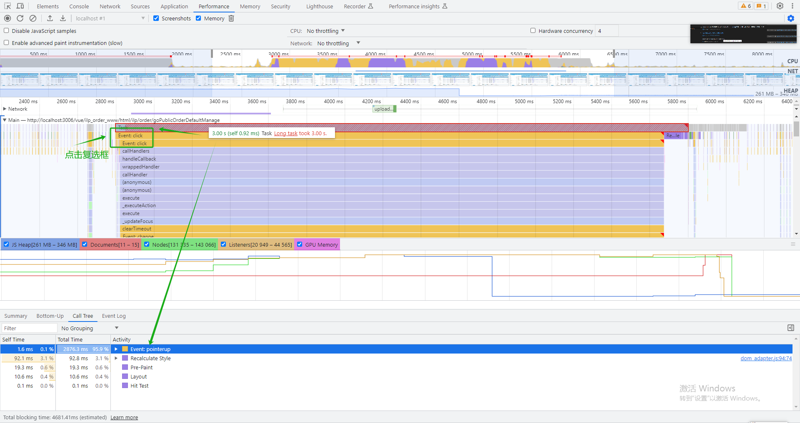
2. 控制台查看
  - 控制台看出可能是因为勾选触发页面渲染引起的卡顿
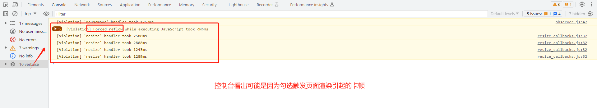
3. 找到相关代码
  - 勾选事件触发重新赋值，导致页面渲染引起卡顿
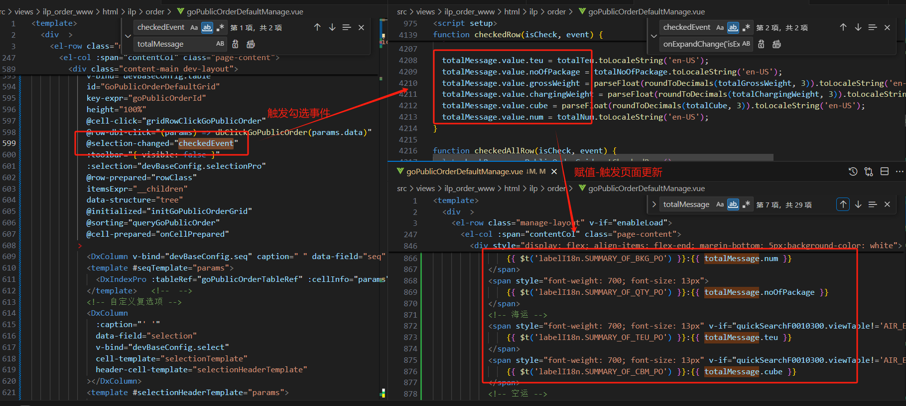
4. 处理
  - 将该部分代码调整位置，并改成绝对定位处理

5. 疑点：重新赋值引起的渲染范围其实很小，渲染涉及的代码也不对，但不知道为什么会影响卡顿这么久(猜测可能是和Dev表格的问题有关)
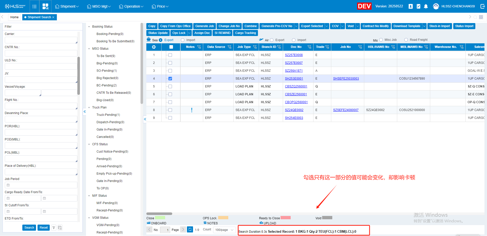
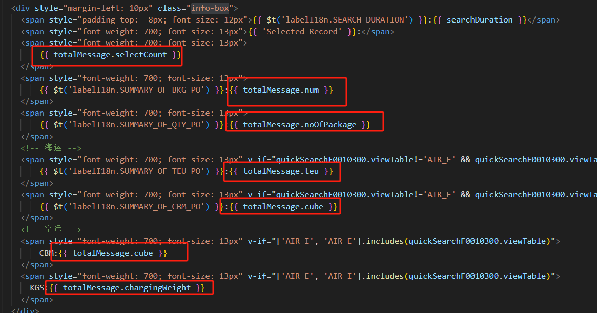
### 优化前后对比
- 优化前：2s多
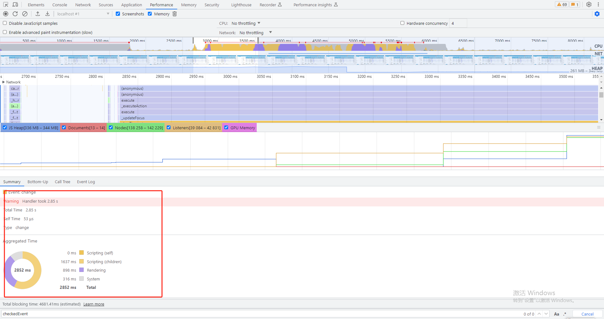
- 优化后：59ms
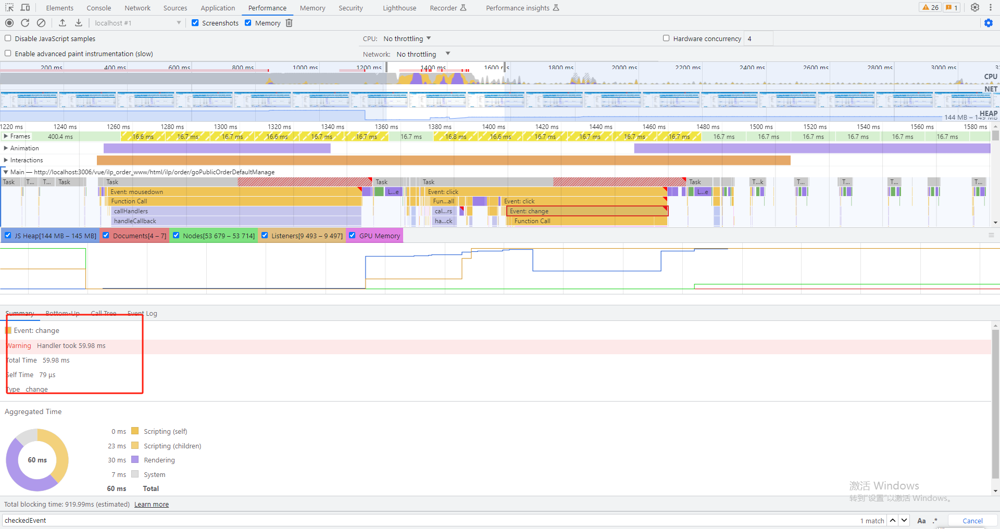