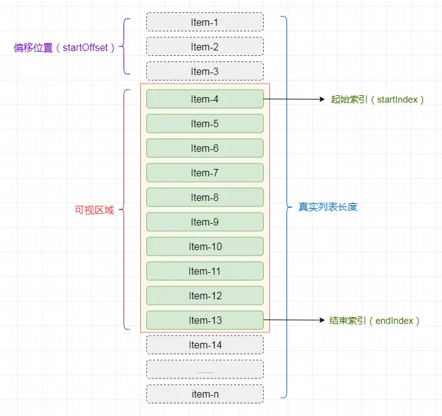
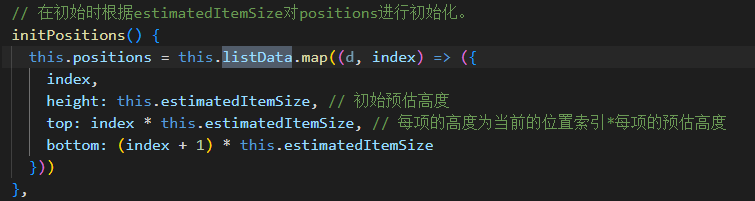
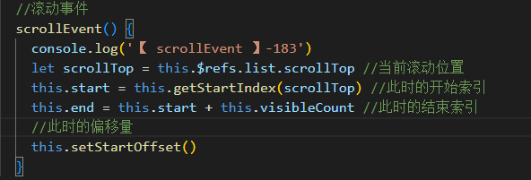
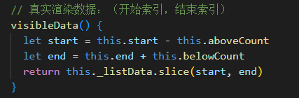
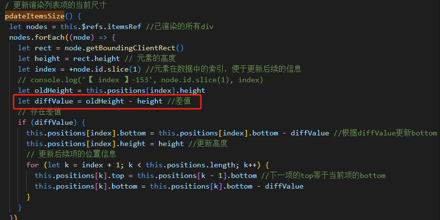

# 虚拟滚动加载原理及实现

## 1. 一次性渲染/普通滚动渲染

::: example
blogs/framework/performance/virtualScroll/generalRender
:::

- 如下如可以看出，渲染花了很多时间：
  

为何两次 console.log 的结果时间差异巨大?

- 在 JS 的`Event Loop`中，当 JS 引擎所管理的执行栈中的事件以及所有微任务事件全部执行完后，**才会触发渲染线程对页面进行渲染**
- 第一个 console.log 的触发时间是在页面进行**渲染之前**，此时得到的间隔时间为 JS 运行所需要的时间
- 第二个 console.log 是放到 setTimeout 中的，它的触发时间是在**渲染完成**，在下一次 Event Loop 中执行的

## [2. 虚拟列表渲染](https://juejin.cn/post/6844903982742110216)

### 原理

- 虚拟列表其实是按需显示的一种实现，即**只对可见区域进行渲染**，对非可见区域中的数据不渲染或部分渲染的技术，以此减少 DOM 操作的数量和提高渲染性能。
- 实现虚拟滚动
  - 监听滚动事件，了解当前滚动位置。
  - 根据滚动位置计算当前应该渲染哪些列表项（即在视口内的项目）。
  - 只渲染那些项目 ，**并用占位符（比如一个空的 div）占据其它项目应有的位置，保持滚动条大小不变**。
  - 当界面滚动时，重新计算并渲染新的项目。
    |变量|公式|
    |----|----|
    |列表总高度|= 数据总数`*`每项的高度|
    |可显示的列表项数|= 屏幕高度`/`每项的高度|
    |开始索引|= 滚动条已经滚动的高度`/`数据项的高度|
    |结束索引|= 开始索引`+`可显示的列表项数|
    |真实列表显示数据|= 截取开始索引`~`结束索引之间的数据|
    |真实渲染列表偏移量|= 滚动的高度`-`滚动的高度%每项的高度???|



### 列表项固定高度

::: example
blogs/framework/performance/virtualScroll/virtualScrollListener
:::

### 列表项动态高度

#### 思路

- **以预估高度先行渲染，然后在滚动时获取真实高度并缓存**。
- 为了使页面平滑滚动，我们可以**在可见区域的上方和下方渲染额外的项目**，在滚动时给予一些缓冲，避免出现短暂的白屏现象。所以将屏幕分为三个区域：
  - 可视区域上方：above
  - 可视区域：screen
  - 可视区域下方：below

#### 具体步骤

1. 在初始时根据列表项的预估高度(`estimatedItemSize`) ，对所有数据进行初始化缓存。初始化每个数据项的 **初始位置`top`、`bottom`和高度`height`** 并缓存到 `positions` 数组中
   - `top`：元素顶部距离父级的高度=元素当前的位置索引`*`每项的预估高度
   - `bottom`：元素底部距离父级的高度=下一元素当前的位置索引`*`每项的预估高度，即下一个元素的顶部的位置
     
2. 当页面滚动时，计算渲染区域对应的**开始索引和结束索引**，得到需要渲染的数据，并设置渲染区域的偏移量
   
   
3. 获取需要渲染的数据后，渲染完成后变量列表项的最新高度，如果最新高度和原来的高度存在差值，则更新后续索引的数据项中的**位置信息、滚动条占位区域的高度、可视区域的偏移量**
   - 滚动条占位区域的高度=列表中最后一项的底部距离列表顶部的位置 bottom
     

  <!-- 对应的组件重新渲染完成后会触发vue的`updated`的生命周期，重新 -->

| 变量                           | 公式                                               |
| ------------------------------ | -------------------------------------------------- |
| 可视渲染条数`visibleCount`     | = 可视区域高度`/`每项的默认高度                    |
| 可视区上方渲染条数`aboveCount` | = (已渲染的条数`start`，缓冲区条数)**取小**        |
| 可视区下方渲染条数`belowCount` | = (剩余条数，缓冲区条数)**取小**                   |
| 列表总高度                     | **列表中最后一项的底部距离列表顶部的位置**         |
| 可视列表的开始索引             | = 第一个**底部位置大于已滚动高度**的元素对应的索引 |
| 结束索引                       | = 开始索引`+`可显示的列表项数                      |

<!--| 真实列表显示数据               | = 截取开始索引`~`结束索引之间的数据         |
| 真实渲染列表偏移量             | = 滚动的高度`-`滚动的高度%每项的高度???     | -->


::: example
blogs/framework/performance/virtualScroll/virtualScrollListenerDynamic
:::

```vue{3,4,68,72,76,92,100,156,159}
<template>
  <div ref="list" :style="{ height }" class="infinite-list-container" @scroll="scrollEvent($event)">
    <div ref="phantom" class="infinite-list-phantom"></div>
    <div ref="content" class="infinite-list">
      <div class="infinite-list-item" ref="items" :id="item._index" :key="item._index" v-for="item in visibleData">
        <slot ref="slot" :item="item.item">{{ item._index }}</slot>
      </div>
    </div>
  </div>
</template>

<script>
export default {
  name: 'VirtualList',
  props: {
    //所有列表数据
    listData: {
      type: Array,
      default: () => []
    },
    //预估高度
    estimatedItemSize: {
      type: Number,
      required: true
    },
    // 缓冲区数据与可视区数据的比例
    bufferScale: {
      type: Number,
      default: 1
    },
    //容器高度 100px or 50vh
    height: {
      type: String,
      default: '300px'
    }
  },
  data() {
    return {
      //可视区域高度
      screenHeight: 0,
      //起始索引
      start: 0,
      //结束索引
      end: 0,
      //用于列表项渲染后存储每一项的高度以及位置信息，
      positions: [
        // {
        //   top:0,
        //   bottom:100,
        //   height:100
        // }
      ]
    }
  },
  computed: {
    _listData() {
      return this.listData.map((item, index) => {
        return {
          _index: `_${index}`,
          item
        }
      })
    },
    visibleCount() {
      return Math.ceil(this.screenHeight / this.estimatedItemSize)
    },
    // 可视区上方渲染条数
    aboveCount() {
      return Math.min(this.start, this.bufferScale * this.visibleCount)
    },
    // 可视区下方渲染条数
    belowCount() {
      return Math.min(this.listData.length - this.end, this.bufferScale * this.visibleCount)
    },
    // 真实渲染数据
    visibleData() {
      let start = this.start - this.aboveCount
      let end = this.end + this.belowCount
      return this._listData.slice(start, end)
    }
  },
  created() {
    this.initPositions()
    window.vm = this
  },
  mounted() {
    this.screenHeight = this.$el.clientHeight
    this.start = 0
    this.end = this.start + this.visibleCount
  },
  // 由于需要在渲染完成后，获取列表每项的位置信息并缓存，所以使用钩子函数updated来实现
  updated() {
    this.$nextTick(function () {
      if (!this.$refs.items || !this.$refs.items.length) {
        return
      }
      //获取真实元素大小，修改对应的尺寸缓存
      this.updateItemsSize()
      //更新列表总高度
      let height = this.positions[this.positions.length - 1].bottom //列表高度实际就等于列表中最后一项的底部距离列表顶部的位置。
      this.$refs.phantom.style.height = height + 'px'
      //更新真实偏移量
      this.setStartOffset()
    })
  },
  methods: {
    // 在初始时根据estimatedItemSize对positions进行初始化。
    initPositions() {
      this.positions = this.listData.map((d, index) => ({
        index,
        height: this.estimatedItemSize, //预估高度
        top: index * this.estimatedItemSize,
        bottom: (index + 1) * this.estimatedItemSize
      }))
    },
    //获取列表起始索引
    getStartIndex(scrollTop = 0) {
      // 由于缓存数据本身就是有顺序的，所以获取开始索引的方法可以考虑通过二分查找的方式来降低检索次数：
      return this.binarySearch(this.positions, scrollTop) //二分法查找
      // 元素底部位置等于滚动条位置的时候，即索引开始位置
      // let item = this.positions.find((i) => i && i.bottom > scrollTop)
      // return item.index
    },
    binarySearch(list, value) {
      let start = 0
      let end = list.length - 1
      let tempIndex = null

      while (start <= end) {
        let midIndex = parseInt((start + end) / 2)
        let midValue = list[midIndex].bottom //
        if (midValue === value) {
          return midIndex + 1
        } else if (midValue < value) {
          start = midIndex + 1
        } else if (midValue > value) {
          if (tempIndex === null || tempIndex > midIndex) {
            tempIndex = midIndex
          }
          end = end - 1
        }
      }
      return tempIndex
    },
    //获取列表项的当前尺寸
    updateItemsSize() {
      let nodes = this.$refs.items
      nodes.forEach((node) => {
        let rect = node.getBoundingClientRect()
        let height = rect.height
        let index = +node.id.slice(1)
        let oldHeight = this.positions[index].height
        let dValue = oldHeight - height
        //存在差值
        if (dValue) {
          this.positions[index].bottom = this.positions[index].bottom - dValue
          this.positions[index].height = height
          // 更新后续项的位置信息
          for (let k = index + 1; k < this.positions.length; k++) {
            this.positions[k].top = this.positions[k - 1].bottom
            this.positions[k].bottom = this.positions[k].bottom - dValue
          }
        }
      })
    },
    //获取当前的偏移量
    setStartOffset() {
      let startOffset
      if (this.start >= 1) {
        let size =
          this.positions[this.start].top -
          (this.positions[this.start - this.aboveCount] ? this.positions[this.start - this.aboveCount].top : 0)
        startOffset = this.positions[this.start - 1].bottom - size
      } else {
        startOffset = 0
      }
      this.$refs.content.style.transform = `translate3d(0,${startOffset}px,0)`
    },
    //滚动事件
    scrollEvent() {
      //当前滚动位置
      let scrollTop = this.$refs.list.scrollTop
      // let startBottom = this.positions[this.start - ]
      //此时的开始索引
      this.start = this.getStartIndex(scrollTop)
      //此时的结束索引
      this.end = this.start + this.visibleCount
      //此时的偏移量
      this.setStartOffset()
    }
  }
}
</script>

<style scoped>
.infinite-list-container {
  overflow: auto;
  position: relative;
  -webkit-overflow-scrolling: touch;
}

.infinite-list-phantom {
  position: absolute;
  left: 0;
  top: 0;
  right: 0;
  z-index: -1;
}

.infinite-list {
  left: 0;
  right: 0;
  top: 0;
  position: absolute;
}

.infinite-list-item {
  padding: 5px;
  color: #555;
  box-sizing: border-box;
  border-bottom: 1px solid #999;
  /* height:200px; */
}
</style>
```

## 3.使⽤ IntersectionObserver 来实现

- 先用占位元素渲染，当元素进入视口时，再替换成真实的渲染内容

```js{8,9,20,35,37,42,43}
class VirtualScroll {
  constructor(container, itemHeight, totalItems, renderItem) {
    this.container = container;
    this.itemHeight = itemHeight;
    this.totalItems = totalItems;
    this.renderItem = renderItem;
    // 初始化观察对象
    this.observer = new IntersectionObserver(this.onIntersection.bind(this), {
      root: this.container,//父容器元素
      threshold: 1.0,
    });
    this.items = new Map();
    this.init();
  }
  // 填充初始屏幕的元素
  init() {
    for (let i = 0; i < this.totalItems; i++) {
      const placeholder = this.createPlaceholder(i);
      this.container.appendChild(placeholder);
      this.observer.observe(placeholder);//观察元素的视口状态
    }
  }
  // 创建占位元素
  createPlaceholder(index) {
    const placeholder = document.createElement("div");
    placeholder.style.height = `${this.itemHeight}px`;
    placeholder.style.width = "100%";
    placeholder.dataset.index = index; // store indexreturn placeholder;
  }
  //
  onIntersection(entries) {
    entries.forEach((entry) => {
      const index = entry.target.dataset.index;
      // 当元素进入视口时,渲染列表项
      if (entry.isIntersecting) {
        const rendered = this.renderItem(index);
        this.container.replaceChild(rendered, entry.target);
        this.items.set(index, rendered);
      } else if (this.items.has(index)) {
        // 当元素离开视口时,换回占位符
        const placeholder = this.createPlaceholder(index);
        this.container.replaceChild(placeholder, this.items.get(index));
        this.observer.observe(placeholder);
        this.items.delete(index);
      }
    });
  }
}
// 渲染列表项
function renderItem(index) {
  const item = document.createElement("div");
  item.classList.add("item");
  item.textContent = `Item ${index}`;
  item.dataset.index = index;
  item.style.height = "30px"; // Same as your itemHeight in VirtualScroll
  return item;
}
// 使用示例
const container = document.getElementById("scroll-container");
const itemHeight = 30; // Height of each item
const itemCount = 1000; // Total numberof items you have
const virtualScroll = new VirtualScroll(container, itemHeight, itemCount, renderItem);
```

## [4.requestAnimationFrame 时间分片](https://juejin.cn/post/6844903938894872589)

- 使用 requestAnimationFrame 来进行分批渲染
- 使用 DocumentFragment 优化渲染
  ::: example
  blogs/framework/performance/virtualScroll/requestAnimationFrameList
  :::

```js{13,15,21,22}
import { onMounted, ref } from 'vue'
let total = 100000 // 插入十万条数据
let once = 20 // 一次插入 20 条
let index = 0 //每条记录的索引
let ul
//循环加载数据
function loop(curTotal, curIndex) {
  if (curTotal <= 0) {
    return false
  }
  let pageCount = Math.min(curTotal, once) //每页多少条
  // 【时间分片】
  window.requestAnimationFrame(function () {
    // 虚拟dom操作
    let fragment = document.createDocumentFragment()
    for (let i = 0; i < pageCount; i++) {
      let li = document.createElement('li')
      li.innerText = curIndex + i + ' : ' + ~~(Math.random() * total)
      fragment.appendChild(li)
    }
    ul.appendChild(fragment)
    loop(curTotal - pageCount, curIndex + pageCount)
  })
}
onMounted(() => {
  //需要插入的容器
  ul = document.getElementById('requestAnimationFrameListId')
  loop(total, index)
})
```
