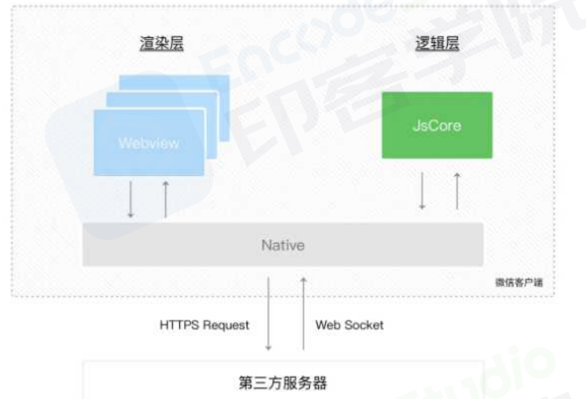

# 小程序

## 【小程序与 H5 的区别有如下】

- 运行环境:小程序基于浏览器内核重构的内置解析器；
- 系统权限:小程序能获得更多的**系统权限**，如网络通信状态、数据缓存能力等；
- 渲染机制:小程序的逻辑层和渲染层是**分开**的

## 【小程序的优缺点】

- 优点
  - 随搜随用，用完即走:使得小程序可以代替许多 APP，或是做 APP 的整体嫁接，或是作为阉割版功能的承载体
  - 流量大，易接受:小程序借助自身平台更加容易引入更多的流量
  - 安全
  - 开发门槛低
  - 降低兼容性限制
- 缺点:
  - 用户留存:及相关数据显示，小程序的平均次日留存在 13%左右，但是双周留存骤降到仅有 1%。
  - **体积限制**:微信小程序只有 2M 的大小，这样导致无法开发大型一些的小程序
  - **受控微信**:比起 APP，尤其是安卓版的高自由度，小程序要面对很多来自微信的限制，从功能接口，甚至到类别内容，都要接受微信的管控

## 【小程序的生命周期】

小程序中，生命周期主要分成了三部分:应用的生命周期、页面的生命周期、组件的生命周期

### 1.应用的生命周期

- 启动或退出小程序时触发

#### 1-1.生命周期有哪些

| 生命周期 | 说明 |
| ---------- | -------------------- |
| `onLaunch` | 小程序初始化完成时触发，全局只触发一次 |
| `onShow` | 小程序启动，或从后台进入前台显示时触发 |
| `onHide` | 小程序从前台进入后台，退出小程序时触发 |
| onError | 小程序发生脚本错误或 API 调用报错时触发 |
| onPageNotFound | 小程序要打开的页面不存在时触发 |
| onUnhandledRejection | 小程序有未处理的 Promise 拒绝时触发 |
| onThemeChange | 系统切换主题时触发 |

#### 1-2.应用的生命周期执行过程:

- 用户首次打开小程序，触发 `onLaunch`(全局只触发一次)
- 小程序初始化完成后，触发`onShow`方法，监听小程序显示
- 小程序从前台进入后台，触发 `onHide` 方法
- 小程序从后台进入前台显示，触发 `onShow` 方法
- 小程序后台运行一定时间，或系统资源占用过高，会被销毁

### 2.页面的生命周期

切换页面时触发

#### 2-1.页面的生命周期有哪些

| 生命周期 | 说明                                   | 适用场景                       |
| -------- | -------------------------------------- | ------------------------------ |
| onLoad   | 生命周期回调一监听页面加载             | 发送请求获取数据               |
| onShow   | 生命周期回调一监听页面显示             | 请求数据                       |
| onReady  | 生命周期回调一监听页面**初次**渲染完成 | 获取页面元素(少用)             |
| onHide   | 生命周期回调一监听页面隐藏             | 终止任务，如定时器或者播放音乐 |
| onUnload | 生命周期回调一监听页面卸载             | 终止任务                       |

onLoad 比 onReady 先执行

#### 2-2.页面生命周期的执行过程:

- 小程序注册完成后，加载页面，触发 `onLoad` 方法
- 页面载入后触发 `onShow` 方法，显示页面
- **首次显示页面**，会触发 `onReady` 方法，渲染页面元素和样式，**一个页面只会调用一次**
- 当小程序后台运行或跳转到其他页面时(即离开当前页面时)，触发 `onHide` 方法.
- 当小程序由后台进入到前台运行或重新进入页面时，触发 `onShow` 方法
- 当使用**重定向**方法`wx.redirectTo()`或**关闭**当前页**返回上一页** `wx.navigateBack()`，触发 `onUnload`
- 当存在也应用生命周期和页面周期的时候，相关的执行顺序如下:
  - 打开小程序:`(App)onLaunch -->(App)onShow -->(Pages)onLoad -->(Pages)onShow -->(Pages)onReady`
  - 进入下一个页面:`(Pages)onHide -->(Next)onLoad -->(Next)onShow -->(Next)onReady`
  - 返回上一个页面:`(curr)onUnload -->(pre)onShow`
  - 离开小程序:`(App)onHide`
  - 再次进入:
    - 小程序未销毁 -->`(App)onShow`(执行上面的顺序)，
    - 小程序被销毁`(App)onLaunch` 重新开始执行.

### 3.组件的生命周期

#### 3-1.组件的生命周期有哪些

| 生命周期   | 说明                               |
| ---------- | ---------------------------------- |
| `created`  | 生命周期回调一监听页面加载         |
| `attached` | 生命周期回调一监听页面显示         |
| `ready`    | 生命周期回调一监听页面初次渲染完成 |
| `moved`    | 生命周期回调一监听页面隐藏         |
| detached   | 生命周期回调一监听页面卸载         |
| error      | 每当组件方法抛出错误时执行         |

## 【微信小程序的登录流程】

- 调用 `wx.login()`方法会生成 code ，将 code 作为参数通过 `wx.request()`方法传递给**后端服务器**，
- 后端把 `appid,appsecret 和 code` 一起发送到**微信服务器**。( appid 和 appsecret 都是微信提供的,可以在管理员后台找到)
- 微信服务器返回了 `openid` 及本次登录的会话密钥 `session_key`
- 后端从数据库中查找 openid，如果没有查到记录，说明该用户没有注册，如果有记录，则继续往下走  
  (session_key 是对用户数据进行加密签名的密钥。为了自身应用安全，session_key 不应该在网络上传输)
- 然后生成 session 并返回给小程序
- **小程序把 session 存到 storage 里面**
- 下次请求时，先从 storage 里面读取，然后带给服务端
- 服务端对比 session 对应的记录，然后校验有效期
  

## 【小程序路由的跳转】

| 名称                      | 说明                                                                          |
| ------------------------- | ----------------------------------------------------------------------------- |
| `wx.navigateTo(Object)`   | 保留当前页面、跳转到应用内的某个页面，使用 `wx.navigateBack` 可以返回到原页面 |
| `wx.redirectTo(Object)`   | 关闭当前页面，跳转到应用内的某个页面                                          |
| `wx.switchTab(Object)`    | 跳转到 tabBar 页面，同时关闭其他非 tabBar 页面                                |
| `wx.navigateBack(Object)` | 返回上一页面                                                                  |
| `wx.reLaunch(Object)`     | 关闭所有页面，打开到应用内的某个页面                                          |

## 【微信小程序的发布流程】

关于发布的流程，主要分成了三个部分

- 1.上传代码(开发者工具上-上传)
  
- 2.提交审核（微信公众号-开发管理后台）
  
- 3.发布版本（微信公众号-开发管理后台）
  

## 【微信小程序的支付流程】

- 打开某小程序，点击直接下单.
- `wx.login`获取用户临时登录凭证`code`，发送到后端服务器换取 openId
- 在下单时，小程序需要将购买的商品 id，商品数量，以及用户的`openId`**传送到服务器**
- 服务器在接收到商品 id、商品数量、`openId`后，生成服务期订单数据，同时经过一定的签名算法**向微信支付发送请求，获取预付单信息(`prepay_id`)**，同时将获取的数据再次进行相应规则的签名**向小程序端响应必要的信息**
- **小程序端在获取对应的`prepay_id`等参数后，调用 `wx.requestPavment()`发起微信支付，唤醒支付工作台，进行支付**
  
- 接下来的一些列操作都是由用户来操作的包括了微信支付密码，指纹等验证，**确认支付之后执行鉴权调起支付**
- 鉴权调起支付:在微信后台进行鉴权，**微信后台直接返回给前端支付的结果**，前端收到返回数据后对支付结果进行展示
- 推送支付结果:**微信后台在给前端返回支付的结果后，也会向后台也返回一个支付结果**，后台通过这个支付结果来更新订单的状态

## 【微信小程序的实现原理】

### 背景

> **网页开发，渲染线程和脚本是互斥的**，这也是为什么长时间的脚本运行可能会导致页面失去响应的原因，本质就是我们常说的 JS 是单线程的

- 而在小程序中，选择了 `Hybrid` 的渲染方式，**将视图层和逻辑层是分开的，双线程同时运行，视图层的界面使用 WebView 进行渲染，逻辑层运行在 JSCore 中**
  - 渲染层:界面渲染相关的任务全都在 `WebView` 线程里执行。一个小程序存在多个界面，所以渲染层存在多个 `WebView`线程
  - 逻辑层:采用 `JsCore` 线程运行 JS 脚本，在这个环境下执行的都是有关小程序业务逻辑的代码

### 通信

- 小程序在渲染层，宿主环境会把`wxml`转化成对应的 JS 对象
- 在逻辑层发生**数据变更**的时候，通过宿主环境提供的 `setData` 方法**把数据从逻辑层传递到渲染层，再经过对比前后差异，把差异应用在原来的 Dom 树上，染出正确的视图**
- 当视图存在交互的时候，例如用户点击界面上某个按钮，这类反馈应该通知给开发者的**逻辑层**，需要将对应的处理状态呈现给用户
- 对于事件的分发处理，微信进行了特殊的处理，将所有的事件拦截后，丢到逻辑层交给 Javascript 进行处理
- 由于小程序是基于双线程的，也就是任何在视图层和逻辑层之间的数据传递都是线程间的通信，会有一定的延时，因此在小程序中，**页面更新成了异步操作**
- 异步会使得各部分的运行时序变得复杂一些，比如在渲染首屏的时候，逻辑层与渲染层会同时开始初始化工作，但是渲染层需要有逻辑层的数据才能把界面渲染出来
- **如果渲染层初始化工作较快完成，就要等逻辑层的指令才能进行下一步工作**
- 因此逻辑层与渲染层需要有一定的机制保证时序正确，在每个小程序页面的生命周期中，存在着若干次页面数据通信
  

### 运行机制

小程序启动运行两种情况:

- 冷启动(重新开始):用户**首次打开**或者小程序**被微信主动销毁后再次打开**的情况，此时小程序需要**重新加载启动**，即为冷启动
- 热启动:用户已经打开过小程序，然后在一定时间内再次打开该小程序，此时**无需重新启动**，只需要将后台态的小程序切换到前台，这个过程就是热启动

> 1.小程序没有重启的概念  
> 2.当小程序进入后台，客户端会维持一段时间的运行状态，**超过一定时间后会被微信主动销毁**  
> 3.短时间内收到系统两次以上内存警告，也会对小程序进行销毁，这也就为什么一旦页面内存溢出，页面会奔溃的本质原因了

## 【提高微信小程序的应用速度的手段有哪些?】

- 小程序首次启动前，微信会在小程序启动前为小程序准备好通用的运行环境，如运行中的**线程和一些基础库的初始化**
- 然后才开始进入启动状态，展示一个固定的**启动界面**，界面内包含小程序的图标、名称和加载提示图标。此时，微信会在背后完成几项工作:
  - **下载**小程序代码包
  - **加载**小程序代码包
  - **初始化**小程序首页

下载到的小程序代码包不是小程序的源代码，而是**编译、压缩、打包之后**的代码包

- 围绕上图小程序的启动流程，我们可以从**加载、渲染**两个纬度进行切入:

### 加载

提升体验最直接的方法是**控制小程序包的大小**，常见手段有如下:

1. 代码包的体积压缩可以通过勾选开发者工具中“**上传代码时，压缩代码**”选项
2. **及时清理无用的代码和资源文件**
3. **减少资源包中的图片等资源的数量和大小**(理论上除了小 icon，其他图片资源从网络下载)，图片资源压缩率有限
4. 并且可以采取**分包加载的**操作，将用户访问率高的页面放在主包里，将访问率低的页面放入子包里，**按需加载**
   当用户点击到子包的目录时，还是有一个代码包下载的过程，这会感觉到明显的卡顿，所以子包也不建议拆的太大，当然我们可以采用**子包预加载技术**，并不需要等到用户点击到子包页面后在下载子包

### 渲染

关于微信小程序首屏渲染优化的手段如下:

1. 请求可以**在页面 `onLoad` 就加载**，不需要等页面 ready 后在异步请求数据
2. 尽量**减少不必要的 https 请求**，可使用 `getStorageSync()`及 `setStorageSync()`方法将数据存储在本地
3. 可以在前置页面将一些有用的字段带到当前页，进行首次渲染(列表页的某些数据-->详情页)  
   没有数据的模块可以进行**骨架屏**的占位

在微信小程序中，提高页面的多次渲染效率主要在于正确使用 setData:

- 不要过于频繁调用 setData，应考虑将多次 setData 合并成一次 setData 调用
- 数据通信的性能与数据量正相关，因而如果有一些数据字段**不在界面中展示**且数据结构比较复杂或包含长字符串，则不应使用 setData 来设置这些数据
- **与界面渲染无关的数据最好不要设置在 data 中**，可以考虑设置在 page 对象的其他字段下
- 除此之外，对于一些独立的模块我们尽可能抽离出来，这是因为自定义组件的更新并不会影响页面上其他元素的更新  
   各个组件也将具有各自独立的逻辑空间。**每个组件都分别拥有自己的独立的数据、setData 调用**

### 总结

| 小程序启动加载性能                                                                      | 小程序渲染性能                                     |
| --------------------------------------------------------------------------------------- | -------------------------------------------------- |
| ● 控制代码包的大小  ● 分包加载 ● 首屏体验(预请求，利用缓存，避免白屏，及时反馈) | ● 避免不当的使用 setData ● 使用自定义组件  |

<!-- ## uni-app 如何引入其他复杂的包方法 -->
