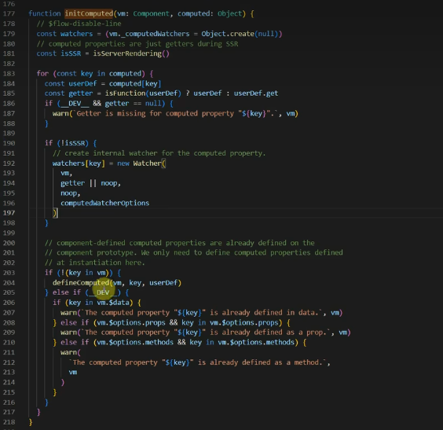
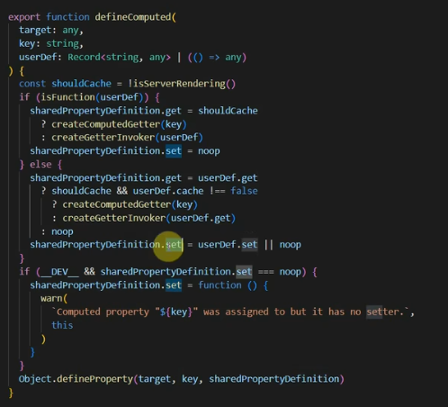
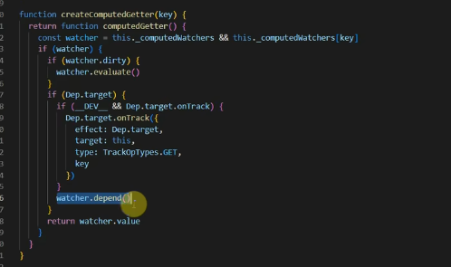
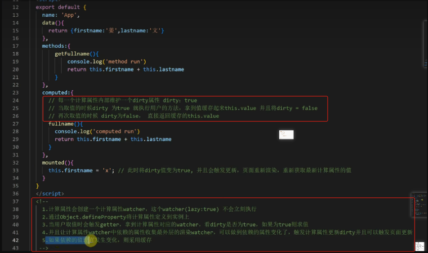
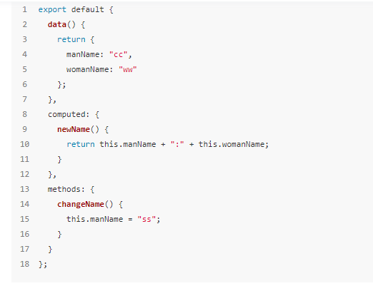
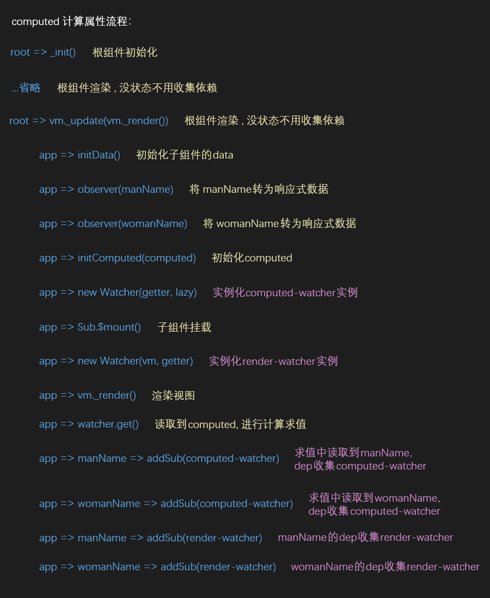

# computed 的实现原理

分析计算属性为何可以做到当它的依赖项发生改变时才会进行重新的计算，否则当前数据是被缓存的

- 计算属性仅当用户取值时才会执行对应的方法。
- computed 属性是具备缓存的，依赖的值不发生变化，对其取值时计算属性方法不会重新执行
- 计算属性可以简化模板中复杂表达式。
- **计算属性中不支持异步逻辑。**
- computed 属性是可以再模板中使用的.

## 1. 获取实例中的 computed(`initState`)

- 获取组件实例中的 computed 进行初始化

```js{7,8}
// 初始化所有状态时
function initState(vm) {
  vm._watchers = [] // 当前实例watcher集合
  const opts = vm.$options // 合并后的属性
  // ... (其他状态初始化)
  // 如果有定义计算属性
  if (opts.computed) {
    initComputed(vm, opts.computed) // 进行初始化
  }
  // ...
}
```

## 2. 创建计算属性监听(`initComputed`)

- 计算属性会创建一个计算属性监听`computed-watcher`，这个 `watcher(lazy:true)`不会立刻执行
- 在 `initComputed` 中，首先定义了一个空的 watchers 对象来存储所有的计算属性对应的 watcher；接着遍历组件中定义的计算属性，且对其添加 watcher 进行监听（调用 defineComputed 添加 `get` 和 `set`）

```js{2,4,5,8}
function initComputed(vm, computed) {
  const watchers = (vm._computedWatchers = Object.create(null)) // 创建一个纯净对象vm._computedWatchers
  for (const key in computed) {
    const getter = computed[key] // computed每项对应的回调函数
    watchers[key] = new Watcher(vm, getter, noop, { lazy: true }) // 实例化computed-watcher(传入 lazy: true，所以计算属性不像普通watcher那要会立刻执行)
    // ...
    if (!(key in vm)) {
      defineComputed(vm, key, getter)// 通过 object.defineProperty 将计算属性定义到实例上
    } else {
      // ... key不能和data里的属性重名
      // ... key不能和props里的属性重名
    }
  }
}
```



## 3. 将 computed 变成响应式(`defineComputed`)

- 通过 `object.defineProperty` 将计算属性定义到实例上，所以 vue2 中可以通过`this.computedName`取值
- 这个方法的作用就是**让 computed 成为一个响应式数据**，并定义它的`get`属性，也就是说当页面执行渲染访问到 computed 时，才会触发 get 然后执行 `createComputedGetter` 方法

```js{3,6}
function defineComputed(target, key) {//vm,key
  // ...
  Object.defineProperty(target, key, {
    enumerable: true,
    configurable: true,
    get: createComputedGetter(key),//用户取值时会触发createComputedGetter
    set: noop
  })
}
```



## 4. 处理响应式 get(`createComputedGetter`)

```js
computed: {
  // newName求值时，会触发计算属性本身的getter，
  // 求值中读到依赖的属性，所以还会触发依赖的属性的getter
  newName(){
    return this.manName + this.womanName;//this.manName 和 this.womanName的get也被触发
  }
}
```

- 当用户取值时会触发 get(createComputedGetter)，拿到计算属性对应的 watcher，**看 dirty 是否为 true，如果为 true 则求值(`evaluate`)**
  > - **通过`Object.defineProperty`定义属性方法时，this 指向的是被定义或修改的对象本身**，
  > - 所以 createComputedGetter 中的 this 指向被定义的对象 target(**即 vm**)，
  > - vm 在 initComputed 方法中定义了`_computedWatchers`
  > - 所以通过作用域，这里的 this 可以获取 vm 的`_computedWatchers`
- 求值时时需要读取依赖的属性的值，**读取时就会触发依赖的属性自己的 get(☆)**
- 就可以让计算属性 watcher 中依赖的属性收集最外层的渲染 watcher，可以做到依赖的属性变化了，触发计算属性更新 dirty，并且可以触发页面更新
  > - 当 Computed 依赖的变量修改时，dirty 会变为 true（？？）
- 如果依赖的值没有发生变化，则采用缓存

```js{4,8,9,12,14}
function createComputedGetter(key) {
  // 高阶函数、返回函数
  return function () {
    const watcher = this._computedWatchers && this._computedWatchers[key]
    // 原来this还可以这样用，得到key对应的computed-watcher
    if (watcher) {
      // 在实例化watcher时dirty默认为true，表示需要计算
      if (watcher.dirty) {
        watcher.evaluate() // 进行计算属性的求值(☆求值时会触发依赖的属性的get),求值后将dirty变为false
      }
      // (类似逻辑详见blogs\framework\vue\vModel\test\js\observer.js和watcher.js)
      if (Dep.target) {
        //Dep.target 指向当前的computed-watcher？？？，因为evaluate()中取值触发了get()，get中将Dep.target指向了computed-watcher中的this
        watcher.depend() // ？？？收集当前watcher，这里是页面渲染触发的这个方法，所以为render-watcher
      }
      return watcher.value // 返回求到的值或之前缓存的值
    }
  }
}
```



## 5. Watcher

```js{6,7,18,22,27,29,}
class Watcher {
  constructor(vm, prop, callback) {
    this.vm = vm
    this.prop = prop
    this.callback = callback
    this.value = this.get() //通过此方法将全局Dep.target对象绑定到当前的watcher实例上
    this.dirty = true // 初始时默认为true（计算属性用）
  }
  update() {
    const value = this.vm.$data[this.prop]
    const oldVal = this.value
    if (value !== oldVal) {
      this.value = value
      this.callback(value) //执行回调函数
    }
  }
  get() {
    Dep.target = this // ☆☆☆ 绑定当前watcher的实例
    // ☆☆☆ 因为this.vm.$data中的属性被监听，
    // 所以使用this.vm.$data[this.prop]时
    // 会触发监听器 Object.defineProperty里的 get方法
    const value = this.vm.$data[this.prop] //触发Object.defineProperty里的 get方法
    Dep.target = null
    return value
  }
  // 用于computed计算属性求值
  evaluate() {
    this.value = this.get() //  计算属性求值
    this.dirty = false // 表示计算属性已经计算，不需要再计算
  }
  depend() {
    let i = this.deps.length // deps内是计算属性内能访问到的响应式数据的dep的数组集合
    while (i--) {
      this.deps[i].depend() // 让每个dep收集当前的render-watcher
    }
  }
}
```

## 总结

1. 计算属性会创建一个计算属性 watcher，这个 watcher(lazy:true)不会立刻执行
2. 通过 object.defineProperty 将计算属性定义到实例上，变成响应式
3. 当用户取值时会触发 getter，拿到计算属性对应的 watcher，看 dirty 是否为 true，如果为 true 则求值
4. 求值时时需要读取依赖的属性的值，读取时就会触发依赖的属性自己的 get，并且让计算属性 watcher 中依赖的属性收集最外层的渲染 watcher，可以做到依赖的属性变化了，触发计算属性更新 dirty 并且可以触发页面更新
5. 如果依赖的值没有发生变化(dirty 为 `false`)，则采用缓存

## 示例

### 示例 1

## 

### 示例 2




> 参考链接
>
> - [原理级讲解视频](https://www.bilibili.com/video/BV1YM411w7Zc/?spm_id_from=333.788.videopod.episodes&vd_source=9d75580d0b23d1137d56e03a996ac726&p=12)
> - [搞懂 computed 和 watch 原理](https://juejin.cn/post/6844903926819454983?searchId=20250221000806796EC6AB26DBF9D382A3#heading-6)

## 疑问

1. computed 是怎么更新渲染到页面上的？
