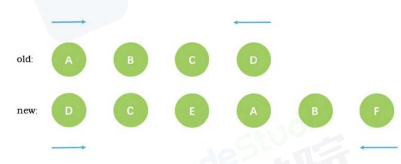
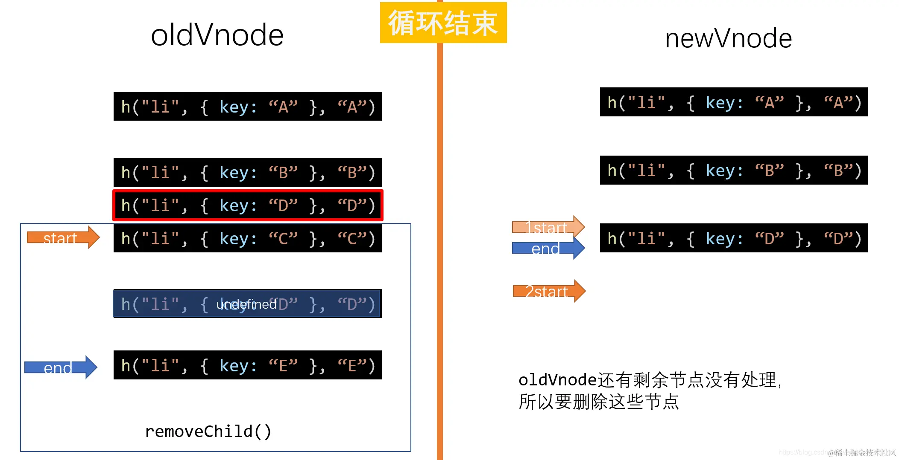

# [虚拟 DOM 与 Diff 算法分析](https://juejin.cn/post/7111904595688833031)

## 涉及函数汇总

| 函数名             | 功能概述                                                                          |
| ------------------ | --------------------------------------------------------------------------------- |
| `vnode()`          | 创建虚拟 dom                                                                      |
| `h() `             | 创建虚拟 dom 树，h()中调用 vnode()                                                |
| `createElement()`  | 将虚拟 dom 转化为 **真实** dom                                                    |
| `patch()`          | 新旧**非同一节点**进行替换：暴力删除旧的，替换新的                                |
| `patchVnode()`     | 对新旧为**同一节点** 的内容进行**精细化比较**（与 updateChildren()互相递归调用 ） |
| `updateChildren()` | 将新旧为同一节点 的**子节点循环取出**然后**递归调用**patchVnode()进行比较         |

## （一）虚拟 DOM 的创建

### 1. 什么是虚拟 DOM?

- 虚拟 DOM 实际上它只是一层对真实 DOM 的抽象，以 JavaScript 对象(VNode 节点)作为基础的树，**用对象的属性来描述节点**，最终可以通过一系列操作使这棵树映射到真实环境上
- 在 Javascript 对象中，虚拟 DOM 表现为一个 0bject 对象。并且最少包含 **标签名(`tag`)、属性(`attrs`)和子元素对象(`children`)** 三个属性
- 创建虚拟 DOM 就是为了更好将虚拟的节点渲染到页面视图中，所以**虚拟 DOM 对象的节点与真实 DOM 的属性一一照应**

### 2. 一个虚拟 DOM 节点有哪些属性

虚拟 DOM：一个能代表 DOM 树的  `JS对象`，通常含有**标签名、标签上的属性、事件监听和子元素们**，以及其他属性

```js{6,7}
{
  children: undefined // 子元素 数组
  data: {
    // 属性、样式、key
  }
  elm: undefined // 对应的真正的dom节点(对象)，undefined表示节点还没有上dom树
  key: undefined // 唯一标识
  sel: '' // 选择器、标签名称
  text: '' // 文本内容
}
```

### 3. 创建 Virtual DOM（vnode.js）

> vnode 函数功能：将传入的参数组合成**对象**返回，产生虚拟节点

```js{14}
//=======================（vnode.js）=========================
/**
 * 产生虚拟节点
 * 将传入的参数组合成对象返回
 * @param {string} sel 选择器
 * @param {object} data 属性、样式
 * @param {Array} children 子元素
 * @param {string|number} text 文本内容
 * @param {object} elm 对应的真正的dom节点(对象)，undefined表示节点还没有上dom树
 * @returns
 */
export default function (sel, data, children, text, elm) {
  const key = data.key
  return { sel, data, children, text, elm, key }
}
```

## （二）[虚拟 DOM 树的创建](https://www.bilibili.com/video/BV1v5411H7gZ?p=4&spm_id_from=pageDriver)

### 1. 认识 h 函数

- h 函数用来产生虚拟节点(vnode)\
  
- 使用 h 函数 创建虚拟节点

```js
// 创建虚拟节点
var myVnode1 = h('a', { props: { href: 'https://www.baidu.com' } }, '虚拟节点')
console.log(myVnode1)
```

- 输出结果\
  
- h 函数的使用形式

```js
h('div', '文字')
h('div', [])
h('div', h())
h('div', {}, [])
h('div', {}, '文字')
h('div', {}, h())
```


### 2. [实现 h 函数（h.js）](https://www.bilibili.com/video/BV1v5411H7gZ?p=4&spm_id_from=pageDriver)

> h 函数功能：产生虚拟 DOM**树的数据格式**，返回的结果是一个**对象**

```js{9,36}
//=========================（h.js）============================
import vnode from './vnode'
/**
 * 产生虚拟DOM树，返回的一个对象
 * 低配版本的h函数要求：这个函数必须接受三个参数，缺一不可
 * @param {*} sel
 * @param {*} data
 * @param {*} c
 * 调用的c只有三种形态 文字、数组、h函数
 * 形态①：h('div', {}, '文字')：字符串
 * 形态②：h('div', {}, [])：数组
 * 形态③：h('div', {}, h())：h()调用的同时已经被执行，相当于获取的是一个执行后返回的对象h('div', {}, h函数执行返回的对象
 */
// vnode ('选择器sel', 'data属性样式', '子元素children', '文本内容text', '真正的dom节点elm')
export default function (sel, data, c) {
  // 检查参数个数
  if (arguments.length !== 3) {
    throw new Error('目前必须只传入三个参数！')
  }
  // 检查第三个参数 c 的类型
  if (typeof c === 'string' || typeof c === 'number') {
    // 说明现在调用h函数是形态① —— h('div', {}, '文字')
    return vnode(sel, data, undefined, c, undefined)
  } else if (Array.isArray(c)) {
    // 说明现在调用h函数是形态②（数组）—— h('div', {}, [])
    let children = []
    // 遍历 c 数组，收集children
    for (let item of c) {
      // 检查 item必须是一个对象，如果不满足则抛出错误
      if (!(typeof item === 'object' && item.hasOwnProperty('sel'))) {
        throw new Error('传入的数组参数中有不是h函数') //h函数执行返回的结果必须是一个对象,因为VNode返回的一定是一个对象
      }
      // ☆☆☆ 这里不用执行item,因为调用语句中已经有了执行
      // ☆☆☆ c数组中的item是调用h函数执行之后返回的一个vnode对象
      // ☆☆☆ 所以不用执行item, 只要收集数组中的item就好了
      children.push(item)
    }
    //循环结束，children收集完毕，返回有children属性的虚拟节点
    return vnode(sel, data, children, undefined, undefined)
  } else if (typeof c === 'object' && c.hasOwnProperty('sel')) {
    // 说明是形态③：是一个对象（h函数返回值是一个对象）
    let children = [c] // 放到children数组中就行了
    return vnode(sel, data, children, undefined, undefined)
  } else {
    throw new Error('传入的第三个参数类型不对')
  }
}
```

**测试代码（index.js）**

```js
import h from './h'

const myVnode1 = h(
  'div',
  {},
  //这里相当于是一个对象数组↓
  [
    h('p', {}, '嘻嘻'), //这里已经调用并执行了h函数，相当于只是一个对象
    h('p', {}, '哈哈'),
    h('p', {}, h('span', {}, '呵呵'))
  ]
)
console.log(myVnode1)
```

## （三）[真实 DOM 的创建（createElement.js）](https://www.bilibili.com/video/BV1v5411H7gZ?p=8&spm_id_from=pageDriver)

> 创建节点。将 vnode 虚拟节点创建为 DOM 节点

### 1. 前置知识点

- `Node.appendChild(aChild)`
  - 将一个节点附加到指定父节点的子节点列表的**末尾处**。
  - 如果将被插入的节点已经存在于当前文档的文档树中，那么  `appendChild()`  只会将它**从原先的位置移动到新的位置**（不需要事先移除要移动的节点）。
- `document.createElement(tagName[, options])`
  - 指定要创建元素类型的字符串,
  - 创建元素时的 nodeName 使用 tagName 的值为初始化，该方法不允许使用限定名称(如:“html:a”)，
  - 在 HTML 文档上调用 createElement() 方法创建元素之前会将 tagName 转化成小写，在 Firefox、Opera 和 Chrome 内核中，createElement(null) 等同于 createElement(“null”)
  - 返回 新建的元素（Element）

### 2. 代码

```js{9,18,21,25}
//===================（createElement.js）=======================
/**
 * 创建节点。将vnode虚拟节点创建为DOM节点
 * 是孤儿节点，不进行插入操作
 * @param {object} vnode
 */
export default function createElement(vnode) {
  // 1.根据虚拟节点sel选择器属性 创建一个DOM节点，这个节点现在是孤儿节点
  let domNode = document.createElement(vnode.sel)
  // 2.判断是有子节点还是有文本
  if (vnode.text !== '' && (vnode.children === undefined || vnode.children.length === 0)) {
    domNode.innerText = vnode.text // 说明没有子节点，内部是文本
  } else if (Array.isArray(vnode.children) && vnode.children.length > 0) {
    // 3.说明内部是子节点，需要递归创建节点
    // 4.遍历数组
    for (let ch of vnode.children) {
      // 5.递归创建子节点，一旦调用createElement意味着创建出DOM了。并且它的elm属性指向了创建出的dom，但是没有上树，是一个孤儿节点
      let childDOM = createElement(ch) // 得到 子节点 表示的 DOM节点 递归最后返回的一定是文本节点
      console.log(ch)
      // 6.文本节点 上domNode树
      domNode.appendChild(childDOM) //appendChild将一个节点附加到指定父节点的子节点列表的末尾处。
    }
  }
  // 7.补充虚拟节点的elm属性,代表已经成为真实节点
  vnode.elm = domNode
  // 8.返回domNode DOM对象
  return domNode
}
```

## （四）[diff 算法-真实 DOM 的更新](https://www.bilibili.com/video/BV1v5411H7gZ?p=6&spm_id_from=pageDriver)

### 1. 前置知识点

- [ `insertBefore(newNode, referenceNode)`](https://blog.csdn.net/hjc256/article/details/89117430)
  - 在父节点`parentNode` 的子节点 `referenceNode` 前插入新节点 `newNode`
  - 如果参考节点为**空**，则将新节点 `newNode`添加到指定父节点的子节点列表的**末尾**。
  - **用法：**`insertedNode = parentNode.insertBefore(newNode, referenceNode)`
    | 参数 | 说明 |
    | ------------- | ----------------------------------------------------------------- |
    | insertedNode | 插入后的节点(`newNode`)<br>因为`insertedNode`是插入后的节点，所以它与`newNode`是同一个节点。 |
    | parentNode | 父节点 |
    | newNode | 将要插入的节点 |
    | referenceNode | 被参照的节点（即要插在该节点之前） |
- `Element.tagName`：返回当前元素的标签名（大写形式）
- `Node.removeChild`\
  从 DOM 中删除一个子节点。返回删除的节点

  - **用法：** `let oldChild = node.removeChild(child);`\
    或`element.removeChild(child);`
  - child 是要移除的那个子节点.
  - node 是 child 的父节点.
  - oldChild 保存对删除的子节点的引用： oldChild === child.

- [`Element.nextSibling`](https://www.runoob.com/try/try.php?filename=tryjsref_node_nextsibling)
  - 返回某个元素之后紧跟的节点:

### 2. diff 算法原理&逻辑

#### （1）原理：

- **key 作为节点的唯一标识**，告诉 diff 算法，在更改前后它们是同一个 DOM 节点。实现**最小量更新**；
- **只进行同层比较，不会进行跨层比较**。即使是同一片虚拟节点，但是跨层了，diff 就是暴力删除旧的，然后插入新的；
- **只有是同一个虚拟节点（`选择器相同且key相同则为同一个`），才进行精细化比较**\
   否则就是暴力删除旧的、插入新的

#### （2）逻辑：


### 3. diff 算法：新旧节点 非同一个节点（patch.js）

> 暴力删除旧的、插入新的

- **功能：**
  - 传入新旧 VNode，对比差异，把差异渲染到 DOM
  - 返回新的 VNode，作为下一次 patch() 的 oldVnode

```js{7,21,27,29,31}
// ==================== patch.js ====================
import vnode from './vnode'
import createElement from './createElement'

export default function (oldVnode, newVnode) {
  // 1.判断传入的第一个参数是 DOM节点 还是 虚拟节点
  if (oldVnode.sel == '' || oldVnode.sel === undefined) {
    // 说明oldVnode是DOM节点，此时要包装成虚拟节点
    oldVnode = vnode(
      oldVnode.tagName.toLowerCase(), // sel
      {}, // data：data.key
      [], // children
      undefined, // text
      oldVnode // elm
    )
  }
  // 2.判断 oldVnode 和 newVnode 是不是同一个节点（key、标签名）
  if (oldVnode.key === newVnode.key && oldVnode.sel === newVnode.sel) {
    //=====================================================
    console.log('是同一个节点，需要精细化比较')
    patchVnode(oldVnode, newVnode)
    //=====================================================
  } else {
    console.log('不是同一个节点，暴力 插入新节点，删除旧节点')
    const newVnodeElm = createElement(newVnode) // （1）创建 新虚拟节点 为 DOM节点
    const oldVnodeElm = oldVnode.elm // （2）要操作DOM，所以都要转换成 DOM节点
    // 3. 如果存在新节点，则更换旧节点（插入“新节点”到“旧节点”之前，删除旧节点）
    if (newVnodeElm) {
      oldVnodeElm.parentNode.insertBefore(newVnodeElm, oldVnodeElm) // 判断newVnodeElm是存在的 在旧节点之前插入新节点
    }
    oldVnodeElm.parentNode.removeChild(oldVnodeElm) // 删除旧节点
  }
}
```

**测试代码**
::: example
blogs/framework/vue/diff/test1
:::

### 4. diff 算法：新旧节点 是同一个节点 —— 精细化比较

#### &-1. 逻辑图

双方是否都包含多个子节点，否则新节点替换子节点；是则进行 diff


#### &-2. 新旧节点不都是 children（patchVnode.js）

patchVnode.js：进行精细化比较

- 判断 新旧 vnode 是否是同一个对象
- 判断 新节点 是否为字符串（即有没有 text\`属性）
  - (1)新节点为字符串（有 `text` 属性）\
    判断 新节点 与 旧节点 的 **字符串是否相同**，
    - **不同则将 老节点的 text 替换成 新节点的 text**
  - (2)新节点不是字符串，即包含多个子节点（有`children`属性）:\
    判断老节点是否也包含多个子节点（也有`children`属性）
    - **① 如果老节点为字符串，则直接替换成新节点的 children**
    - **② 如果老节点和新节点都分别包含多个子节点，则进行精细化比较双方的子节点**（updateChildren.js）

```js{12,20}
// ==================== patchVnode.js ====================
export default function patchVnode(oldVnode, newVnode) {
  console.log('【 oldVnode, newVnode 】-8', oldVnode, newVnode)
  // 1. 判断新旧 vnode 是否是同一个对象
  if (oldVnode === newVnode) return
  // 2. 判断 newVndoe 有没有 text 属性
  if (newVnode.text && !newVnode.children?.length) {
    // 2.1 newVnode 有 text属性
    // 2.1.1 判断 newVnode 与 oldVnode 的 text 属性是否相同
    // 如果newVnode中的text和oldVnode的text不同，那么直接让新text替换老elm中的text即可。
    // 如果oldVnode中是children，也会立即消失
    if (newVnode.text !== oldVnode.text) {
      oldVnode.elm.innerText = newVnode.text
    }
  } else {
    // 2.2 newVnode 没有 text属性，即有children属性
    // 2.2.1 判断 oldVnode 有没有 children 属性
    if (oldVnode.children?.length) {
      // ☆☆☆ oldVnode有children属性 最复杂的情况，新老节点都有children
      updateChildren(oldVnode.elm, oldVnode.children, newVnode.children) // 见updateChildren.js
    } else {
      // 2.2.2 （oldVnode没有children属性，说明是text） && （newVnode有children属性）
      // 将oldVnode的text内容清空，替换成新的子节点
      oldVnode.elm.innerHTML = ''
      // 遍历新的vnode虚拟节点的子节点，创建DOM，上树
      for (let ch of newVnode.children) {
        let chDOM = createElement(ch)
        oldVnode.elm.appendChild(chDOM)
      }
    }
  }
}

```

---

#### &-3. ⭐ 新旧节点都是 children（updateChildren.js）

##### &-&-1. 前置知识点

**（1）什么是新前新后、旧前旧后（四个指针）：**
| 指针 | 描述|
| --- | --- |
| 新前 | 新父节点的第一个子节点 |
| 新后 | 新父节点的最后一个子节点 |
| 旧前 | 旧父节点的第一个子节点 |
| 旧后 | 旧父节点的最后一个子节点 |


**（2）比较两个节点是否为同一个节点**

```js{4}
// 判断是否是同一个节点
function checkSameVnode(a, b) {
  return a.sel === b.sel && a.key === b.key
  // 如果没有设置 key ，那么 key 为 undefined ，这时候 undefined 是恒等于 undefined
}
```

##### &-&-2. [四种命中查找](https://www.bilibili.com/video/BV1v5411H7gZ?p=12&spm_id_from=pageDriver)



- 比较的过程中，循环从两边向中间收拢
- 每次进入循环的时候，按命中**顺序向下**进行命中查找，`命中一种就不再进行命中判断了` ，就进入精细化比较

| 命中查找                          | 是否移动节点                                                                                                                                                                                                                                   |
| --------------------------------- | ---------------------------------------------------------------------------------------------------------------------------------------------------------------------------------------------------------------------------------------------- |
| 命中 ①**旧前**与新前              | 不移动                                                                                                                                                                                                                                         |
| 命中 ②**旧后**与新后              | 不移动                                                                                                                                                                                                                                         |
| 命中 ③**旧前**与新后              | `旧前移到旧后之后`<br/>前面的移到后面：旧前（即新后），移动到**旧后指针对应节点**的**后面**                                                                                                                                                    |
| 命中 ④**旧后**与新前              | `旧后移到旧前之前`<br/>后面的移到前面：旧后（即新前），移动到**旧前指针对应节点**的**前面**                                                                                                                                                    |
| 如果都没有命中                    | `新前移/插到旧前之前`<br/>用 newStart 去匹配旧节点，<br/>如果匹配到，则将对应的旧节点（新前）移动到 oldStartldx 之前。并将原来的旧节点**置为空** ，<br/>如果没匹配到，则插到 oldStartldx 对应的节点前面，<br/>移到完只移动新前指针`newStart++` |
| 循环结束`旧前>旧后`或`新前>新后 ` | 如果`newStartIdx <= newEndIdx`说明有新节点，则依次添加到旧前之前<br/>如果`oldStartIdx <= oldEndIdx`说明有剩余节点，则删除                                                                                                                      |


##### &-&-3. 循环四种命中查找

每一次循环都**重新**按四种命中方式进行比对

###### （0）循环的条件

- 重复四种命中查找的对比过程，直到两个数组中**任一数组**的**头指针超过尾指针，循环结束**
- 进行循环的条件：**旧前<=旧后&&新前<=新后**

```js
while（oldStartIdx <= oldEndIdx && newStartIdx <= newEndIdx）> {}
```

###### （1）命中 ①：— 旧前与新前（头头对比）

- 如果命中了 ①，patchVnode 之后新前与旧前指针分别**向下移动**，即 `newStart++ `，`oldStart++`
  

```js{2,7,8}
// 新前与旧前
if (checkSameVnode(oldStartVnode, newStartVnode)) {
  console.log(' ①1 新前与旧前 命中')
  // 精细化比较两个节点 oldStartVnode现在和newStartVnode一样了
  patchVnode(oldStartVnode, newStartVnode)
  // 移动指针，分别指向双方的下一个节点，这表示当前这两个节点都处理（比较）完了
  oldStartVnode = oldCh[++oldStartIdx] // 旧前的下一个节点
  newStartVnode = newCh[++newStartIdx] // 新前的下一个节点
}
```

::: example
blogs/framework/vue/diff/oldstartNewstart
:::

如果没命中就接着比较下一种情况

###### （2）命中 ②：— 旧后与新后（尾尾对比）

如果命中了 ②，patchVnode 之后新后与旧后指针分别**向上移动**，即 `newEnd-- `，` oldEnd–-`


```js{2,6,7}
// 旧后与新后
if (checkSameVnode(oldEndVnode, newEndVnode)) {
  // 处理（比较）当前这两个节点
  patchVnode(oldEndVnode, newEndVnode)
  // 处理（比较）完当前这两个节点，移动指针，分别指向双方的上一个节点
  oldEndVnode = oldCh[--oldEndIdx] // 旧后的上一个节点
  newEndVnode = newCh[--newEndIdx] // 新后的上一个节点
}
```

::: example
blogs/framework/vue/diff/oldendNewend
:::

如果没命中就接着比较下一种情况

###### （3）命中 ③：— 旧前与新后（头尾对比）

- 将 新后 newEnd 指向的节点（即旧前），`移动到 旧后 oldEnd 之后`
- 移动在旧节点上进行：**前面的移到后面**，
- 然后`newEnd++`，` oldStart–-`


```js{2,10}
// 旧前与新后
if (checkSameVnode(oldStartVnode, newEndVnode)) {
  console.log(' ③3 新后与旧前 命中')
  patchVnode(oldStartVnode, newEndVnode)
  // 当③新后与旧前命中的时候，此时要移动节点。
  // 移动 新后指向的这个节点（即旧前），到老节点的 旧后的后面
  // 移动节点：只要插入一个已经在DOM树上 的节点，就会被移动
  // insertBefore(新节点, 参考节点)：在参考节点之前插入一个拥有指定父节点的子节点
  // oldEndVnode.elm.nextSibling: 获取参考节点之后紧跟的节点
  parentElm.insertBefore(oldStartVnode.elm, oldEndVnode.elm.nextSibling)
  oldStartVnode = oldCh[++oldStartIdx] // 旧前的下一个节点
  newEndVnode = newCh[--newEndIdx] // 新后的上一个节点
}
```

::: example
blogs/framework/vue/diff/oldstartNewend
:::

如果没命中就接着比较下一种情况

###### （4）命中 ④：— 旧后与新前（尾头对比）

- 如果命中了 ④
  - 将 新前 newStart 指向的节点（即旧后），`移动到 旧前 oldStart 之前`
  - 移动在旧节点上进行：后面的移到前面，
  - 然后`newStart--`，` oldEnd++`
    

```js{2,7}
// 旧后与新前
if (checkSameVnode(oldEndVnode, newStartVnode)) {
  console.log(' ④4 新前与旧后 命中')
  patchVnode(oldEndVnode, newStartVnode)
  // 当④新前与旧后命中的时候，此时要移动节点。
  // 移动 新前 指向的这个节点（即旧后），到老节点的 旧前的前面
  parentElm.insertBefore(oldEndVnode.elm, oldStartVnode.elm)
  oldEndVnode = oldCh[--oldEndIdx]
  newStartVnode = newCh[++newStartIdx]
}
```

::: example
blogs/framework/vue/diff/oldendNewstart
:::

如果没命中就表示四种情况都没有命中

###### （5）[4 种都没命中 遍历 oldVnode 中的 key](https://www.bilibili.com/video/BV1v5411H7gZ?p=15&vd_source=9d75580d0b23d1137d56e03a996ac726)

- 当新节点跟旧节点头尾交叉对比没有结果时，会根据新节点的 key 去对比旧节点数组中的 key
- 找到了就 移动旧节点的位置，将原来位置的节点设为`undefined`，\
  移动指针`newStart++`（**只移动新头**）
- 没找的就是新节点，直接插入所有未处理旧节点**之前**


```js{11,21,27,29,32}
// 四种都没有匹配到，都没有命中
console.log('四种都没有命中')
// 寻找 keyMap 一个映射对象， 就不用每次都遍历old对象了
if (!keyMap) {
  keyMap = {}
  // 记录oldVnode中的节点出现的key
  // 从oldStartIdx开始到oldEndIdx结束，创建keyMap
  for (let i = oldStartIdx; i <= oldEndIdx; i++) {
    const key = oldCh[i].key
    if (key !== undefined) {
      keyMap[key] = i // ☆ 每个key的顺序 i 对应旧子节点在旧节点中的位置
    }
  }
}
console.log(keyMap)
const idxInOld = keyMap[newStartVnode.key]// 寻找当前项（newStartIdx）在keyMap中映射的序号
// 没找到对应的key就说明是全新的节点
if (idxInOld === undefined) {
  // 如果 idxInOld 是 undefined 说明是全新的项，要插入
  // 被加入的项（就是newStartVnode这项)现不是真正的DOM节点
  parentElm.insertBefore(createElement(newStartVnode), oldStartVnode.elm)
} else {
  // 找到说明不是全新的项，要移动，把要移动的项先用新值elmToMove保存起来，处理完再设置为undefined
  const elmToMove = oldCh[idxInOld] //oldCh[idxInOld]：新节点对应的旧节点，就是要移动的节点
  patchVnode(elmToMove, newStartVnode) //精细化比较这两项
  // 把这项设置为undefined，表示我已经处理完这项了，处理为undefined之前已经赋值给elmToMove
  oldCh[idxInOld] = undefined
  // 移动，调用insertBefore也可以实现移动。把当前项移动到旧节点前面
  parentElm.insertBefore(elmToMove.elm, oldStartVnode.elm)
}
// 指针下移，只移动新头
newStartVnode = newCh[++newStartIdx] // 指向新前的下一个节点
```

::: example
blogs/framework/vue/diff/newStart
:::

- 进行下一次循环

##### &-&-4. 循环结束

循环结束：`旧前>旧后 || 新前>新后`

###### （1）newVnode 中还有剩余节点——插入

`newStartIdx <= newEndIdx`

- 如果旧节点先循环处理完，新节点还没有结束\
  `oldStartIdx > oldEndIdx` && `newStartIdx <= newEndIdx`
- 新节点中剩余的都  **插入**  旧节点 oldEnd 后面 或 oldStart 之前）\
  
- 后面新增的情况：
  
- 前面新增的情况：
  

###### （2）oldVnode 中还有剩余节点——删除

- 如果新节点先循环处理完，旧节点还没有结束\
  `newStartIdx > newEndIdx` && `oldStartIdx <= oldEndIdx`
- 旧节点中剩余的都进行删除
- 后面删除的情况：
  
- 前面删除的情况：
  
- 循环结束——删除多余的旧节点
  

###### （3）代码

```js{2,5,7,11}
// （1）新增插入
if (newStartIdx <= newEndIdx) {
  // 说明newVndoe还有剩余节点没有处理，所以要添加这些节点
  for (let i = newStartIdx; i <= newEndIdx; i++) {
    // insertBefore方法可以自动识别null，如果是null就会自动排到队尾，和appendChild一致
    //此时newCh[i] 还是虚拟节点，需变成真实DOM再上树：createElement(newCh[i])
    parentElm.insertBefore(createElement(newCh[i]), oldCh[oldStartIdx].elm)
  }
}
// （2）多余删除
else if (oldStartIdx <= oldEndIdx) {
  // 说明oldVnode还有剩余节点没有处理，所以要删除这些节点
  for (let i = oldStartIdx; i <= oldEndIdx; i++) {
    if (oldCh[i]) {
      parentElm.removeChild(oldCh[i].elm)
    }
  }
}
```

##### &-&-5. ⭐diff 算法代码（updateChildren.js）


```js{66,75,99,105,107}
import createElement from './createElement'
import patchVnode from './patchVnode'
/**
 *
 * @param {object} parentElm Dom节点
 * @param {Array} oldCh oldVnode的子节点数组
 * @param {Array} newCh newVnode的子节点数组
 */

// 判断是否是同一个节点
function checkSameVnode(a, b) {
  return a.sel === b.sel && a.key === b.key
}

export default function updateChildren(parentElm, oldCh, newCh) {
  console.log('updateChildren()')
  console.log(oldCh, newCh)

  // 四个指针
  let oldStartIdx = 0 // 旧前
  let newStartIdx = 0 // 新前
  let oldEndIdx = oldCh.length - 1 // 旧后
  let newEndIdx = newCh.length - 1 // 新后

  // 指针指向的四个节点
  let oldStartVnode = oldCh[0] // 旧前节点
  let oldEndVnode = oldCh[oldEndIdx] // 旧后节点
  let newStartVnode = newCh[0] // 新前节点
  let newEndVnode = newCh[newEndIdx] // 新后节点

  //根据旧节点的key保存旧节点中每个子节点的顺序位置
  let keyMap = null

  // 进行循环的条件：旧前<=旧后 && 新前<=新后
  while (oldStartIdx <= oldEndIdx && newStartIdx <= newEndIdx) {
    console.log('**循环中**')
    // 首先应该不是判断四种命中，而是略过已经加了undefined标记的项
    if (oldStartVnode === null || oldCh[oldStartIdx] === undefined) {
      oldStartVnode = oldCh[++oldStartIdx]
    } else if (oldEndVnode === null || oldCh[oldEndIdx] === undefined) {
      oldEndVnode = oldCh[--oldEndIdx]
    } else if (newStartVnode === null || newCh[newStartIdx] === undefined) {
      newStartVnode = newCh[++newStartIdx]
    } else if (newEndVnode === null || newCh[newEndIdx] === undefined) {
      newEndVnode = newCh[--newEndIdx]
    } else if (checkSameVnode(oldStartVnode, newStartVnode)) {
      // 【1】新前与旧前
      console.log(' ①1 新前与旧前 命中')
      // 精细化比较两个节点 oldStartVnode现在和newStartVnode一样了
      patchVnode(oldStartVnode, newStartVnode)
      // 移动指针，改变指针指向的节点，这表示这两个节点都处理（比较）完了
      oldStartVnode = oldCh[++oldStartIdx]
      newStartVnode = newCh[++newStartIdx]
    } else if (checkSameVnode(oldEndVnode, newEndVnode)) {
      // 【2】新后与旧后
      console.log(' ②2 新后与旧后 命中')
      patchVnode(oldEndVnode, newEndVnode)
      oldEndVnode = oldCh[--oldEndIdx]
      newEndVnode = newCh[--newEndIdx]
    } else if (checkSameVnode(oldStartVnode, newEndVnode)) {
      // 【3】新后与旧前
      console.log(' ③3 新后与旧前 命中')
      patchVnode(oldStartVnode, newEndVnode)
      // 当③新后与旧前命中的时候，此时要移动节点。移动 新后（旧前） 指向的这个节点到老节点的 旧后的后面
      // 移动节点：只要插入一个已经在DOM树上 的节点，就会被移动
      parentElm.insertBefore(oldStartVnode.elm, oldEndVnode.elm.nextSibling)
      oldStartVnode = oldCh[++oldStartIdx]
      newEndVnode = newCh[--newEndIdx]
    } else if (checkSameVnode(oldEndVnode, newStartVnode)) {
      // 【4】新前与旧后
      console.log(' ④4 新前与旧后 命中')
      patchVnode(oldEndVnode, newStartVnode)
      // 当④新前与旧后命中的时候，此时要移动节点。移动 新前（旧后） 指向的这个节点到老节点的 旧前的前面
      // 移动节点：只要插入一个已经在DOM树上的节点，就会被移动
      parentElm.insertBefore(oldEndVnode.elm, oldStartVnode.elm)
      oldEndVnode = oldCh[--oldEndIdx]
      newStartVnode = newCh[++newStartIdx]
    } else {
      // 【5】四种都没有匹配到，都没有命中
      console.log('四种都没有命中')
      // 寻找 keyMap 一个映射对象， 就不用每次都遍历old对象了
      if (!keyMap) {
        keyMap = {}
        // 记录oldVnode中的节点出现的key
        // 从oldStartIdx开始到oldEndIdx结束，创建keyMap
        for (let i = oldStartIdx; i <= oldEndIdx; i++) {
          const key = oldCh[i].key
          if (key !== undefined) {
            keyMap[key] = i
          }
        }
      }
      console.log(keyMap)
      // 寻找当前项（newStartIdx）在keyMap中映射的序号
      const idxInOld = keyMap[newStartVnode.key]
      if (idxInOld === undefined) {
        // 如果 idxInOld 是 undefined 说明是全新的项，要插入
        // 被加入的项（就是newStartVnode这项)现不是真正的DOM节点
        parentElm.insertBefore(createElement(newStartVnode), oldStartVnode.elm)
      } else {
        // 说明不是全新的项，要移动
        const elmToMove = oldCh[idxInOld]
        patchVnode(elmToMove, newStartVnode)
        // 把这项设置为undefined，表示我已经处理完这项了
        oldCh[idxInOld] = undefined
        // 移动，调用insertBefore也可以实现移动。
        parentElm.insertBefore(elmToMove.elm, oldStartVnode.elm)
      }

      // newStartIdx++;
      newStartVnode = newCh[++newStartIdx]
    }
  }

  // 循环结束：newStartIdx <= newEndIdx || oldStartIdx <= oldEndIdx
  if (newStartIdx <= newEndIdx) {
    // 说明newVndoe还有剩余节点没有处理，所以要添加这些节点
    // 插入的标杆
    // const before =
    //   newCh[newEndIdx + 1] === null ? null : newCh[newEndIdx + 1].elm;
    for (let i = newStartIdx; i <= newEndIdx; i++) {
      // insertBefore方法可以自动识别null，如果是null就会自动排到队尾，和appendChild一致
      // 此时newCh[i] 还是虚拟节点，需变成真实DOM再上树：createElement(newCh[i])
      parentElm.insertBefore(createElement(newCh[i]), oldCh[oldStartIdx].elm)
    }
  } else if (oldStartIdx <= oldEndIdx) {
    // 说明oldVnode还有剩余节点没有处理，所以要删除这些节点
    for (let i = oldStartIdx; i <= oldEndIdx; i++) {
      if (oldCh[i]) {
        parentElm.removeChild(oldCh[i].elm)
      }
    }
  }
}
```

## （五）完整思路分析图&概述


概述：

- diff 算法是**虚拟节点**的比较
- 先进行 key 值的比较，然后进行同级比较，
- 先比较一方有子节点，一方没子节点的情况
  - 如果是，直接在旧节点中插入或删除子节点
- 再比较两方都有子节点的情况
  - 情况一：旧：`A`BCD，新：`A`BCDE；  
    **从头向尾**比较，最后插入即可
  - 情况二：旧 ：ABC`D`，新：EABC`D`；  
    **从尾向头**比较，最后插入即可
  - 情况三：旧：ABC`D`，新：`D`ABC；  
    **头和尾**先进行一次比对，发现 D 时，把 D 移至前面；再继续**从头向尾**比较，
  - 情况四：旧：`A`BCD，新 BCD`A`；  
    从头向尾比较后发现不对，就会**从尾向头**比，把 A 移至最后，再继续比较
  - 情况五：旧 ：ABCD，新 CDME；  
    以上四种都没比中时，用 keyMap 记录 oldVnode 中的节点出现的 key 和节点位置，新节点从头向尾在 keyMap 中查找比较，把 CD 移至前面，最后 新建 ME，再把 CD 至为**空**（详见 **(四）4-3-3-(5)**）

```
0  A-(C)    (C)
1  B-D =>   A   D
2  C-M      B   M
3  D-E      D   E
```

- 递归比较子节点

## [ 延伸问题]

### 【源码中如何定义“同一个节点”?】

> -旧节点的 key 要和新节点的 key 相同，且旧节点的选择器要和新节点的选择器相同
>
> ```ts
> function sameVnode(vnode1: VNode, vnode2: VNode): boolean {
>   return vnodel.key === vnode2.key && vnode1.sel === vnode2.sel
> }
> ```

### 1. [写 React / Vue 项目时为什么要在列表组件中写 key，其作用是什么？](https://github.com/Advanced-Frontend/Daily-Interview-Question/issues/1)

- vue 和 react 都是采用 diff 算法来**对比新旧虚拟节点，从而更新节点**。
- 在交叉对比中，当新节点跟旧节点`头尾交叉对比`没有结果时，会根据**新节点的 key**去对比**旧节点数组**中的 key，从而找到相应旧节点（这里对应的是一个 key => index 的**map 映射**）。如果没找到就认为是一个新增节点。
- 而如果没有 key，那么就会采用遍历查找的方式去找到对应的旧节点。一种一个 map 映射，另一种是遍历查找。相比而言。**map 映射的速度更快**
  点

### 2. 虚拟 DOM 的优缺点

- 优点

  - 虚拟 DOM 最大的优势在于抽象了原本的渲染过程，**实现了跨平台的能力**，而不仅仅局限于浏览器的 DOM，
  - 支持 diff 算法，减少 JavaScript 操作真实 DOM 带来的性能消耗，减少了**回流与重绘**

- 缺点
  - **首次**渲染大量 DOM 时，由于多了一层虚拟 DOM 的计算，会比 innerHTML 插入慢

### 3. Vue 的 Key 的作用

- key 主要用在**虚拟 Dom 算法**中，每个虚拟节点 VNode 有一个**唯一标识 Key**，通过对比新旧节点的 key 来判断节点是否改变，
- 用 key 就可以**大大提高渲染效率**，
- 这个 key 类似于缓存中的 etag。

### 4. 为什么 v-for 会要有 key？⭐⭐⭐⭐⭐

因为在 vue 中会有一个 diff 算法，假如子节点 AB 调换了位置，它会**比较 key 值**，会直接调换，而不是一个销毁重新生成的过程

### 5. [什么是 render 函数](https://www.jianshu.com/p/d96bebc2bbc8)⭐⭐⭐

- `render 函数`即**渲染函数**，它是个函数，它的参数也是个函数——即  `createElement`
- 这形参也作为一个方法（可以动态创建标签），可传入三个参数：**标签名、属性、子元素**；
- 返回值: VNode，即虚拟节点；

```js
 /**
  * render: 渲染函数
  * 参数: createElement
  * 参数类型: Function
 */
 render: function (createElement) {
   let _this = this['$options'].parent	// 我这个是在 .vue 文件的 components 中写的，这样写才能访问this
   let _header = _this.$slots.header   	// $slots: vue中所有分发插槽，不具名的都在default里

   /**
    * createElement 本身也是一个函数，它有三个参数
    * 返回值: VNode，即虚拟节点
    * 1. 一个 HTML 标签字符串，组件选项对象，或者解析上述任何一种的一个 async 异步函数。必需参数。{String | Object | Function} - 就是你要渲染的最外层标签
    * 2. 一个包含模板相关属性的数据对象你可以在 template 中使用这些特性。可选参数。{Object} - 1中的标签的属性
    * 3. 子虚拟节点 (VNodes)，由 `createElement()` 构建而成，也可以使用字符串来生成“文本虚拟节点”。可选参数。{String | Array} - 1的子节点，可以用 createElement() 创建，文本节点直接写就可以
    */
   return createElement(
     // 1. 要渲染的标签名称：第一个参数【必需】
     'div',
     // 2. 1中渲染的标签的属性，详情查看文档：第二个参数【可选】
     {
       style: {
         color: '#333',
         border: '1px solid #ccc'
       }
     },
     // 3. 1中渲染的标签的子元素数组：第三个参数【可选】
     [
       'text',   // 文本节点直接写就可以
       _this.$slots.default,  // 所有不具名插槽，是个数组
       createElement('div', _header)   // createElement()创建的VNodes
     ]
   )
 }
```

---

> 来源/参考链接：
>
> - [视频讲解参考](https://www.bilibili.com/video/BV1v5411H7gZ)
> - [图文内容参考](https://blog.csdn.net/weixin_44972008/article/details/115620198)
> - [四种命中分析流程参考](https://juejin.cn/post/6844903902429577229#heading-6) > \-<https://juejin.cn/post/7025247844156047374#heading-2>

### 设置 key 与不设置 key 区别


- 从代码如果节点类型相同,没有设置 key ，那么 key 为 undefined ，**这时候 undefined 是恒等于 undefined**，**当进行 diff 算法判断的时候，每次 sameNode 都为 true**,就都会进入 patch，从而增加 dom 操作
  
- 而有 key 的情况，只有 key 真的相等时才会进行更新操作，减少了 dom 的更新和插入
  
