<!--
 * @Description:
 * @Date: 2024-10-31 17:36:21
 * @LastEditTime: 2024-11-04 11:17:52
-->

## vue 的错误处理

- 接口错误
  - 响应拦截
- 代码错误
  - `Vue.config.errorHandler`
  - errorCaptured:生命周期钩子，返回 false 以阻止错误继续向上传播。

## 【vue 中 Scoped Styles 是如何实现样式隔离的， 原理是啥？】

在 Vue 中，`.vue` 单⽂件组件的 `<style>`标签可以添加⼀个 `scoped` 属性来实现样式的隔离。
通过这个 scoped 属性，Vue 会确保样式只应⽤到当前组件的模板中，⽽不会泄漏到外部的其他组件
中。
这个效果是通过 `PostCSS` **在构建过程中对 CSS 进⾏转换**来实现的。

### Scoped Styles 的⼯作原理：

1. 当你为 `<style>` 标签添加 `scoped` 属性时，Vue 的加载器（⽐如 vue-loader ）会处理你
   的组件⽂件。
2. `vue-loader` 使⽤ `PostCSS` 来处理 `scoped` 的 CSS。 **它为组件模板内的每个元素添加⼀个独
   特的属性（如 `data-v-f3f3eg9` ）** 。这个属性是随机⽣成的，确保唯⼀性（是在 Vue 项⽬构建
   过程中的 `hash` 值）。
3. 同时，所有的 CSS 规则都会被更新，**以仅匹配带有相应属性选择器的元素**。例如：如果你有⼀个
   .button 类的样式规则，它会被转换成类似`.button[data-v-f3f3eg9]` 的形式。这确保
   了样式只会被应⽤到拥有对应属性的 DOM 元素上。

### 示例

- 编译前

```vue{4}
<template>
  <button class="btn">点击</button>
</template>
<style scoped>
.btn {
  background-color: blue;
}
</style>
```

- 编译时为 scoped 组件模板内的每个元素添加⼀个独特的属性

```vue{1,3}
<button class="btn" data-v-f3f3eg9>点击</button>
<style >
.btn[data-v-f3f3eg9] {
  background-color: blue;
}
</style>
```

## 【Vue 中为何不要把 `v-if` 和 `v-for` 同时⽤在同⼀个元素上,原理是什么？】

- 将 `v-if` 和 `v-for` 同时⽤在同⼀个元素上可能会导致性能问题。原因在于 `v-for` 具有⽐ `v-if` 更⾼的优先级，它会在每次渲染的时候都会运⾏。
- 这意味着，即使在某些情况下 v-if 的条件为 false ， v-for 仍然会对数据进⾏

```html{2}
<ul>
  <li v-for="item in items" v-if="item.isActive">{{ item.name }}</li>
</ul>
```

- 在 Vue 的渲染过程中，它会将模板解析为**AST（抽象语法树）**，然后将 AST 转换为渲染函数。对于上⾯的模板，渲染函数⼤致如下：

```js{7}
function render() {
  return _c(
    'ul',
    null,
    _l(items, function (item) {
      // 即使 `item.isActive` 为 false ，Vue 仍然会对它进⾏遍历和渲染
      return item.isActive ? _c('li', null, _v(_s(item.name))) : _e()
    })
  )
}
```

- 上⾯的代码中， `_l` 是由 `v-for` 指令⽣成的渲染函数。它接收⼀个数组和⼀个回调函数，并在每个**数组项**上调⽤回调函数。回调函数根据 `v-if` 条件来决定是否渲染 li 元素。
- **由于 v-for 的优先级⽐ v-if ⾼**，所以每次渲染时都会执⾏` v-for` 循环，⽆论 `v-if` 的条件是否为 `false` 。这意味着即使 `item.isActive` 为 false ，Vue 仍然会对它进⾏遍历和渲染。
- 此外，Vue 在渲染时会尽量复⽤已经存在的元素，⽽不是重新创建和销毁它们。但是当 v-for 遍历的数据项发⽣变化时，Vue 会使⽤具有相同 key 的元素。在上⾯的例⼦中，如果 item.isActive 从 true 变为 false ，Vue 会尝试复⽤之前的 li 元素，并在其上应⽤ v-if 条件。这可能会导致⼀些不符合预期的⾏为。
- 可以考虑使⽤计算属性或者 `v-for` 的过滤器来处理数据

## 【如何更好地在 vue 中使用 jQuery】❗

### 1. jQuery 和 vue 的虚拟 dom 的冲突原因?

‌jQuery 和 Vue 的虚拟 DOM 冲突的主要原因在于：

- Vue 通过**数据绑定**来管理 DOM 更新，而 jQuery **直接操作 DOM** 元素可能会破坏 **Vue 的虚拟 DOM 机制**，导致内部状态与 DOM 不一致。
- 具体来说，Vue 使用虚拟 DOM 来提高效率，任何直接的 DOM 操作都会导致 Vue 内部状态与 DOM 不一致。

### 2.如何更好地在 vue 中使用 jQuery，有什么注意点

- **‌ 避免直接操作 DOM**‌：尽量通过 Vue 的数据绑定和指令来操作 DOM，避免直接使用 jQuery 操作 DOM 元素。这样可以减少与 Vue 响应式系统的冲突，保持代码的清晰和可维护性 ‌
- **‌ 在生命周期钩子中使用 jQuery 代码**‌：在 Vue 的生命周期钩子如 `mounted` 和 `updated` 中使用 jQuery 代码，**确保 DOM 元素已经被正确渲染或更新后再进行操作**。例如，在 mounted 钩子中初始化 jQuery 插件，在 updated 钩子中执行 DOM 操作 ‌
- 封装 jQuery 代码为 Vue 插件 ‌：将 jQuery 代码封装为 Vue 插件，这样可以更好地管理和复用 jQuery 代码，同时确保只在需要的地方使用，减少全局污染 。
- 使用 Vue 的自定义指令 ‌：通过自定义指令封装 jQuery 插件或效果，这样可以在模板中直接使用指令，保持代码的简洁和一致性 ‌
- 性能问题 ‌：混用 JQuery 和 Vue.js 可能会导致性能问题。JQuery 直接操作 DOM 可能会导致与 Vue 的虚拟 DOM 机制冲突，增加不必要的 DOM 操作，造成性能下降 。

## 【vue 有哪些比其他框架好的性能优化点】❗

- **虚拟 DOM**：Vue 通过使用虚拟 DOM 来高效地追踪和更新 DOM。虚拟 DOM 是一种轻量级的表现形式，它记录了真实 DOM 状态的快照。当数据改变时，Vue 会比对新旧虚拟 DOM 树之间的差异，并只应用必要的改变到真实 DOM 上。
- **数据响应式系统**：Vue 使用数据响应式系统，只更新变更的部分，而不是重新渲染整个组件。这大大提高了性能，尤其是在处理大型列表和组件时。
- **组件化**：Vue 组件可以封装自己的逻辑和模板，使得开发者能够以组件为单位进行开发和复用，从而减少不必要的重渲染。
- **懒加载与预加载**：Vue 支持懒加载和预加载，可以帮助优化加载时间，减少首屏加载时间。
- **使用工具库**：结合诸如 Webpack、Babel 这样的构建工具，可以帮助优化项目的打包大小和编译速度。

## 【vue2 有哪些不足，需要怎么解决】

- **单向数据流限制**
  - 问题：Vue 2 强调单向数据流，这在一定程度上简化了状态管理，但在处理复杂应用状态时可能会遇到一些限制。Vue 2 的组件通信主要依赖 props 和事件，虽然简单直观，但在处理复杂状态变化时可能会变得繁琐和冗长 ‌
  - 解决：使用 `Vuex` 这样的状态管理模式和库，集中管理应用的所有组件的状态，可以使用事件总线或 Vuex 进行通信 ‌

## 【说说你对 vue 的 mixin 的理解，有什么应用场景?】

- mixin 类似于对象
- 当组件存在与 mixin 对象相同的选项的时候，进行递归合并的时候组件的选项会**覆盖** mixin 的选项，但是如果相同选项为**生命周期钩子**的时候，会**合并成一个数组，先执行 mixin 的钩子，再执行组件的钩子**
  - 替换型：同名的 props、methods、inject、computed 会被后来者代替
  - 合并型：data(有对象的话则递归进行合并)
  - 队列型：全部生命周期钩子和 watch 被合并为一个数组，然后正序遍历一次执行
  - 叠加型有:component、directives、filters，叠加型主要是通过原型链进行层层的叠加

## 【vue 的修饰符】

### 表单修饰符

| 修饰符   | 示例                     |
| -------- | ------------------------ |
| `lazy`   | 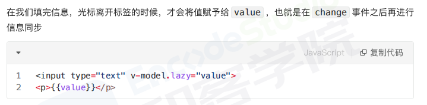 |
| `number` | 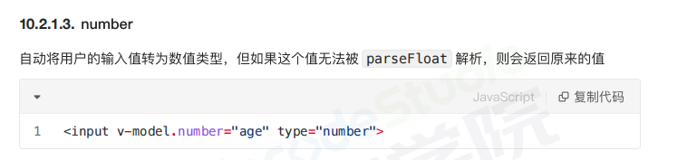 |
| `trim`   | 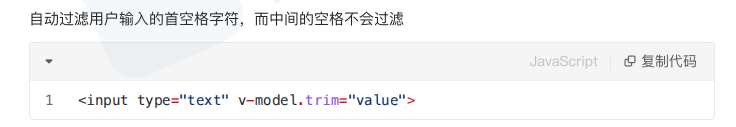 |

### 事件修饰符

| 修饰符                                                                 | 示例                      |
| ---------------------------------------------------------------------- | ------------------------- |
| `stop`                                                                 | 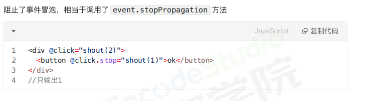  |
| `prevent`                                                              | 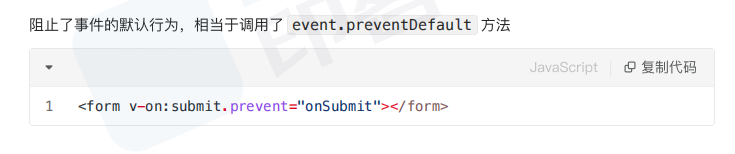  |
| `self`                                                                 | 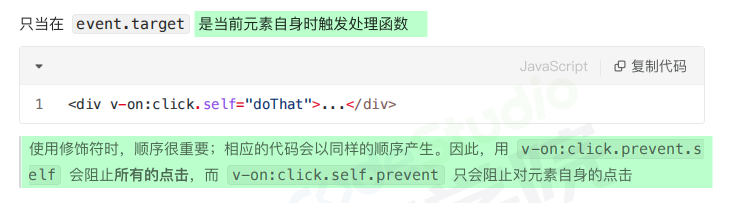  |
| `once`                                                                 | 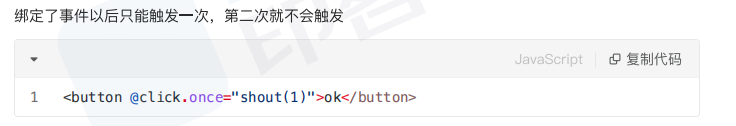  |
| `capture`                                                              | 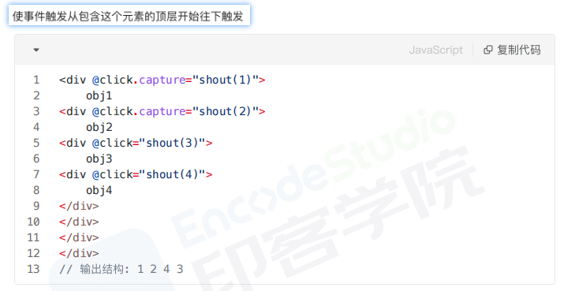  |
| `passive`                                                              | 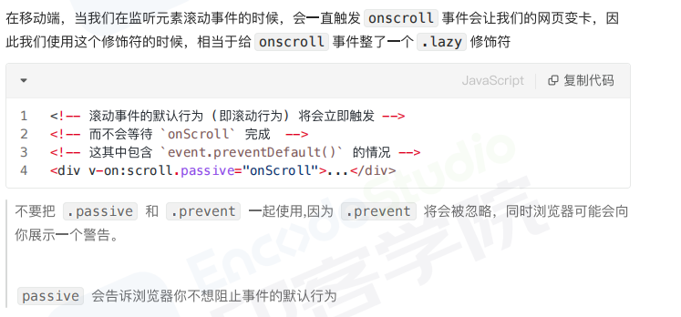  |
| [`native`](https://blog.csdn.net/u011690675/article/details/129736921) | 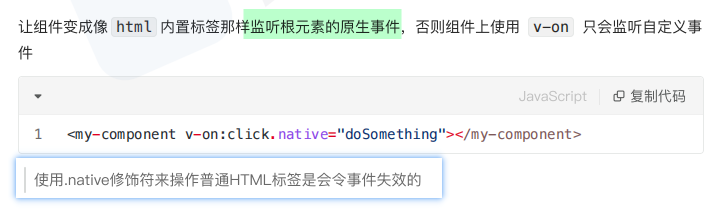 |

### 鼠标修饰符

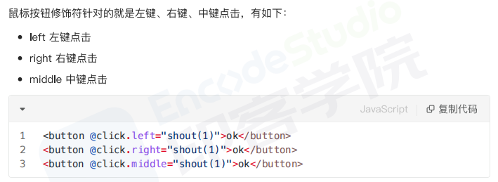

### 键盘修饰符

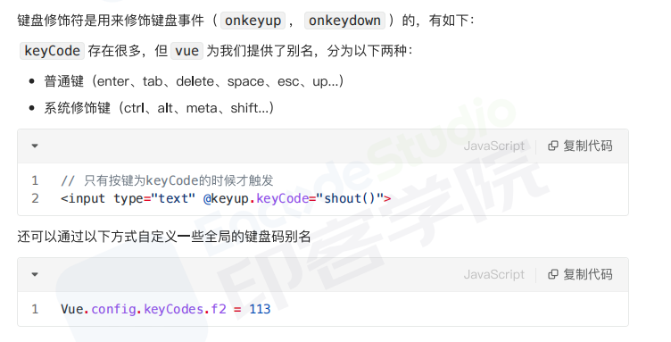

## 【Vue 中的$nextTick 有什么作用?】


- nextTick 参数相关的有两个
  - 第一个参数为:回调函数(可以获取最近的 DOM 结构)
  - 第二个参数为:执行函数上下文（`textContent`）

```js{2,4}
this.message = ' '
console.log(this.$el.textContent) // => '原始的值 '
this.$nextTick(function () {
  console.log(this.$el.textContent) // => '修改后的值'
})
```

### 原理

- 可以理解成，Vue 在更新 DOM 时是**异步执行**的。当数据发生变化，Vue 将开启一个异步更新队列，视图需要**等队列中所有数据变化完成之后，再统一进行更新**
  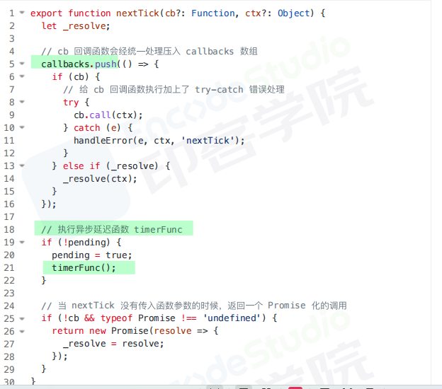
  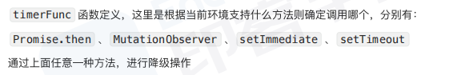
  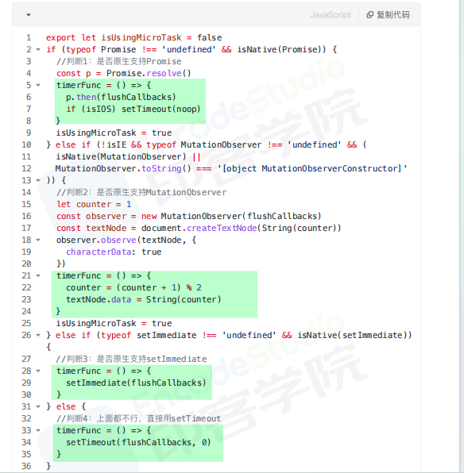
  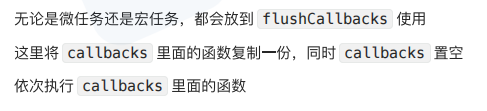
  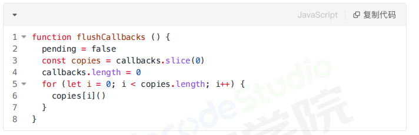
- 小结:
  1. 把回调函数放入 `callbacks` 等待执行
  2. 将执行函数放到**微任务或者宏任务**中
  3. 事件循环到了微任务或者宏任务，**执行函数依次执行 callbacks 中的回调**
