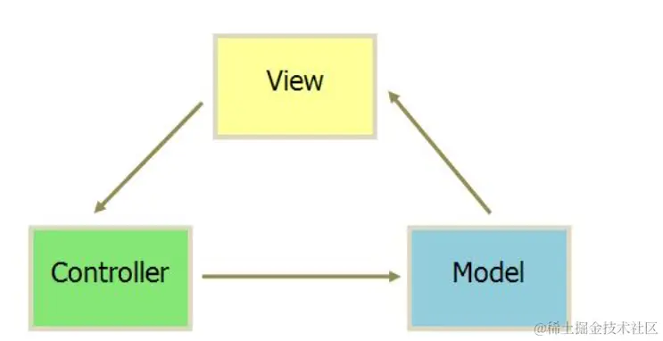
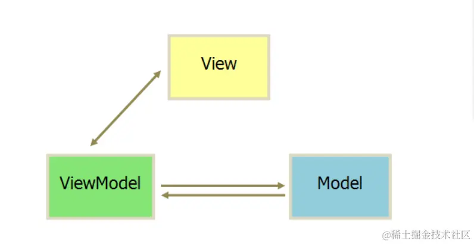
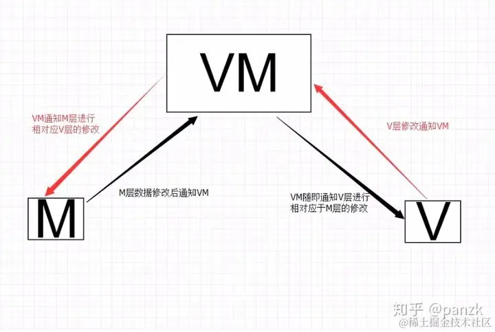

<!--
 * @Description:
 * @Date: 2025-01-07 17:42:07
 * @LastEditTime: 2025-01-07 17:56:30
-->

## （一） MVC

### 1. MVC 组成：

**MVC 思想** ：Controller 负责将 Model 的数据用 View 显示出来。

| MVC                    | 解释                                                                                                                                               |
| ---------------------- | -------------------------------------------------------------------------------------------------------------------------------------------------- |
| ① Model（模型）        | 是应用程序中**用于处理应用程序数据逻辑**的部分。 通常模型对象负责**在数据库中存取数据**。处理数据的 crud                                        |
| ② View（视图）         | 是应用程序中处理**数据显示**的部分。通常视图是依据模型数据创建的。视图层，前端                                                                     |
| ③ Controller（控制器） | 是应用程序中处理**用户交互**的部分。 **控制器负责从视图读取数据，控制用户输入，并将数据发送给模型。** 一般包括业务处理模块和 router 路由模块 |

### 2. MVC 优点：

- **耦合度低**（运用 MVC 的应用程序的三个部件是相互独立的，改变其中一个不会影响其他两个）；
- 重用性高（多个视图可以使用同一个模型）
- 生命周期成本低
- 部署快（业务分工明确）
- **可维护性高**

### 3. MVC 缺点：

- 不适合小型项目开发
- **视图与控制器联系过于紧密**，妨碍了它们的独立重用

## （二） M V VM——视图模型双向绑定（谈谈你对 M V VM 开发模式的理解）

### 1. MVVM 组成：

MVVM 由 Model，View，ViewModel 三部分构成。

| M V VM    | 解释                                                                                        |
| --------- | ------------------------------------------------------------------------------------------- |
| Model     | 代表数据模型（Vue 的 data），**数据和业务逻辑**都在 Model 层中定义；                        |
| View      | 代表 UI 视图，负责**数据的展示**（Vue 的 el）；                                             |
| ViewModel | 是一个对象，负责**监听 Model 中数据的改变**并且**控制 View 视图的更新**，处理用户交互操作； |

- **Model** 和 **View** 并无直接关联，而是通过 **ViewModel** 来进行交互的（即双向数据绑定），
- **Model** 和 **ViewModel**之间有着**双向数据绑定的联系**。\
  View 的变化可以引起 Model 的变化，Model 的变化也可以引起 View 变化（类似于浅拷贝）。`ViewModel`是`View`和`Model`层的桥梁，数据会绑定到`viewModel`层并自动将数据渲染到页面中，视图变化的时候会通知`viewModel`层更新数据。

### 2. MVVM 优点：

- 低耦合：
  - 视图（View）可以独立于 Model 变化和修改，**一个 Model 可以绑定到不同的 View 上**，
  - 当 View 变化的时候 Model 可以不变化，当 Model 变化的时候 View 也可以不变；
- 可重用性：你可以把一些视图逻辑放在一个 Model 里面，让很多 View 重用这段视图逻辑。
- 独立开发：**双向数据绑定的模式，实现了 View 和 Model 的自动同步，因此开发者只需要专注对数据的维护操作即可，而不需要一直操作 dom。**\
  可以实现双向绑定的标签：Input，textarea，select 标签等（可以输入或改变标签内容的标签）

## \[ 延伸问题 ]

### （1）MVC 与 MVVM 有什么区别 ⭐⭐⭐⭐⭐

- MVVM 和 MVC 都是一种设计思想。
- MVVM 与 MVC 最大的**区别**就是：它实现了**View 和 Model 的自动同步**
  - 当 Model 属性改变时，不用手动操作 Dom 元素去改变 View 的显示。
  - 而改变属性后，该属性对应 View 的显示会自动改变

### [（2）阐述一下你所理解的 MVVM 响应式原理](https://juejin.cn/post/7108350109481435144)⭐⭐⭐⭐⭐

---

> 参考链接：
>
> - [ MVC 与 MVVM 模式的区别](https://blog.csdn.net/weixin_53186633/article/details/123697268)
