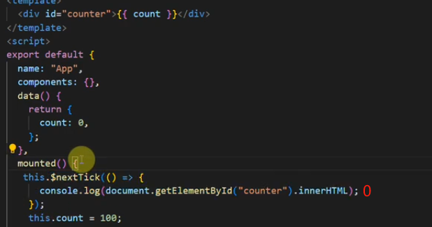

# [nextTick](https://www.bilibili.com/video/BV1YM411w7Zc/?spm_id_from=333.788.videopod.episodes&vd_source=9d75580d0b23d1137d56e03a996ac726&p=36)

## 【nextTick 作用】

> 官方解释  
> 在下次 DOM 更新循环结束之后执行延迟回调。在修改数据之后立即使用这个方法，获取更新后的 DOM

- 我们可以理解成，Vue 在更新 DOM 时是**异步执行**的。
- 当数据发生变化，vue 并不会立刻去更新 Dom ，而是开启一个**异步更新队列**，将**修改数据的操作**放在了一个异步操作队列中.（如果我们一直修改相同数据，异步操作队列还会进行**去重**）
- 等待**同一事件循环**中的**所有数据变化完成**之后，会将队列中的事件拿来进行处理，统一进行 D0M 的更新
- **nextTick 本质是一种优化策略**
- nextTick 参数相关的有两个
  - 第一个参数为:回调函数(可以获取最近的 DOM 结构)
  - 第二个参数为:执行函数上下文（`textContent`）

```js{2,4}
this.message = ' '
console.log(this.$el.textContent) // => '原始的值 '
this.$nextTick(function () {
  console.log(this.$el.textContent) // => '修改后的值'
})
```

## 【源码解析】

- `callbacks` 也就是**异步操作队列**
- `callbacks` 收集完回调函数后又执行了 `timerFunc` 函数，
- `pending` 是用来标识**同一时间只能执行一次 callbacks**，
  - 当这一轮`callbacks`中的回调**还没被执行**，后面的回调将放到下一轮 `callbacks` 中去执行。
  - 每轮执行完时都会清空一次`callbacks`，然后 `pending` 设为 `false`
- `timerFunc` 函数定义，用来根据当前环境支持什么方法来确定调用哪个，分别有:` Promise.then``、MutationObserver `、`setImmediate`、`setTimeout`通过其中任意一种方法，进行**降级操作**

### nextTick

```js{4,17,18,19}
export function nextTick(cb?: Function, ctx?: Object) {
  let _resolve
  // 将回调函数先存到异步操作队列callbacks中
  callbacks.push(() => {
    if (cb) {
      // cb try-catch
      try {
        cb.call(ctx)
      } catch (e) {
        handleError(e, ctx, 'nextTick')
      }
    } else if (_resolve) {
      _resolve(ctx)
    }
  })
  // timerFunc
  if (!pending) {
    pending = true// pending是用来标识同一时间只能执行一次 callbacks，
    timerFunc() //降级将回调函数放入异步队列中
  }
  // nextTick Promise
  if (!cb && typeof Promise !== 'undefined') {
    return new Promise((resolve) => {
      _resolve = resolve
    })
  }
}
```

### timerFunc 降级操作

```js{3,12,30,39}
export let isUsingMicroTask = false
// 【判断环境是否支持 Promise】
if (typeof Promise !== 'undefined' && isNative(Promise)) {
  // 1 Promise
  const p = Promise.resolve()
  timerFunc = () => {
    p.then(flushCallbacks)
    if (isIOS) setTimeout(noop)
  }
  isUsingMicroTask = true
}
// 【判断环境是否支持 MutationObserver】
else if (
  !isIE &&
  typeof MutationObserver !== 'undefined' &&
  (isNative(MutationObserver) || MutationObserver.toString() === '[object MutationObserverConstructor]')
) {
  // 2 MutationObserver
  let counter = 1
  const observer = new MutationObserver(flushCallbacks)
  const textNode = document.createTextNode(String(counter))
  observer.observe(textNode, {
    characterData: true
  })
  timerFunc = () => {
    counter = (counter + 1) % 2
    textNode.data = String(counter)
  }
  isUsingMicroTask = true
} // 【判断环境是否支持 setImmediate】
else if (typeof setImmediate !== 'undefined' && isNative(setImmediate)) {
  timerFunc = () => {
    setImmediate(flushCallbacks)
  }
} else {
  // 【都不支持的话用setTimeout】
  // 4 setTimeout
  timerFunc = () => {
    setTimeout(flushCallbacks, 0)
  }
}
```

### flushCallbacks

- 无论是微任务还是宏任务，都会放到 flushCallbacks 使用
- 这里将 callbacks 里面的函数**复制一份**，同时 callbacks 置空
- 依次执行 callbacks 里面的函数

```js{2,4}
function flushCallbacks() {
  pending = false // 重置，表示当前轮的callbacks已经被执行
  const copies = callbacks.slice(0)//将 callbacks 里面的函数复制一份
  callbacks.length = 0//callbacks 置空
  for (let i = 0; i < copies.length; i++) {
    copies[i]()
  }
}
```

## 【nextTick 示例】

- 数据是同步修改的，**视图是异步更新的**
- nextTick 本身不是一个异步方法，而是用来将里面的回调放到异步队列里面，这样可以保证用户的同步代码执行后，再进行操作
- 响应数据更新的时候，会触发数据拦截`set`，然后通知 `watcher` 实例执行回调函数更新
- **因为 vue 中 dom 的 更新是异步的**，所以所有 watcher 的回调操作**会被放入异步操作队列中**
- 如果 nextTick 在数据修改前执行，则 watcher 在队列中的执行顺序就会在 nextTick 后面，所以 nextTick 也拿不到修改后的内容
- **所以 nextTick 需放在数据修改后执行**



- 假设有如下 count 变量

```js{3}
data(){
  return {
    count: 0
  }
}
```

- 想执行 nextTick，再修改数据：拿不到正确 dom

```js{3,6}
mounted() {
  // nextTick的回调先进入异步操作队列：queue队列=[nextTick]
  this.$nextTick(() => {
    console.log(document.getElementById('counter').innerHTML) // 最后执行拿到结果0
  })
  // watcher的回调操作后进入异步操作队列
  this.count = 100 // queue队列=[nextTick,watcher1]
  this.count = 200 // queue队列=[nextTick,watcher1,watcher2]
  this.count = 300 // queue队列[nextTick,watcher1,watcher2,watcher3]
  // nextTick先被执行，所以拿不到正确的DOM
}
```

- 想修改数据，再执行 nextTick：拿到正确 dom

```js{2,3,8}
mounted() {
  // 数据修改会触发数据拦截set，进而通知watcher执行回调，
  // 因为vue的dom更新是异步的，所有watcher的回调操作先进入异步操作队列
  this.count = 100 // queue队列=[watcher1]
  this.count = 200 // queue队列=[watcher1,watcher2]
  this.count = 300 // queue队列[watcher1,watcher2,watcher3]

  // nextTick的回调后进入异步操作队列
  // queue队列=[watcher1,watcher2,watcher3,nextTick]
  this.$nextTick(() => {
    console.log(document.getElementById('counter').innerHTML) // 最后执行拿到结果300
  })
}
```

- 如果没有 nextTick 更新机制，那么 count 每次更新值都会触发视图更新(上面这段代码也就是会更新 3 次视图)，有了 nextTick 机制，只需要更新一次，**所以 nextTick 本质是一种优化策略**

## 【小结】

1. 把 nextTick 中的回调函数放入异步操作队列 `calbacks`中等待执行
2. 将执行函数 `calbacks` 放到微任务或者宏任务中
3. 事件循环到了微任务或者宏任务，执行函数依次执行 `callbacks` 中的回调
