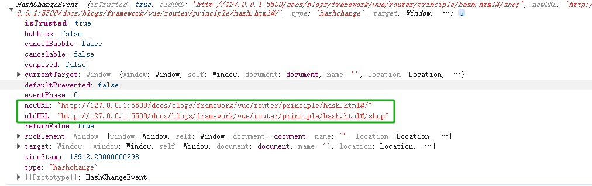

# 使⽤浏览器原⽣ hash 或 history 路由来组织⻚⾯路由

## hash 模式

- 详见`hash.html`
- hash 模式改变 URL 中的 hash 部分不会引起页面刷新

### 实现思路

- 通过监听 `hashchange` 事件监听 URL 的变化
- `hashchange`事件可以获取到**变化前后的 url**(包含 hash 值)：
  ```js
  window.addEventListener('hashchange', this.refresh, false)
  ```
  
- 下列 3 种情况改变 URL 都会触发 `hashchange` 事件
  - 通过浏览器前进后退触发`popstate`改变 URL;
  - 通过`<a>`标签改变 URL;
  - 通过 `window.location` 改变 URL;

### 实现代码

```js{6,8,10,20,21,26,25,37}

class VueRouter {
  constructor(routes = []) {
    this.routes = routes // 路由映射
    this.currentHash = '' // 当前的hash
    this.refresh = this.refresh.bind(this)
    // 监听页面加载load
    window.addEventListener('load', this.refresh, false)
    // 监听hashchange事件
    window.addEventListener('hashchange', this.refresh, false)
  }

  // 【hash路由切换时刷新页面】
  refresh(event) {
    console.log('【 refresh-路由切换 】-19', event)
    // URL hash发生改变的时候，拿到当前的hash
    let newHash = ''
    let oldHash = null
    if (event.newURL) {
      oldHash = getUrlPath(event.oldURL || '') // 旧的路由
      newHash = getUrlPath(event.newURL || '') // 新的路由
    } else {
      newHash = getUrlPath(window.location.hash)
    }
    this.currentHash = newHash
    this.matchComponent() // 匹配路由对应的页面
  }
  // 【匹配路由对应的页面】
  matchComponent() {
    let curRoute = this.routes.find((route) => route.path === this.currentHash)
    console.log('【 curRoute 】-91', curRoute)
    if (!curRoute) {
      // 当前URL中的hash不存在的时候，默认取第一个，当然真实场景下，可能会有各种情况，取决于业务逻辑
      curRoute = this.routes.find((route) => route.path === '/')
    }
    const { component } = curRoute
    document.querySelector('#content').innerHTML = component
  }
}
// 【获取路径】
function getUrlPath(url) {
  const index = url.indexOf('#')
  const hash = index >= 0 ? url.slice(index + 1) : '/' // 获取hash
  return hash
}
```

```html{10,55,65}
<!DOCTYPE html>
<html lang="en">

<head>
  <meta charset="UTF-8" />
  <meta http-equiv="X-UA-Compatible" content="IE=edge" />
  <meta content="width=device-width,initial-scale=1,maximum-scale=1,user-scalable=no,viewport-fit=cover"
    name="viewport" />
  <title>实现简单的hash路由</title>
  <script src="./hash.js"></script>
  <style>
    * {
      margin: 0;
      padding: 0;
      box-sizing: border-box;
    }

    html,
    body {
      height: 100%;
    }

    #content {
      height: calc(100vh - 50px);
      display: flex;
      align-items: center;
      justify-content: center;
      font-size: 3em;
    }

    #nav {
      height: 50px;
      position: fixed;
      left: 0;
      bottom: 0;
      width: 100%;
      display: flex;
    }

    #nav a {
      width: 25%;
      display: flex;
      justify-content: center;
      align-items: center;
      border: 1px solid black;
    }

    #nav a:not(:last-of-type) {
      border-right: none;
    }
  </style>
</head>

<body>
  <main id="content"></main>
  <nav id="nav">
    <a href="#/">首页</a>
    <a href="#/shop">tab1</a>
    <a href="#/shopping-cart">tab2</a>
    <a href="#/mine">tab3</a>
  </nav>
</body>

<script>
  const router = new VueRouter([
    {
      path: '/',
      name: 'home',
      component: '<div>首页内容</div>'
    },
    {
      path: '/shop',
      name: 'shop',
      component: '<div>tab1内容</div>'
    },
    {
      path: '/shopping-cart',
      name: 'shopping-cart',
      component: '<div>tab2内容</div>'
    },
    {
      path: '/mine',
      name: 'mine',
      component: '<div>tab3内容</div>'
    }
  ])
</script>
</html>
```

## history 模式

- 详见`history.html`

### 实现思路

1. 重写 `history.pushState()` 和 `history.replaceState()` ⽅法来添加和修改浏览器历史条⽬。
1. 监听 `pushState`，获取当前的 URL 的路径，⼿动匹配和渲染对应的组件。
1. 通过**浏览器前进后退**改变 URL 时会触发 `popstate` 事件，侦听 `popstate` 事件来响应浏览器历史的变化。
   > 通过`pushState/replaceState`或`<a>`标签改变 URL 不会触发 `popstate` 事件

### 实现代码

- js

```js{6,7,8,10,16,18,29,34,38,41,47,57}
class VueRouter {
  constructor(routes = []) {
    this.routes = routes // 路由映射
    this.currentPath = '' // 当前的hash
    this.refresh = this.refresh.bind(this)
    history.pushState = this._wr('pushState') // 重写history.pushState
    history.replaceState = this._wr('replaceState') // 重写history.replaceState方法
    this.addEventListener()
    // 监听浏览器的前进后退改变
    window.onpopstate = (event) => {
      this.refresh(event)
    }
  }
  // 【重写history.pushState和history.replaceState方法】可以触发 window.addEventListener
  _wr(type) {
    let orig = history[type] //调用原来的history.pushState和history.replaceState方法
    return function () {
      let rv = orig.apply(this, arguments) // arguments为37行执行时传入的参数
      let e = new Event(type) // 创建函数
      e.arguments = arguments
      // 调用 dispatchEvent() 是触发一个事件的最后一步。
      // 被触发的事件应事先通过 Event() 构造函数创建并初始化完毕。
      window.dispatchEvent(e)
      return rv // 返回重写后的方法
    }
  }
  // 【添加事件监听】
  addEventListener() {
    window.addEventListener('load', this.refresh, false)
    // 给按钮添加事件,点击时切换路径
    this.routes.forEach((route) => {
      const target = document.querySelector(route.target)
      target.addEventListener('click', () => {
        history.pushState({ state: 1 }, null, route.path) // 因为pushState被重写了，所以这里触发的是重写的pushState
      })
    })
    // 通过监听pushState来获取路由变化
    window.addEventListener('pushState', (e) => {
      console.log('【 pushState 】-43', e)
      //监听pushState自定义事件，拿到上面通过pushState传入的参数，做出对应的页面渲染，
      this.refresh(e)
    })
  }
  // 【路由切换时刷新页面】
  refresh(event) {
    this.currentPath = getUrlPath()
    this.matchComponent() // 匹配路由对应的页面
  }
  // 【切换页面组件】
  matchComponent() {
    let curRoute = this.routes.find((route) => route.path === this.currentPath)
    if (!curRoute) {
      // 当前URL中的hash不存在的时候，默认取第一个，具体取决于业务逻辑
      curRoute = this.routes.find((route) => route.path === '/')
    }
    const { component } = curRoute
    document.querySelector('#content').innerHTML = component
  }
}
// 获取路由
function getUrlPath() {
  const path = window.location.pathname
  return path
}
```

- html

```html{8,50,59}
<!DOCTYPE html>
<html lang="en">

<head>
  <meta charset="UTF-8" />
  <meta http-equiv="X-UA-Compatible" content="IE=edge" />
  <title>实现简单的history路由</title>
  <script src="./history.js"></script>
  <style>
    * {
      margin: 0;
      padding: 0;
      box-sizing: border-box;
    }

    html,
    body {
      height: 100%;
    }

    #content {
      height: calc(100vh - 50px);
      display: flex;
      align-items: center;
      justify-content: center;
      font-size: 3em;
    }

    #nav {
      height: 50px;
      position: fixed;
      left: 0;
      bottom: 0;
      width: 100%;
      display: flex;
    }

    #nav button {
      width: 25%;
      display: flex;
      justify-content: center;
      align-items: center;
      border: 1px solid black;
    }

  </style>
</head>

<body>
  <main id="content"></main>
  <nav id="nav">
    <button id="button1">button1</button>
    <button id="button2">button2</button>
    <button id="button3">button3</button>
    <button id="button4">button4</button>
  </nav>
</body>
<script>
  const router = new VueRouter([
    {
      target: '#button1',
      path: '/',
      name: 'home',
      component: '<div>首页内容</div>'
    },
    {
      target: '#button2',
      path: '/shop',
      name: 'shop',
      component: '<div>tab1内容</div>'
    },
    {
      target: '#button3',
      path: '/shopping-cart',
      name: 'shopping-cart',
      component: '<div>tab2内容</div>'
    },
    {
      target: '#button4',
      path: '/mine',
      name: 'mine',
      component: '<div>tab3内容</div>'
    }
  ])
</script>

</html>
```
