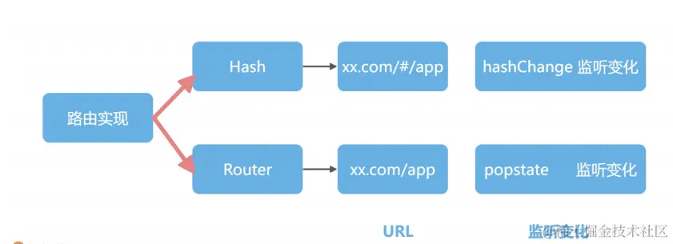
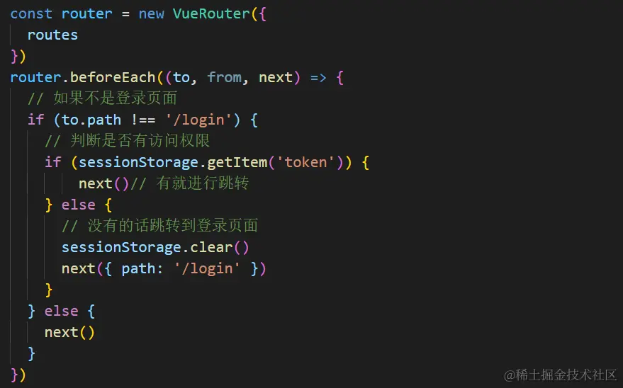

# vue-router

- vue-router 是基于路由和组件：路由用户设定访问路径，将路径和组件映射起来；
- **在 vue-router 的单页面应用中，页面的路径改变就是组件的切换。**

## （一）[Vue-router 的模式](https://blog.csdn.net/CC1991_/article/details/124521845)



### 1. [hash 模式 ](https://juejin.cn/post/7127143415879303204#heading-2)

- [实现模拟](/blogs/framework/vue/router/principle.html)
- hash 也就是`#`，它是 URL 的锚点，表示的是**网页中的一个位置**\
  hash 的特点：它的改变**不会导致页面重新加载**，只是会触发 hashchange 事件
- 监听`hashchange`事件实现前端路由，利用 url 中的 hash 来模拟一个 hash，以保证**url 改变时，页面不会重新加载**，也就是**单页面应用**了。
- vue-router 默认使用`hash` 模式，所以在路由加载的时候，项目中的 `url` 会自带 `#`。
- **hash 模式是通过锚点值的改变，根据不同的值，渲染指定的 DOM 位置上不同的数据。**
- hash 模式会创建`hashHistory`对象，在访问不同路由的时候，会发生两个操作：
  - ① `HashHistory.push()`将新的路由添加到浏览器访问的历史的栈顶；
  - ② `HasHistory.replace()`替换到当前栈顶的路由。

### 2. history 模式

如果不想使用 `#`， 可以使用 `vue-router` 的另一种模式 `history`

> - 需要注意的是，当我们启用 `history` 模式的时候，由于我们的项目是一个**单页面应用**，所以在路由跳转的时候，就会出现**访问不到静态资源而出现 `404` 的情况**，
> - 因为**没有当前的真正路径**，要想解决这一问题需要后端配合，**将不存在的路径重定向到入口文件**。
> - 这时候就需要服务端增加一个覆盖所有情况的候选资源：如果 `URL` 匹配不到任何静态资源，则应该返回同一个 `index.html` 页面

- 通过`pushState` 和 `replaceState`这两个 API，我们可以改变 URL 地址，并且浏览器不会向后端发送请求
- 浏览前进后退，会触发 `popstate` 事件
- 通过这两个 API 和 通 `popstate` 事件，我们就能⽤另外⼀种⽅式实现前端路由。

```js
new Router({
  mode: 'history',
  routes: []
})
```

## （二）[vue 路由传参的三种基本方式](https://www.jianshu.com/p/d276dcde6656)

### 1. 路由 path + id

特点：页面刷新数据不会丢失

（1）路由配置：`path: '/particulars/:id`，使用`:/id` 来传递参数

```js{2}
{
    path: '/particulars/:id',//用:/id 来传递参数
    name: 'RouteName',
    component: ViewComponent
}
```

（2）使用方式：直接调用`$router.push`实现携带参数的跳转

```js{4}
this.$router.push({
    path: `/particulars/${id}`, //直接调用$router.push 实现携带参数的跳转
})
```

（3）路由参数获取：`this.$route.params`

```js
this.$route.params.id
```

### 2. params 传值

特点：页面刷新数据会丢失

（1）路由配置：

```js{2}
  {
      path: '/particulars',//跳转时使用 params 来携带参数
      name: 'RouteName',
      component: ViewComponent
    }
```

（2）使用方式：通过路由属性中的 `name` 来确定匹配的路由，通过 `params` 来传递参数。

```js{3}
this.$router.push({
  name: 'RouteName', // name来确定匹配的路由
  params: {
    id //通过params来传递参数。
  }
})
```

（3）获取参数：`this.$route.params.id `

```js
this.$route.params.id
```

### 3. query 传值

特点： 页面刷新数据不会丢失，query 传递的参数会**显示在 url 后面?id=？**

（1）路由配置：路由配置：

```js
 {
      path: '/particulars',
      name: 'RouteName',
      component: ViewComponent
    }
```

（2）使用方式：使用 `path` 来匹配路由，然后通过 `query` 来传递参数，这种情况下

```js{3}
this.$router.push({
  path: '/particulars',
  query: {
    id: id //通过query来传递参数
  }
})
```

（3）获取参数：`this.$route.query.id`

```js
this.$route.query.id
```

### 4. name+params

可以根据 name 匹配对应的路由，然后 query 传参，

```js{2,3}
router.push({
  name: 'OceanOrderAddOrEdit',
  query: {
    id
  }
})
```

`特别注意哦， 组件中 获取参数的时候是 route.params 而不是 router`

## （三）Vue-router 有哪几种钩子函数

| 属性                 | 说明                                                                                                             | 示例                              |
| -------------------- | ---------------------------------------------------------------------------------------------------------------- | --------------------------------- |
| ①`beforeEach`        | 参数有：<br/> ● to(Route 路由对象)<br/>● from(Route 路由对象)<br/>● next(function 函数) 一定要调用才能进行下一步 |  |
| ②`afterEach`         |                                                                                                                  |                                   |
| ③`beforeRouterLeave` |                                                                                                                  |                                   |

## （四）谈谈你对 vue-router 的 keep-alive 的理解

### 1. 原理

- `Vue.js`内部将`DOM`节点抽象成了一个个的`VNode`节点， `keep-alive`组件的缓存也是基于`VNode`节点的而不是直接存储`DOM`结构。
- 它将满足条件`（pruneCache与pruneCache）`的组件在`cache`对象中缓存起来，在需要重新渲染的时候再将`vnode`节点从`cache`对象中取出并渲染。

### 2. 作用

实现组件缓存，保持这些组件的状态，以避免反复渲染导致的性能问题。 适合需要缓存组件 频繁切换，不需要重复渲染的情况

### 3.场景

tabs 标签页 后台导航，vue 性能优化

### 4. 使用

- keep-alive 可以实现组件缓存，当组件切换时不会对当前组件进行卸载。
- 常用的两个属性 `include/exclude`，允许组件**有条件的进行缓存。**

### 5. 两个生命周期

`activated/deactivated`，用来得知当前组件**是否处于活跃状态**。

- keep-alive 的中还运用了 LRU(Least Recently Used)算法。
  - keep-alive 有一个最大缓存限制，使用的是 LRU 算法（最久未使用法，使用了就放到最上边，先删最下边）
- router-view 也是一个组件,如果直接被**包在 keep-alive 里面**,所有路径匹配到的视图组件都会被缓存
