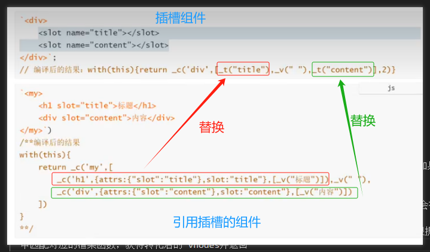

# [插槽的实现原理](https://www.bilibili.com/video/BV1YM411w7Zc?spm_id_from=333.788.videopod.episodes&vd_source=9d75580d0b23d1137d56e03a996ac726&p=29)

**`slot` 本质上是返回 `VNode` 的函数**，一般情况下，Vue 中的组件要渲染到页面上需要经过`template -> render function -> VNode -> DOM `过程，原理如下

## 【默认插槽&具名插槽】

<!--  -->

### 1. 编译插槽组件

- 假设有如下插槽组件

```vue
<!-- SlotTest -->
<template>
  <div>
    <slot name="title"></slot>
    <slot name="content"></slot>
  </div>
</template>
```

- 编译时会转换成如下的渲染函数
  - `_v`表示穿件普通文本节点,
  - `_t(插槽名称,[slots节点的默认值])`表示渲染插槽的函数,获取插槽转化后的 vNode

```js{6,7,8}
function with(this) {
  return _c(
    'div',// 父节点标签
    // 子节点chidren
    [
      _t('title'), // _t表示渲染插槽的函数，对应<slot name="title"></slot>
      _v(' '), //换行符
      _t('content') // _t表示渲染插槽的函数，对应<slot name="content"></slot>
    ],
    2
  )
}

```

<!--  -->

### 2. 编译插槽的父组件

- 当组件 Test 使用 SlotTest 时

```vue{3,4}
<!-- Test -->
<template>
  <SlotTest>
    <h1 slot="title">标題</h1>
    <div slot="content">内容</div>
  </SlotTest>
</template>
```

- 编译时会转换成如下的渲染函数
  - `_c(父组件标签名,属性,子节点)`

```js{10,11,17}
function with() {
  // _c(父组件标签名,属性,子节点)
  return _c('SlotTest',
    // children
    [
      // 对应<h1 slot="title">标題</h1>
      _c('h1',
        // 属性
        {
          attrs: { "slot": "title" },//对应h1上的属性，因为最终不需要渲染到真实dom上，所以在resolveSlots方法中会被移除
          slot: "title"//记录插槽名称
        },
        [_v("标题")] // 子节点-文本节点
      ),
      _v("  "),// 换行符
      // 对应<div slot="content">内容</div>
      _c('div', { attrs: { "slot": "content" }, slot: "content" }, [_v('内容')])
    ])
}
```

### 3. 然后执行 resolveSlots 函数

父组件使用插槽时，会调用`resolveSlots` 函数会对父组件中的 children 节点做归类和过滤处理，返回 `slots`，并调用函数最终得到`$scopedSlots`

```js{5,11,17,18,19,25,34}
function resolveSlots(children, context) {
  if (!children || !children.length) {
    return {}
  }
  var slots = {} //保存组件中的所有插槽渲染函数
  for (var i = 0, l = children.length; i < l; i++) {
    var child = children[i]
    var data = child.data
    // remove slot attribute if the node is resolved as a Vue slot node
    if (data && data.attrs && data.attrs.slot) {
      delete data.attrs.slot //对应attrs: { "slot": "title" }，因为最终不需要渲染到真实dom上，所以移除
    }
    // named slots should only be respected if the vnode was rendered in the same context.
    if ((child.context === context || child.fnContext === context) && data && data.slot != null) {
      var name = data.slot
      var slot = slots[name] || (slots[name] = [])
      // 如果是tempalte元素，则把template的children添加进数组中，这也就是为什么你写的template标签并不会渲染成另一个标签到
      if (child.tag === 'template') {
        slot.push.apply(slot, child.children || [])
      } else {
        slot.push(child)
      }
    } else {
      // 如果没有就默认是default
      ;(slots.default || (slots.default = [])).push(child)
    }
  }
  // ignore slots that contains only whitespace
  for (var name$1 in slots) {
    if (slots[name$1].every(isWhitespace)) {
      delete slots[name$1] //删除空数据
    }
  }
  return slots
}
```

### 4. `_t`匹配插槽的渲染函数

`_t` 函数会根据插槽名称，去当前作用域的所有`$scopedSlots` 中获取对应的渲染插槽内容的函数，如果存在插槽渲染函数，则执行插槽渲染函数，生成 nodes 节点返回，否则使用插槽的默认值

- `renderSlot`即`_t`函数
- `_t`(插槽名称,[slots 节点的**默认值**])

```js{3,6}
function renderSlot(name, fallback, props, bindObject) {
  // 匹配渲染插槽内容的函数
  var scopedSlotFn = this.$scopedSlots[name]
  var nodes
  // 如果存在插槽渲染函数，则执行插槽渲染函数，生成nodes节点返回// 否则使用默认值
  nodes = scopedSlotFn(props) || fallback
  return nodes
}
```

### 5. 总结

- 父组件使用插槽时，会对组件中的 children 节点做**归类和过滤处理**，过滤出所有插槽类型的渲染函数，并存到对象 `$scopedSlots` 中
- 当编译插槽组件时，插槽组件本身会被转化成包含`_t`的渲染函数,
- `_t` 根据插槽名称去`$scopedSlots`中匹配对应的渲染函数，用匹配的内容替换当前的 slot 占位
- 最终得到完整的 vNode 进行渲染



## 【作用域插槽】

作用域插槽中父组件能够得到子组件的值是因为在 `renderSlot` 的时候执行会传入 props ，也就是上述 t 第三个参数，父组件则能够得到子组件传递过来的值

### 1. 编译插槽组件

- 假设有如下插槽组件

```html
<div>
  <slot :article="{ title: '标题', content: '内容' }"></slot>
</div>
```

- 编译时会转换成如下的渲染函数

```js{6}
function with(this) {
  return _c('div',
    [
      _t("default", null,
        // 插槽的参数
        { "article": { title: '标题', content: '内容' } }
      )
    ],
    2)
}
```

### 2. 编译插槽的父组件

- 当父组件使用 SlotTest 时

```vue{4}
<!-- Test -->
<template>
  <SlotTest>
    <template v-slot="{ article }">
      <hl>{{ article.title }}</hl>
      <div>{{ article.content }}</div>
    </template>
  </SlotTest>
</template>
```

- 编译时会转换成如下的渲染函数

```js{6,7}
function with(this) {
  return _c('SlotTest', {
    scopedSlots: _u([{
      key: "default",
      // 作用域插槽的渲染函数，等待插槽组件渲染时调用并传参，在子组件内部完成渲染
      fn: function ({ article }) {
        // 返回vNode
        return [
          _c('h1', [_v(_s(article.title))]),
          _c('div', [_v(_s(article.content))])
        ]
      }
    }])
  })
}
```

## 【普通插槽和作用域插槽的区别】

普通插槽，渲染在父级，作用域插槽在组件内部渲染

- 普通插槽是在父组件完成当前组件的 vNode 渲染后，然后替换子组件对应的 slot 占位符
- 作用域插槽是将父组件的渲染内容**编译成返回 vNode 的函数**，这个函数会接收子组件的传参，等到子组件渲染的时候，会调用父组件的渲染函数并传值，得到最终的 vnode 来替换掉 slot 占位符
