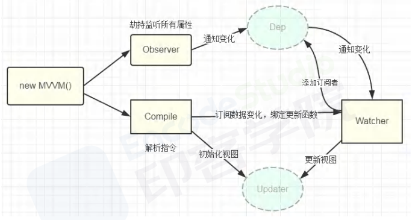
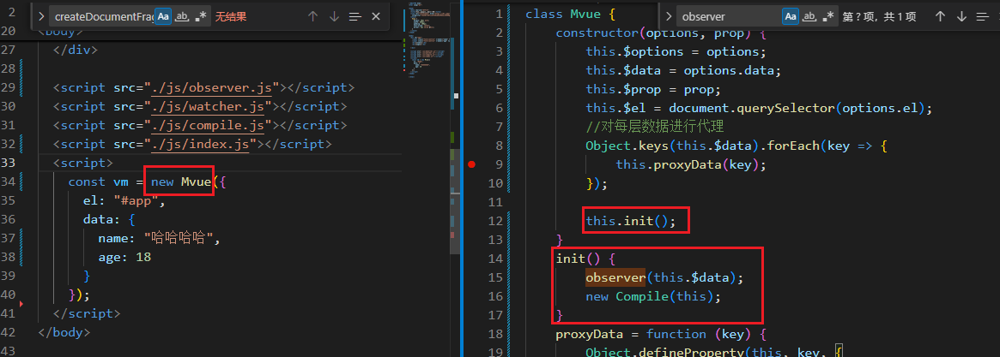
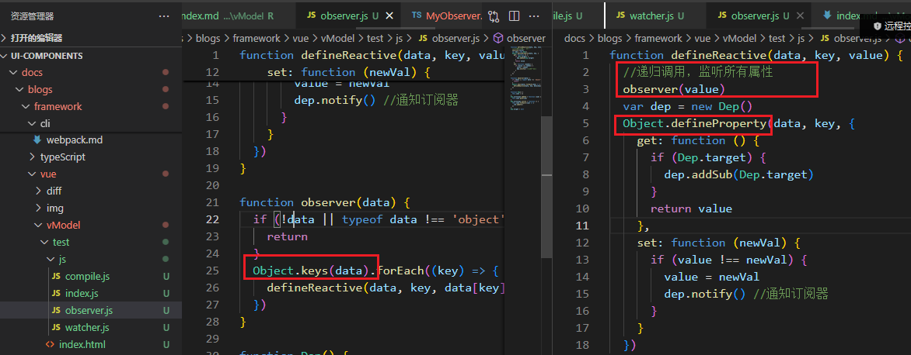
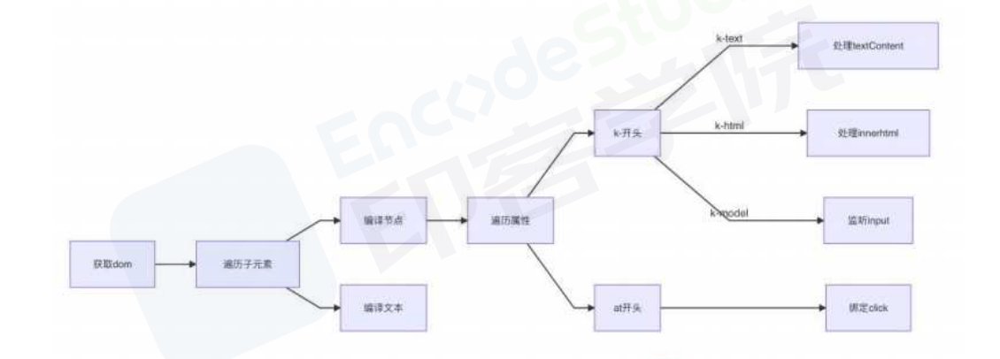
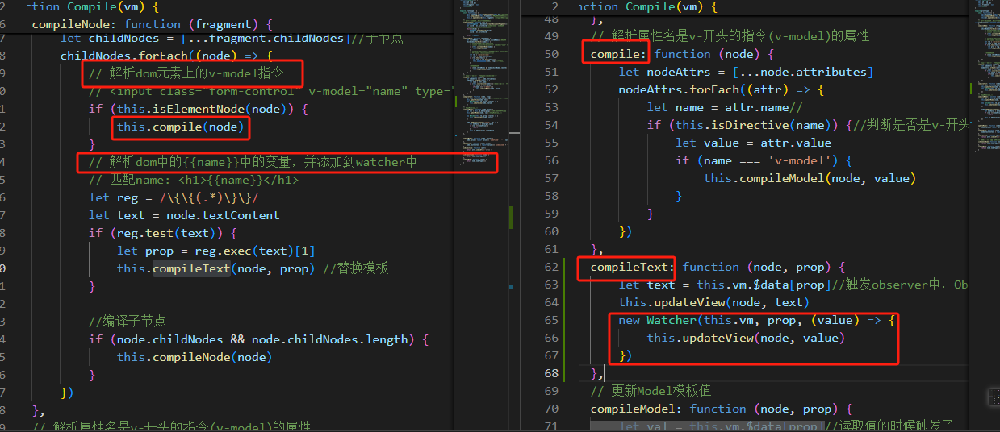
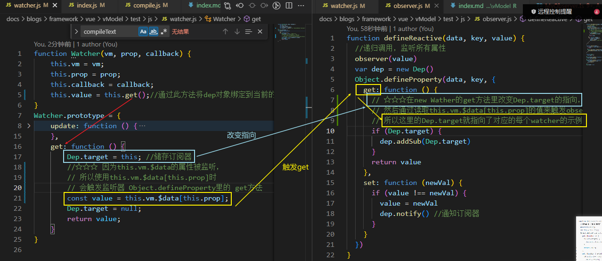
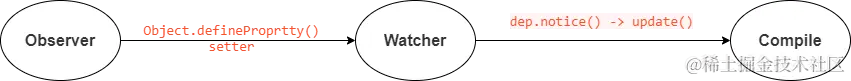

## 【vue 的双向绑定的原理】

vue 是采用**数据劫持**+**发布者-订阅者模式**的方式：

- 通过`Object.defineProperty()`来劫持各个属性的 getter 和 setter；
  > vue3 是通过`new Proxy()`来劫持各个属性的 setter，getter
- 当获取某个属性值时，会触发该属性的 getter，发布者就可以将该属性加入**订阅者的集合管理数组 dep**中，
- 当更新某个属性值时，就会触发该属性的 setter，发布者可以调用`dep.notice()`方法，通知订阅者调用**自身**的 `update()` 方法，更新视图
  > 订阅者就是 Watcher，依赖收集器 dep 中的 subs

## 【数据劫持】

检测 data 变化的核心 API：`Object.defindeProperty`

- enumerable：属性是否可枚举，默认为 false。
- configurable：属性是否可配置 ，默认为 false。
  ::: example
  blogs/framework/vue/vModel/defineProperty
  :::

```js{9,19}
const dep = new Dep() // 依赖收集器
// 劫持并监听所有属性
Object.defineProperty(obj, key, {
  enumerable: true, //属性是否可枚举
  configurable: false, //属性是否可配置
  get() {
    console.log('触发get')
    // 订阅数据变化时，在Dep中添加订阅者
    Dep.target && dep.addSub(Dep.target) //用到这个数据的时候就添加监听
    return value
  },
  set: (newVal) => {
    console.log('触发set')
    if (newVal !== value) {
      this.observe(newVal)
      value = newVal
    }
    // 告诉Dep通知变化，通知视图更新...
    dep.notify()
  }
})
//测试
const data = {}
let name = '张三'
console.log(data.name) // 获取数据的时候会触发get  张三
data.name = '李四' // 赋值的时候会触发set
```

这样就可以实现数据的获取和赋值的监听

## 【发布者-订阅者模式】 ⚄

- data 中每一个数据都绑定一个 Dep，这个 Dep 中都存有所有用到该数据的**订阅者**
- 当数据改变时，发布消息给 dep（依赖收集器），去通知每一个订阅者，做出对应的回调函数

```js{9,21,25,26}
// 订阅者
class Watcher {
  // name模拟使用属性的地方
  constructor(name, cb) {
    this.name = name
    this.cb = cb
  }
  // 更新
  update() {
    console.log(this.name + '更新了')
    this.cb() //做出更新回调
  }
}
// 发布者（依赖收集器）
class Dep {
  constructor() {
    this.subs = [] //订阅者
  }
  // 添加订阅者
  addSubs(watcher) {
    this.subs.push(watcher)
  }
  // 当有数据更新时，通知每一个订阅者做出更新
  notify() {
    this.subs.forEach((w) => {
      w.update() //每个订阅者Watcher自身有一个update()方法
    })
  }
}
// --------------------------示例------------------------------------
// 假如现在用到age的有三个地方
let w1 = new Watcher('我{{age}}了', () => {
  console.log('更新age')
})
let w2 = new Watcher('v-model:age', () => {
  console.log('更新age')
})
let w3 = new Watcher('I am {{age}} years old', () => {
  console.log('更新age')
})
//添加订阅者
let dep = new Dep()
dep.addSubs(w1)
dep.addSubs(w2)
dep.addSubs(w3)

// 在Object.defineProperty 中的 set中运行 ☆
dep.notify()
```

## 【原理解析】

<!-- ### （1）简化版：

- Vue2.x
  - 简单来说，就是**数据劫持** + **发布者-订阅者**模式实现，通过`object.defineproperty()`来劫持各属性的`getter`和`setter`，在数据变更时通知订阅者，触发相应的监听回调，实现视图更新。
- Vue3.0
  - vue.js 是采用数据劫持结合发布者-订阅者模式的方式，通过`new Proxy()`来劫持各个属性的 setter，getter，在数据变动时发布消息给订阅者，触发相应的监听回调 -->

<!--- 对每个 vue 属性使用`objecet.defineproperty()`来劫持各属性的 getter 和 setter，每个属性分配一个**订阅者集合管理数组 dep**；
- **订阅者来自 `compile`**，一旦数据改变，通知 watcher 绑定更新函数，同时**向 dep 添加订阅者**；
- 当 dep 接到 observer 变化时，会通知 watcher，watcher 调用**update()方法**，触发 compile 绑定的**回调**，视图更新。 -->




### 1. Observe（响应化处理）

- Observer 的核心是通过`Object.defineProprtty()`来监听数据的变动;
- `new Vue`的时候调用`Observe`方法，对 data 对象进行**递归遍历**，通过 `Object.defineProperty`方法给每个属性都加上 `setter` 和 `getter` ；
- 每当数据发生变化，就会触发 `setter`。这时候 Observer 就要通知订阅者(`dep.notify()`)，订阅者就是 dep 里面的 Watcher
  

```js{8,9,10,19}
// docs\blogs\framework\vue\vModel\test\js\observer.js
function defineReactive(data, key, value) {
  //递归调用，监听所有属性
  observer(value)
  var dep = new Dep()
  Object.defineProperty(data, key, {
    get: function () {
      // ☆☆☆在new Wather的get方法里改变Dep.target的指向，
      // 然后再通过读取this.vm.$data[this.prop]的值来触发这里的observe中的get，
      // 所以这里的Dep.target就指向了对应的每个watcher的实例
      if (Dep.target) {
        dep.addSub(Dep.target)
      }
      return value
    },
    set: function (newVal) {
      if (value !== newVal) {
        value = newVal
        dep.notify() //通知订阅器
      }
    }
  })
}

function observer(data) {
  if (!data || typeof data !== 'object') {
    return
  }
  Object.keys(data).forEach((key) => {
    defineReactive(data, key, data[key])
  })
}

function Dep() {
  this.subs = []
}
Dep.prototype.addSub = function (sub) {
  this.subs.push(sub)
}
Dep.prototype.notify = function () {
  this.subs.forEach((sub) => {
    sub.update()
  })
}
Dep.target = null
```

### 2. Compile（解析模板指令）

> `document.createDocumentFragment()`:文档片段,是一种轻量级的临时容器，用于在内存中构建和操作 DOM 结构，然后一次性插入到文档中，从而提高性能和效率。

- Compile（指令解析器）主要做的事情是**解析模板指令**,对每个元素节点的指令进行扫描跟解析,根据指令模板替换数据,以及绑定相应的更新函数
- **将模板`{ { } }`中的变量替换成数据**(对模板中的变量进行`new Wather`)，然后初始化**渲染页面视图**
- 并将每个指令对应的节点**绑定更新函数(`update`)**，添加监听数据的订阅者，**一旦数据有变动，收到通知，更新试图**
  
  

```js{10,11,12,28,31,33,39,55,64,65}
// 解析el中的所有'{{}}'中的变量并添加到wather监听
function Compile(vm) {
  this.vm = vm
  this.el = vm.$el
  this.fragment = null
  this.init()
}
Compile.prototype = {
  init: function () {
    this.fragment = this.nodeFragment(this.el) //将dom节点转成虚拟的文档片段
    this.compileNode(this.fragment) //重新渲染文档片段，解析更新值
    this.el.appendChild(this.fragment) //解析完成挂载到真实dom中,一次性插入到文档中
  },
  // 【将真实Dom节点转成虚拟的文档片段】
  nodeFragment: function (el) {
    const fragment = document.createDocumentFragment() //创建文档片段
    let child = el.firstChild //获取el下的所有子节点
    //将子节点，全部移动文档片段里
    while (child) {
      fragment.appendChild(child)
      child = el.firstChild
    }
    return fragment
  },
  compileNode: function (fragment) {
    let childNodes = [...fragment.childNodes] //子节点
    childNodes.forEach((node) => {
      // 解析dom元素上的v-model指令
      // <input class="form-control" v-model="name" type="text">
      if (this.isElementNode(node)) {
        this.compile(node)
      }
      // 解析dom中的模板{{name}}中的变量，并添加到watcher中
      // 匹配name: <h1>{{name}}</h1>
      let reg = /\{\{(.*)\}\}/
      let text = node.textContent
      if (reg.test(text)) {
        let prop = reg.exec(text)[1]
        this.compileText(node, prop) //替换模板
      }
      //编译子节点
      if (node.childNodes && node.childNodes.length) {
        this.compileNode(node)
      }
    })
  },
  // 【解析属性名是v-开头的指令(v-model)的属性】
  compile: function (node) {
    let nodeAttrs = [...node.attributes]
    nodeAttrs.forEach((attr) => {
      let name = attr.name //
      if (this.isDirective(name)) {
        //判断是否是v-开头的指令
        let value = attr.value
        if (name === 'v-model') {
          this.compileModel(node, value)
        }
      }
    })
  },
  compileText: function (node, prop) {
    let text = this.vm.$data[prop] //触发observer中，Object.defineProperty里的 get方法
    this.updateView(node, text)
    new Watcher(this.vm, prop, (value) => {
      this.updateView(node, value)
    })
  },
  // 【更新Model模板值】
  compileModel: function (node, prop) {
    let val = this.vm.$data[prop] //读取值的时候触发了  Object.defineProperty的get
    this.updateModel(node, val) //更新Model模板值
    new Watcher(this.vm, prop, (value) => {
      this.updateModel(node, value)
    })
    node.addEventListener('input', (e) => {
      let newValue = e.target.value
      if (val === newValue) {
        return
      }
      this.vm.$data[prop] = newValue // 触发set
    })
  },
  updateModel: function (node, value) {
    node.value = typeof value == 'undefined' ? '' : value
  },
  updateView: function (node, value) {
    node.textContent = typeof value === 'undefined' ? '' : value
  },
  isDirective: function (attr) {
    return attr.indexOf('v-') !== -1
  },
  // 代表是一个 元素 节点，例如 <p> 和 <div>
  isElementNode: function (node) {
    return node.nodeType === 1
  },
  isTextNode: function (node) {
    return node.nodeType === 3
  }
}
```

### 3. Watcher（通信桥梁）

- Watcher 订阅者是 Observer 和 Compile 之间通信的桥梁，主要做的事情是:
  - 在自身实例化时往`属性订阅器(dep)`里面添加自己(实例化的时候触发 get)
  - 自身必须有一个`update()`方法
  - 待属性变动调用`dep.notice()`通知时，能调用自身的`update()`方法，并触发`Compile`中绑定的回调

> **初始化`new Vue`时，对 this.vm.$data 的属性进行了数据拦截监听，所以在`new Watcher` 时，通过`this.get`方法，先改变 dep 的指向，再通过使用`this.vm.$data[this.prop]`读取值触发数据拦截的 get，就可以将对应的 watcher 实例添加到 deps 中**




```js{6,13,17,18,19,20,21,22}
class Watcher {
  constructor(vm, prop, callback) {
    this.vm = vm;
    this.prop = prop;
    this.callback = callback;
    this.value = this.get();//通过此方法将全局Dep.target对象绑定到当前的watcher实例上
  }
  update() {
    const value = this.vm.$data[this.prop];
    const oldVal = this.value;
    if (value !== oldVal) {
      this.value = value;
      this.callback(value);//执行回调函数
    }
  }
  get() {
    Dep.target = this; // 将Dep.target绑定到当前watcher的实例
    // ☆☆☆ 因为this.vm.$data中的属性被监听，
    // 所以使用this.vm.$data[this.prop]时
    // 会触发监听器 Object.defineProperty里的 get方法
    const value = this.vm.$data[this.prop];//触发Object.defineProperty里的 get方法
    Dep.target = null;
    return value;
  }
}
```

### 总结

- MVVM 作为绑定的入口，整合 Observer,Compile 和 Watcher 三者，
  - Observer 来监听自己的 model 数据变化
  - 通过 Compile 来解析编译模板指令
  - 最终利用 Watcher 搭起 Observer 和 Compile 之间的通信桥梁
  - 达到**数据变化 Observer=>视图更新**；**视图交互变化=>数据 model 变更**的双向绑定效果。
    

## [【Vue 是如何监听数组的？】](https://wenku.baidu.com/view/3feb2167bd1e650e52ea551810a6f524cdbfcb41.html)⚄

- 首先第一点是要看数组里面是不是还存在对象，如果存在对象的话再进行深层遍历看是否还依然存在对象，再把对象进行 `defineProperty监听`。
- 在将数组处理成响应式数据后，如果使用数组原始方法改变数组时，数组值会发生变化，但是并不会触发数组的 setter 来通知所有依赖该数组的地方进行更新，
- 为此，vue 通过**重写**数组的`push、pop、shift、unshift、splice、sort、reverse`七种方法来监听数组变化，重写后的方法中会手动触发通知该数组的所有依赖进行更新。

---

> 参考文章：\
> [Vue 双向绑定原理，教你一步一步实现双向绑定](https://juejin.cn/post/6844903698166988808#heading-4)
