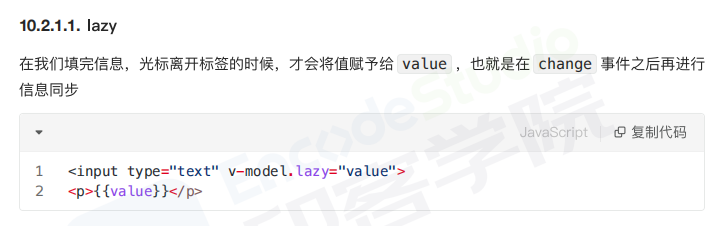
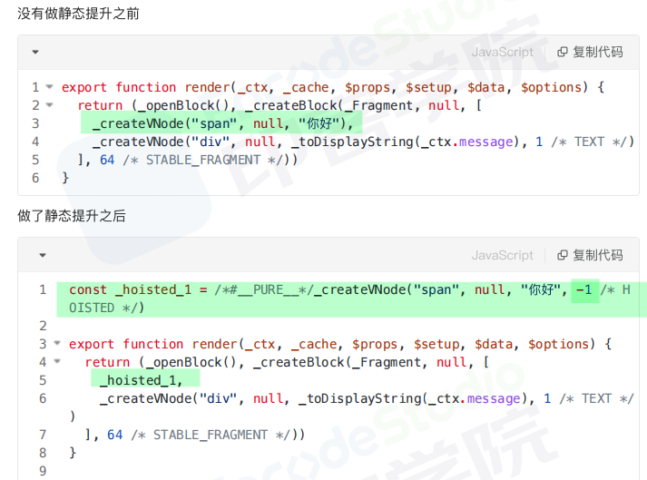
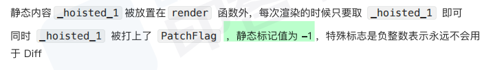
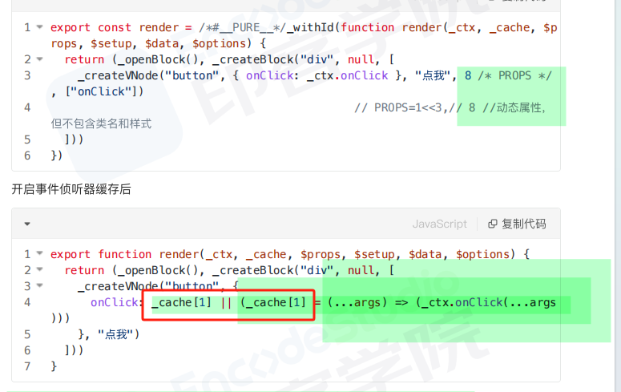
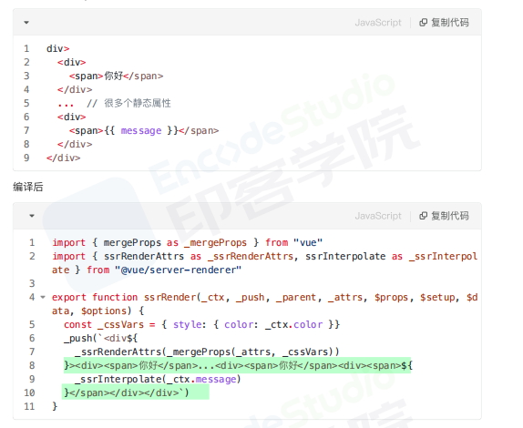

# VU3

## 【Vue3.0 所采用的 `Composition Api`与 Vue2.x 使用的 `Options Api` 有什么不同?】

- `Options Api`：当组件的逻辑比较复杂时，会更加的**碎片化**，在处理单个逻辑关注点时，我们必须不断地“跳转”相关代码的选项块，这种碎片化使得理解和维护复杂组件变得困难
- 在 Vue3 Composition API 中，组件**根据逻辑功能来组织**的，一个功能所定义的所有 API 会放在一起(更加的**高内聚，低耦合**)

## 【Vue3.0 性能提升主要是通过哪几方面体现的?】

### 1.编译阶段

- 回顾 Vue2 ，我们知道每个组件实例都对应一个 watcher 实例，它**会在组件渲染的过程中把用到的数据 property 记录为依赖，当依赖发生改变，触发 setter ，则会通知 watcher ，从而使关联的组件重新渲染**
- Vue3 在编译阶段，做了进一步优化。主要有如下:

#### (1)diff 算法优化——增加静态标记

- vue3 在 diff 算法中相比 vue2 增加了**静态标记**
- 关于这个静态标记，其作用是为了**会发生变化的地方添加一个 flag 标记**，下次发生变化的时候直接找该地方进行比较
  下图这里，已经标记静态节点的 p 标签在 diff 过程中则不会比较，把性能进一步提高
  

#### (2)静态提升——不参与更新的元素，只会被创建一次

Vue3 中对不参与更新的元素，会做静态提升，**只会被创建一次，在渲染时直接复用，这样就免去了重复的创建节点**，大型应用会受益于这个改动，免去了重复的创建操作，优化了运行时候的内存占用



#### (3)事件监听缓存



#### SSR 优化

- 当静态内容大到一定量级时候，会用 createStaticVNode 方法在客户端去生成一个 static node，这些静态 node ，**会被直接 innerHtml(直接以 html 的形式返回)，** 就不需要创建对象，然后根据对象渲染
  

### 2.源码体积

相比 Vue2 ， Vue3 整体体积变小了，**除了移出一些不常用的 AP!**，再重要的是 Tree shanking 任何一个函数，如 ref、reavtived、computed 等，**仅仅在用到的时候才打包**，没用到的模块都被摇掉，打包的整体体积变小

### 3.响应式系统

- vue2 中采用 defineProperty 来劫持整个对象，然后进行深度遍历所有属性，给每个属性添加 getter 和 setter，实现响应式
- vue3 采用 proxy 重写了响应式系统，因为 **proxy 可以对整个对象进行监听**，所以不需要深度遍历
  - 可以监听动态属性的添加
  - 可以监听到数组的索引和数组 length 属性
  - 可以监听删除属性

## 【Vue3.0 里为什么要用 Proxy API 替代 defineProperty API ?】

### defineProperty API 的问题

- 检测不到对象属性的**添加和删除**
- **数组 API**方法无法监听到
- 需要对每个属性进行遍历监听，如果嵌套对象，需要深层监听，造成性能问题

### Proxy

- Proxy 的监听是**针对一个对象**的，那么对这个对象的所有操作会进入监听操作，这就完全可以代理所有属性了

  ::: example
  blogs/framework/vue/myreactive
  :::

- [Reflect.get()](https://blog.csdn.net/dingshuo168/article/details/137891732)  
   Reflect.get() 是 JavaScript 的一个内置方法，它用于获取对象上某个属性的值。与直接使用点（.）或方括号（[]）访问属性的方式类似

```js{6,12}
function myReactive(obj) {
  if (typeof obj !== 'object' && obj != null) {
    return obj
  }
  // Proxy相当于在对象外层加拦截
  const observed = new Proxy(obj, {
    get(target, key, receiver) {
      const res = Reflect.get(target, key, receiver)//类似于obj.key
      console.log(`获取${key}:${res}`)
      // return res //这里直接return 复杂嵌套（ state2.bar.a ）无法触发set
      // 解决嵌套无法进入代理set的问题，需要在 get 之上再进行一层代理 myReactive(res)
      return typeof res == 'object' ? myReactive(res) : res
    },
    set(target, key, value, receiver) {
      const res = Reflect.set(target, key, value, receiver)
      console.log(`设置${key}:${value}`)
      return res
    },
    deleteProperty(target, key) {
      const res = Reflect.deleteProperty(target, key)
      console.log(`删除${key}:${res}`)
      return res
    }
  })
  return observed
}
```

### 总结

- `Object.defineProperty` 只能遍历对象属性进行劫持
- Proxy 直接**可以劫持整个对象**，并**返回一个新对象**，我们可以只操作新的对象达到响应式目的
- Proxy 可以直接监听数组的变化(`push`、`shift` 、`splice` )
- Proxy 有多达 13 种拦截方法,不限于 apply、ownKeys、deleteProperty、has 等等，这是 Object.defineProperty 不具备的,正因为 defineProperty 自身的缺陷，导致 Vue2 在实现响应式过程需要实现其他的方法辅助(如重写数组方法、增加额外 set、delete 方法)
- Proxy 不兼容 IE，也没有 polyfill，defineProperty 能支持到 IE9

## 【Vue 3.0 中 Treeshaking 特性?】

- `Tree shaking` 是一种通过**清除多余代码**方式来优化项目打包体积的技术，
- 在 Vue2 中，无论我们使用什么功能，它们最终都会出现在生产代码中。主要原因是 **Vue 实例在项目中是单例的**，捆绑程序无法检测到该对象的哪些属性在代码中被使用到

```js
import Vue from 'vue'
Vue.nextTick(() => {})
```

- 而 Vue3 源码引入 tree shaking 特性，将全局 API 进行分块。如果您**不使用其某些功能，它们将不会包含在您的基础包中**

```js
import { nextTick, observable } from 'vue'
nextTick(() => {})
```

- 通过 Tree shaking ,Vue3 给我们带来的好处是:
  - 减少程序体积(更小)
  - 减少程序执行时间(更快)
  - 便于将来对程序架构进行优化(更友好)
