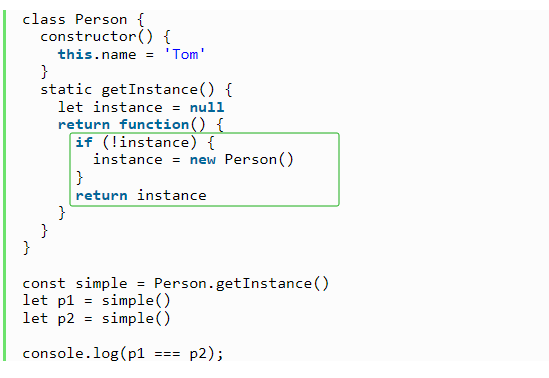

## （一）什么是闭包

- 闭包指的是那些了**引用另一个函数作用域中的变量**的**函数**，通常是在**嵌套函数**中实现的
- 函数执行后**返回结果是一个内部函数**，并**被外部变量所引用**，如果**内部函数**持有**被执行函数作用域的变量**，即形成了闭包。

## （二）闭包的作用

<!-- 1.  -->
<!-- 使用闭包，一可以**读取函数内部中的变量**，使变量不会被垃圾回收机制回收 -->
<!-- 避免命名冲突：二可以将函数中的变量存储在内存中，**保护变量不被污染**（如避免命名冲突）。 -->

1. **封装数据和保持状态**：闭包可以将变量和函数封装在一个作用域内，避免全局变量的污染；
1. **实现私有变量** ‌：闭包可以在函数内部创建局部变量，并将其保留在内存中，即使函数执行完毕
1. ‌ **内存管理** ‌：闭包通过引用外部变量的方式，可以在内部函数中访问到**外部函数的作用域**（通过外部传参的形式），使得函数能够在其生命周期内持有对外部环境的“引用”或“状态”，‌ 这对于内存管理非常有帮助

## （三）闭包的优缺点

### 1. 优点

- 可以在内部函数访问到外部函数作用域。
- **避免变量污染全局**
- 把变量存到独立的**作用域**，作为私有成员存在

### 2. 缺点

- **会导致内存泄漏**
  - 对内存消耗有负面影响。因内部函数保存了对外部变量的引用，导致**无法被垃圾回收**，增大内存使用量，所以使用不当会导致内存泄漏
  - `当不需要使用闭包时，要及时释放 内存，可将内层函数对象的变量赋值为null。`
- 对处理速度具有负面影响。  
   （闭包的层级决定了引用的外部变量在查找时经过的作用域链长度）
- 可能获取到意外的值(captured value)

## （四）闭包原理

**函数执行分成两个阶段：预编译阶段和执行阶段**

- 在预编译阶段，如果发现**内部函数使用了外部函数的变量，则会在内存中创建一个“闭包”对象并保存对应变量值，如果已存在“闭包”，则只需要增加对应属性值即可**。
- 执行完后，函数执行上下文会被销毁，函数对“闭包”对象的引用也会被销毁，但其内部函数还持用该“闭包”的引用，所以内部函数可以继续使用“外部函数”中的变量

利用了 **`函数作用域链的特性`，一个函数 内部定义的函数 如果引用了外部函数中的变量， 那这个外部函数中的变量`会被添加到它的作用域链中`**，函数执行完毕，其执行作用域链销毁，但因内部函数的作用域链仍然在引用这个活动对象，**所以其活动对象不会被销毁**，直到内部函数被烧毁后才被销毁。

## （五）闭包的应用

### 1. [防抖和节流](/blogs/javaScript/code/debounce/)

### 2. for 循环中的保留 i

- 在循环中创建闭包，防止取到意外的值。

如下代码，无论哪个元素触发事件，都会弹出 3。**因为函数执行后引用的 i 是同一个**，而 i 在循环结束后就是 3

> ‌ 因为 var 没有块级作用域 ‌。可以在同一作用域内多次声明同一个 var 变量，所以重复声明**会被重新赋值**

```js{1,2,10,13}
// 可以在同一作用域内多次声明同一个var变量，重复声明会被重新赋值
for (var i = 0; i < 3; i++) {
  document.getElementById('id' + i).onfocus = function () {
    alert(i)
  }
}
//可用闭包解决
function makeCallback(num) {
  return function () {
    alert(num) //内部函数持有被 执行函数作用域的变量 num,num无法被销毁
  }
}
for (var i = 0; i < 3; i++) {
  document.getElementById('id' + i).onfocus = makeCallback(i)
}
```

### 3. 设计模式中的[单例模式](https://www.jb51.net/javascript/325589hcn.htm)

单例模式需要以下特性：

- 唯一实例：保证类在整个应用程序中**只有一个实例**。
- 全局访问：提供一个全局访问点来获取这个唯一实例。
  

### 4. 模块封装

- 在各模块规范出现之前，都是用这样的方式防止变量污染全局。

```js{2,6}
var Yideng = (function () {
  var foo = 0 // 这样声明为模块私有变量，外界无法直接访问
  // 1. 创建一个引用内部作用域变量的函数
  function Yideng() {}
  Yideng.prototype.bar = function bar() {
    return foo // 2. 引用内部作用域的变量
  }
  return Yideng // 3. 返回这个引用内部作用域变量的函数
})()
```

<!-- ### 5.函数柯里化 -->
