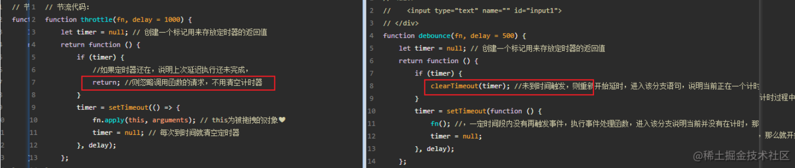

# 什么是防抖？什么是节流

## 1. [节流 throttle ](https://www.bilibili.com/video/BV1cv411r7HQ?p=64)：`n 秒内重复触发，只执行一次`

> - n 秒内只运行一次，若在 n 秒内重复触发，只有一次生效 `if(timer){ return }`
> - 节流是限制函数在**某段时间内只能执行一次**，或者说每隔一段时间执行一次。
> - 如果在指定的时间间隔内再次触发该事件，函数调用将被忽略，直到时间间隔过去后才会执行下一次调用。
> - 其跟防抖的主要区别在于 保证了函数是有规律的执行，每 xx 毫秒执行一次。
> - 节流适用于需要以固定的速率处理事件的情况，比如**滚动事件**、**鼠标移动**事件等。

::: example
blogs/javaScript/throttle
:::

- 节流函数的实现原理是
  - 将即将被执行的函数用定时器延时一段时间后执行；
  - 如果定时器还在，说明上次延迟执行还未完成，则**忽略调用函数的请求**（return）；
  - 节流函数接受**两个参数**，第一个是 **需要被延时执行的函数**，第二个是**需要延迟的时间**。
- 代码：

```js{6,9,19}
function throttle(fn, delay = 1000) {
    let timer = null; // 创建一个标记用来存放定时器的返回值
    return function () {
        //如果定时器还在，说明上次延迟执行还未完成，
        if (timer) {
             return; //则忽略调用函数的请求，不用清空计时器
        }
        timer = setTimeout(() => {
            fn.apply(this, arguments); // this为被拖拽的对象❤
            timer = null; // 每次到时间就清空定时器
        }, delay);
    };
}

// ----------------- 节流测试 -----------------
const dragdiv = document.getElementById('dragdiv'); // 节流函数
dragdiv.addEventListener(
    'drag',
    throttle(function (e) {
        console.log(e.offsetX, e.offsetY);
    })
);

```

## 2. [防抖 debounce ](https://www.bilibili.com/video/BV1cv411r7HQ?p=63)：`n 秒内重复触发，则重新计时`

- n 秒后再执行该事件，**若在 n 秒内被重复触发，则重新计时**`if(timer){ clearTimeout(timer) }`
- 当持续触发事件时，一定时间段内没有再触发事件，事件处理函数才会执行一次；
- 如果设定的时间到来之前，又一次触发了事件，就重新开始延时；
- 可以理解为多个相同的事件最后只执行一次。
- 防抖适用于需要等待一段时间后进行操作的情况，比如**用户输入搜索框**、**窗口大小**调整等。

::: example
blogs/javaScript/debounce
:::

- **代码：**

```js{5}
function debounce(fn, delay = 500) {
  let timer = null // 创建一个标记用来存放定时器的返回值
  return function () {
    if (timer) {
      clearTimeout(timer) //未到时间触发，则重新开始延时，进入该分支语句，说明当前正在一个计时过程中，并且又触发了相同事件。所以要取消当前的计时，重新开始计时
    }
    timer = setTimeout(function () {
      fn() //，一定时间段内没有再触发事件，执行事件处理函数，进入该分支说明当前并没有在计时，那么就开始一个计时 //fn.apply(this, arguments);
      timer = null
    }, delay)
  }
}

// ----------- 防抖测试 -----------------
const input1 = document.getElementById('input1') // 防抖函数
input1.addEventListener(
  'keyup',
  debounce(function () {
    console.log('input1.value:', input1.value)
  })
)
```
## 3.代码的关键区别

- 节流 ：n 秒内重复触发，只执行一次`if(timer){ return }`
- 防抖 ：n 秒内重复触发，则重新计时`if(timer){ clearTimeout(timer) }`

## 4. 完整版代码




### (1) 节流

```js{3,5,8,10,17,21}
// ---------------------------------------------------------节流 ，时间戳版
function throttle(fn, wait) {
  let previous = 0
  return function () {
    let now = Date.now()
    let _this = this
    let args = arguments
    if (now - previous > wait) {
      fn.apply(_this, arguments)
      previous = now
    }
  }
}

// ---------------------------------------------------------节流 ，定时器版
function throttle2(fn, wait) {
  let timer
  return function () {
    let _this = this
    let args = arguments
    if (!timer) {
      timer = setTimeout(() => {
        timer = null
        fn.apply(_this, arguments)
      }, wait)
    }
  }
}
```

### (2) 防抖

```js{6,20,25,39}
// ---------------------------------------------------------防抖函数
function debounce(func, delay) {
  let timeout
  return function () {
    let arg = arguments
    if (timeout) clearTimeout(timeout)
    timeout = setTimeout(() => {
      func(arg)
    }, delay)
  }
}

// ---------------------------------------------------------立即执行防抖函数
function debounce2(fn, delay) {
  let timer
  return function () {
    let args = arguments
    if (timer) clearTimeout(timer) //重新计时，但是定时器还在

    let immediate = !timer //立即执行,还没启动定时器前先执行一次
    timer = setTimeout(() => {
      timer = null
    }, delay)
    //还没启动定时器前先执行一次
    if (immediate) {
      fn(args)
    }
  }
}
// ---------------------------------------------------------立即执行防抖函数+普通防抖
function debounce3(fn, delay, immediate) {
  let timer

  return function () {
    let args = arguments
    let _this = this
    if (timer) clearTimeout(timer)

    if (immediate) {
      let callNow = !timer
      timer = setTimeout(() => {
        timer = null
      }, delay)

      if (callNow) {
        fn.apply(_this, args)
      }
    } else {
      timeout = setTimeout(() => {
        func.apply(_this, arguments)
      }, delay)
    }
  }
}
```
