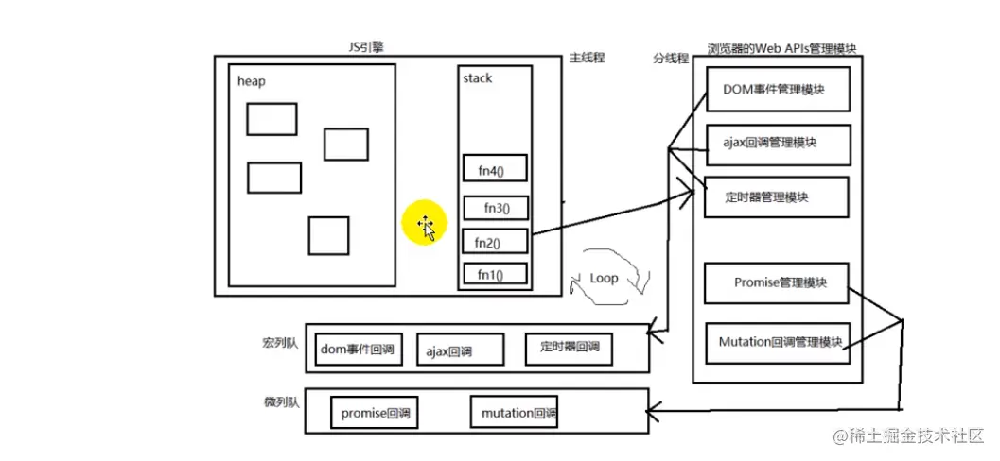

## 进程和线程的区别

|          | 进程                                                                                     | 线程                                                                             |
| -------- | ---------------------------------------------------------------------------------------- | -------------------------------------------------------------------------------- |
| 关系     |                                                                                          | 线程是进程中执行运算的最小单位，是进程中的一个实例                               |
| 是什么   | 进程是拥有资源的基本单位                                                                 | 线程是调度和分配资源的基本单位                                                   |
| 并发执行 | 不同进程间可以并发执行                                                                   | 同一进程不同线程可以并发执行                                                     |
| 资源     | 每个进程只能访问系统分配给自己的资源<br>但可以通过 IPC 机制进行进程间通信                | 线程不拥有资源，但可以访问它所在进程的资源<br>线程之间可以共享所属进程的数据     |
| 阻塞性   | 进程与进程之间相互隔离<br>这保证了当一个进程挂起或崩溃时，<br>不会影响其他进程的正常运行 | 只要某个线程执行出错，将会导致整个进程崩溃                                       |
| 资源回收 | 进程所占用的资源会在其关闭后由操作系统回收                                               | 即使进程中存在某个线程产生的内存泄漏，<br>当进程退出时，相关的内存资源也会被回收 |

## 事件循环（Event loop）

事件循环也就是 Event loop， 是 JavaScript 或 Node 为解决单线程代码执行不阻塞主进程一种机制，也就是我们所说的异步原理。事件循环负责执行代码、收集和处理事件以及执行队列中的子任务。

### 是什么(JavaScript 运行机制)

1. 整体的 `script`(作为第一个宏任务)开始执行的时候，会把所有代码分为两部分：**“同步任务”、“异步任务”**；
2. 同步任务会直接进入主线程依次执行；
3. 异步任务会再分为**宏任务**(进入宏任务队列) 和 **微任务**(进入微任务队列)。
4. 当主线程内的任务执行完毕（主线程为空时），会检查微任务的任务队列，如果有任务，就进入主线程全部执行，如果没有就从宏任务队列读取下一个宏任务执行；
5. **每执行完一个宏任务就清空一次微任务队列，再开始下一个宏任务**，此过程会不断重复，这就是 `Event Loop`。

### 原理



1. `js执行的优先级：同步 > 微队列 > 宏队列`
1. js 中用来**存储待执行回调函数**的队列包含 2 个不同特定的列队，
   - 宏列队：用来保存待执行的宏任务(回调)，比如：`定时器回调/DOM事件回调/ajax回调`
   - 微列队：用来保存待执行的微任务(回调)，比如: `promise的回调`/`MutationObserver` 的回调
1. JS 执行时会区别这 2 个队列
   - **JS 引擎**首先必须先执行所有的**初始化同步任务代码**
   - 每次准备取出第一个宏任务执行前，**都要将所有的微任务一个一个取出来执行**
1. 关于 promise  
   ① `then是同步执行的，then里面的回调是异步的，所以后面的回调不一定马上放到队列`  
   ② `then里面的回调是否放入微队列执行，要取决于他前面promise的执行结果，如果是resolve或reject就放入微队列等待执行，如果还是pending就不放入`，**谁先 resolve 或 reject 谁就先进入队列**  
   ③ `若没有resolve或reject，但所有.then执行完毕，返回undefined，也表示当前微任务结束`

### 例题

思路：找出同步，再找微任务和宏任务，再看是否存在无效的数据

#### 1. 例题（难度 ☆）

```js
// 宏任务
setTimeout(() => {
  console.log(1)
}, 0)
// 微任务
new Promise((resolve) => {
  console.log(2) //new Promise是同步的
  resolve()
})
  .then(() => {
    console.log(3)
  })
  .then(() => {
    console.log(4)
  })

console.log(5)
// 2 5 3 4 1
// 宏:[1]
// 微:[3 4]
```

::: example
blogs/javaScript/eventLoop/loop1
:::

#### 2. [例题（难度 ☆☆☆）](https://www.bilibili.com/video/BV1MJ41197Eu?p=39&spm_id_from=pageDriver)

```js{11,14}
const first = () =>
  new Promise((resolve, reject) => {
    console.log(3)

    const p = new Promise((resolve, reject) => {
      console.log(7)
      setTimeout(() => {
        console.log(5)
        resolve(6)
      }, 0)
      resolve(1) //思考：如果此行注释掉结果有什么区别？
    })

    resolve(2)

    p.then((arg) => {
      console.log(arg)
    })
  })

first().then((arg) => {
  console.log(arg)
})
console.log(4)

// 解析：
// 同:[3 7 4]
// 宏:[5]
// 微:[1 2]
```

::: example
blogs/javaScript/eventLoop/loop2
:::

##### (1) QA：为什么 resolve（6）是无效的？

- promise 状态只能改一次，`resolve(6)`之前已经`resolve(1)`过一次了，所以**定时任务**到了之后再执行`resolve(6)`是无效的

##### (2) QA：为什么先输出 1 再输出 2？

- **p new 的时候是马上执行的**
- p 的状态执行`resolve(1)`后立马转为成功，所以`p.then()`的回调先进入微任务队列;
- p 运行完之后才执行到`resolve(2)`，这个时候`first().then()`的回调才进入微任务队列，
- **谁先 resolve 或 reject 谁就先进入队列**
- 所以先输出 1，再输出 2

##### (3) 如果 resolve(1)注释掉，最后的结果是什么

- 结果 3,7,4,2,**5,6**
- 6 在 5 的后面是因为执行完 setTimeout 之后 p 才进入 resolve，p.then 中的函数才进入微队列(原理 ②：then 里面的回调是否放入微队列执行，要取决于他前面 promise 的执行结果，如果是 resolve 或 reject 就放入微队列等待执行，如果还是 pending 就不放入)

#### 3. [例题（难度 ☆☆☆☆☆）](https://www.bilibili.com/video/BV1MJ41197Eu?p=40&spm_id_from=pageDriver)

```js{14,17,21}
setTimeout(() => {
  log('0')
}, 0)
new Promise((resolve, reject) => {
  log('1')
  resolve()
})
  .then(() => {
    log('2')
    new Promise((resolve, reject) => {
      log('3')
      resolve()
    })
      .then(() => {//then同步执行，里面的回调异步
        log('4')
      })
      .then(() => {//then同步执行，里面的回调异步
        log('5')
      })
  })
  .then(() => {
    log('6')
  })

new Promise((resolve, reject) => {
  log('7')
  resolve()
}).then(() => {
  log('8')
})
```

::: example
blogs/javaScript/eventLoop/loop3
:::

##### (1) QA：为什么 3 之后不输出 4 而输出 8？

- 8 比 4 先进入队列

##### (2) QA：为什么 4 之后不输出 5 输出 6？/ 为什么 4 之后微任务 2 执行完毕？

- 因为 log4 之后会立马执行.then（then 是同步执行的，所以会被放入微队列，但后面的回调 log5 不一定马上放到队列，因为 log4 还未执行完毕(pending 状态)，所以无法执行 log5
- **无法执行 log5,但意味着 log2 的微任务结束了**（所有.then 执行完毕，返回 undefined），log6 先进入队列），所以先输入 6 再输出 5

##### (3) 输出顺序从上到下进行分析

1. 先执行完初始同步任务

- 遇到定时器 setTimeout，放入宏队列（log0）
- 遇到第 1 个 _new Promise (1)_ 立即执行，**直接执行输出 log1**， ——1
  - 跟着执行 resolve()立即完成,所以后面的.then()中的回调 log2 被放入微队列`（MicroTask2）`[此时微队列有：2]
    - 因为后续任务 log3、log4、log5、log6 依赖于微任务 log2,
    - 所以暂时不会将该部分放入微队列，
    - 需等执行到（log2）时才轮到
- 遇到第 2 个 _new Promise(2)_ 立即执行，**直接执行输出 log 7** ， ——7
  - 跟着执行 resolve()立即完成，所以后面的.then()中的回调 log8 被放入微队列`（MicroTask8）`[此时微队列有：2,8]

2. 开始执行微任务

- 执行微任务 MicroTask2，**输出 2**， ——2[此时微队列有：8]
- 遇到第 3 个*new Promise (3)* 立即执行，**输出 3**， ——3
  - 跟着执行 resolve()立即完成，所以后面的.then()中的回调 log4 被放入微队列`（MicroTask4）`[此时微队列有：8,4]
  - 跟着执行 log4 后的.then（**then 方法都是同步的**）,
  - 因为此时 MicroTask4 刚进入微队列中，**4 的微队列前面还有 MicroTask8 没有执行**，所以 log4 还是 `pending` 状态，log5 依赖于 MicroTask4 的执行结果，所以 log5 中的回调不会被放入微队列中（原理 4-①②）
- 接着往后走 MicroTask2 中没有 resolve 或 reject，但**所有.then 执行完毕**，微任务 MicroTask2 结束（原理 4-③、疑点 2）
  - 所以 MicroTask2 的.then()中的回调 log6 被放入微队列中`（MicroTask6）`[此时微队列有：8,4,6]
- 执行微任务 MicroTask8 ，**输出 8**，——8[此时微队列有：4,6]
- 执行微任务 MicroTask4 ，**输出 4**，——4[此时微队列有：6]
  - 此时微任务 MicroTask4 执行完毕，返回 undefined，所以之前 log5 中的回调被放入微任务队列中`（MicroTask5）`[此时微队列有：6,5]
- 执行微任务（log6），**输出 6**，——6[此时微队列有：5]
- 执行微任务（log5)，**输出 5**，——5

3. 微任务执行完毕，执行宏任务，输出 0，——0

- 结果：1，7，2，3，8，4，6，5，0

## async 、await()

顺序：await > 微任务 > 宏任务

> <https://mp.weixin.qq.com/s/MErDXm9Tk9NRbrNT1jYZOQ>

- `async`关键字是将一个同步函数变成一个异步函数，并将返回值变为`promise`。
- 而`await`可以放在任何异步的、基于`promise`的函数之前。在执行过程中，**它会暂停代码在该行上，直到`promise`完成，然后返回结果值**。而在暂停的同时，他正在等待执行的代码就有机会执行了。

---

## [问题延伸]

#### 1. 宏任务和微任务都有哪些 ⚄

宏任务：script、setTimeOut、setInterval、setImmediate  
微任务：**promise.then**、process.nextTick、Object.observe、MutationObserver  
`注意：Promise是同步任务`

#### 2. [宏任务和微任务都是怎样执行的](https://juejin.cn/post/7106072703135645727/)⚄

- 执行宏任务 script，
- 进入 script 后，所有的同步任务主线程执行
- 所有宏任务放入宏任务执行队列
- 所有微任务放入微任务执行队列
- 先清空微任务队列，
- 再取一个宏任务，执行，再清空微任务队列
- 依次循环

---

> 参考链接：
>
> - [ 视频资料](https://www.bilibili.com/video/BV1MJ41197Eu?p=36)
> - [一次弄懂 Event Loop（彻底解决此类面试问题）](https://juejin.cn/post/6844903764202094606?utm_source=gold_browser_extension)
> - [彻底理解 Promise.then 回调的执行顺序](https://juejin.cn/post/6876686095954903048)
