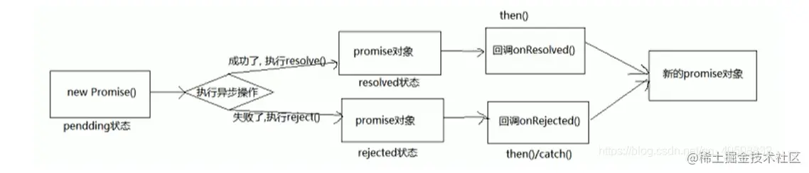

## 一、Promise

### （一）Promise 的作用

- 主要是用来解决回调嵌套的问题（执行完后再去执行某一些操作，这时候容易形成嵌套再嵌套的问题），也就是常见的"**回调地狱**"；
- 执行多并发请求获取数据；

### （二）Promise 的基本流程



### （三）Promise 的基本特征

1.  promise 有三个状态：`pending`（默认），`fulfilled`(完成)，or `rejected`（失败）；「规范 Promise/A+ 2.1」
    - promise 的默认状态是 `pending`；
    - **promise 只能从`pending`到`rejected`, 或者从`pending`到`fulfilled`，**
    - **状态一旦确认，就不会再改变** ☆☆☆
2.  promise 有两个保存状态结果的值，分别是 value 和 reson
    - `value`保存**成功状态**的值，可以是`undefined/thenable/promise`；「规范 Promise/A+ 1.3」
    - `reason`保存**失败状态**的值；「规范 Promise/A+ 1.5」
3.  `new promise`时， 需要传递一个`executor()`执行器，**执行器立即执行**☆☆☆；  
    `executor`接受两个参数，分别是`resolve`和`reject`；
    - 调用 resolve 方法就是成功，
    - 调用 reject 方法就是失败
4.  promise 必须有一个`then`方法，then 接收两个参数，分别是 promise 成功的回调 onFulfilled, 和 promise 失败的回调 onRejected；「规范 Promise/A+ 2.2」
    - 如果调用 then 时，promise 已经**成功**，则执行外部传入的`onFulfilled`，参数是`promise`的`value`；
    - 如果调用 then 时，promise 已经**失败**，那么执行外部传入的`onRejected`, 参数是`promise`的`reason`；
5.  如果 then 中抛出了异常，那么就会**把这个异常作为参数**，传递给下一个 then 的失败的回调`onRejected`；

### （四）手写实现 Promise

#### 1. 前置知识点

> [JavaScript constructor 属性详解](https://www.cnblogs.com/chenweizhen/p/6422995.html)
>
> - constructor 属性：返回对创建此对象的数组函数的引用。
> - constructor 属性： 并不是所有对象都有此属性。每个构造函数刚被制造出来的时候，它的 c.prototype 上面都会有一个 constructor 属性，并且执行它本身，即 `c.prototype.constructor ===c;`

#### 2. 手写简易版的 Promise

```js{11,25,27,35,37,44,59,64,66,67,69}
// 三个状态：PENDING、FULFILLED、REJECTED
//  javascript 对象中的 constructor属性 指向的函数本身。
const PENDING = 'PENDING' // 等待中
const FULFILLED = 'FULFILLED' // 完成
const REJECTED = 'REJECTED' // 拒绝

class Promise {
  // 每个构造函数C刚被制造出来的时候，它的C.prototype上面都会有一个constructor属性，并且执行它本身
  // constructor 属性返回对创建此对象的数组函数的引用。
  // 【1】立即执行函数
  constructor(executor) {
    console.log(0, '创建Promise对象')
    // (1) promise 的 三个状态
    this.status = PENDING // 默认状态为 PENDING
    // (2) promise 有两个保存状态结果的值
    this.value = undefined // 存放成功状态的值，默认为 undefined
    this.reason = undefined // 存放失败状态的值，默认为 undefined
    this.successCB = [] // 成功存放的数组
    this.failCB = [] // 失败存放的数组
    // 【1-1】调用此方法就是成功
    let resolve = (value) => {
      // 状态为 PENDING 时才可以更新状态，防止 executor 中调用了两次 resovle/reject 方法
      if (this.status === PENDING) {
        console.log(2, '成功则调用 resolve 方法')
        this.status = FULFILLED
        this.value = value
        this.successCB.forEach((f) => f()) // 一开始调用的时候如果外部还没有执行resolve或reject，则需要先放到successCB和failCB里
      }
    }
    // 【1-2】调用此方法就是失败
    let reject = (reason) => {
      //确保状态还未改变
      if (this.status == PENDING) {
        console.log(3, '失败则调用 reject 方法')
        this.status = REJECTED
        this.reason = reason
        this.failCB.forEach((f) => f())// 一开始调用的时候如果外部还没有执行resolve或reject，则需要先放到successCB和failCB里
      }
    }
    // 【1-3】立即执行函数
    try {
      console.log(1, '立刻执行函数executor(resolve, reject)')
      // 立即执行，将 resolve 和 reject 函数传给使用者
      executor(resolve, reject)//回调
    } catch (error) {
      console.log(3, '出错则调用reject函数 error')
      reject(error) //出错则调用reject函数
    }
  }
  //【2】异步函数
  // 包含一个 then 方法，并接收两个参数 onFulfilled、onRejected，
  // 第一个参数是状态变为成功后应该执行的回调函数，
  // 第二个参数是状态变为失败后应该执行的回调函数。
  then(onFulfilled, onRejected) {
    console.log(4, 'then:当前状态', this.status)
    // 【2-1】成功后用户需要执行的函数
    if (this.status === FULFILLED) {
      console.log(5, '成功后执行 onFulfilled函数')
      onFulfilled(this.value)//onFulfilled：成功后用户需要执行的函数
    }
    // 【2-2】失败后用户需要执行的函数
    if (this.status === REJECTED) {
      console.log(6, '失败后执行 onRejected函数')
      onRejected(this.reason) //onRejected：失败后用户需要执行的函数
    }
    // 【2-3】一开始调用的时候如果外部还没有执行resolve或reject，则需要先放到successCB和failCB里
    // 等后续执行resolve或reject的时候再执行
    if (this.status === PENDING) {
      this.successCB.push(() => {
        onFulfilled(this.value)
      })
      this.failCB.push(() => {
        onRejected(this.reason)
      })
    }
  }
}
```

调用

```js{9}
const ps = new Promise((resolve, reject) => {
  if (成功) {
    resolve('成功了') // 状态由等待变为成功，传的参数作为then函数中成功函数的实参
  } else {
    reject('失败了') // 状态由等待变为失败，传的参数作为then函数中失败函数的实参
  }
})
// ps.then为同步的
ps.then(
  // onFulfilled为异步
  (data) => {
    console.log('success----', data)
  },
  // onRejected为异步
  (err) => {
    console.log('fail----', err)
  }
)
```

::: example
blogs/javaScript/promise/demo
:::

#### 3. 手写 promise.all()

promise.all() 里面*状态都改变*，那就会输出，得到一个数组

```js{14,17,23}
/*
Promise函数对象的all方法
返回一个promise，只有当所有promise都成功时才成功，否则只要有一个失败的就失败
*/
Promise.all = function (promisesArr) {
  let resolvedCount = 0 // 用来保存成功promise的数量
  const resolvedArr = new Array(promisesArr.length) // 创建一个数组用来保存所有promise执行成功后返回的对应的value
  // 【1】 返回一个新的promise
  return new Promise((resolve, reject) => {
    // 【2】 遍历promises获取每个promise的结果
    promisesArr.forEach((promiseItem, index) => {
      promiseItem.then(
        (value) => {
          resolvedCount++ // 成功的数量加1
          resolvedArr[index] = value // p成功，将成功的value按顺序保存到values
          // 【3】 如果全部成功了。将return的新的promise的状态改为成功
          if (resolvedCount === promisesArr.length) {
            resolve(resolvedArr) //返回所有promise的执行结果
          }
        },
        (reason) => {
          // 【4】 只要有一个失败了，return的promise就失败
          reject(reason)
        }
      )
    })
  })
}
```

#### 4. 手写 promise.race()

promise.race() 里面只有一个状态变为 rejected 或者 fulfilled 即输出

```js{13,17}
/*
Promise函数对象的race方法
返回一个promise，其结果由第一个完成的promise决定
*/
Promise.race = function (promisesArr) {
  // 【1】 返回一个promise
  return new Promise((resolve, reject) => {
    // 【2】 遍历promises获取每个promise的结果
    promisesArr.forEach((promiseItem, index) => {
      promiseItem.then(
        // 只有第一次调用的有效果
        (value) => {
          resolve(value) // 一旦有成功，将return的promise变为成功
        },
        (reason) => {
          // 【3】一旦有失败，将return的promise变为失败
          reject(reason)
        }
      )
    })
  })
}
```

#### 5. promise.finally()

不管指定不管 Promise 对象最后状态如何，都会执行的操作（本质上还是 then 方法的特例）

## 二、async/await

### （一）async/await 的实现原理

- `async/await`是基于`Promise`构建的一种语法糖，它利用了`Promise`的特性来支持暂停和恢复函数的执行，并使用`try/catch`来处理异步操作中的错误。

1.  `async`函数：使用`async`关键字定义的函数会**返回一个`Promise`对象**。内部代码可以包含`await`关键字，用于暂停函数的执行，等待一个异步操作完成并返回结果。
1.  `await`关键字：`await`关键字只能在`async`函数内部使用。当遇到`await`时，它会暂停`async`函数的执行，等待后面的表达式（通常是一个返回`Promise`对象的异步操作）解析为已完成状态，并且返回该操作的结果。
1.  `Promise`对象：**`await`关键字只能用于`Promise`对象**，它会等待该`Promise`对象的状态变为已完成或已拒绝。如果状态为已完成，则`await`表达式返回已完成的值；如果状态为已拒绝，则会抛出异常。

- 错误处理：使用`try/catch`块来捕获`await`表达式中的异常，并进行相应的错误处理。如果`await`表达式中的`Promise`被拒绝，将会抛出一个错误，可通过`catch`块捕获并进行处理。

## [ 问题延伸]

#### [1. js 实现限制函数并发量限制](https://juejin.cn/post/7106710015171362853#heading-4)

#### 2. async/await 和 Promise 有什么区别

- `async/await`是一种用于处理异步操作的语法糖，它基于`Promise`构建，并提供更简洁、更直观的编码方式。它们的区别如下：

1.  **语法**：使用`async/await`可以**以同步代码的方式**编写异步操作，而`Promise`则需要通过`.then()`和`.catch()`等方法链式调用来处理异步结果。
1.  **错误处理**：在`Promise`中，错误处理通常需要使用`.catch()`来捕获和处理异常。而在`async/await`中，可以使用`try/catch`块来直接捕获和处理异常，使错误处理更加简洁。
1.  **可读性**：`async/await`可以使异步代码看起来更像是同步代码，流程更加清晰易懂。相比之下，使用`Promise`进行异步编程可能会导致**回调地狱**（callback hell）的问题，难以维护和阅读。
1.  **异步函数返回值**：使用`Promise`时，`.then()`方法返回的是一个新的`Promise`对象，可以对其进行链式调用。而在`async/await`中，异步函数的返回值是一个`Promise`对象，可以直接使用`await`关键字来获取异步操作的结果。

---

> 参考链接：
>
> - [Promise 教程从入门到精通(25~42 集)](https://www.bilibili.com/video/BV1GA411x7z1?p=28&spm_id_from=pageDriver)
> - [简述 promise 原理](https://www.jianshu.com/p/fc5030e725ae)
> - [完整版代码](https://github.com/Woc12138/Promise-study/blob/master/Promise.js)
