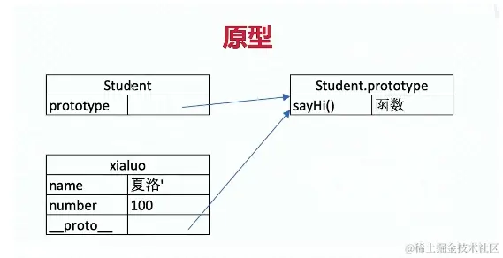
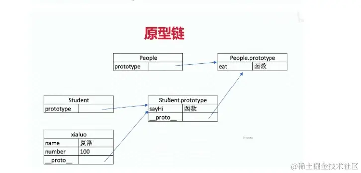
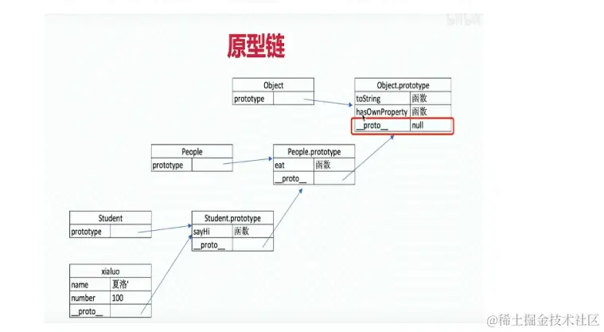
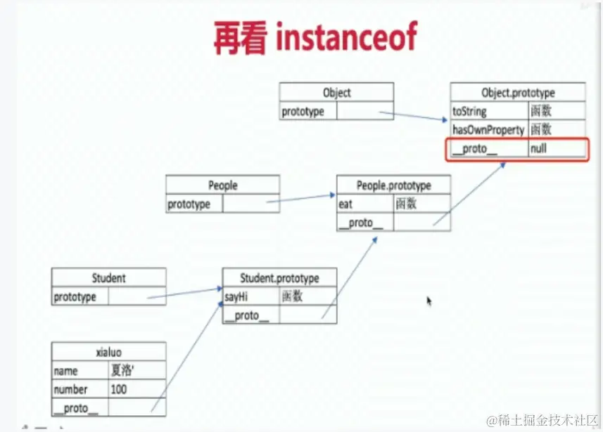
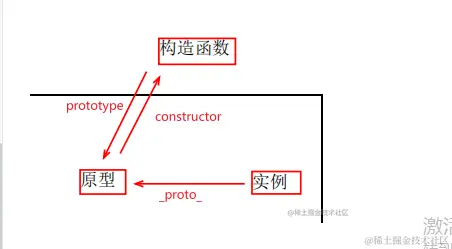

<!--
 * @Description:
 * @Date: 2024-10-11 18:10:58
 * @LastEditTime: 2024-10-31 16:36:12
-->

# [原型](https://juejin.cn/post/7105588080991535111/)

> 构造函数，是一种特殊的方法。主要用来在创建对象时**初始化对象**， 即为对象成员变量赋初始值，总与 new 运算符一起使用在创建对象的语句中。

<!--
- 任何一个类（函数）都有原型对象，原型对象至少有两个属性：constructor、**proto**。
  - **constructor**：指向函数本身
     constructor 属性返回对创建此对象的数组函数的引用。 并不是所有对象都有此属性
  - **proto**：指向**父类**原型对象。
- prototype 的属性值中天生自带一个`constructor`属性，其 constructor 属性值指向**当前原型所属的类**
- 所有的**对象数据类型**（class），都天生自带一个`proto`属性，该属性的属性值指向**当前实例所属类的原型**，`__.proto.__是存在于实例和函数的原型对象关系`
- 每个构造函数 C 刚被制造出来的时候，它的 c.prototype 上面都会有一个 constructor 属性，并且执行它本身，即`c.prototype.constructor === c`; -->

## 1. 如何理解原型和原型链的？※

### （一）原型

- 原型：`实例共享的属性和方法组成的对象(prototype)`
- 原型分为**隐式原型和显式原型**，每个对象都有一个隐式原型`__proto__`，它指向**自己的构造函数的显式原型**`prototype`
- 每一个实例的`__proto__ `存储这个「共用属性组成的对象」的地址，即`prototype`。
- 所有的 `prototype` 的`__proto__`最终指向的是 Object 的 prototype，Object 的隐式原型是 `null`
- 原型出现的目的：为了**减少不必要的内存消耗**。
  

<!-- （1） **原型**：原型分为**隐式原型和显式原型**，每个对象都有一个隐式原型，它指向**自己的构造函数的显式原型**。每个构造方法都有一个显式原型。

- 共用属性组成的对象
- `__proto__`是隐式原型；prototype 是显式原型
- 所有实例的`__proto__`都指向他们构造函数的 prototype
- 所有的 prototype 都是对象，自然它的`__proto__`最终指向的是 Object()的 prototype
- **所有的构造函数的隐式原型指向的都是`Function()`的显示原型**
- Object 的隐式原型是 null -->

### （二）原型链

- 原型链就是对象通过 `proto` 向**当前实例所属类的原型**上**查找属性或方法**的机制，
- 如果找到`Object` 的原型上还是没有找到想要的属性或者是方法则查找结束，最终会返回 `undefined`
- `instanceof` 就是判断某对象是否位于某构造方法的原型链上。

  
  
  

### （三）原型关系

- 每个 构造函数 都有显示原型 `prototype`
- 每个实例都有隐式原型`_proto_`
- 实例的`_proto_`指向对应 构造函数 的 `prototype`

## 2. 构造函数、原型和实例的关系

- 每个构造函数都有一个原型对象（`prototype`），
- 原型有一个属性（`constructor`）指回构造函数，
- 而实例有一个内部指针（`proto`）指向原型。

