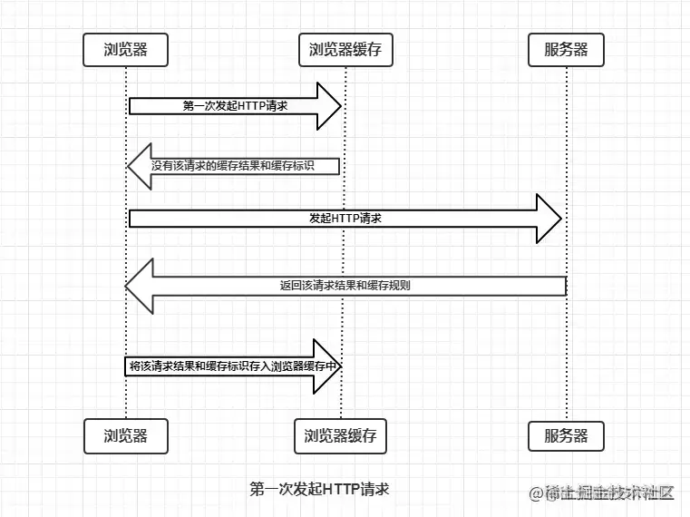
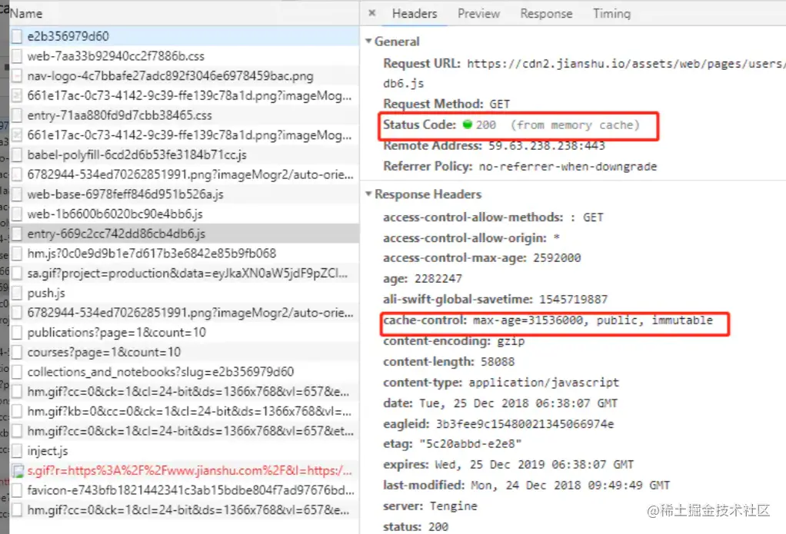

## （一） [浏览器的缓存机制](https://juejin.cn/post/7016593221815910408#heading-17)

- 浏览器缓存机制主要包括**强制缓存**和**协商缓存**;
- 若存在强缓存且没有过期，则直接使用该缓存；
- 当强制缓存失效后，浏览器会携带这些缓存标识向服务器发起请求，由服务器根据缓存标识判断是否使用缓存（协商缓存）。
  - 如果资源未修改，服务器返回 `304` 状态码，表示使用缓存内容；
  - 如果资源已修改，返回 `200` 状态码，表示使用新内容。
- 浏览器与服务器通信的方式为**应答模式**，即：浏览器发起 HTTP 请求 – 服务器响应该请求。
- 浏览器第一次向服务器发起该请求后拿到请求结果，会根据响应报文中 HTTP 头的**缓存标识**，决定是否缓存结果， **是则将请求结果和缓存标识存入浏览器缓存中，**

### 1. 第一次发起请求的简单过程如下图：

### 2. 浏览器缓存机制的关键

由上图我们可以知道：

- 浏览器每次发起请求，都会先在**浏览器缓存**中查找该**请求的结果以及缓存标识**
- 浏览器每次拿到返回的请求结果都会**将该结果和缓存标识存入浏览器缓存中**  
  以上两点结论就是浏览器缓存机制的关键，他确保了每个请求的缓存存入与读取；

根据**是否需要向服务器重新发起 HTTP 请求**将缓存过程分为两个部分，分别是`强制缓存`和`协商缓存`，由**后端服务器**设置。

## （二）强缓存（max-age）

### 1. 触发条件：

- 在**客户端**发起请求之前，先检查的`cache-control里的max-age`有没有过期
- 如果没有过期直接使用该缓存，过期则走协商缓存

### 2. 触发过程

- 在**客户端**发起请求之前，先检查强缓存
- 查看强缓存的`cache-control里的max-age`，判断数据有没有过期，如果没有直接使用该缓存
  > 有些用户可能会在没有过期的时候就点了**刷新按钮**，这个时候浏览器就回去请求服务端  
  > 要想避免这样做，可以`在cache-control里面加一个immutable`  
  > 这样用户再怎么刷新，只要 max-age 没有过期就不会去请求资源

### 3. cache-control 相关属性

| 标题            | 解释 `cache-control: max-age=xxxx，public/private,...`                                                                                               |
| --------------- | ---------------------------------------------------------------------------------------------------------------------------------------------------- |
| `max-age=xxxx ` | 在 xxx 秒的有效期内，如果有请求该资源的需求的话就直接读取缓存, statu code:200 ，如果用户做了**刷新操作**，就向服务器发起 http 请求                |
| `public `       | 客户端和代理服务器都可以缓存该资源                                                                                                                   |
| `private`       | 只让客户端可以缓存该资源；代理服务器不缓存                                                                                                        |
| `immutable`     | 在**没有过期**的时候，即使用户做了**刷新操作**，也不向服务器发起 http 请求                                                                           |
| ` no-cache`     | 不允许强缓存，可以协商缓存 一般如果你做了强缓存，只有在强缓存失效了才走协商缓存的， 设置了 no-cache 就不会走强缓存了，每次请求都回询问服务端。 |
| `no-store`      | 不缓存，这个会让客户端、服务器都不缓存，也就没有所谓的强缓存、协商缓存了。                                                                           |

### 4. 强缓存步骤示例

`cache-control: max-age=xxxx，immutable`：

1.  第一次请求 a.js ，缓存表中没该信息，直接请求后端服务器。
1.  后端服务器返回了 a.js ，且 http response header 中 `cache-control 为 max-age=xxxx`，所以是强缓存规则，存入缓存表中。
1.  第二次请求 a.js ，缓存表中是 max-age， 那么命中强缓存
1.  然后判断是否过期，如果没过期，直接读缓存的 a.js，如果过期了，则执行协商缓存的步骤
    

## （三）协商缓存

### 1. [触发条件](https://juejin.cn/post/6844903763665240072)：

- `Cache-Control` 的值为 `no-cache `（不强缓存）
- 或者`max-age`过期了 （强缓存，但总有过期的时候）

### 2. 触发过程

1. 浏览器加载资源时，没有命中强缓存，这时候就去请求服务器；
2. 请求服务器的时候，会带着**两个参数**（`If-None-Match`、`If-Modified-Since`），服务器收到请求后，去检验缓存是否真的过期；
   | 两个参数 | 说明 |
   | --- | --- |
   | `If-None-Match` |表示**是否命中**，响应头中的`etag`属性，**每个文件对应一个 etag** |
   | `If-Modified-Since` |表示**是否过期**，响应头中的`Last-Modified`属性 |
3. 服务器会比较资源的**最后修改时间**（通过`If-Modified-Since`头）或者**资源的唯一标识符**（通过`If-None-Match`头）与请求中的值；  
   如果没有过期，则服务器会给浏览器返回一个`304状态码`，表示缓存没有过期，可以使用旧缓存，过期则返回 200；
4. 客户端接收到响应后，如果是 304 响应，它将使用先前缓存的资源；如果是 200 响应，它将更新缓存并使用新的资源。

### 3. etag 的作用

- 有时候编辑了文件，但是没有修改，但是 last-modified 属性的时间就会改变，导致服务器会重新发送资源；
- 但是 etag 的出现就完美的避免了这个问题，他是**文件的唯一标识**

### 4. last-modified 和 etag 各自的优缺点：

- 每个文件都有一个 etag 和 last-modified 属性，**etag 要优先于 last-modified**
- 两个属性各有优缺点，比如 `last-modified` 很多时候**不能感知文件是否改变**，但 etag 能；
- last-modified 仅仅记录了时间点，**性能肯定要高于 etag**，etag 记录的是哈希值

---

> 参考原文：  
> [彻底弄懂强缓存与协商缓存](https://www.jianshu.com/p/9c95db596df5)⭐⭐⭐⭐⭐
