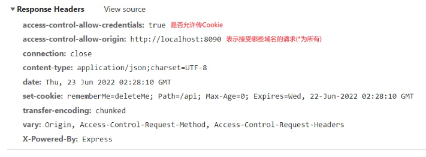

# 同源策略与跨域请求

## （一）[同源策略](https://www.imooc.com/article/291931)

### 什么是同源策略

- 同源策略是一种约定，它是浏览器最核心也最基本的安全功能，如果缺少了同源策略，**浏览器很容易受到 XSS、CSRF 等攻击。**
- 所谓同源是指 “ **协议+域名+端口** ” 三者相同，即便两个不同的域名指向同一个 ip 地址，也非同源。
  - 形式：`协议：//域名:(端口号)`
    

### 同源策略的限制内容

1. 非同源的`Cookie`、`LocalStorage` 和 `IndexDB` 无法读取
1. 非同源的 DOM 和 JS 对象无法获得
1. 非同源的`AJAX` 请求不能发送，被浏览器拦截了

## （二）跨域

### 跨域的原因

- 跨域，是指浏览器不能执行其他网站的脚本。它是由浏览器的**同源策略**造成的。
- **同源策略要求协议、域名和端口号必须完全一致**，因此，即使是一级域名相同，二级域名不同的情况下，也会被视为跨域 ‌
  > - 可以通过将二级域名的 cookie 域设置成一级域名，path 设置成‘/’实现共享 cookie
  > - 顶级域名:又叫一级域名。一串字符串中间一个点隔开,例如`baidu.com`
  > - 二级域名就是最靠近顶级域名左侧的字段。  
  >   **tieba**.`baidu.com`，**news**.`baidu.com`，tieba 和 news 就是二级域名
  > - 二级域访问访问顶级域是可以的，而二级域名之间的访问是存在跨域的
- **跨域并不是请求发不出去，请求能发出去，服务端能收到请求并正常返回结果，只是结果被浏览器拦截了。**
- 跨域原理：即是通过各种方式，`避开浏览器的安全限制`。

### 解决方案

#### 1. JSONP（JSON with Padding）

##### (1)原理：

- 三个允许跨域加载资源的标签
  1. ``
  1. `<link href=XXX>`
  1. `<script src=XXX>`
- `JSONP`通过同源策略涉及不到的"漏洞"，利用 **`<script>`标签不受同源策略的限制** 的特性来发送请求，
- 服务端**不再返回 JSON 格式**的数据，而是 **返回一段调用某个函数的 js 代码**，在 src 中进行了调用，这样实现了跨域。
- JSONP 请求一定需要对方的服务器做支持才可以。

##### (2)步骤：

1.  创建一个 script 标签
1.  script 的 src 属性设置接口地址
1.  接口参数，必须要带一个自定义回调函数（函数名前后端约定好），要不然后台无法返回数据
1.  通过自定义回调函数去接受返回的数据

客户端

```js{4,6,11,17,18,19,27}
// 【封装jsonp】
function jsonp({ url, params, callback }) {
  return new Promise((resolve, reject) => {
   // 1.创建一个 script 标签
   let script = document.createElement('script')
    // 2. 申明回调函数，用于在后端返回的js代码中进行调用
    window[callback] = function (data) {
      resolve(data)
      document.body.removeChild(script)
    }
    // 3.组装请求参数
    params = { ...params, callback } // wd=b&callback=show
    let arrs = []
    for (let key in params) {
      arrs.push(`${key}=${params[key]}`)
    }
    // 4. 让 script 生效，挂载到界面上才开始执行
    // 组装请求地址:http://localhost:3000/jsonp?wd=Iloveyou&callback=myCallback
      script.src = `${url}?${arrs.join('&')}`
    document.body.appendChild(script) //
  })
}
// 【调用jsonp】
jsonp({
  url: 'http://localhost:3000/jsonp',
  params: { wd: 'Iloveyou' }, //传给后端的参数
  callback: 'myCallback' // 自定义回调函数名
}).then((data) => {
  console.log(data)
})
```

- 服务端  
  后端根据前后端约定好的方法名，将字符串拼接成**调用方法的 js 字符串**，并将这个字符串返回

```js{6}
let express = require('express')
let app = express()
app.get('/jsonp', function (req, res) {
  let { wd, callback } = req.query//获取src的参数
  console.log(wd,callback) // Iloveyou,myCallback
  res.end(`${callback}('返回的信息')`)//返回调用方法的js代码字符串
})
app.listen(3000)
```

##### (3)缺点:

- JSON **只支持 get**，因为 script 标签只能使用 get 请求；
- JSONP 需要后端配合返回指定格式的数据。
- 不安全可能会遭受 XSS 攻击。

#### 2. [CORS](https://juejin.cn/post/6983852288091619342)

##### 是什么

> CORS 是一个 W3C 标准，全称是“跨域资源共享”（Cross-origin resource sharing），**允许浏览器向跨源服务器，发出 XMLHttpRequest 请求**，从而克服了 AJAX 只能同源使用的限制。

- CORS 需要浏览器和后端同时支持。
- 浏览器会自动进行 CORS 通信，实现 CORS 通信的关键是后端。只要后端实现了 CORS，就实现了跨域。
- 服务端设置 `Header[Access-Control-Allow-Origin]` HTTP **响应头**之后，就可以开启 CORS。 该属性表示哪些域名可以访问资源，如果设置通配符`*`则表示所有网站都可以访问资源。
- 虽然设置 CORS 和前端没什么关系，但是通过这种方式解决跨域问题的话，会在发送请求时出现两种情况，分别为简单请求和复杂请求。

浏览器将`CORS`请求分成两类：**简单请求和非简单请求**

##### 简单请求

- 满足以下条件，就是简单请求：
  1. 请求方法是：`HEAD`、`POST`、`GET`
  1. 请求头只有：`Accept`、`AcceptLanguage`、`ContentType`、`ContentLanguage`、`Last-Event-Id`
- 简单请求，浏览器自动添加一个`Origin`字段
- 同时**后端**需要设置的请求头，跨域的 header 配置如下
  | CORS Header 属性 | 解释 |
  | --- | --- |
  | `Access-Control-Allow-Origin` | (必须)表示接受哪些域名的请求(`*`为所有) <br>需要注意的是，如果设置为`*`，则不能携带 cookie。|
  |`Access-Control-Allow-Credentials`|(可选)设置是否允许传 Cookie，要是想传 cookie，<br>前端需设置`xhr.withCredentials= true`，<br>后端设置`Access-Control-Allow-Credentials: true`） |
  |`Access-Control-Allow-Methods`|指定了服务器支持的方法列表，<br>例如 GET, POST, PUT, DELETE, OPTIONS 等|
  | `Access-Control-Expose-Headers`|(可选)指定了客户端在跨域请求中可以携带的头部信息,<br>可以设置为具体的头部名称（如 Authorization）<br>或`*`表示允许所有头部。|
  | Access-Control-Max-Age |设置在 86400 秒不需要再发送预校验请求

  - Access-Control-Expose-Headers 的六个字段属性：
    | 属性 | 解释 |
    | -------------------------------------------------------------------------- | ----------------------------------------------------------------------------------------------------------- |
    | [Cache-Control](https://www.kancloud.cn/spirit-ling/http-study/851882) | 通过指定首部字段  `Cache-Control`  的指令，来进行缓存操作的工作机制，多个参数之间可以使用“,”分隔 |
    | [Content-Language](https://www.kancloud.cn/spirit-ling/http-study/1418537) | 会告知客户端，实体主体使用的自然语言（指中文或英文等语言） |
    | [Content-Type](https://www.kancloud.cn/spirit-ling/http-study/1418542) | 说明实体主体内对象的媒体类型（仅限于 application/x-www-form-urlencoded、multipart/form-data 或 text/plain） |
    | [Last-Modified](https://www.kancloud.cn/spirit-ling/http-study/1418544) | 指明资源最终修改时间 |
    | [Expires](https://www.kancloud.cn/spirit-ling/http-study/1418543) | ：会将资源失效日期告知客户端 |
    | [Pragma](https://www.kancloud.cn/spirit-ling/http-study/851885) | 是 HTTP/1.1 之前版本保留的历史遗留字段，仅作为与 HTTP/1.0 的向后兼容而定义 |

- 简单请求示例

```js{1,4}
GET /cors? HTTP/1.1 // 请求方法是：HEAD、POST、GET
Host: localhost:2333
Connection: keep-alive
Origin: http://localhost:2332 // 简单请求，浏览器自动添加一个`Origin`字段
User-Agent: Mozilla/5.0 (Windows NT 10.0; Win64; x64) AppleWebKit/537.36 (KHTML, like Gecko) Chrome/71.0.3578.98 Safari/537.36 Accept: */*
Referer: http://localhost:2332/CORS.html
Accept-Encoding: gzip, deflate, br
Accept-Language: zh-CN,zh;q=0.9
If-None-Match: W/"1-NWoZK3kTsExUV00Ywo1G5jlUKKs"
```

- 后端响应
  

##### 非简单请求

> 非简单请求则是不满足上边的两种情况之一，比如请求的方式为  `PUT`，或者请求头包含其他的字段

**步骤：预检请求 -> 预检请求通过 -> 正式请求**

1. 非简单请求的`CORS`请求会在正式通信之前进行一次**预检请求**  
   预检请求格式
   - `OPTIONS`：请求行 的请求方法为`OPTIONS`（专门用来询问的）
   - `Origin`：通过预检之后的请求,会自动带上 Origin 字段
   - `Access-Control-Request-Method`：请求的方式
   - `Access-Control-Request-Header`：表示浏览器发送的自定义字段
   ```js{1,3,4}
   OPTIONS /cors HTTP/1.1  //`"预检"`使用的请求方法是 `OPTIONS` , 表示这个请求是用来询问的
   Origin: localhost:2333
   Access-Control-Request-Method: PUT // 表示使用的什么HTTP请求方法
   Access-Control-Request-Headers: X-Custom-Header // 表示浏览器发送的自定义字段
   Host: localhost:2332
   Accept-Language: zh-CN,zh;q=0.9
   Connection: keep-alive
   User-Agent: Mozilla/5.0...
   ```
1. 预检请求后，服务器收到预检请求以后，检查了`Origin`、`Access-Control-Request-Method`和`Access-Control-Request-Headers`字段以后，确认允许跨源请求，就可以做出回应。
   - 预检的响应头:
   ```js{4}
   HTTP/1.1 200 OK
   Date: Mon, 01 Dec 2008 01:15:39 GMT
   Server: Apache/2.0.61 (Unix)
   Access-Control-Allow-Origin: http://localhost:2332 // 表示http://localhost:2332可以访问数据
   Access-Control-Allow-Methods: GET, POST, PUT
   Access-Control-Allow-Headers: X-Custom-Header
   Content-Type: text/html; charset=utf-8
   Content-Encoding: gzip Content-Length: 0
   Keep-Alive: timeout=2, max=100
   Connection: Keep-Alive
   Content-Type: text/plain
   ```
1. **通过预检后，才会进行正式的请求，浏览器接下来的每次请求就类似于简单请求了**
   - 一旦通过了预检请求后,请求的时候就会跟简单请求一样,会有一个`Origin`头信息字段。
   - 通过预检之后的，浏览器发出正式请求：
   ```js{2}
   PUT /cors HTTP/1.1
   Origin: http://api.bob.com // 通过预检之后的请求,会自动带上Origin字段
   Host: api.alice.com X-Custom-Header: value
   Accept-Language: en-US
   Connection: keep-alive
   User-Agent: Mozilla/5.0...
   ```

#### 3. [nginx 反向代理](https://juejin.cn/post/6844903767226351623#heading-17)

##### (1)客户端

```js{6}
// index.html
var xhr = new XMLHttpRequest()
// 前端开关：浏览器是否读写cookie
xhr.withCredentials = true
// 访问nginx中的代理服务器
xhr.open('get', 'http://www.domain1.com:81/?user=admin', true)
xhr.send()
```

##### (2) nginx 服务器中转

- 搭建一个中转 nginx 服务器，用于转发请求。
- 使用 nginx 反向代理实现跨域，是最简单的跨域方式。只需要修改 nginx 的配置即可解决跨域问题，
- 支持所有浏览器，支持 session，**不需要修改任何代码，并且不会影响服务器性能**。
- 实现思路：通过 nginx 配置一个代理服务器（域名与 domain1 相同，端口不同）做跳板机，反向代理访问 domain2 接口，并且可以顺便修改 cookie 中 domain 信息，方便当前域 cookie 写入，实现跨域登录。
  - 先下载 nginx，然后将 nginx 目录下的 `nginx.conf` 修改如下:
- 最后通过命令行 `nginx -s reload` 启动 nginx
- [nginx.conf](https://blog.csdn.net/qq_42402854/article/details/132843413) 配置文件中的内容分为三个部分：
  - 第一部分：main 全局块（全局设置）， 作用域是全局
  - 第二部分：events 块（nginx 工作模式）
  - 第三部分：http 块（http 设置）
- http 块
  |属性|描述|
  |---|--|
  |server_name|匹配客户端的域名|
  |location `/` |定位 URL，`/`表示匹配访问根目录。|
  |proxy_pass|反向代理的域名|
  |proxy_cookie_domain|修改 cookie 里域名|
  |index|修改 cookie 里域名|

```js{15,16,17,20}
// proxy服务器
// 1.【main 全局块】
worker_processes  1;
// 2.【events 块（nginx 工作模式）】
events {
  worker_connections  1024;
}
// 3.【http块（http设置）】
http {
  include       mime.types;
  default_type  application/octet-stream;
  sendfile        on;
  keepalive_timeout  65;
  server {
    listen       81;//客户端端口号
    server_name  www.domain1.com//客户端代理的域名//localhost;
    location / { # `/`表示匹配访问根目录。
      root   html;
      index  index.html index.htm;
      proxy_pass   http://www.domain2.com:8080;  //#反向代理
      proxy_cookie_domain www.domain2.com www.domain1.com; //#修改cookie里域名
      //# 当用webpack-dev-server等中间件代理接口访问nignx时，此时无浏览器参与，故没有同源限制，下面的跨域配置可不启用
      // # add_header Access-Control-Allow-Origin http://www.domain1.com;  #当前端只跨域不带cookie时，可为*
      //# add_header Access-Control-Allow-Credentials true;
    }
    error_page   500 502 503 504  /50x.html;
    location = /50x.html {
        root   html;
    }
  }
}

```

##### (3)服务器

```js{9}
// server.js
var http = require('http')
var server = http.createServer()
var qs = require('querystring')
server.on('request', function (req, res) {
  var params = qs.parse(req.url.substring(2))
  // 向前台写cookie
  res.writeHead(200, {
    'Set-Cookie': 'l=a123456;Path=/;Domain=www.domain2.com;HttpOnly' // HttpOnly:脚本无法读取
  })
  res.write(JSON.stringify(params))
  res.end()
})
server.listen('8080')
console.log('Server is running at port 8080...')
```

#### 4. Node 中间件代理(两次跨域)

实现原理：同源策略是浏览器需要遵循的标准，而如果是**服务器向服务器请求就无需遵循同源策略**。 代理服务器，需要做以下几个步骤：

1. 客户端请求 Node 代理服务器 。
1. Node 代理服务器再将请求转发给服务器。
1. 拿到服务器响应数据。
1. Node 代理服务器将响应转发给客户端
   

#### 5. Websocket

Websocket 是 HTML5 的一个持久化的协议，它实现了浏览器与服务器的**全双工通信**，同时也是跨域的一种解决方案。

<!-- ### 5. window.name

利用在一个浏览器窗口内，载入所有的域名都是共享一个 window.name

### 6. document.domain

基础域名相同 子域名不同

### 7. window.postMessage()

利用 h5 新特性 window.postMessage() -->

---

参考链接

> - [面试官问我 CORS 跨域，我直接一套操作斩杀！](https://juejin.cn/post/6983852288091619342)
