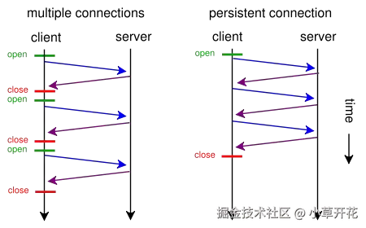
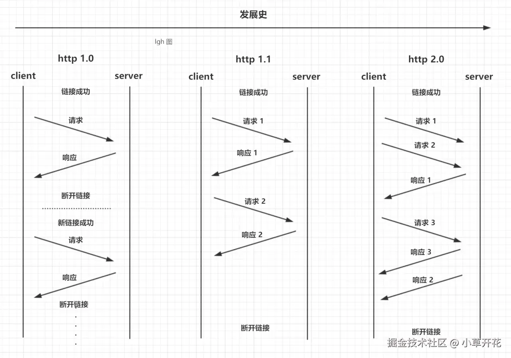

<!--
 * @Description:
 * @Date: 2024-11-05 14:23:38
 * @LastEditTime: 2024-11-05 14:29:47
-->

> 参考：<https://blog.csdn.net/Erica_1230/article/details/129062038>

## 1. http 和 https 的基本概念 ⭐⭐⭐⭐⭐

- http：是一个**客户端和服务器端**请求和应答的标准（TCP），用于从 **WWW 服务器** 传输 超文本 到 **本地浏览器**的 **超文本传输协议**。
- https：是以安全为目标的 HTTP 通道，**即 HTTP 下 加入 SSL 层进行加密**。\
  其作用是：建立一个信息安全通道，来确保数据的传输，确保网站的真实性。

## 2. http 和 https 的区别及优缺点？⭐⭐⭐⭐⭐

| 区别     | http                        | https                                               |
| -------- | --------------------------- | --------------------------------------------------- |
| 默认端口 | 80 端口                     | 443 端口                                            |
| 传输方式 | 超文本传输协议 **明文传输** | 具有安全性的 ssl **加密传输**（会保证数据的完整性） |
| 安全性   | 不安全（无状态无连接）      | 安全（可以保证对方身份的真实性和）                  |

- http 的连接很简单，是无状态的。https 握手阶段比较`费时`，会使页面加载时间延长 50%，增加 10%\~20%的耗电。
- https `缓存`不如 http 高效，会增加数据开销。
- https 协议需要 **ca 证书**，费用较高，功能越强大的`证书费`用越高。
- SSL 证书需要绑定 `IP`，不能再同一个 IP 上绑定多个域名，IPV4 资源支持不了这种消耗。

## 3. http 的状态码 ⭐⭐⭐⭐⭐

| 标题                     | 状态码 |                                                                                                        |
| ------------------------ | ------ | ------------------------------------------------------------------------------------------------------ |
| **2 开头的表示成功**     | 200    |                                                                                                        |
| **3 开头的表示重定向**   | 301    | 永久重定向                                                                                             |
|                          | 302    | 临时重定向                                                                                             |
|                          | 304    | 表示可以在缓存中取数据（协商缓存）                                                                     |
| **4 开头表示客户端错误** | 403    | 跨域（服务器理解客户的请求，但拒绝处理它）                                                             |
|                          | 404    | 请求资源不存在                                                                                         |
|                          | 412    | 表示“未满足前提条件”。 如果服务器没有满足请求者在请求中设置的其中一个前提条件时就会返回此错误代码。 |
| **5 开头表示服务端错误** | 500    |                                                                                                        |

## 3. [https 协议的工作原理](https://juejin.cn/post/6995109407545622542)⭐⭐⭐

- **SL/TLS 协议的基本思路是采用公钥加密法，也就是说，客户端先向服务器端索要公钥，然后用公钥加密信息，服务器收到密文后，用自己的私钥解密。（理解：公钥类似于锁，私钥类似于钥匙）**
- 客户端在使用 HTTPS 方式与 Web 服务器通信时有以下几个步骤：

### 简单版

1.  **客户端发出请求（ClientHello）**：客户端使用 https url 访问服务器，则要求 web 服务器`建立 ssl 链接`。
2.  **服务器回应（SeverHello）**：web 服务器接收到客户端的请求之后，会`将网站的证书（证书中包含了公钥），传输给客户端`。
3.  客户端和 web 服务器端开始`协商 SSL 链接的安全等级`，也就是加密等级。
4.  客户端浏览器通过双方协商一致的安全等级，`建立会话密钥`，然后**通过网站的公钥来加密会话密钥**，并传送给网站。
5.  web 服务器`通过 自己的私钥 解密出会话密钥`。
6.  web 服务器`通过 会话密钥 加密与客户端之间的通信`。

### [详细版](http://www.ruanyifeng.com/blog/2014/02/ssl_tls.html)

- https 实现原理 ⭐⭐⭐
  - **客户端发出请求（ClientHello）**
    - 首先客户端向服务端发送**一个`随机值`和一个客户端支持的加密算法**，并连接到 443 端口。
  - **服务器回应（SeverHello）**
    - 服务端收到以后，会返回**另外一个随机值和一个协商好的加密算法**，这个算法是刚才发送的那个算法的子集
    - 随后服务端会再次发送一个 CA 证书，这个 CA 证书实际上就是一个公钥，包含了一些信息（比如颁发机构和有效时间等）
  - **客户端回应**
    - 客户端收到以后会验证这个 CA 证书，比如验证是否过期，是否有效等等，如果验证未通过，会弹窗报错。
    - 如果验证成功，会生成一个随机值作为**预主密钥**，**客户端使用刚才两个随机值和这个预主密钥组装成会话密钥**；再使用刚才服务端发来的公钥进行加密发送给服务端；这个过程是一个非对称加密（公钥加密，私钥解密）  
      **会话秘钥=客户端随机值+服务端随机值+预主秘钥**
  - **服务器的最后回应**  
    服务端收到以后使用私钥解密，随后得到那两个随机值和预主密钥，随后再组装成会话密钥。
  - 客户端在向服务端发起一条信息，这条信息使用会话秘钥加密，用来验证服务端时候能收到加密的信息
  - 服务端收到以后使用刚才的会话密钥解密，在返回一个会话密钥加密的信息，双方收到以后 SSL 建立完成；这个过程是对称加密（加密和解密是同一个）

### 个人理解总结

> - 客户端使用两个随机值(**客户端随机值**+**服务端随机值**)和**预主密钥**(CA 证书验证通过后客户端生成)组装成**会话密钥**,然后用服务端的**公钥加密**后返回给服务端（公钥加密）
> - 服务端接收后，用**私钥解密**得到会话密钥（私钥解密）
> - 然后后续双方用**会话秘钥**通信（对称加密）

## 4. http1.0 和 http1.1，还有 http2 有什么区别？⭐⭐⭐⭐

1.  Http0.9 **只支持 get 请求**
2.  http1.0 请**求方式变多**了，增加了 POST、PUT，DELETE ，HEAD，OPTION，等
    | 请求方式 | 作用 |
    | -------- | ------------------------------------------------ |
    | HEAD 请求 | 和 get 请求差不多，但是没有 body，用来检查资源是否有效，不需要消耗更多的带宽去请求这个 url |
    | OPTION 请求 | 预检请求，**判断是否支持跨域**（CORS） |
    | PUT 请求 | 一般是用来更改资源 |
    | POST 请求 | 一般是用来增加资源 |
3.  http1.1 增加了**长连接`keep-alive`**、增加了 host 域、更节约带宽了、还有缓存中的 `max-age`（之前是 expire）
    - **长连接`keep-alive`**\
      `Keep-Alive`解决的核心问题是： 一定时间内（时间可以配置，不管用的是`Apache`还是`nginx`），**同一域名多次请求数据，只建立一次 HTTP 请求**，其他请求可**复用**每一次建立的连接通道，以达到提高请求效率的问题。
      
    - 强缓存在 http1.0 用的是 Expire， 在 1.1 中用的是 Max-age  
      为什么换了呢？因为 Expire 记录的是一个时间点，**有可能服务端和客户端的时间不一致**，后来直接改成了一个**时长**就完美解决问题了
4.  http2.0 增加了服务器推送、多路复用、头部压缩、以及更接近二进制了  
    | http2.0 | 描述 | 图解|
    | -------- | -------------------------------- |------------- |
    | 多路复⽤ | 允许**在同⼀ TCP 连接上同时传输多个独⽴的请求-响应消息**。可以并⾏处理多个请求，⼤⼤减少了队头阻塞的问题 ||
    | 服务器推送 | 允许服务器主动发送多个响应到客⼾端，⽽不需要客⼾端明确地为每个资源提出请求 | |

5.  http3.0 增加了 QUIC 协议，是基于 udp 来完成建立连接的

## 5.浏览器对队头阻塞有什么优化？

### 什么是队头阻塞

- 队头阻塞（`Head-of-Line Blocking`，缩写 HoLB）问题主要发⽣在⽹络通信中，特别是在使⽤`HTTP/1.1` 和以前版本时，**在⼀个 TCP 连接中同⼀时间只能处理⼀个请求**。
- 即使后续的请求已经准备好在客⼾端，它们也**必须等待当前处理中的请求完成后才能被发送**。这会延迟整个⻚⾯或应⽤的⽹络请求，降低性能。

### 优化措施

- 现代浏览器和协议已经实施了多种优化措施来减少或解决队头阻塞问题：

1. `多路复⽤（HTTP/2）`  
   为了解决 HTTP/1.x 的诸多问题，包括队头阻塞问题，HTTP/2 引⼊了**多路复⽤**（multiplexing）功能。这允许**在同⼀ TCP 连接上同时传输多个独⽴的请求-响应消息**。可以并⾏处理多个请求，⼤⼤减少了队头阻塞的问题。
2. `服务器推送（HTTP/2）`：  
   HTTP/2 还引⼊了服务器推送（server push）功能，**允许服务器主动发送多个响应到客⼾端**，⽽不需要客⼾端明确地为每个资源提出请求。这提⾼了⻚⾯加载的速度，因为相关资源可以被预先发送⽽⽆需等待浏览器请求。
3. `优先级设置（HTTP/2）`：  
   **HTTP/2 允许设置资源的加载优先级**，使得关键资源（如 HTML，CSS，JavaScript）可以⽐不那么重要的资源（如图⽚，⼴告）更早加载。
4. 域名分散（Domain Sharding）（HTTP/1.1）：  
   这种技术常⽤于 HTTP/1.1 中，通过创建多个⼦域，使得浏览器可以同时开启更多的 TCP 连接来加载资源。虽然这种⽅法可以在⼀定程度上减轻队头阻塞，但它增加了复杂性，并且在 HTTP/2 中由于多路复⽤功能变得不再必要。
5. 连接重⽤（Connection Reuse）（HTTP/1.1）：  
   这是 HTTP/1.1 中的⼀个特性，即持久连接（Persistent Connections），**允许在⼀次 TCP 连接中发送和接收多个 HTTP 请求和响应，⽽⽆需开启新的连接**，从⽽减少了 TCP 握⼿的开销并提升了效率。
6. `资源优化`：  
   **减少资源的⼤⼩通过压缩（如`GZIP`）**，优化图⽚，减少 CSS 和 JavaScript ⽂件的⼤⼩等，可以减少队头阻塞的影响，因为⼩资源⽂件传输更快。
7. 预加载：  
   浏览器可以通过使⽤ `<link rel="preload">` 标签预加载关键资源，例如字体⽂件和关键脚本，这样可以确保它们在主要内容加载之前已经准备好。
8. HTTP/3 和 QUIC 协议：  
   HTTP/3 是未来的推进⽅向，它基于 QUIC 协议，⼀个在 UDP 之上的新传输层协议，旨在进⼀步减少延迟，解决 TCP/IP 协议的队头阻塞问题。

总的来说，HTTP/2 的特性如`多路复⽤、服务器推送和优先级设置`都有助于减少队头阻塞。⽽ HTTP/3 的引⼊可能会在未来为⽹络通信带来根本性的变化。在使⽤ HTTP/2、HTTP/3 和浏览器级别的优化时，⽹⻚开发者也需注意资源加载优化的最佳实践，以更全⾯地应对队头阻塞问题
