# 浏览器解析渲染机制

|                                   |                                     |
| --------------------------------- | ----------------------------------- |
| 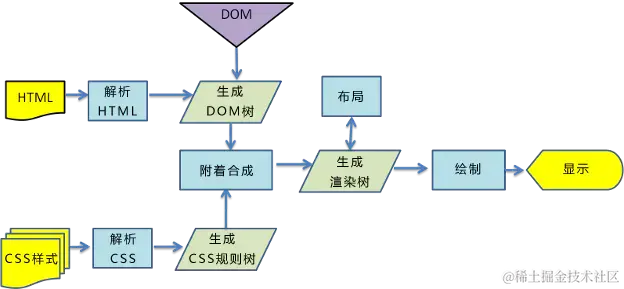 | 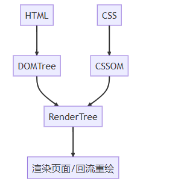 |

## 流程概述

| 过程                    | 描述                                                                                                                                                                                  |
| ----------------------- | ------------------------------------------------------------------------------------------------------------------------------------------------------------------------------------- |
| ① 解析 HTML             | 浏览器首先解析 HTML 文件，生成 `DOM` 树                                                                                                                                               |
| ② 解析 CSS              | 然后解析 CSS 文件，生成 `CSS OM` 树（`CSS Object Model`）                                                                                                                             |
| ③ 样式计算              | 根据 DOM 树和 CSSOM 树**计算出每个节点的具体样式**                                                                                                                                    |
| ④ 布局(`Layout`)        | 根据计算好的样式，浏览器生成布局树，确定页面上每个元素的**位置和尺寸**。 这个过程可能会触发回流（`Reflow`）                                                                       |
| ⑤ 分层(`Layer`)         | 确认了布局树后，主线程需要遍历整颗布局树来创建一棵层次树（Layer Tree），来确定哪些元素需要放置在哪一层， 然后为每个图层单独产生**绘制指令集**，用于描述这一层的内容该如何画出来。 |
| ⑥ 绘制(`Painting`)      | 浏览器将布局树中的元素**绘制到屏幕上**。这个过程称通常由`GPU`完成。绘制过程中，元素被分配到不同的图层中，这些图层最终组合在一起形成最终的页面。                                       |
| ⑦ 合成和显示(Composite) | 最后，浏览器将所有图层合成在一起，生成最终的页面内容并显示在屏幕上                                                                                                                    |

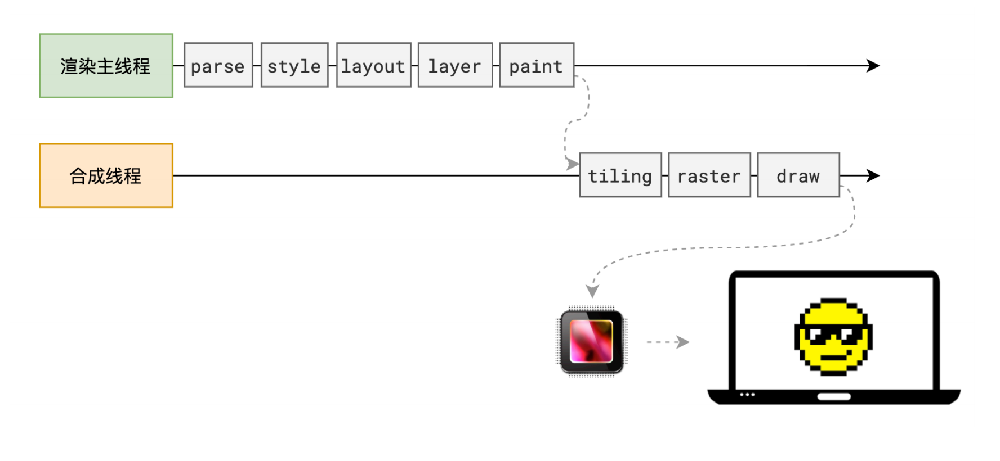

## 具体过程

### 1. 解析 HTML(DOM Tree)

- 浏览器渲染时会去请求对应的 HTML 文件。请求结果在网络中传输的内容其实都是 0 和 1 的**字节数据**。
- 浏览器会**将这些字节数据转换为字符串**，也就是我们写的代码。
- 拿到代码后将整个字符串进行**标记化**，**构建出对应的 DOM 树**（`Document Object Model Tree`）

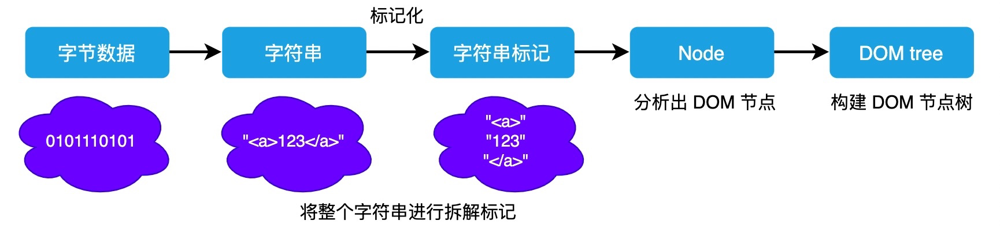

- DOM 树由 dom 元素及属性节点组成，树的根是 document 对象
  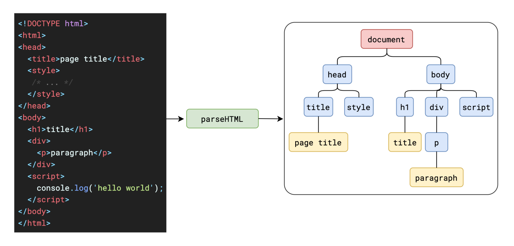

### 2. 解析 CSS(CSSOM Tree)

- 解析 CSS 得到 `CSSOM` 树，浏览器的默认样式、内部样式、外部样式、行内样式均会包含在 `CSSOM` 树中。
- 浏览器 CSS 解析器对 CSS 解析规则是**从右到左匹配查找**，如果选择器嵌套层数太多会造成 CSS Tree 加载变慢

#### 为什么 CSS 不会阻塞 HTML 解析

- 为了提高解析效率，浏览器在开始解析前，会启动一个**预解析的线程**，率先下载 HTML 中的外部 CSS 文件和外部的 JS 文件。
- 如果主线程解析到 link 位置，此时外部的 CSS 文件还没有下载解析好，**主线程不会等待，继续解析后续的 HTML**。这是因为**下载和解析 CSS 的工作是在预解析线程中进行的**，这就是 CSS 不会阻塞 HTML 解析的根本原因
  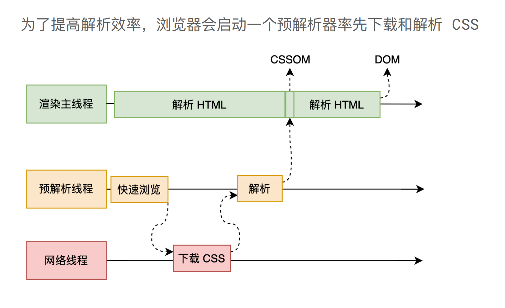
- 最终，CSS 的解析在经历了从字节数据、字符串、标记化后，最终也会形成一颗 CSSOM 树。
  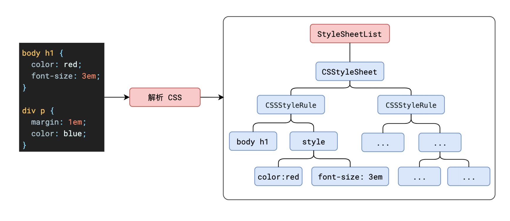

#### 为什么 JS 会阻塞 HTML 解析

- **如果主线程解析到 script 位置，会停止解析 HTML**，转而等待 JS 文件下载好，并将全局代码解析**执行完成**后，才能继续解析 HTML。
- 这是因为 **JS 代码的执行过程可能会修改当前的 DOM 树**，所以 DOM 树的生成必须暂停。这就是 JS 会阻塞 HTML 解析的根本原因
  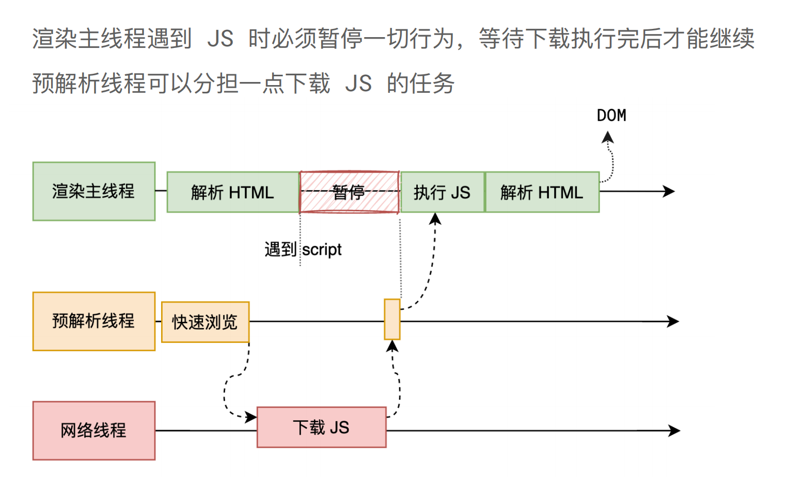

#### 首屏渲染优化

- 因此，如果你想首屏渲染的越快，建议将 script 标签放在 `body` 标签底部
- 在现代浏览器中，还可以通过 script 标签设置避免 JS 代码阻塞渲染的情况：`async`、`defer`、`prefetch`、`preload`

### 3. 样式计算(Render Tree)

浏览器根据 DOM 树和 CSSOM 树**计算出每个节点的具体样式**，这个过程称为样式计算。样式计算遵循 CSS 的继承和层叠规则，最终生成每个 DOM 节点的样式，并保存在 `ComputedStyle` 中。

> 需要注意的是，这里所指的浏览器确定每一个节点的样式，是指在样式计算时会对所有的 DOM 节点计算出所有的样式属性值。如果开发者在书写样式时，没有写某一项样式，那么大概率会使用其默认值

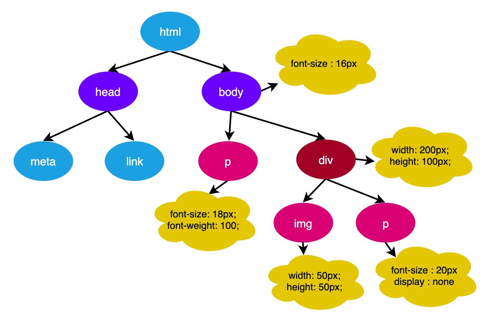

<!-- 1. 将 DOM 树和 CSSOM 树结合，一颗带有样式的 DOM 树，即渲染树(`Render Tree`) -->

### 4. 布局(Laouyt Tree)

- 根据计算好的样式，浏览器生成布局树，确定页面上每个元素的几何信息，如**位置和尺寸**。这个过程称为布局（`Layout`），可能会触发回流（`Reflow`）
- 生成布局树的具体过程是：主线程会遍历刚刚构建的 DOM 树，根据 DOM 节点的计算样式计算出一个布局树（`layout tree`）。布局树上每个节点会有它在页面上的 `x，y` 坐标以及**盒子大小**（bounding box sizes）的具体信息。
  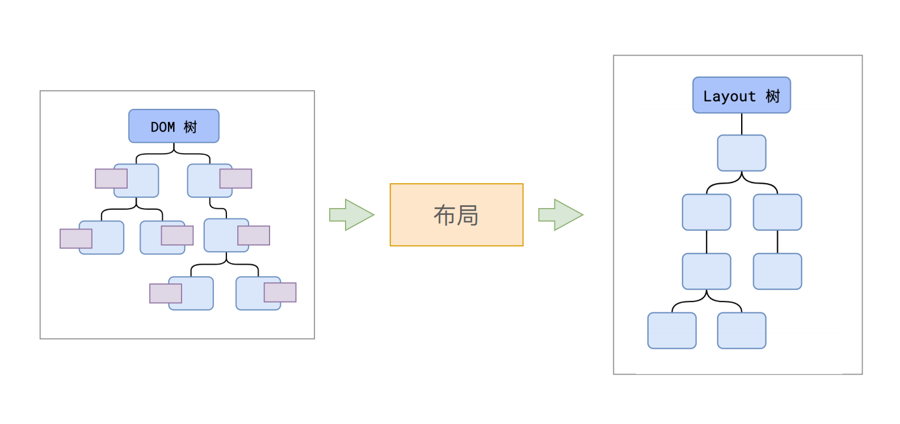
  > 布局树大部分时候，和 DOM 树并非一一对应。虽然它长得和先前构建的 DOM 树差不多，但是不同的是这颗树只有那些**可见的**（visible）节点信息。

### 5. 分层和生成绘制指令（layer Tree）

- 确认了布局树后，主线程需要遍历整颗布局树来创建一棵**层次树**（Layer Tree），来确定哪些元素需要放置在哪一层，
  > 分层的好处在于，将来某一个层改变后，仅会对该层进行后续处理，从而提升效率。
- 分层工作结束后，接下来就是**生成绘制指令**。主线程会为每个图层单独产生**绘制指令集**，用于描述这一层的内容该如何画出来。
- **生成绘制指令集后，渲染主线程的工程就暂时告一段落**，接下来主线程将每个图层的绘制信息提交给合成线程，**剩余工作将由合成线程完成**。
  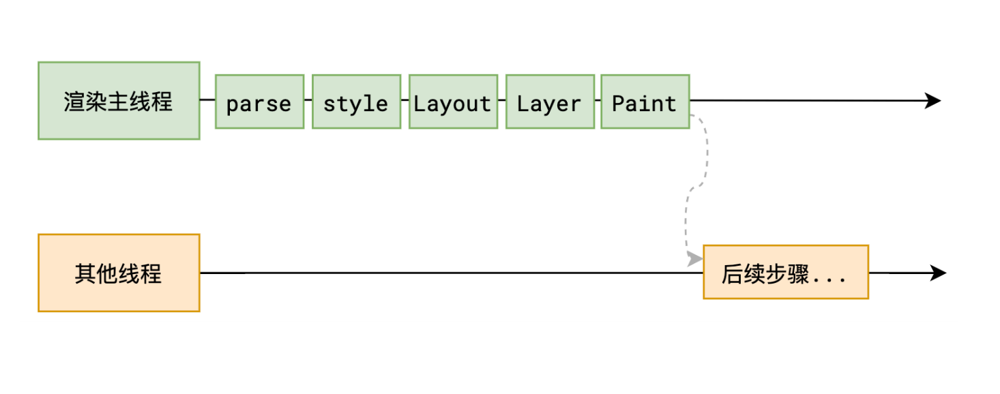

### 6‌. 绘制(Painting)

- 浏览器将布局树中的元素绘制到屏幕上。这个过程称为绘制（`Painting`），通常由 `GPU` 完成。
- 绘制过程中，**元素被分配到不同的图层中**，这些图层最终组合在一起形成最终的页面。
  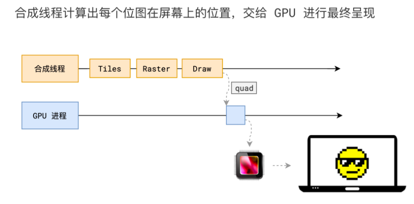

### 7. 合成和显示 （Composite）

最后，浏览器将所有图层合成在一起，生成最终的页面内容并显示在屏幕上。这个过程称为合成。

## 影响浏览器渲染性能的因素包括：

### 回流

#### 基础概念

- 当页面的布局和几何信息发生变化时，浏览器需要**重新计算元素的位置和尺寸**，这个过程称为回流。
- 回流会导致性能下降，因为整个页面可能需要重新渲染。

#### 回流触发时机

- 添加或删除可见的 DOM 元素
- 元素的**位置**发生变化
- 元素的 **尺寸（大小）** 发生变化(包括外边距、内边框、边框大小、高度和宽度等)。
- **内容**发生变化，比如文本变化或图片被另一个不同尺寸的图片所替代
- **页面一开始渲染的时候**(无法避免)
- **浏览器的窗口尺寸变化**(因为回流是根据视口的大小来计算元素的位置和大小的)
- 还有一些容易被忽略的操作：获取一些需要即时计算的特定属性的值（见【浏览器优化机制】）
  > - `offsetTop`、`offsetLeft`、 `offsetWidth`、`offsetHelgh`、 `scralTop`、`scrolLeft`、`scrollWidth`、`scrollHeight`、`clientTop`、`clientLeft`、`clientWidth`、`clientHeight`
  > - 这些属性有一个共性，就是**需要通过即时计算得到**。因此浏览器为了获取这些值，也会进行回流，除此还包括 `getComputedstyle` 方法，原理是一样的

### 重绘（Repaint）

#### 基础概念

当元素的**样式发生变化但不影响布局**时，浏览器只需要重新绘制该元素，这个过程称为重绘。重绘通常比回流更快。

#### 重绘触发时机

- **触发回流一定会触发重绘**(重绘不一定会触发回流)
- 颜色的修改
- 文本方向的修改
- 阴影的修改

### 图层化（Layering）

浏览器会将页面中的元素分配到不同的图层中，这样可以提高渲染效率。图层化可以减少不必要的回流和重绘，从而提高页面性能。

## 浏览器优化机制

- 由于每次重排都会造成额外的计算消耗，因此大多数浏览器都会通过**队列化修改并批量执行**来优化重排过程。
- 浏览器会将修改操作放入到队列里，直到过了一段时间或者操作达到了一个值，才清空队列
- **当你获取布局信息的操作的时候，会强制队列刷新**，包括前面讲到的 offsetTop 等方法都会返回最新的数据，因此浏览器不得不清空队列，触发回流重绘来返回正确的值

## 如何避免或减少重排和重绘

- 尽量避免频繁使用 style，而是使用修改 class 的方式
- 尽量只修改 `position：absolute` 或 `fixed` 元素，对其他元素影响不大
- 避免使用 table 布局，table 中每个元素的大小以及内容的改动，都会导致整个 table 的重新计算
- 在使用 JavaScript 动态插入多个节点时,可以使用 `DocumentFragment`,创建后一次插入,就能避免多次的渲染性能
- 对于那些复杂的动画，对其设置` position:fixed/absolute` ，尽可能地使元素脱离文档流从而减少对其他元素的影响
- ~~使用 css3 硬件加速，可以让 transform、opacity、filters 这些动画不会引起回流重绘~~
- 避免使用 CSS 的 JavaScript 表达式
- 对于 resize 和 scroll 进行防抖节流处理
- 集中改变样式，不要一条一条地修改 DOM 的样式。
- 不要把 DOM 结点的属性值放在循环里当成循环里的变量。
- 为动画的 HTML 元件使用 fixed 或 absoult 的 position，那么修改他们的 CSS 是不会 reflow 的。
<!-- - 动画开始 GPU 加速，translate 使用 3D 变化 -->
- 离线操作:通过设置元素属性 display:none ，将其从页面上去掉，然后再进行后续操作，这些后续操作也不会触发回流与重绘，这个过程称为离线操作,结束后再显示

## 问题

### 1.为什么 transform 效率高？

因为变形发生在合成线程，与渲染主线程无关
