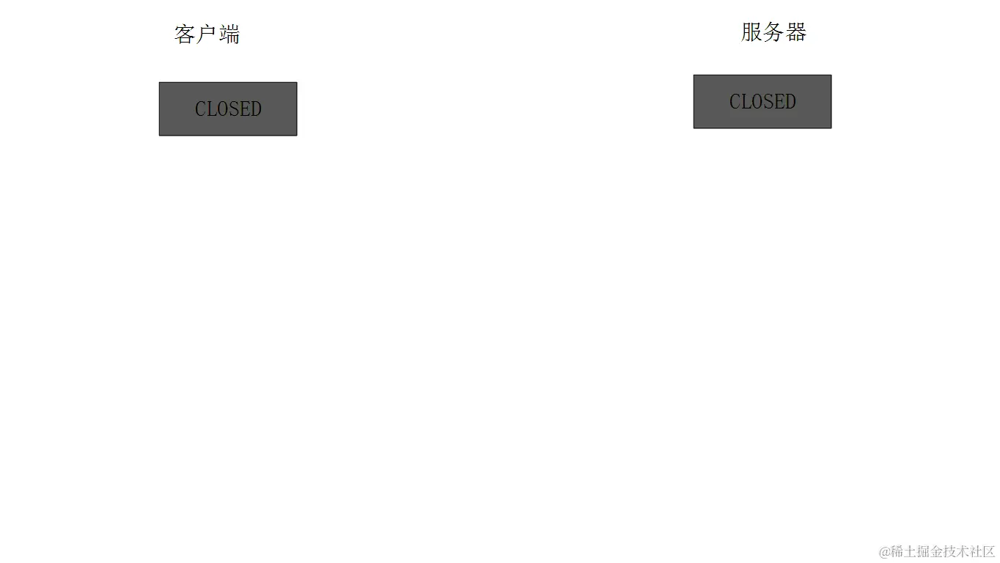
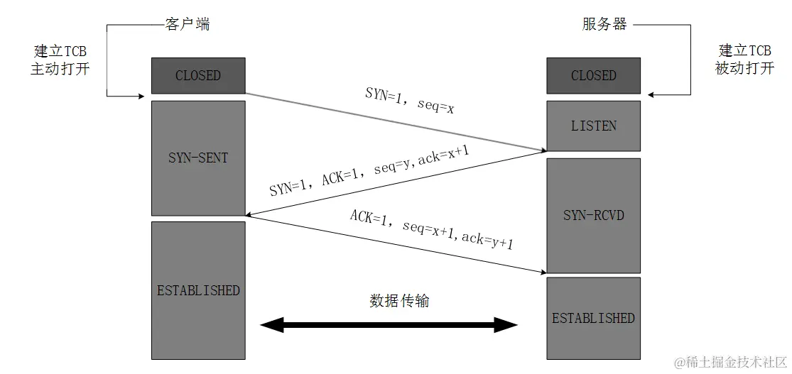
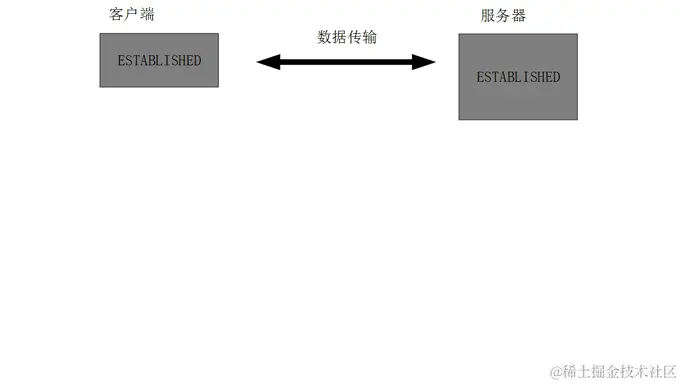
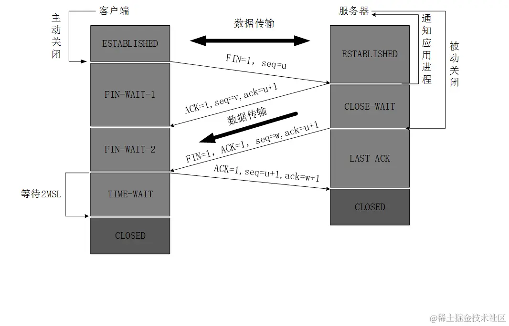

## （一）TCP

### 1. TCP（Transmission Control Protocol）的概述

**传输控制协议**（TCP，Transmission Control Protocol）：是一种面向**连接的**、**可靠的**、**基于字节流**的传输层通信协议，由 IETF 的 RFC 793 定义。

> - TCP 把连接作为最基本的对象，每一条 TCP 连接都有**两个端点**，这种断点我们叫作**套接字**（socket）
> - **IP 地址+端口号**即构成了套接字  
>   例如，若 IP 地址为 192.3.4.16 而端口号为 80，那么得到的套接字为 `192.3.4.16:80`。

### [ 延伸问题 ]

### （1）[TCP 和 UDP 有什么区别](https://blog.csdn.net/weixin_44887366/article/details/105187714)⚄

> UDP
> Internet 协议集支持一个**无连接的传输协议**，该协议称为**用户数据报协议**（UDP，User Datagram Protocol）。UDP 为应用程序提供了一种无需建立连接就可以发送封装的 IP 数据包的方法。RFC 768 描述了 UDP。

| 区别           | TCP                                                  | UDP                                                                                                         |
| -------------- | ---------------------------------------------------- | ----------------------------------------------------------------------------------------------------------- |
| 连接方面       | tcp 面向连接 （需要**三次握手四次挥手**请求连接） | udp 不需要连接 （知道对端的 IP 和端口号就直接进行传输）                                                  |
| 可靠性         | tcp 是**可靠传输** 一旦传输过程中丢包会进行重传   | udp 是**不可靠传输** 没有确认机制, 没有重传机制，但会最大努力交付                                        |
| 工作效率       | 比 UDP 工作效率低                                    | UDP 实时性高，比 TCP 工作效率高 因为不需要建立连接，更不需要复杂的握手挥手以及复杂的算法，也没有重传机制 |
| 是否支持多对多 | TCP 是**点对点**的                                   | UDP 支持**一对一，一对多，多对多**                                                                          |
| 首部大小       | tcp 首部占 20 字节                                   | udp 首部占 8 字节                                                                                           |

### （2）TCP 是如何保证可靠传输的 ⚄

- **校验和**  
  数据传输的过程中，每一个数据段都有一个 16 位的编号，将这些编号**加起来并取反**得出一个校验和，看收到后是否和之前的一致
- **序列号和确认应答**  
  每次发送数据的时候，服务端都会返回一个确认应答以及将要发送的序列号
- **超时重传**、滑动窗口、拥塞控制

### （3）为什么 TCP 要进行流量控制？⭐⭐⭐

为了解决**发送方和接收方的速率不一致**问题，如果发送方的速率过快的话，接收方处理不过来，只能放在**缓存区**，缓存区满了，就只能**丢包**了。所以需要进行流量控制

### （4）TCP 为什么会重传？⚄

- TCP 传输是**一应一答**的，如果中间丢包了的话，那么就会处于僵持状态
- 所以在发送时会设置一个**定时器**，一段时间（这个时间应该略大于一个发送来回的时间）如果没有收到对方**ACK 确认**的话，就会重新发送数据，这就是**超时重传**

> 如果要发送 12345 中间丢包的话，只收到了 1、3、4、5·，服务器检测出来，会连续发送三个 Ack=2，触发快速重传，在定时器之前就完成重传

### （5）TCP/IP / 如何保证数据包传输的有序可靠？

对字节流分段并进行编号然后`通过 ACK 回复`和`超时重发`这两个机制来保证。

- 发送方：
  - ① 为了保证数据包的可靠传递，发送方必须把**已发送的数据包**保留在**缓冲区**；
  - ② 并为每个已发送的数据包启动一个**超时定时器**；
  - ③ 如在定时器超时之前收到了对方发来的**应答信**息（可能是对本包的应答，也可以是对本包后续包的应答），则释放该数据包占用的缓冲区;
  - ④ 否则，重传该数据包，**直到收到应答或重传次数超过规定的最大次数为止**。
- 接收方
  - ⑤ 接收方收到数据包后，先进行**CRC 校验**，如果正确则把数据交给上层协议，然后给发送方发送一个累计应答包，表明该数据已收到，如果接收方正好也有数据要发给发送方，应答包也可方在数据包中捎带过去。

~~**TCP 的四种拥塞控制算法:**~~  
1.慢开始 2.拥塞控制 3.快重传 4.快恢复

### （6）~~tcp 的四元组是什么~~⚄

- 四元组：  
  源 IP 地址，目标 IP 地址，源端口，目标端口
- 五元组：  
  源 IP 地址，目标 IP 地址，**协议号**，源端口，目标端口
- 七元组：  
  源 IP 地址，目标 IP 地址，**协议号**，源端口，目标端口，**服务类型、接口索引**

## （二）[TCP 的三次握手和四次挥手](https://blog.csdn.net/qzcsu/article/details/72861891)

### 1. 三次握手(客-服-客)

- TCP 连接的建立，由服务器根据 ACK 决定是否建立连接
- 最开始的时候客户端和服务器都是处于 CLOSED 状态。  
  主动打开连接的为客户端，被动打开连接的是服务器。
- 详细过程如下
  > SYN：同步序列编号（Synchronize Sequence Numbers）。

| 序号                           | 解释                                                                                                                                         |
| ------------------------------ | -------------------------------------------------------------------------------------------------------------------------------------------- |
| 第一次握手 （客-`SYN`）     | **客户端**发送一个**SYN 码**给服务器， **要求建立数据连接**，（然后客户端进入 SYN_SENT 状态）                                                |
| 第二次握手 （服-`SYN+ACK`） | 服务端收到 SYN 后，给客户端返回一个**ACK+SYN（确认包）** 发送给客户端，**表示已收到 SYN，可以建立连接**；（然后服务端进入 SYN_RECEIVE 状态） |
| 第三次握手 （客-`ACK`）     | 最后客户端再向服务端发送一个 ACK 包表示**确认**，服务器**验证 ACK 没有问题，则建立起连接**；然后双方进入 ESTABLISHED 状态。                  |

### [ 延伸问题 ]

### （1）为什么 TCP 客户端最后还要发送一次确认呢？

一句话，主要防止**已经失效的连接请求报文突然又传送到了服务器**，从而产生错误和资源的浪费。

如果使用的是两次握手建立连接，假设有这样一种场景：

> - 客户端发送了第一个请求连接并且没有丢失，只是因为在网络结点中滞留的时间太长了，由于 TCP 的**客户端迟迟没有收到服务器的确认报文，以为服务器没有收到**，
> - 此时接着重新向服务器发送这条报文，此后客户端和服务器经过第二次握手完成连接，传输数据，然后**关闭连接**。
> - 此时此前滞留的那一次请求连接，网络通畅了到达了服务器，这个报文本该是失效的，但是，**两次握手的机制将会让客户端和服务器再次建立连接**，这将导致不必要的错误和资源的浪费。

如果采用的是三次握手，就算是那一次失效的报文传送过来了，**服务端接受到了那条失效报文并且回复了确认报文，但是客户端不会再次发出确认**。由于服务器收不到确认，就知道客户端并没有请求连接。

### 2. [四次挥手](https://juejin.cn/post/7016593221815910408#heading-5)(客-服-服-客)

- 数据传输完毕后，双方都可释放连接。
- 最开始的时候，客户端和服务器都是处于 ESTABLISHED 状态（建立连接。表示两台机器正在通信），
- 然后**客户端主动关闭，服务器被动关闭**。
- 详细过程如下
  - 首先客户端向服务端发送一个 FIN 包，进入 FIN_WAIT1 状态，
  - 服务端收到后，向客户端发送 ACK 确认包，进入 CLOSE_WAIT 状态，
  - 然后客户端收到 ACK 包后进入 FIN_WAIT2 状态，
  - 然后服务端再把自己剩余没传完的数据发送给客户端，发送完毕后在发送一个 FIN+ACK 包，进入 LAST_ACK（最后确认）状态，
  - 客户端收到 FIN+ACK 包后，再向服务端发送 ACK 包，在等待**两个周期**后再关闭连接

| 序号                        | 解释                                                                                                                                                                |
| --------------------------- | ------------------------------------------------------------------------------------------------------------------------------------------------------------------- |
| 第一次挥手 （客-`FI1N`） | 客户端发送**FIN(结束)报文**，通知服务器**数据已经传输完毕**（但是还能接收数据），进入 FIN-WAIT-1（终止等待 1）状态                                                  |
| 第二次挥手 （服-`ACK`）  | 服务器接收到连接释放报文，发出确认报文，通知客户端我收到了 SYN,发送**ACK**(确认)给客户端，**告诉对方还有数据要传输完成**，服务端就进入了 CLOSE-WAIT（关闭等待）状态 |
| 第三次挥手 （服-`FIN`）  | 服务器已经传输完毕，**再次发送 FIN 通知客户端**，数据已经传输完毕，服务端进入 LAST-ACK（最后确认）状态                                                              |
| 第四次挥手 （客-`ACK`）  | 客户端**再次发送 ACK**,进入 TIME_WAIT 状态；服务器和客户端关闭连接；                                                                                                |

### [ 延伸问题 ]

### （1） 为什么建立连接是三次握手，而断开连接是四次挥手呢?

- **四次挥手是为了避免还有数据没传完连接就被关闭；**
- 建立连接的时候， 服务器在 LISTEN 状态下，收到建立连接请求的 SYN 报文后，把 ACK 和 SYN 放在一个报文里发送给客户端。
- 而关闭连接时，服务器收到对方的 FIN 报文时，仅仅表示**对方不再发送数据了但是还能接收数据**，
  - 而自己也未必全部数据都发送给对方了，所以己方可以立即关闭，也可以发送一些数据给对方后，
  - 等全部传输完毕，再发送 FIN 报文给对方来表示同意现在关闭连接，
  - 因此，己方**ACK 和 FIN 一般都会分开发送**，从而导致多了一次。

### （2）为什么等待两个周期后再关闭连接

之所以等待两个周期是因为最**后客户端发送的 ACK 包可能会丢失**，如果不等待 2 个周期的话，服务端在没收到 ACK 包之前，会不停的重复发送 FIN 包而不关闭，所以得等待两个周期

### 3. 有意思的理解：

`基本思想：“让我知道你已经知道了”`

**（1）3 次握手**：

- 客户端： 听得到吗？（第 1 次握手-`SYN_SENT`）
- 服务端： 听得到，你呢？（第 2 次握手-`SYN_RECEIVE`）
- 客户端： 我也听到了。（第 3 次握手-`ESTABLISHED`）

模拟信号不好打电话时的情况一样：确认双方都能听到，然后才开始真正对话 （避免因听不到而产生数据的丢失）

**（2）4 次挥手：**

- 客户端： 我的内容讲完了，可以准备结束通话了（ `FIN-WAIT-1`）
- 服务端： 好，我知道了，我还有一点要说完。(`CLOSE-WAIT`)
- 服务端： 好了，说完了，结束吧。(`LAST-ACK`)
- 客户端： 收到，那我这边也结束了，(`TIME_WAIT`)

模拟确认双方话都说完再挂电话,避免突然被挂断
