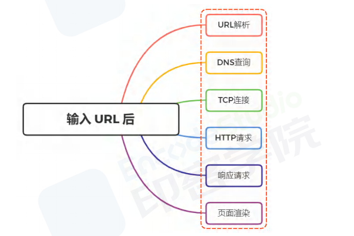
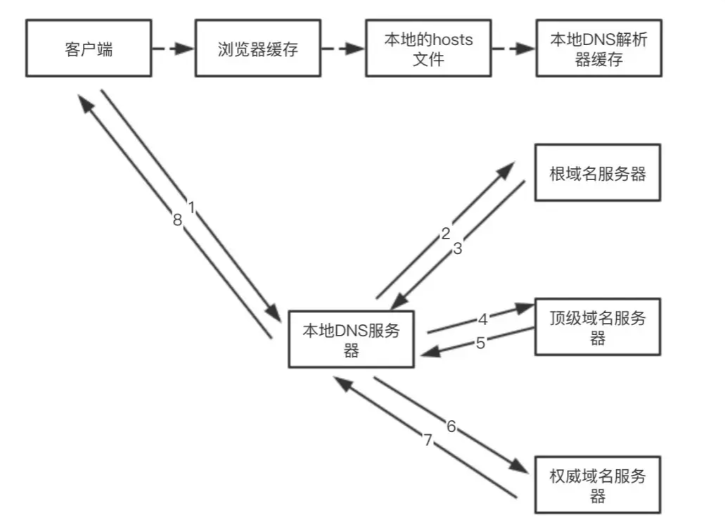
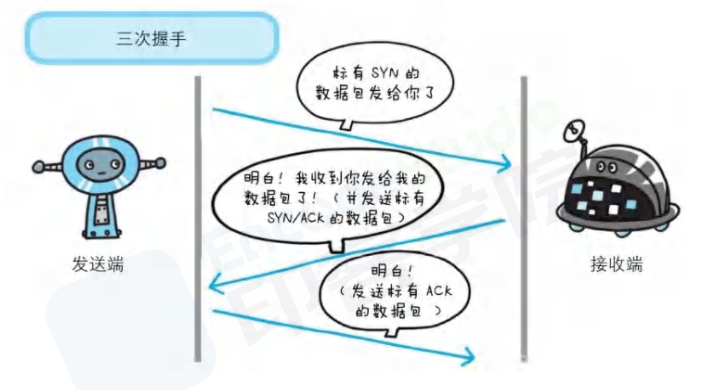
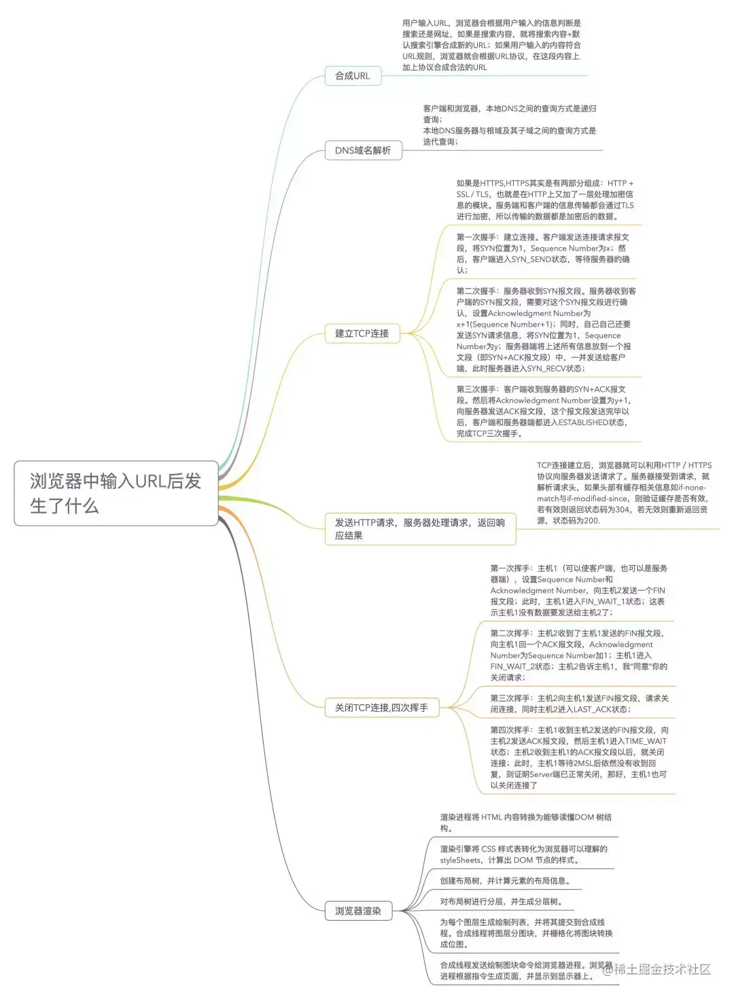

## [从浏览器输入 url 后都经历了什么](https://www.cnblogs.com/qianduanpiaoge/p/14152069.html)

### 1. URL 解析

- 浏览器会根据用户输入的信息**判断是搜索内容还是网址**
  - 如果是搜索内容，就将搜索内容+默认搜索引擎**合成新的 URL**;
  - 如果用户输入的是合法的 URL
- 则查找当前 URL 是否存在 **浏览器缓存**，
  > 浏览器缓存是在本地保存资源副本，然后在缓存中查询是否有要请求的文件。
  - 如果缓存查找成功，则拦截并结束请求，返回缓存资源的副本
  - 如果缓存查找失败，就会进入网络请求过程，即 DNS 查询

### 2. [DNS 查询](https://juejin.cn/post/6871947938701475847)

`DNS` 会根据 url，解析域名对应的`IP 和端口号`

<!--  -->

### 3. TCP 连接[(三次握手)](/blogs/network/tcp.html)

在确定目标服务器的 IP 地址后，则经历**三次握手**建立 TCP 连接，

### 4. 发送 HTTP 请求(HTTP 缓存)

当建立 tcp 连接之后，**连接到了 Web 服务器**，就可以在这基础上进行通信，浏览器会根据 IP 地址和端口号发起 HTTP 请求

### 5. 服务器响应请求

- 当服务器接收到浏览器的请求之后，就会进行逻辑操作，处理完成之后返回一个 HTTP 响应消息

### 6. 关闭 TCP 连接[(四次挥手)](/blogs/network/tcp.html)

在服务器响应之后，由于现在 http 默认开始长连接 keep-alive ，当页面关闭之后，会经过**四次挥手**完成断开

### 7. [页面渲染](/blogs/css/layoutPainting.html)

（知识点：浏览器渲染的主要流程）

## 总结

