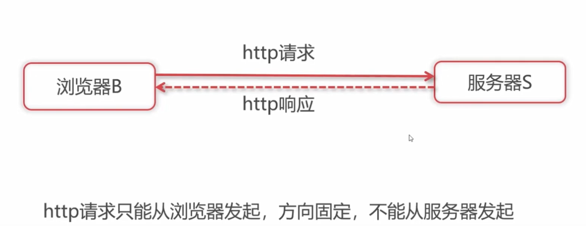
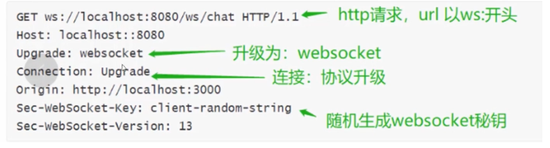
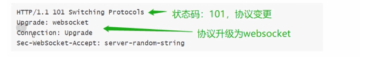
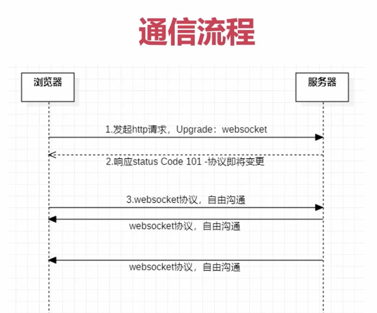
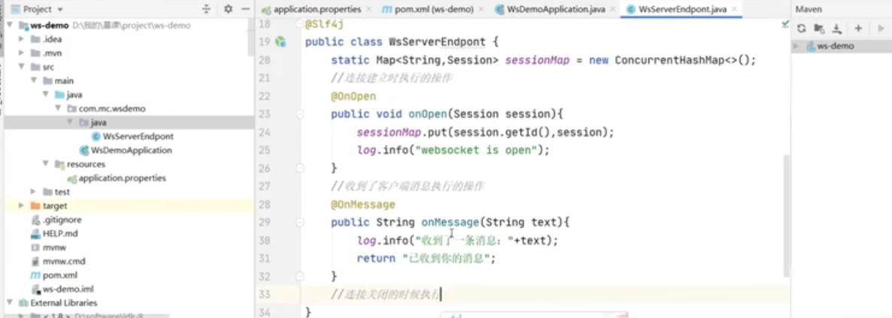
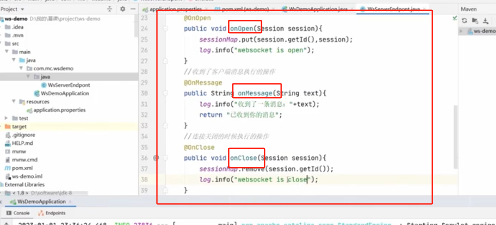
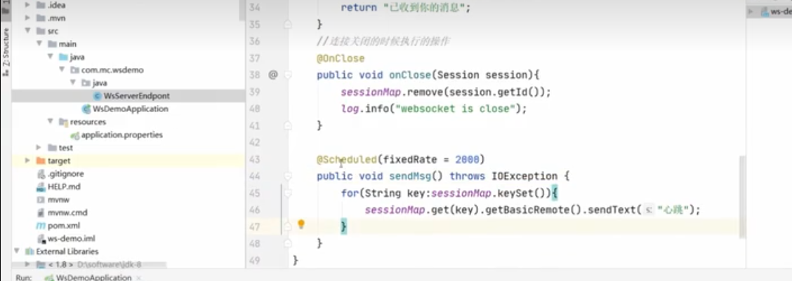
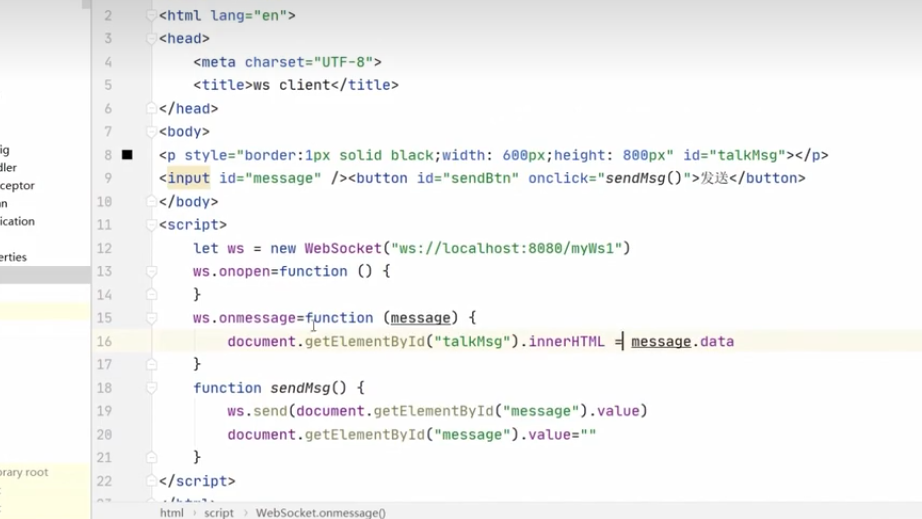

# [【WebSocket】](https://developer.mozilla.org/en-US/docs/Web/API/WebSocket)

## [API](https://www.ruanyifeng.com/blog/2017/05/websocket.html)

| 属性                | 描述         |     |
| ------------------- | ------------ | --- |
| ws.close()          | 主动断开连接 |     |
| ws.send("message"); | 主动发送消息 |     |

## 什么是 WebSocket

WebSocket 是一种在**单个 TCP 连接**上进行**全双工通信**的协议。

## WebSocket 的特点包括：

1. **服务器可以主动向客户端推送信息**，客户端也可以主动向服务器发送信息。
1. 建立在 `TCP `协议之上，服务器端的实现比较容易。
1. WebSocket 本质上一种**计算机网络应用层的协议**，用来**弥补 http 协议在持久通信能力上的不足**。
1. 在 WebSocket API 中，**浏览器和服务器只需要完成一次握手**（用来告诉服务器需要切换 WebSocket 协议），两者之间就直接可以创建持久性的连接， 并进行双向数据传输。
1. 与 HTTP 协议有着良好的兼容性。默认端口也是 `80` 和 `443`，并且**握手阶段采用 HTTP 协议**，因此握手时不容易屏蔽，能通过各种 HTTP 代理服务器。
1. 数据格式比较轻量，性能开销小，通信高效。
1. 可以发送文本，也可以发送二进制数据。
1. **WebSocket 没有同源限制**，客户端可以与任意服务器通信。
1. 协议标识符是 `ws`（如果加密，则为 `wss`），服务器网址就是 URL。

## 为什么需要 WebSocket

- **因为 HTTP 协议有一个缺陷：通信只能由客户端发起，不具备服务器推送能力**。(注意：虽然 HTTP/2 也具备服务器推送功能，但 HTTP/2 只能推送静态资源，无法推送指定的信息。)
- 在 WebSocket 协议出现以前，创建一个和服务端进双通道通信的 web 应用，需要依赖 HTTP 协议，进行不停的轮询，这会导致一些问题：
  - 服务端被迫维持来自每个客户端的大量不同的连接
  - 大量的轮询请求会造成高开销，比如会带上多余的 header，造成了无用的数据传输。
    

## WebSocket 与 HTTP 的区别

- 相同点： 都是一样基于 `TCP` 的，都是**可靠性传输**协议。都是**应用层协议**。
- 联系： WebSocket **在建立握手时**，数据是通过 HTTP 传输的。但是建立之后，在真正传输时候是不需要 HTTP 协议的。
- 区别
  1. WebSocket 是**双向**通信协议，模拟 Socket 协议，可以双向发送或接受信息，而 HTTP 是**单向**的(一个 Request 一个 Response )；
  2. WebSocket 是需要浏览器和服务器**握手**进行建立连接的，而 http 是浏览器发起向服务器的连接。

## WebSocket 协议的原理

- 与 http 协议一样，WebSocket 协议也需要**通过已建立的 TCP 连接来传输数据**。
- 具体实现上是**通过 http 协议建立通道**，然后在此基础上用真正的 WebSocket 协议进行通信，所以 WebSocket 协议和 http 协议是有一定的交叉关系的。

## WebSocket 连接的过程

1. 浏览器发起 http 请求，请求建立 WebSocket 连接  
   首先，客户端发起 http 请求，经过 3 次握手后，建立起 TCP 连接；http 请求里存放 WebSocket 支持的版本号等信息，如：`Upgrade`、`Connection`、`WebSocket-Version` 等；
   
1. 服务器响应同意协议更改
   <!-- 服务器收到客户端的握手请求后，同样采用 HTTP 协议回馈数据； -->
   
1. 最后，客户端收到连接成功的消息后，开始借助于 TCP 传输信道进行**全双工通信**。



## WebSocket 应用场景

- 即时聊天通信
- 在线协同编辑/编辑
- 实时数据流的拉取与推送
- 实时地图位置

## websocket 断线重连

### 如何判断在线离线？

- 当客户端第一次发送请求至服务端时会携带**唯一标识、以及时间戳**，服务端到 db 或者缓存去查询改请求的唯一标识，如果不存在就**存入 db 或者缓存中**，
- 第二次客户端定时再次发送请求依旧携带唯一标识、以及时间戳，服务端到 db 或者缓存去查询改请求的唯一标识，**如果存在就把上次的时间戳拿取出来，使用当前时间戳减去上次的时间**，
- 得出的毫秒秒数判断是否大于指定的时间，**若小于的话就是在线，否则就是离线**；

### 如何解决断线问题

- 断线的可能原因
  1. websocket 超时没有消息自动断开连接  
     应对措施：了解服务端设置的超时时长，在小于超时时间内**发送心跳包**
  2. websocket 异常包括服务端出现中断，交互切屏等等客户端异常中断等等  
     针对这种异常的中断解决方案就是**处理重连**

### 心跳包&重连机制

::: example
blogs/network/webSocket/Heartbeat
:::

- 客户端每隔一个时间间隔发生一个探测包给服务器
- 客户端**发包时启动一个超时定时器**
- 服务器端接收到检测包，应该回应一个包
- 如果客户机收到服务器的应答包，则说明**服务器正常应答，删除超时定时器**
- 如果客户端的超时定时器超时，依然没有收到应答包，则说明服务器挂了

```js{11,37,40,46,89}
// myWebSocket.js
// import KdxfShare from 'KdxfShare'
// import Bus from 'Bus'
const TIMEOUT = 10 * 1000 // 10秒一次心跳
export default class MyWebSocket {
  constructor(wsUrl, options) {
    this.wsUrl = wsUrl
    this.webSocketId = null
    this.$socket = null //保存WebSocket 实例
    this.timeoutServerHeartbeat = null // 服务心跳倒计时
    this.timeoutHeartbeat = null // 心跳倒计时
    this.lockReconnect = false // 是否真正建立连接
    this.timeoutReconnect = null // 断开 重连倒计时
    this.initWebSocket() // 执行初始化方法
  }
  // 【初始化】
  initWebSocket() {
    let id = new Date().getTime()
    this.webSocketId = id //生成实例的唯一id
    // let token = await KdxfShare.getKdxfToken()
    if ('WebSocket' in window) {
      // socket = new WebSocket(wsUrl, token)
      this.$socket = new WebSocket(this.wsUrl)
      console.log('【 this.$socket 】-26', this.$socket)
      this.$socket.customId = id
      this.$socket.onopen = this.openWebsocket.bind(this) //建立连接成功，开启心跳
      this.$socket.onmessage = this.onMessage
      this.$socket.onerror = this.onError
      this.$socket.onclose = this.closeWebsocket.bind(this) //监听关闭重连
    } else {
      throw new Error('您的浏览器不支持websocket，请更换Chrome或者Firefox')
    }
  }
  // 【建立连接】
  openWebsocket(e) {
    console.log(`【${this.webSocketId}】WebSocket连接成功`)
    this.startHeartbeat() //开启心跳监听
  }
  // 【开启心跳】
  startHeartbeat() {
    // 清空旧的定时器并重新开启定时器
    this.timeoutHeartbeat && clearTimeout(this.timeoutHeartbeat)
    // 定时检查连接状态
    this.timeoutHeartbeat = setInterval(() => {
      // 如果连接正常
      if (this.$socket.readyState == 1) {
        console.log(`心跳【${this.webSocketId}】正常连接`)
      } else {
        this.$socket.close() //否则重连（关闭时会触发$socket.onclose ，从而执行closeWebsocket）
      }
    }, TIMEOUT)
  }
  // 【发送数据】
  sendWebsocket(msg) {
    console.log('【 sendWebsocket 】-27', msg)
    this.$socket.send(msg)
  }
  // 【接收服务器返回的数据】
  onMessage(e) {
    console.log('【 接收服务器返回的数据 】-78', e.data)
    if (!e) {
      this.resetHeartbeat() //
      return
    }
    // Bus.$emit('getWebSocketOnMessage', e.data)
    return e
  }
  // 【获取id】
  getId() {
    return this.webSocketId
  }
  // 【断开连接】
  close() {
    console.log('【 close 】-76====')
    this.$socket.close() // WebSocket对象也有发送和关闭的两个方法，只需要在自定义方法中分别调用send()和close()即可实现。
  }
  // 【关闭连接-重连】
  closeWebsocket(e) {
    // 执行this.$socket.close()会触发closeWebsocket
    console.log('【 关闭连接-重连 】-80', e)
    this.reConnect()
  }
  // 连接出错时，重连
  onError(e) {
    this.initWebSocket()
    this.reConnect()
  }
  // 重新连接
  reConnect() {
    console.log('【 重新连接 】-89')
    if (this.lockReconnect) {
      return
    }
    this.lockReconnect = true
    // 没连接上会一直重连，设置延迟避免请求过多
    this.timeoutReconnect && clearTimeout(this.timeoutReconnect)
    this.timeoutReconnect = setTimeout(() => {
      // 新连接
      this.initWebSocket()
      this.lockReconnect = false//重新连接成功，不成功的话会继续进入onError
    }, 1000)
  }
  // 【重置心跳】
  resetHeartbeat() {
    // 清除时间
    clearTimeout(this.timeoutHeartbeat)
    clearTimeout(this.timeoutServerHeartbeat)
    this.startHeartbeat() // 重启心跳
  }
}
```

  <!-- JAVA-示例 -->
  <!-- 
  
   -->

<!--  -->

## 示例

### 服务端 Node

- 运行下列文件内容，启动 node 服务器
  > - 启动：定位到 nodeServer.js 的目录下，运行： `node nodeServer.js` 或`nodemon nodeServer.js` (
  > - (nodemon 安装 `npm i -g nodemon`, ws 安装 ：`npm install ws`)

```js{23,28,32}
// nodeServer.js
/*
- 安装npm install ws
- 启动：定位到当前文件下运行： node nodeServer.js 或nodemon nodeServer.js (安装 npm i -g nodemon)
- 参考地址：https://blog.csdn.net/m0_37911706/article/details/128057137
*/
//创建一个WebSocket服务器，在8080端口启动
const WebSocket = require('ws')
const server = new WebSocket.Server({
  port: 8080 //绑定服务器的端口号
})

server.on('open', function open(message) {
  console.log('【 open======= 】-58', message)
})
// 关闭WebSocket服务器：通过监听close事件关闭服务器
server.on('close', function close() {
  console.log(`关闭连接========`, ws, req)
})

// 只要有WebSocket连接到该服务器，就会触发'connection'事件；req对象可以用来获取客户端的信息，如ip、端口号
// 获取所有已连接的客户端信息，则可以使用server.clients数据集
server.on('connection', function connection(ws, req) {
  const ip = req.socket.remoteAddress
  const port = req.socket.remotePort
  const clientName = ip + '_' + port
  console.log(`编号为【${clientName}】的用户，连接成功`)
  ws.send(`你好，编号为【${clientName}】的用户`)

  // 接收数据：ws通过message事件来接收数据。当客户端有消息发送给服务器时，服务器就能够触发该消息
  ws.on('message', function incoming(message) {
    ws.send(`【${clientName}】${message}`)
    console.log(`来自【${clientName}】的消息${message}`)
    // 使用server.clients 获取所有已连接的客户端信息
    // server.clients.forEach(function each(client) {
    //     if (client.readyState === WebSocket.OPEN) {
    //         client.send(clientName + " -> " + message)
    //     }
    // })
  })
  // 关闭连接
  ws.on('close', function close() {
    console.log(`用户【${clientName}】关闭连接`)
  })
  ws.on('error', function open() {
    console.log('error')
    ws.send('ws.on-error')
  })
})
console.log('WebSocket server is running on ws://localhost:8080')
```

### 客户端

::: example
blogs/network/webSocket/demoAPI
:::

## 参考资料

> - [一文吃透 WebSocket 原理](https://juejin.cn/post/7020964728386093093)
> - [WebSocket 入门与案例实战](https://www.bilibili.com/video/BV1hF411k7bj/?p=7&share_source=copy_web&vd_source=9f129c82f173049a4e396b82a477d8e1)
> - [Node.js 实现 WebSocket 后台服务](https://blog.csdn.net/m0_37911706/article/details/128057137)
> - [WebSocket 教程-阮一峰](https://www.ruanyifeng.com/blog/2017/05/websocket.html)
