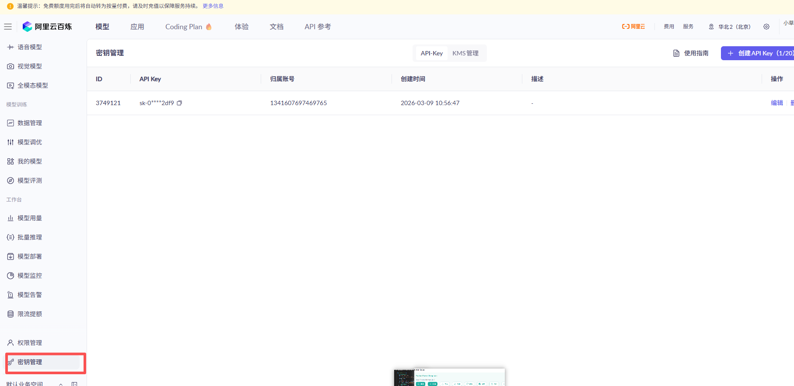

- 学习地址
> 课程： https://www.bilibili.com/video/BV1yjz5BLEoY?spm_id_from=333.788.player.switch&vd_source=9d75580d0b23d1137d56e03a996ac726&p=2
> API： https://bailian.console.aliyun.com/cn-beijing/?tab=model#/api-key

## No.2
- Python安装openai： `pip install openai -i  https://pypi.tuna.tsinghua.edu.cn/simple`
- [pycharm安装](https://www.runoob.com/w3cnote/pycharm-windows-install.html)