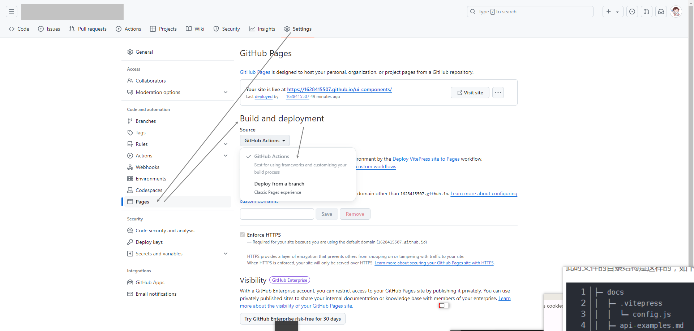
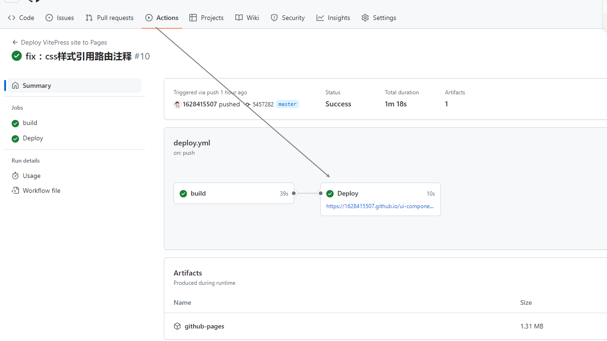

# Github Pages 发布

> 参考地址：
>
> 1. [VitePress 学习指南 | 部署篇](https://juejin.cn/post/7361629576416739369)
> 2. [VitePress 官方文档](https://vitepress.dev/guide/deploy#github-pages)

## 前置准备
- 创建 docs 项目
- 在`docs/.vitepress/config.mts`中设置`base`路径
- `docs/.vitepress/theme/index.ts`中 ZUiComp 的引用路径需改成引用本项目的相对路径，否则打包发布的时候会报错
- 路径内容需要和 github 的项目名称一致，否则发布后会出现资源找不到的问题
- 已创建好项目，发布前可以执行`npm run docs:build`看打包是否报错

```ts{3}
// config.mts...
export default defineConfig({
  base: '/ui-components/',//基本路径
  // ...
})
```

## 创建 yml 文件

- 在项目根目录创建 .github 文件夹，然后在其中创建 workflows 目录，新建 deploy.yml 文件。
- 文件内容如下

```yml{11,40,45,47,51}
# 构建 VitePress 站点并将其部署到 GitHub Pages 的示例工作流程
name: Deploy VitePress site to Pages

on:
  # 在针对 `main` 分支的推送上运行
  # 如果是使用 `master` 分支作为默认分支，请将其更改为 `master`
  push:
    branches: [master] # 当push到master分支时触发

  # 允许你从 Actions 选项卡手动运行此工作流程
  workflow_dispatch:

# 设置 GITHUB_TOKEN 的权限，以允许部署到 GitHub Pages
permissions:
  contents: read
  pages: write
  id-token: write

# 只允许同时进行一次部署，跳过正在运行和最新队列之间的运行队列
# 但是，不要取消正在进行的运行，因为我们希望允许这些生产部署完成
concurrency:
  group: pages
  cancel-in-progress: false

jobs:
  # 构建工作
  build:
    runs-on: ubuntu-latest
    steps:
      - name: Checkout
        uses: actions/checkout@v4
        with:
          fetch-depth: 0 # 如果未启用 lastUpdated，则不需要
      - name: Setup Node
        uses: actions/setup-node@v4
        with:
          node-version: 18.15.0 # 指定需要的 node 版本
          cache: npm
      - name: Setup Pages
        uses: actions/configure-pages@v4
      - name: Install dependencies
        run: npm ci # 或 pnpm install / yarn install / bun install
      - name: Build with VitePress
        run: npm run docs:build # 或 pnpm docs:build / yarn docs:build / bun run docs:build
      - name: Upload artifact
        uses: actions/upload-pages-artifact@v3
        with:
          path: docs/.vitepress/dist

  # 部署工作
  deploy:
    environment:
      name: github-pages
      url: ${{ steps.deployment.outputs.page_url }}
    needs: build
    runs-on: ubuntu-latest
    name: Deploy
    steps:
      - name: Deploy to GitHub Pages
        id: deployment
        uses: actions/deploy-pages@v4
```

## GitHub 配置

- 然后进入到 GitHub 中的 Settings 页面，点击左侧的 Pages 菜单，在 Build and deployment 标题下，选择 Source 为 GitHub Actions。
  <!-- 插入图片 -->
- 配置成功后，当我们把本地代码推送到 GitHub 上的 master 分支时，就会触发 GitHub Actions 自动进入构建和部署工作流中。

## 验证发布结果

- 可以点击 Actions 选项，检查项目是否部署成功。成功后可点击 deploy 对应的路径进行访问
  <!-- 插入图片 -->
