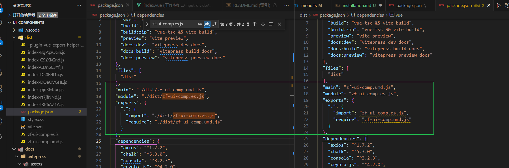

# 安装

分为 **npm 安装**和 **压缩包安装** 两种安装方式

## npm 安装

```
  npm install z-ui-comp --save
```

## 压缩包安装

- 在根目录下执行 `npm run build:zip`
- 打包完成后，将根目录下的 `package.json` 复制到 dist 目录中     
  将复制的 package.json 中的`./dist/z-ui-comp.umd.js`改为`z-ui-comp.umd.js`  
  将复制的 package.json 中的`./dist/z-ui-comp.es.js`改为`z-ui-comp.es.js`  
  <!-- 插入图片 -->
- 在根目录下执行 `tar zcvf z-ui-comp.tar.gz -C ./dist .`打成压缩包  
  （如果vscode内置的终端无法执行，可以用git执行）
- 将打成的压缩包复制到需要的项目目录下
- 在对应项目中执行 `npm install 压缩包地址`，解压到 node_modules 中    
  如 `npm install ./pkg/z-ui-comp.tar.gz`

