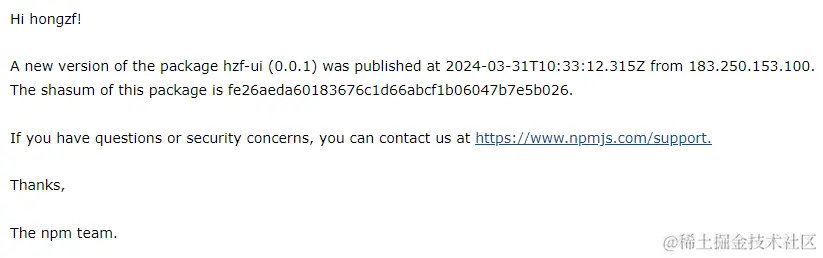

<!--
 * @Description:
 * @Date: 2025-01-06 16:10:23
 * @LastEditTime: 2025-01-06 16:58:57
-->

# npm 包上传

## （一）创建 npm 项目

- 在项目的根目录下通过`npm init`生成 package.json 文件
  
- 编写需要的组件代码，并在入口文件中引入导出
  

## （二）上传 npm

### 1. 注册 npm 账号

- 到[npm 官网](https://www.npmjs.com/)注册自己的 npm 账号（首次注册需要邮箱验证）

### 2. 配置 npm 代理

- `npm config get registry`
- 切换为 npm 源：`npm config set registry https://registry.npmjs.org`
  
  （ 后面发布完可以切回原来的镜像地址：npm config get registry）

### 3. npm 登录

- 执行`npm login`：输入账号，密码、邮箱（没有的话需要先申请）
  - 会自动打开 npm 网页，并发验证码到个人邮箱
    
    
  - 查看邮箱输入验证码则登录成功
    

### 4. 发布前校验

- [发布前先验证包名是否已存在](https://blog.csdn.net/weixin_51499232/article/details/124940480)(建议使用 git 的终端操作)
- `npm view 【你的npm包名】`
- 如果已存在，则会显示对应的包信息和版本名称
  
- 不存在则显示如下信息
  

### 5. 发布 npm 包

- 执行命令：`npm publish`，出现如下界面则表示发布成功
  
  
- 以下几种情况会发布失败
  - 包名已存在
  - 版本号和已上传的包的版本号相同
  - @符号代表私有收费的，所以名称不能包含
  - 不能有斜杠等特殊符号

### 5. 查看发布的包

- 在[npm](https://www.npmjs.com/)官网中点击 Packages 可以查看自己上传的包，点击包名，可以看到 npm 下载包的命令
  

## （三） 下载使用
