# AI大模型
> 脑图：https://docs.qq.com/mind/DWkdKVnhQUWtrYmtJ
> 课程： https://www.bilibili.com/video/BV1yjz5BLEoY?spm_id_from=333.788.player.switch&vd_source=9d75580d0b23d1137d56e03a996ac726&p=2
> 配套资料：https://pan.baidu.com/s/1kQ-Q7UFWuHEbawQ4SStNSQ?pwd=1234
> API： https://bailian.console.aliyun.com/cn-beijing/?tab=model#/api-key
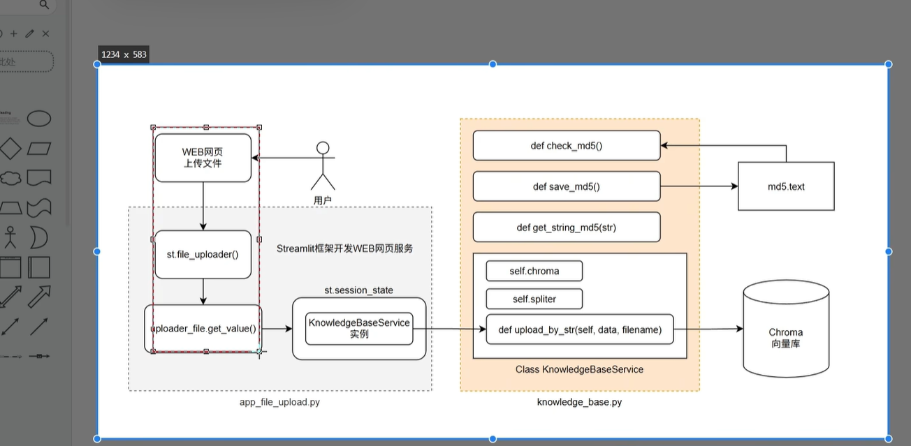
------------------------------

## 01 apiKey调用
- Python安装openai： `pip install openai -i  https://pypi.tuna.tsinghua.edu.cn/simple`
- [pycharm安装](https://www.runoob.com/w3cnote/pycharm-windows-install.html)

------------------------------
## [02 Ollama](https://www.bilibili.com/video/BV1yjz5BLEoY?spm_id_from=333.788.player.switch&vd_source=9d75580d0b23d1137d56e03a996ac726&p=5)
### Ollama简介
- 开源软件，支持在本地运行模型

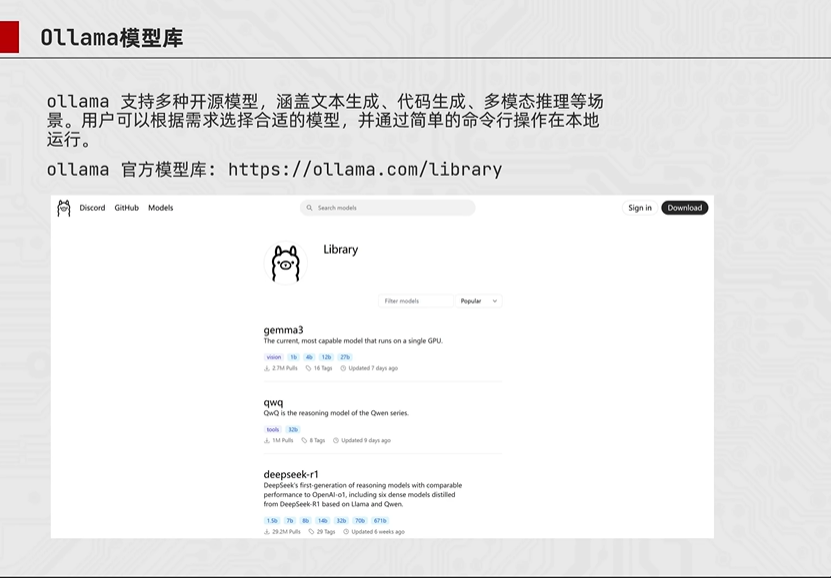

- 蒸馏模型，参数量越大，效果越好，但是也更吃电脑性能（性能支持越好，回答问题的速度越快）
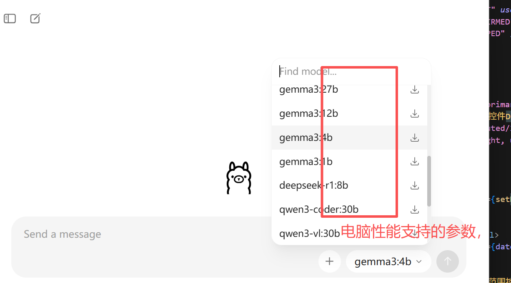

### 本地如何使用Ollama
- 启动Ollama
- 调整配置文件的`base_url`和`model`

------------------------------
## 03 [OpenAI库的基础使用](https://www.bilibili.com/video/BV1yjz5BLEoY?spm_id_from=333.788.player.switch&vd_source=9d75580d0b23d1137d56e03a996ac726&p=8)
### 常见命令
1. 查看当前安装的模型名称：`ollama list`
2. 删除问题模型：`ollama rm <模型名称>`
3. 重新下载模型：`ollama pull <模型名称>`

- 回复越多，消耗的tokens越多
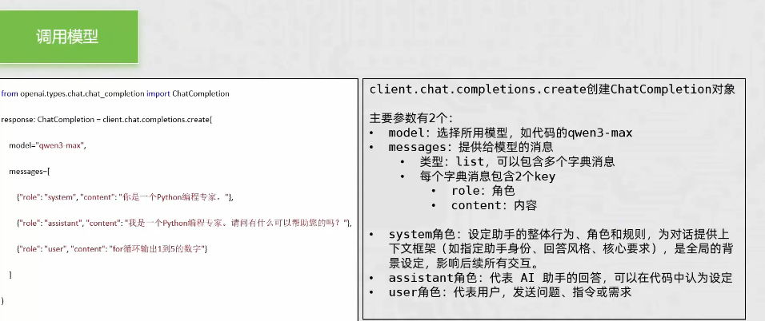
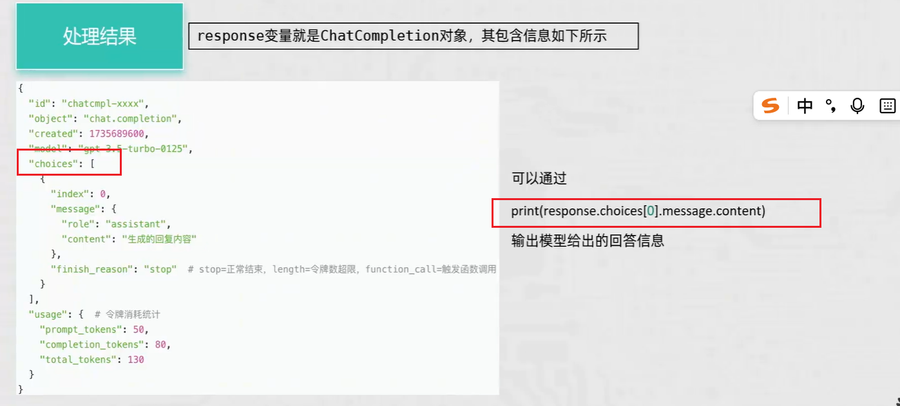
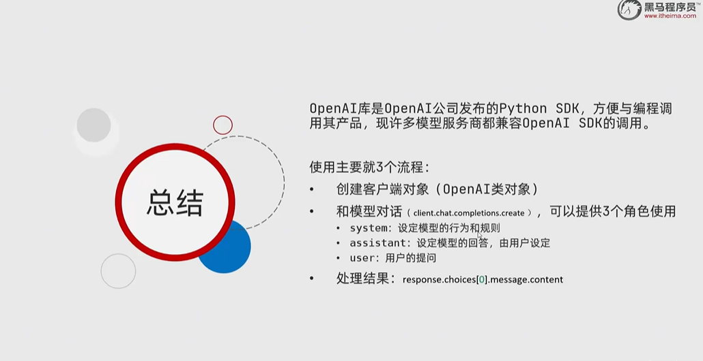

### [OpenAI库的流式输出](https://www.bilibili.com/video/BV1yjz5BLEoY?spm_id_from=333.788.player.switch&vd_source=9d75580d0b23d1137d56e03a996ac726&p=9)
- 配置`stream=True `, 然后for循环输出
- 可以让结果一段段输出

### openai-附带历史消息调用模型
- 通过多条message记录历史消息

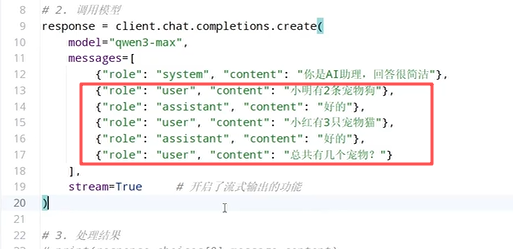

------------------------------

## 04 prompt提示工程

### 提示词技巧/提问技巧
1. 详细描述
2. 让模型充当某个角色
3. 分隔符说明内容
4. 指定步骤
5. 提供示例
6. 使用参考文本（给出参考范围，降低幻觉）
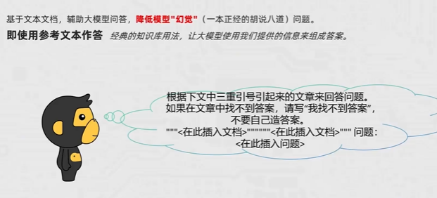

### 提示词思想
-  [Zero-shot “零样本”](https://www.bilibili.com/video/BV1yjz5BLEoY/?spm_id_from=333.788.player.switch&vd_source=9d75580d0b23d1137d56e03a996ac726&p=12)
- 基于已经训练好的能力，从已知的属性，类推识别新的类别
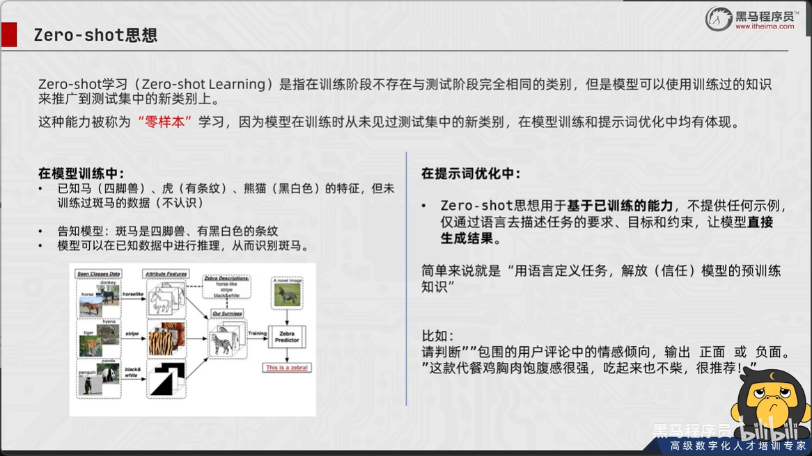

- Few-show “少样本”
- 给出示例
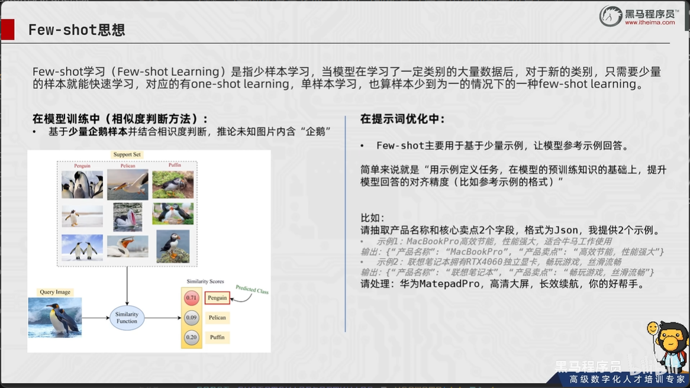
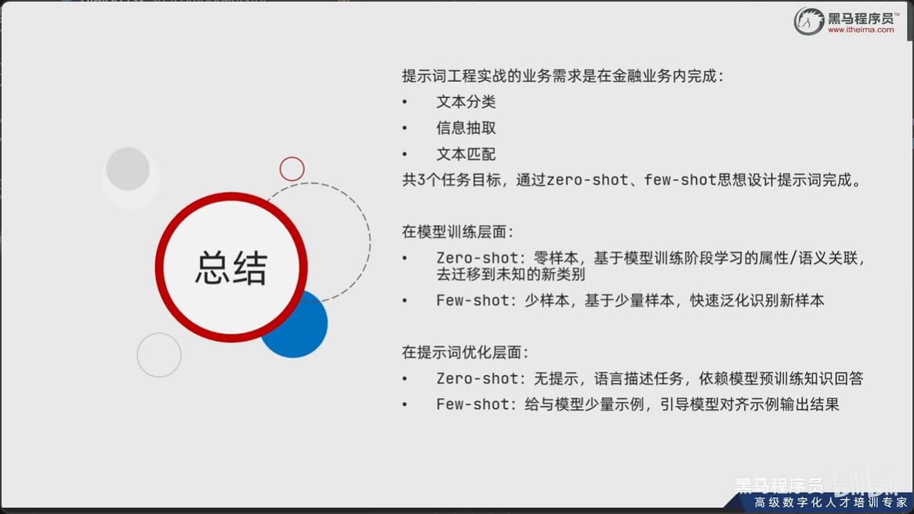

### JSON数据格式
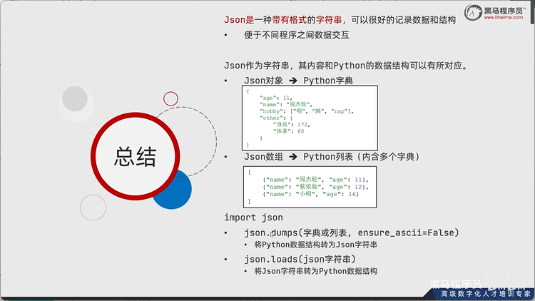