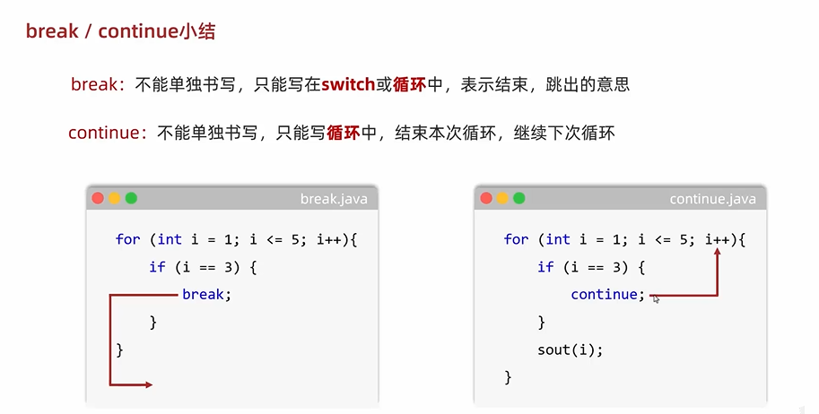

- [JAVA学习视频](https://www.bilibili.com/video/BV1TJxCzSEEZ?spm_id_from=333.788.player.switch&vd_source=9d75580d0b23d1137d56e03a996ac726&p=4)
- [视频配套笔记](https://heuqqdmbyk.feishu.cn/docx/Zx5tdqkrpoVXFuxTPBSc5cEhnuJ)

# 一、环境配置
## 1.1 安装JDK
1. [下载JDK](https://www.oracle.com/java/technologies/downloads/#jdk25-windows) -> (配置环境变量)[https://www.bilibili.com/video/BV1TJxCzSEEZ?spm_id_from=333.788.player.switch&vd_source=9d75580d0b23d1137d56e03a996ac726&p=5]

## 1.2 [安装IDEA](https://www.bilibili.com/video/BV1TJxCzSEEZ?spm_id_from=333.788.player.switch&vd_source=9d75580d0b23d1137d56e03a996ac726&p=6)


# 二、关键字
| 关键字 | 作用 | 示例 |
| :--- | :--- | :--- |
| package | 表示当前的类定义在哪个包下 | `package com.deepinsights.ilp.system.utils;` |
| public | 访问权限修饰符，表示公开的 | `public class MethodDemo1 { ... }` |
| static | 静态修饰符，表示类级别的 | `public static void main(String[] args) { ... }` |
| void | 表示方法没有返回值 | `public static void printArr(int[] arr) { ... }` |
| return | 用于结束方法，并将结果返回给调用处 | `return sum;` |
| public static void main | 表示Java程序的主入口，当程序开始运行的时候，会从主入口开始逐行往下执行 | `public static void main(String[] args) { ... }` |

# 三、数据类型

## 3.1 分类
- **基本数据类型**
- **引用数据类型**

## 3.2 基本数据类型（四类八种）
| 分类 | 数据类型 | 关键字 | 说明 |
| :--- | :--- | :--- | :--- |
| 整数 | 字节型 | `byte` | - |
| | 短整型 | `short` | - |
| | 整型 | `int` | 默认类型 |
| | 长整型 | `long` | 需加 `L` 后缀 |
| 浮点数 | 单精度浮点数 | `float` | 需加 `F` 后缀 |
| | 双精度浮点数 | `double` | 默认类型 |
| 字符 | 字符型 | `char` | - |
| 布尔 | 布尔型 | `boolean` | - |

> **取值范围大小关系**：`double` > `float` > `long` > `int` > `short` > `byte`

# 四、字面量
| 字面量类型 | 数据类型 | 说明 | 举例 |
| :--- | :--- | :--- | :--- |
| 整数类型 | [`byte`](#基本数据类型四类八种)、[`short`](#基本数据类型四类八种)、[`int`](#基本数据类型四类八种)、[`long`](#基本数据类型四类八种) | 直接写 | 18, -88 |
| 小数类型 | [`double`](#基本数据类型四类八种)、[`float`](#基本数据类型四类八种) | 直接写，加上小数点 | 1.93, -5.21 |
| 字符串类型 | `String` | 用双引号引起 | "尼古拉斯·纯情·暖男·天真·阿玮" |
| 字符类型 | [`char`](#基本数据类型四类八种) | 用单引号引起，**内容只能有一个** | '男', 'A', '0' |
| 布尔类型 | [`boolean`](#基本数据类型四类八种) | 布尔值，表示真假 | true, false |
| 空类型 | - | 一个特殊的值，空值 | null |

# 五、常用 API

## 5.1 Scanner (键盘录入)

`Scanner` 类用于获取用户的键盘输入。

### 5.1.1 使用步骤
1. **导包**：`import java.util.Scanner;`（必须放在类定义的上面）
2. **创建对象**：`Scanner sc = new Scanner(System.in);`
3. **接收数据**：根据需要调用对应的方法。

### 5.1.2 常用方法
| 方法名 | 作用 | 示例 |
| :--- | :--- | :--- |
| `nextInt()` | 接收键盘录入的一个[整数](#基本数据类型四类八种) | `int i = sc.nextInt();` |
| `nextDouble()` | 接收键盘录入的一个[小数](#基本数据类型四类八种) | `double d = sc.nextDouble();` |

## 5.2 Random (产生随机数)

`Random` 类用于在指定的范围内产生随机数。

### 5.2.1 使用步骤
1. **导包**：`import java.util.Random;`
2. **创建对象**：`Random r = new Random();`
3. **生成随机数**：调用对应的方法获取随机数。

### 5.2.2 常用方法
| 方法名 | 作用 | 说明 |
| :--- | :--- | :--- |
| `nextInt()` | 生成 `int` 范围内的随机数 | 包含正数、负数和零 |
| `nextInt(int n)` | 生成 `[0, n)` 范围内的随机数 | **包含 0，不包含 n** |
| `nextInt(int a, int b)` | 生成 `[a, b)` 范围内的随机数 | **JDK 17 新特性**，包含 a，不包含 b |

# 六、运算符

## 6.1 算术运算符

| 符号 | 作用 | 说明 | 示例 |
| :--- | :--- | :--- | :--- |
| `+` | 加 | 相加操作 | `3 + 2 = 5` |
| `-` | 减 | 相减操作 | `3 - 2 = 1` |
| `*` | 乘 | 相乘操作 | `3 * 2 = 6` |
| `/` | 除 | 相除操作 | `10 / 3 = 3` (整数相除结果为商) |
| `%` | 取模 | 求余数 | `10 % 3 = 1` |

> **注意**：
> 1. **整数相除**：结果只能得到商，余数被舍弃。若想得到小数，必须有浮点数参与运算。
> 2. **浮点运算**：在计算机中，小数直接参与计算可能会出现[精度不精确](#常用-api)的情况。

## 6.2 类型转换

在 Java 中，当不同类型的数据进行运算时，需要转换为同一类型。

### 6.2.1 隐式转换 (自动提升)
**规则**：取值范围小的类型，自动提升为取值范围大的类型。
- `byte` / `short` / `char` 参与运算时，首先提升为 `int`。
- 转换层级：`byte` -> `short` -> `int` -> `long` -> `float` -> `double`。

### 6.2.2 强制转换 (手动转换)
**格式**：`目标数据类型 变量名 = (目标数据类型) 被强转的数据;`
> **风险**：可能会导致精度丢失 or 数据溢出。

```java 11:25:JavaStudy/src/com/itheima/operator/OperatorDemo4.java
        // 请说出下面代码在计算的时候，类型转换的情况
        /*
        *   1. b + s
        *   先把byte类型的100，和short类型的200   提升为int类型
        *   结果：300（int）
        *
        *
        *   2.300（int） + d
        *   int类型的300会提升为double类型，变成300.0
        *   结果：320.3（double）
        *
        *
        * */
```

## 6.3 字符串拼接

当 `+` 运算符左右两边出现字符串时，其作用变为**拼接**。
- **规则**：任意数据类型与字符串拼接，结果都是一个新的字符串。
- **示例**：`"个位是：" + ge` -> `"个位是：3"`

## 6.4 赋值运算符

| 符号 | 作用 | 示例 | 说明 |
| :--- | :--- | :--- | :--- |
| `=` | 赋值 | `int a = 10;` | 将右边的值交给左边 |
| `+=` | 加后赋值 | `a += b;` | 相当于 `a = a + b;` |
| `-=` | 减后赋值 | `a -= b;` | 相当于 `a = a - b;` |
| `*=` | 乘后赋值 | `a *= b;` | 相当于 `a = a * b;` |
| `/=` | 除后赋值 | `a /= b;` | 相当于 `a = a / b;` |
| `%=` | 取模后赋值 | `a %= b;` | 相当于 `a = a % b;` |

## 6.5 关系运算符 (比较运算符)

| 符号 | 作用 | 结果类型 |
| :--- | :--- | :--- |
| `==` | 判断是否相等 | `boolean` |
| `!=` | 判断是否不等 | `boolean` |
| `>` | 大于 | `boolean` |
| `>=` | 大于等于 | `boolean` |
| `<` | 小于 | `boolean` |
| `<=` | 小于等于 | `boolean` |

## 6.6 逻辑运算符

| 符号 | 名称 | 作用 |
| :--- | :--- | :--- |
| `&` | 逻辑与 | 且（两边都为真才为真） |
| `|` | 逻辑或 | 或（只要有一个为真即为真） |
| `!` | 逻辑非 | 取反 |

### 6.6.1 短路逻辑运算符
- `&&` (短路与)：如果左边为假，右边不再执行。
- `||` (短路或)：如果左边为真，右边不再执行。

## 6.7 三元运算符

**格式**：`关系表达式 ? 表达式1 : 表达式2;`
- **执行流程**：计算关系表达式，若为 `true` 则取 `表达式1` 的值，若为 `false` 则取 `表达式2` 的值。

```java 12:15:JavaStudy/src/com/itheima/operator/OperatorDemo14.java
        // 2.利用三元运算符，求两个整数的较大值
        // 格式： 关系表达式 ? 表达式1 ： 表达式2；
        int max = a > b ?  a : b;
        System.out.println(max);
```

### 6.7.1 实战示例

```java 14:20:JavaStudy/src/com/itheima/variable/VariableDemo7.java
        // 1.找到Scanner这个打工人
        Scanner sc = new Scanner(System.in); // 获取键盘对象

        // 2.让Scanner干活
        System.out.println("请键盘录入第一个整数:");
        int num1 = sc.nextInt(); // 获取键盘输入的值
        System.out.println(num1);
```

```java 12:18:JavaStudy/src/com/itheima/variable/VariableDemo8.java
        Scanner sc = new Scanner(System.in);
        System.out.println("请输入您的体重：");
        double weight = sc.nextDouble();

        // 2. 键盘录入身高 M
        System.out.println("请输入您的身高：");
        double height = sc.nextDouble();
```

# 七、流程控制语句
## 7.1 判断语句——if
## 7.2 选择语句——switch
1. 表达式：结果（字符/整数byte short int/枚举/字符串）--- 跳转表，索引不支持小数，也不支持大的整数long
2. case：被匹配的值，只能是真实的数据 --- 不能写变量的
3. case：值不允许重复
4. break：表示中断，结束的意思，结束switch语句 --- break关键字，作用结束switch语句,在我们写代码的时候，如果break没有写，此时就会触发case穿透现象
5. default：所有情况都不匹配，执行该处的内容 --- if里面的else是非常类似的
6. switch新特性: 
    - 箭头标签
    - case后面可以写多个值
    - switch可以有运行结果
    - yield 关键字

## 7.3 循环语句

### 7.3.1 for 循环
用于已知循环次数的场景。

### 7.3.2 while 循环
用于不确定循环次数，仅需满足条件的场景。


### 7.3.3 for 与 while 的对比
- 相同点：先判断后执行
- 不同点：

| 特性 | `for` 循环 | `while` 循环 |
| :--- | :--- | :--- |
| **相同点** | 运行规则一致（初始化 -> 判断 -> 执行 -> 迭代） | 运行规则一致 |
| **变量作用域** | 控制循环的变量归属于 `for` 语法结构，**循环结束后无法访问**。 | 控制循环的变量不归属于其语法结构，**循环结束后仍可继续使用**。 |

### 7.3.4 do...while 循环
**特点**：先执行后判断，循环体**至少执行一次**。

### 7.3.5 无限循环 (死循环)
循环条件永远为 `true`，导致循环永不停止。
| 格式 | 语法结构 | 说明 |
| :--- | :--- | :--- |
| `for` 格式 | `for ( ; ; ) { ... }` | 最为简洁的格式 |
| `while` 格式 | `while (true) { ... }` | **最常用**的格式 |
| `do...while` 格式 | `do { ... } while (true);` | 较少使用 |

> **注意**：在无限循环的**下方**不能编写任何其他代码，因为程序永远无法执行到该位置。

## 7.4 循环控制语句

在循环执行过程中，可以使用 `break` 和 `continue` 关键字来控制循环的跳转和结束。

### 7.4.1 关键字对比

| 关键字 | 作用 | 使用范围 |
| :--- | :--- | :--- |
| **`break`** | **跳出并结束**当前所在循环（或 `switch` 语句） | `switch` 或 循环语句中 |
| **`continue`** | **跳过本次循环**，直接开始下一次循环 | 仅限循环语句中 |

> **注意**：这两个关键字都不能单独书写（即不能脱离循环或 `switch` 结构单独使用）。

### 7.4.2 实战示例


# 八、数组

## 8.1 数组的定义与初始化

### 8.1.1 静态初始化
在创建数组时，直接给数组赋值。适用于**已知具体数据**的场景。

| 格式 | 语法结构 | 示例 |
| :--- | :--- | :--- |
| **完整格式** | `数据类型[] 数组名 = new 数据类型[]{元素1, 元素2, ...};` | `int[] arr = new int[]{1, 2, 3};` |
| **简写格式** | `数据类型[] 数组名 = {元素1, 元素2, ...};` | `int[] arr = {1, 2, 3};` |

### 8.1.2 动态初始化
在创建数组时，只指定数组长度，由系统给出默认初始化值。适用于**只知道数据个数，不知道具体值**的场景。

| 格式 | 语法结构 | 示例 |
| :--- | :--- | :--- |
| **标准格式** | `数据类型[] 数组名 = new 数据类型[数组长度];` | `int[] arr = new int[5];` |

> **默认初始化值**：
>
> | 数据类型分类 | 具体类型 | 默认初始化值 |
> | :--- | :--- | :--- |
> | 整数类型 | [`byte`](#基本数据类型四类八种), [`short`](#基本数据类型四类八种), [`int`](#基本数据类型四类八种), [`long`](#基本数据类型四类八种) | `0` |
> | 浮点数类型 | [`float`](#基本数据类型四类八种), [`double`](#基本数据类型四类八种) | `0.0` |
> | 字符类型 | [`char`](#基本数据类型四类八种) | `'\u0000'` (空格) |
> | 布尔类型 | [`boolean`](#基本数据类型四类八种) | `false` |
> | 引用数据类型 | `String` 等 | `null` |

## 8.2 常见问题

### 8.2.1 索引越界 (ArrayIndexOutOfBoundsException)
访问了不存在的索引（如负数或 `>= 数组长度` 的索引）。

### 8.2.2 双指针去重 (有序数组)
利用快慢指针在原地修改数组以去除重复项。

```java 9:21:JavaStudy/src/com/itheima/array/Test6.java
/**
 * 有序数组去重（双指针）
 * @author majf
 */
// 1. 定义两个指针
int slow = 0;
int fast = 1;

// 2.利用循环不断的移动快慢指针,找不重复的元素
while (fast < arr.length){
    if(arr[slow] != arr[fast]){
        slow++;
        arr[slow] = arr[fast];
    }
    fast++;
}
```

# 九、方法

## 9.1 方法的定义与调用

方法是具有独立功能的代码块，通过将其封装可以提高代码的复用性。

### 9.1.1 定义格式

| 组成部分 | 说明 | 示例 |
| :--- | :--- | :--- |
| **修饰符** | 目前固定写法 `public static` | `public static` |
| **返回值类型** | 方法运行结果的数据类型，若无结果则用 [`void`](#关键字) | `int`, `double`, `void` |
| **方法名** | 遵循小驼峰命名法，见名知意 | `getSum`, `printArr` |
| **参数列表** | 方法执行所需的外部数据（形参） | `(int a, int b)` |
| **方法体** | 具体业务逻辑代码 | `{ int sum = a + b; ... }` |
| **return** | 结束方法并返回结果给调用处 | `return sum;` |

```java
public static 返回值类型 方法名(参数1, 参数2...) {
        方法体
        return 返回值;
}
```
### 9.1.2 调用方式

1. **直接调用**：仅执行方法，不处理结果。`方法名(实参);`
2. **赋值调用**：将结果存入变量。`数据类型 变量名 = 方法名(实参);`
3. **输出调用**：直接打印结果。`System.out.println(方法名(实参));`

## 9.2 方法重载 (Overload)

在同一个类中，定义了多个**同名**的方法，但其**参数列表不同**，这些方法构成了重载关系。

### 9.2.1 判定标准

| 维度 | 要求 | 示例 |
| :--- | :--- | :--- |
| **类** | 必须在同一个类中 | - |
| **方法名** | 必须完全相同 | `getSum` |
| **参数列表** | 必须不同（个数、类型、顺序） | `(int a)` vs `(int a, int b)` |
| **返回值** | **无关** | `void getSum(int a)` 与 `int getSum(int a)` 不构成重载 |
- 示例代码
```java 12:27:JavaStudy/src/com/itheima/method/MethodDemo6.java
    public static double getSum(int a, int b) {
        return a + b;
    }

   public static double getSum(int a, double b) {
        return a + b;
    }

    public static double getSum(double a, int b) {
        return a + b;
    }

    public static double getSum(double a, double b) {
        return a + b;
    }
```

## 9.3 注意事项

1. **平级关系**：方法与方法之间是平级关系，**不能嵌套定义**。
2. **被动执行**：方法不会自动运行，必须被调用。
3. **参数匹配**：调用时实参的个数与类型必须与形参一一对应。
4. **返回值处理**：如果方法有返回值，必须通过 `return` 关键字返回；如果是 `void`，则不能返回具体值。

# 十、面向对象 (OOP)

## 10.1 类与对象

- **[JavaBean](#类与对象)类**：描述一类事物的类，可以编写属性和行为，通常包含私有化属性和对应的 `get/set` 方法。
- **测试类**：带有 [`main`](#关键字) 方法的类，用于创建对象并调用其功能。

## 10.2 封装 (Encapsulation)

封装是面向对象的三大特征之一，通过将数据和操作数据的方法绑定在一起，隐藏内部实现细节。

### 10.2.1 `private` 关键字

| 关键字 | 作用 | 特点 |
| :--- | :--- | :--- |
| **`private`** | 权限修饰符，可修饰成员变量和方法 | **只能在本类中访问** |

### 10.2.2 `set/get` 方法

针对 `private` 修饰 of 成员变量，必须提供公共 of `get/set` 方法，以确保数据的安全性。

```java
    /**
     * 设置年龄并进行校验
     */
    // age
    // num:表示将来要赋的值 2岁
    public void setAge(int num) {
        // 给对象中的属性进行赋值
        if (num >= 0 && num <= 15) {
            age = num;
        } else {
            System.out.println("当前的" + num + "不在合理范围之内");
        }
    }

    /**
     * 获取年龄
     */
    public int getAge() {
        return age;
    }
```

## 10.3 `this` 关键字与就近原则

### 10.3.1 就近原则
在方法中使用变量名时，遵循“先局部，后成员”的查找顺序。

### 10.3.2 `this` 的作用
用于**区分成员变量和局部变量**。当局部变量与成员变量重名时，使用 `this.变量名` 显式访问成员变量。

```java
/**
 * 演示 this 关键字区分变量
 */
public class Student {
    private int age;

    public void setAge(int age) {
        // 此时左边的 age 触发就近原则，是局部变量；
        // 使用 this.age 才能访问成员变量
        this.age = age; 
    }
}
```

