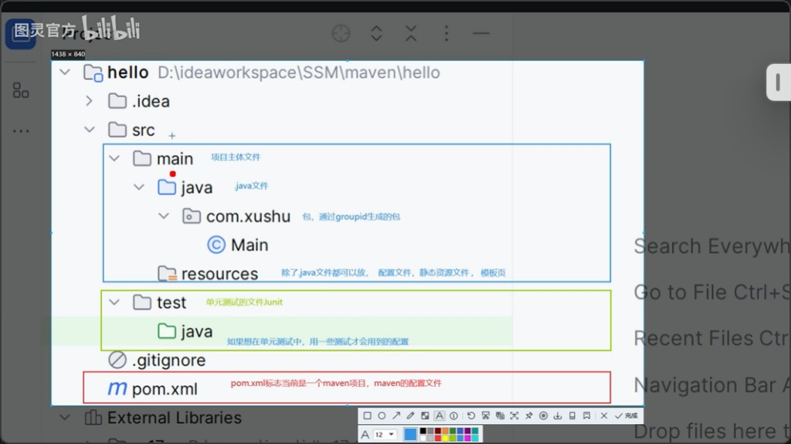

# 一、标准目录结构 <a id="maven-standard-layout"></a>

Maven 采用**约定优于配置**的标准目录布局。根目录存在 [`pom.xml`](#maven-pom) 即标识为 Maven 工程；构建产物默认输出到 `target`。



## 1.1 目录职责

| 路径 | 作用 |
| :--- | :--- |
| `pom.xml` | Maven 工程标志与配置文件（[POM](#maven-pom)） |
| `src/main/java` | 项目主体 Java 源码；包名通常与 `groupId` 对应生成 |
| `src/main/resources` | 非 Java 资源：配置文件、静态资源、模板页等 |
| `src/test/java` | 单元测试源码（如 JUnit） |
| `src/test/resources` | 仅测试阶段使用的配置与资源（可选） |
| `target` | 编译、打包等构建输出目录（class、jar 等） |

目录树示意：

```text
hello/
├── pom.xml                 # Maven 配置
├── src/
│   ├── main/               # 项目主体
│   │   ├── java/           # Java 源码（包由 groupId 生成，如 com.xushu）
│   │   └── resources/      # 配置、静态资源、模板
│   └── test/               # 单元测试
│       ├── java/
│       └── resources/      # 测试专用配置（可选）
└── target/                 # 构建输出
```

## 1.2 约定目录的意义

Maven 目标是**尽可能自动化构建**。约定固定目录后，执行编译等任务时无需手工指定路径：自动从 `src/main/java` 读取源码，编译结果写入 `target`。

## 1.3 约定大于配置 <a id="convention-over-configuration"></a>

若每个新项目都要手动配置「源码目录在哪、输出目录在哪」，会增加大量重复配置成本。Maven 用约定替代这类配置，降低上手与维护成本。

> 技术发展趋势：**约定大于配置，配置大于编码。**

Spring Boot 项目中的目录与依赖实践见 [SpringBoot.md · Maven 依赖管理](./SpringBoot.md#maven-pom)。

---

# 二、Maven 核心概念：POM <a id="maven-pom"></a>

## 2.1 含义

**POM**（Project Object Model，项目对象模型）对应工程根目录的 `pom.xml`：描述项目坐标、依赖、插件与构建行为。有 `pom.xml` 即视为 Maven 项目。

坐标（GAV）与依赖声明示例（项目内实战）：

```xml 12:14:SpringBoot/springboot-quickstart/pom.xml
	<groupId>com.itheima</groupId>
	<artifactId>springboot-quickstart</artifactId>
	<version>0.0.1-SNAPSHOT</version>
```

| 节点 | 作用 | 示例 |
| :--- | :--- | :--- |
| `groupId` | 组织/公司域名倒写，常作为默认包名前缀 | `com.itheima` |
| `artifactId` | 项目/模块名 | `springboot-quickstart` |
| `version` | 版本号 | `0.0.1-SNAPSHOT` |
| `parent` | 继承父 POM，统一依赖版本等 | 见 [Spring Boot 父工程](./SpringBoot.md#maven-pom) |
| `dependencies` | 声明本模块直接依赖 | 含 `scope` 时可限定测试范围等 |

父工程与起步依赖（Starter）属于 Spring Boot 场景，详见 [SpringBoot.md · Maven 依赖管理](./SpringBoot.md#maven-pom)，此处不重复展开。
