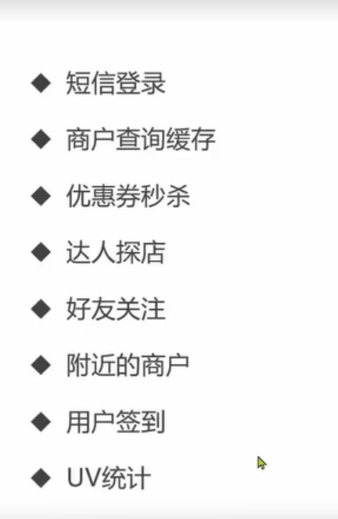
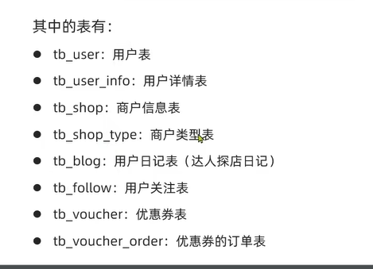

#  [Redis 知识梳理](https://www.bilibili.com/video/BV1cr4y1671t/?spm_id_from=333.337.search-card.all.click)

> Redis (Remote Dictionary Server) 诞生于 2009 年，是一个**基于内存**的键值型 NoSQL 数据库。

## 一、 SQL vs NoSQL 核心对比

在选择数据库时，需要根据业务场景在传统关系型数据库（SQL）与非关系型数据库（NoSQL）之间进行权衡。

| 特性 | SQL (关系型数据库) | NoSQL (非关系型数据库) |
| :--- | :--- | :--- |
| **数据结构** | 结构化 (Structured)，表格式 | 非结构化/半结构化，格式灵活 |
| **数据关联** | 关联的 (Relational)，支持强外键约束 | 无关联的 (Non-relational) |
| **查询方式** | SQL 查询 (标准语法) | 非 SQL 查询 (API 或特定语法) |
| **事务特性** | ACID (原子性、一致性、隔离性、持久性) | BASE (基本可用、软状态、最终一致性) |
| **存储方式** | 磁盘存储 (Disk) | 内存存储 (Memory) |
| **扩展性** | 垂直扩展 (提高单机性能) | 水平扩展 (通过集群增加节点) |
| **使用场景** | 数据结构固定、相关业务对安全性/一致性要求高 | 数据结构不固定、对一致性/安全性要求不高、对性能要求高 |

### 1.1 NoSQL 常见分类

| 类型 | 代表产品 | 核心特点 |
| :--- | :--- | :--- |
| **键值类型** | [Redis](#redis) | 极高性能，常用于缓存、会话管理 |
| **文档类型** | MongoDB | 灵活的 JSON 结构，适合复杂嵌套数据 |
| **列类型** | HBase | 适合海量数据存储与随机查询 |
| **Graph 类型** | Neo4j | 擅长处理复杂的社交关系或路径搜索 |

## 二、 Redis 核心特征 <a id="redis"></a>

Redis 以其极高的读写速度和丰富的数据类型成为最受欢迎的键值存储系统。

| 特性 | 说明 |
| :--- | :--- |
| **键值型** | 以 Key-Value 形式存储，Value 支持 String, **List, Set, Hash, ZSet** 等多种数据结构 |
| **单线程** | 核心网络 IO 与键值读写由单线程完成，每个命令具备原子性，避免了多线程竞争 |
| **低延迟/快** | 基于内存操作，使用 IO 多路复用模型，具备良好的底层数据结构编码优化 |
| **持久化** | 支持 RDB (内存快照) 和 AOF (追加文件) 两种方式，平衡性能与数据安全性 |
| **高可用与扩展** | 支持主从集群、分片集群，可实现高可用与水平扩展 |
| **多语言支持** | 提供丰富的多语言客户端 SDK，方便各类应用集成 |

---

## 三、 Redis 安装

- 先安装linux
- 安装redis
- 修改启动配置文件；开机自启

## 四、 Redis 通用命令 <a id="redis-generic-commands"></a>

与具体 Value 类型无关、多数场景均可使用的命令。在 `redis-cli` 中可用 `help [command]` 查看用法摘要，例如 `help keys` 会输出 `KEYS pattern` 及说明。

| 命令 | 作用 | 示例 / 注意 |
| :--- | :--- | :--- |
| **KEYS** | 按模式列出匹配的 key | `KEYS *` 列出全部；`KEYS a*` 匹配前缀；**生产环境不建议使用**（全库扫描可能阻塞） |
| **DEL** | 删除指定 key | `DEL key [key ...]`；`help del` 可查语法 |
| **EXISTS** | 判断 key 是否存在 | `EXISTS key` |
| **EXPIRE** | 为 key 设置过期时间（秒），到期自动删除 | `EXPIRE key seconds` |
| **TTL** | 查看 key 剩余存活时间（秒） | 无过期或 key 不存在时返回值语义以 `help ttl` 为准 |

```text
127.0.0.1:6379> help keys
KEYS pattern
summary: Find all keys matching the given pattern

127.0.0.1:6379> KEYS *
1) "age"
2) "name"

127.0.0.1:6379> KEYS a*
1) "age"
```

## 五、 String 类型与 key 规范 <a id="redis-string"></a>

Redis 中最基础的 Value 类型；value 虽为字符串，按内容可分为三类。无论哪种形态，底层均以**字节数组**存储（编码方式不同）；单个 String 值最大 **512MB**。

| 形态 | 说明 | 示例（key → value） |
| :--- | :--- | :--- |
| **string** | 普通字符串 | `msg` → `hello world` |
| **int** | 整数，可做自增、自减 | `num` → `10` |
| **float** | 浮点数，可按步长自增、自减 | `score` → `92.5` |

### 5.1 key 的结构 <a id="redis-key-structure"></a>

- key 可由多段英文单词组成，段间用冒号 `:` 分隔，形成层级，便于区分业务。
- 推荐形态为 `项目名:业务名:类型:id`，段数可按需要增减。

| KEY | VALUE |
| :--- | :--- |
| `heima:user:1` | `{"id":1, "name": "Jack", "age": 21}` |
| `heima:product:1` | `{"id":1, "name": "小米11", "price": 4999}` |

值为 Java 对象时，先序列化为 **JSON 字符串**再写入 Redis；应用侧存取见 [Spring Boot 整合 Redis](#spring-boot-redis) 中的 `StringRedisTemplate`。

### 5.2 String 常见命令 <a id="redis-string-commands"></a>

| 命令 | 作用 | 语法 | 示例 |
| :--- | :--- | :--- | :--- |
| **SET** | 添加或修改 String 键值对 | `SET key value` | `SET msg "hello world"` |
| **GET** | 按 key 获取 value | `GET key` | `GET msg` |
| **MSET** | 批量添加多个键值对 | `MSET key value [key value ...]` | `MSET name Jack age 21` |
| **MGET** | 按多个 key 批量获取 value | `MGET key [key ...]` | `MGET name age` |
| **INCR** | 整型 value 自增 1 | `INCR key` | `INCR num`（value 须为整数形态） |
| **INCRBY** | 整型 value 按步长自增 | `INCRBY key increment` | `INCRBY num 2` |
| **INCRBYFLOAT** | 浮点 value 按步长自增 | `INCRBYFLOAT key increment` | `INCRBYFLOAT score 0.5` |
| **SETNX** | 仅当 key 不存在时写入，否则不执行 | `SETNX key value` | `SETNX lock 1` |
| **SETEX** | 写入 String 并指定过期时间（秒） | `SETEX key seconds value` | `SETEX token 3600 abc`；等价于 SET 后配合 [EXPIRE](#redis-generic-commands) |

### 5.3 Hash 类型与常见命令 <a id="redis-hash-commands"></a>

Hash（哈希）在单个 key 下保存多组 **field-value**，适合同一实体的多个属性；field 与 value 均为字符串。key 命名仍遵循 [key 结构](#redis-key-structure)，例如 `heima:user:1`、`heima:user:2` 各自包含 `name`、`age` 等 field（与 [String](#redis-string) 存整段 JSON 是不同建模方式）。

| 命令 | 作用 | 语法 | 示例 |
| :--- | :--- | :--- | :--- |
| **HSET** | 添加或修改指定 field | `HSET key field value` | `HSET heima:user:1 name Jack` |
| **HGET** | 获取指定 field 的 value | `HGET key field` | `HGET heima:user:1 name` |
| **HMSET** | 批量设置多个 field | `HMSET key field value [field value ...]` | `HMSET heima:user:1 name Jack age 21` |
| **HMGET** | 批量获取多个 field | `HMGET key field [field ...]` | `HMGET heima:user:1 name age` |
| **HGETALL** | 获取 key 下全部 field 与 value | `HGETALL key` | `HGETALL heima:user:1` |
| **HKEYS** | 获取 key 下全部 field | `HKEYS key` | `HKEYS heima:user:1` |
| **HVALS** | 获取 key 下全部 value | `HVALS key` | `HVALS heima:user:1` |
| **HINCRBY** | 指定 field 按步长自增（整型） | `HINCRBY key field increment` | `HINCRBY heima:user:1 age 1` |
| **HSETNX** | 仅当 field 不存在时写入，否则不执行 | `HSETNX key field value` | `HSETNX heima:user:1 phone 13800000000` |

### 5.4 List 类型与常见命令 <a id="redis-list-commands"></a>

List（列表）可视为双向链表结构（类似 Java 的 `LinkedList`），支持从两端插入与弹出，也可按索引区间读取。特征：**有序**、**元素可重复**、**头尾插入/删除快**、**按位置查询需遍历，速度一般**。

| 命令 | 作用 | 语法 | 示例 |
| :--- | :--- | :--- | :--- |
| **LPUSH** | 从列表左侧插入一个或多个元素 | `LPUSH key element [element ...]` | `LPUSH heima:queue:msg a b` |
| **LPOP** | 移除并返回左侧第一个元素；列表为空时返回 nil | `LPOP key` | `LPOP heima:queue:msg` |
| **RPUSH** | 从列表右侧插入一个或多个元素 | `RPUSH key element [element ...]` | `RPUSH heima:queue:msg c` |
| **RPOP** | 移除并返回右侧第一个元素 | `RPOP key` | `RPOP heima:queue:msg` |
| **LRANGE** | 返回下标区间内全部元素（含两端） | `LRANGE key start stop` | `LRANGE heima:queue:msg 0 -1`（`-1` 表示最后一个） |
| **BLPOP** | 同 LPOP，列表为空时阻塞等待，超时仍无元素则返回 nil | `BLPOP key [key ...] timeout` | `BLPOP heima:queue:msg 10`（最多等待 10 秒） |
| **BRPOP** | 同 RPOP，列表为空时阻塞等待 | `BRPOP key [key ...] timeout` | `BRPOP heima:queue:msg 10` |

### 5.5 Set 类型与常见命令 <a id="redis-set-commands"></a>

Set（集合）结构与 Java 的 `HashSet` 类似，可看作 value 恒为 null 的 HashMap；底层为哈希表。特征：**无序**、**元素不可重复**、**查找快**、支持**交集、并集、差集**等集合运算。

| 命令 | 作用 | 语法 | 示例 |
| :--- | :--- | :--- | :--- |
| **SADD** | 向 set 添加一个或多个 member | `SADD key member [member ...]` | `SADD heima:tags:1 java redis` |
| **SREM** | 移除 set 中的指定 member | `SREM key member [member ...]` | `SREM heima:tags:1 redis` |
| **SCARD** | 返回 set 中 member 个数 | `SCARD key` | `SCARD heima:tags:1` |
| **SISMEMBER** | 判断 member 是否在 set 中 | `SISMEMBER key member` | `SISMEMBER heima:tags:1 java` |
| **SMEMBERS** | 返回 set 中全部 member | `SMEMBERS key` | `SMEMBERS heima:tags:1` |
| **SINTER** | 求多个 key 对应 set 的交集 | `SINTER key [key ...]` | `SINTER heima:set:s1 heima:set:s2` |
| **SDIFF** | 求多个 key 对应 set 的差集（以第一个 key 为基准） | `SDIFF key [key ...]` | `SDIFF heima:set:s1 heima:set:s2` |
| **SUNION** | 求多个 key 对应 set 的并集 | `SUNION key [key ...]` | `SUNION heima:set:s1 heima:set:s2` |

### 5.6 SortedSet（ZSet）类型与常见命令 <a id="redis-zset-commands"></a>

SortedSet（有序集合，Redis 中常称 **ZSet**）是带 **score** 的有序 set：每个 member 唯一，按 score 排序。概念上类似 Java 的 `TreeSet`，但底层一般为 **跳表 + 哈希表** 组合实现。特征：**可排序**、**member 不重复**、**查询快**；常用于**排行榜**等场景。

| 命令 | 作用 | 语法 | 示例 |
| :--- | :--- | :--- | :--- |
| **ZADD** | 添加 member 并指定 score；已存在则更新 score | `ZADD key score member [score member ...]` | `ZADD heima:rank:game 100 jack 95 rose` |
| **ZREM** | 删除指定 member | `ZREM key member [member ...]` | `ZREM heima:rank:game rose` |
| **ZSCORE** | 获取 member 的 score | `ZSCORE key member` | `ZSCORE heima:rank:game jack` |
| **ZRANK** | 获取 member 按 score 升序的排名（从 0 起） | `ZRANK key member` | `ZRANK heima:rank:game jack` |
| **ZCARD** | 返回 member 个数 | `ZCARD key` | `ZCARD heima:rank:game` |
| **ZCOUNT** | 统计 score 落在闭区间内的 member 个数 | `ZCOUNT key min max` | `ZCOUNT heima:rank:game 90 100` |
| **ZINCRBY** | 将 member 的 score 增加指定步长 | `ZINCRBY key increment member` | `ZINCRBY heima:rank:game 5 jack` |
| **ZRANGE** | 按 score 升序，取下标区间内的 member | `ZRANGE key start stop` | `ZRANGE heima:rank:game 0 2` |
| **ZRANGEBYSCORE** | 按 score 升序，取 score 区间内的 member | `ZRANGEBYSCORE key min max` | `ZRANGEBYSCORE heima:rank:game 90 100` |
| **ZDIFF / ZINTER / ZUNION** | 对多个 ZSet 求差集、交集、并集 | `ZDIFF numkeys key [key ...]` 等 | `ZINTER 2 heima:zset:s1 heima:zset:s2` |

默认按 score **升序**排名与区间；需要**降序**时在命令的 `Z` 后插入 `REV`（如 `ZREVRANK`、`ZREVRANGE`），例如 `ZREVRANGE heima:rank:game 0 0` 可取排行榜第一名。

## 六、 Java 客户端：Jedis <a id="redis-jedis"></a>

[Jedis](https://github.com/redis/jedis) 是常用的 Java Redis 客户端：创建 `Jedis` 实例后，**方法名与 Redis 命令一致**（如 `set` 对应 SET、`get` 对应 GET），便于对照 [String 常见命令](#redis-string-commands) 等 CLI 小节。基本步骤：**引入依赖 → 建立连接 → 调用 API → 释放资源**；生产环境更推荐 [连接池](#redis-jedis-pool) 替代频繁直连。

### 6.1 Maven 依赖

```xml
<dependency>
    <groupId>redis.clients</groupId>
    <artifactId>jedis</artifactId>
    <version>3.7.0</version>
</dependency>
```

### 6.2 连接、操作与释放 <a id="redis-jedis-direct"></a>

| 步骤 | 语法 | 示例 |
| :--- | :--- | :--- |
| 建立连接 | `new Jedis(host, port)` | `jedis = new Jedis("192.168.150.101", 6379);` |
| 认证（若服务端开启） | `jedis.auth(password)` | `jedis.auth("123321");` |
| 选择逻辑库 | `jedis.select(index)` | `jedis.select(0);` |
| 写入 String | `jedis.set(key, value)` | `jedis.set("name", "张三");` |
| 读取 String | `jedis.get(key)` | `jedis.get("name");` |
| 释放连接 | `jedis.close()` | 在 `@AfterEach` 中 `if (jedis != null) jedis.close();` |

```java
private Jedis jedis;

@BeforeEach
void setUp() {
    jedis = new Jedis("192.168.150.101", 6379); // 连接虚拟机中的redis库
    jedis.auth("123321");
    jedis.select(0);
}

@Test
void testString() {
    String result = jedis.set("name", "张三");
    System.out.println("result = " + result);
    String name = jedis.get("name");
    System.out.println("name = " + name);
}

@AfterEach
void tearDown() {
    if (jedis != null) {
        jedis.close(); //关闭redis连接
    }
}
```

### 6.3 Jedis 连接池 <a id="redis-jedis-pool"></a>

`Jedis` 实例**线程不安全**，频繁 `new Jedis` / `close` 也有性能损耗，推荐使用 **JedisPool** 统一管理连接。从池中 `getResource()` 得到的 `Jedis`，用完后仍调用 `close()`，连接会**归还池**而非物理断开（用法与 [6.2](#redis-jedis-direct) 中释放资源一致）。

| 配置项 | 语法 | 示例 |
| :--- | :--- | :--- |
| 最大连接数 | `JedisPoolConfig#setMaxTotal(int)` | `jedisPoolConfig.setMaxTotal(8);` |
| 最大空闲连接 | `setMaxIdle(int)` | `jedisPoolConfig.setMaxIdle(8);` |
| 最小空闲连接 | `setMinIdle(int)` | `jedisPoolConfig.setMinIdle(0);` |
| 获取连接最大等待（毫秒） | `setMaxWaitMillis(long)` | `jedisPoolConfig.setMaxWaitMillis(200);` |

| 步骤 | 语法 | 示例 |
| :--- | :--- | :--- |
| 创建连接池 | `new JedisPool(config, host, port, timeout, password)` | `new JedisPool(jedisPoolConfig, "192.168.150.101", 6379, 1000, "123321");` |
| 借用连接 | `jedisPool.getResource()` | `Jedis jedis = JedisConnectionFactory.getJedis();` |
| 归还连接 | `jedis.close()` | 在 `finally` 或 `@AfterEach` 中关闭 |

```java
public class JedisConnectionFactory {
    private static final JedisPool jedisPool;

    static {
        JedisPoolConfig jedisPoolConfig = new JedisPoolConfig();
        jedisPoolConfig.setMaxTotal(8);
        jedisPoolConfig.setMaxIdle(8);
        jedisPoolConfig.setMinIdle(0);
        jedisPoolConfig.setMaxWaitMillis(200);
        jedisPool = new JedisPool(jedisPoolConfig, "192.168.150.101", 6379,
                1000, "123321");
    }

    public static Jedis getJedis() {
        return jedisPool.getResource();
    }
}
```

> 本仓库业务模块采用 Spring Data Redis，见下一节；Jedis 多用于学习或对连接生命周期的直接控制。

## 七、 Spring Boot 整合 Redis <a id="spring-boot-redis"></a>

[Spring Data Redis](https://spring.io/projects/spring-data-redis) 是 Spring Data 中面向 Redis 的集成模块：默认基于 **Lettuce** 客户端（亦可选 Jedis），通过 **RedisTemplate** 统一 API，并支持发布订阅、Sentinel/Cluster、序列化等能力。Java 侧整合步骤：**引入依赖 → 配置 `application.yml` → 注入 Template 使用**。

### 7.1 Maven 依赖

本仓库 `SpringBoot/big-event/pom.xml` 已引入：

```xml
<!--redis坐标-->
<dependency>
    <groupId>org.springframework.boot</groupId>
    <artifactId>spring-boot-starter-data-redis</artifactId>
</dependency>
```

启用 **Lettuce 连接池**时还需 `commons-pool2`（课件示例；本仓库未显式声明，使用默认连接方式）：

```xml
<!--连接池依赖-->
<dependency>
    <groupId>org.apache.commons</groupId>
    <artifactId>commons-pool2</artifactId>
</dependency>
```

### 7.2 环境配置

Spring Boot **3.x** 使用 `spring.data.redis` 前缀。本仓库 `application.yml` 片段：

```yaml
spring:
  data:
    redis:
      host: localhost
      port: 6379 #redis的默认端口号
```

课件中常见写法（Boot 2.x 为 `spring.redis`；Boot 3 请将同级项移到 `spring.data.redis` 下）含密码与 Lettuce 连接池，与 [Jedis 连接池](#redis-jedis-pool) 中 `maxTotal` / `maxIdle` / `minIdle` / `maxWaitMillis` 含义对应：

| 配置项 | 作用 | 课件示例值 |
| :--- | :--- | :--- |
| `lettuce.pool.max-active` | 连接池最大连接数（在用 + 空闲） | `8` |
| `lettuce.pool.max-idle` | 池中最多保留的空闲连接数 | `8` |
| `lettuce.pool.min-idle` | 池中至少维持的空闲连接数 | `0` |
| `lettuce.pool.max-wait` | 获取连接的最大等待时间（毫秒） | `100` |

```yaml
spring:
  data:
    redis:
      host: 192.168.150.101
      port: 6379
      password: 123321
      lettuce:
        pool:
          max-active: 8
          max-idle: 8
          min-idle: 0
          max-wait: 100
```

### 7.3 RedisTemplate 与数据类型 API

`RedisTemplate` 封装各类 Redis 命令；不同 Value 类型的 API 分属不同 `*Operations`，与第五节 CLI 小节对应关系如下。

| API | 返回值类型 | 说明 |
| :--- | :--- | :--- |
| `redisTemplate.opsForValue()` | `ValueOperations` | [String](#redis-string-commands) |
| `redisTemplate.opsForHash()` | `HashOperations` | [Hash](#redis-hash-commands) |
| `redisTemplate.opsForList()` | `ListOperations` | [List](#redis-list-commands) |
| `redisTemplate.opsForSet()` | `SetOperations` | [Set](#redis-set-commands) |
| `redisTemplate.opsForZSet()` | `ZSetOperations` | [ZSet](#redis-zset-commands) |
| `redisTemplate` 自身 | — | 通用命令（如 `delete`） |

注入与 String 测试（课件写法）：

```java
@Autowired
private RedisTemplate redisTemplate;

@Test
void testString() {
    redisTemplate.opsForValue().set("name", "李四");
    Object name = redisTemplate.opsForValue().get("name");
    System.out.println("name = " + name);
}
```

### 7.4 StringRedisTemplate 与序列化 <a id="string-redis-template"></a>

为节省空间、避免默认 JSON 序列化带来的可读性与工具兼容问题，本仓库业务与测试统一使用 **`StringRedisTemplate`**：key、value 默认均为 **String 序列化**；存 Java 对象时需**手动** JSON 序列化/反序列化（与 [key 结构](#redis-key-structure) 中 JSON 字符串建模一致）。

| 方法 | 作用 | 示例 |
| :--- | :--- | :--- |
| `opsForValue()` | 操作 String 类型 | `ops.set(key, value, timeout, unit)` |
| `opsForHash()` | 操作 Hash 类型 | `ops.put(key, hashKey, value)` |
| `delete(key)` | 删除 key | `stringRedisTemplate.delete(key)` |

`opsForValue()` 的 `set` / `get` 及带过期参数的 `set` 分别对应 [String 常见命令](#redis-string-commands) 中的 SET、GET、SETEX（或 SET + EXPIRE）；`opsForHash()` 的 `put` / `get` 对应 [Hash 常见命令](#redis-hash-commands) 中的 HSET、HGET。

**RedisTemplate 序列化常见两种做法**（二选一，勿混用同一 key）：

| 方案 | 做法 |
| :--- | :--- |
| **方案一** | 自定义 `RedisTemplate`，将序列化器改为 `GenericJackson2JsonRedisSerializer`，由框架读写对象 |
| **方案二（本仓库）** | 使用 `StringRedisTemplate`，写入前 `ObjectMapper` 等转为 JSON 字符串，读取后再反序列化为对象 |

#### 7.4.1 实战示例：存取与过期控制

```java
// SpringBoot/big-event/src/test/java/com/itheima/RedisTest.java

ValueOperations<String, String> operations = stringRedisTemplate.opsForValue();
operations.set("username","zhangsan");
operations.set("id","1",15, TimeUnit.SECONDS);//15秒后过期,过期后会被redis删除，就无法获取到了

System.out.println(operations.get("id"));
```

## 八、 业务实战：基于 Redis 的 Token 会话管控
- 实战功能

- 实战表


在无状态的 JWT 架构中，Redis 常用于实现 Token 的主动失效（如退出登录、改密）。

### 8.1 核心流程

1. **登录成功**：生成 JWT 后，将其作为 Key（或 Value）存入 Redis，并设置与 JWT 一致的过期时间。
2. **拦截校验**：[登录拦截器](#login-interceptor) 从请求头获取 Token 后，需在 Redis 中查询是否存在，不存在则视为已失效。
3. **状态变更**：用户退出登录或修改密码时，从 Redis 中删除对应的 Token，实现强制下线。

### 8.2 拦截器逻辑实现 <a id="login-interceptor"></a>

在 `LoginInterceptor.java` 中，通过 Redis 校验 Token 有效性：

```java
// SpringBoot/big-event/src/main/java/com/itheima/interceptors/LoginInterceptor.java

@Override
public boolean preHandle(HttpServletRequest request, HttpServletResponse response, Object handler) throws Exception {
    String token = request.getHeader("Authorization");
    try {
        // 从 Redis 获取相同 Token
        ValueOperations<String, String> operations = stringRedisTemplate.opsForValue();
        String redisToken = operations.get(token);
        if (redisToken == null) {
            // Redis 中无记录，说明 Token 已失效
            throw new RuntimeException();
        }
        
        Map<String, Object> claims = JwtUtil.parseToken(token);
        ThreadLocalUtil.set(claims);
        return true;
    } catch (Exception e) {
        response.setStatus(401);
        return false;
    }
}
```

### 8.3 登录与登出管理

在 `UserController.java` 中管理 Token 的生命周期：

| 动作 | 核心代码片段 | 业务目的 |
| :--- | :--- | :--- |
| **登录** | `operations.set(token, token, 1, TimeUnit.HOURS)` | 记录在线会话，同步过期时间 |
| **改密/退出** | `operations.getOperations().delete(token)` | 强制失效当前 Token |
