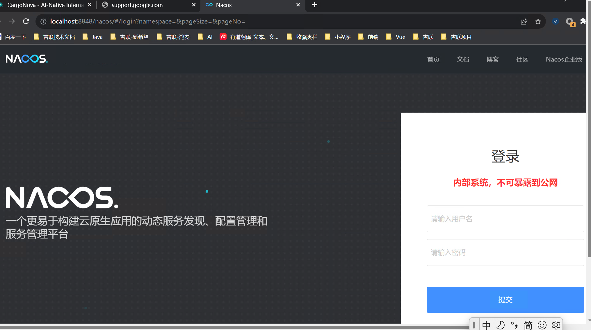

# 一、 Maven 依赖管理(pom.xml)

在 Spring Boot 项目中，依赖管理通过父工程（`spring-boot-starter-parent`）和各种起步依赖（`starter`）来简化。

## 1.1 父工程 (Parent POM)
父工程用于统一管理所有起步依赖的版本，避免版本冲突。

```xml 5:11:SpringBoot/springboot-quickstart/pom.xml
    <!-- boot工程的父工程。用于管理起步依赖的版本-->
	<parent>
		<groupId>org.springframework.boot</groupId>
		<artifactId>spring-boot-starter-parent</artifactId>
		<version>4.1.0</version>
		<relativePath/> <!-- lookup parent from repository -->
	</parent>
```

## 1.2 起步依赖 (Starters)
通过引入一个 Starter，即可**自动引入**该功能所需的所有相关依赖。

| 依赖名称 | 作用 | 对应配置项 / 备注 |
| :--- | :--- | :--- |
| `spring-boot-starter-webmvc` | 引入 Web 开发所需的 Spring MVC 核心组件及 Tomcat 容器。 | Web 核心，集成了 MVC 的基本配置。 |
| `spring-boot-starter-webmvc-test` | 引入用于 Web 应用测试的依赖。 | 仅在测试范围 (`scope: test`) 使用。 |

```xml 33:45:SpringBoot/springboot-quickstart/pom.xml
	<dependencies>
		<!-- web起步依赖 -->
		<dependency>
			<groupId>org.springframework.boot</groupId>
			<artifactId>spring-boot-starter-webmvc</artifactId>
		</dependency>

		<dependency>
			<groupId>org.springframework.boot</groupId>
			<artifactId>spring-boot-starter-webmvc-test</artifactId>
			<!-- 仅在测试范围 -->
			<scope>test</scope>
		</dependency>
	</dependencies>
```

---

# 二、 核心注解 <a id="core-annotations"></a>

| 注解名称 | 作用 | 应用场景 | 示例 |
| :--- | :--- | :--- | :--- |
| `@SpringBootApplication` | 标识该类为 Spring Boot 的启动类，集成了自动配置、组件扫描和配置类声明。 | Spring Boot 项目**主入口**类。 | `com.itheima.springbootquickstart.SpringbootQuickstartApplication` |
| `@RestController` | 标识该类是一个 RESTful 风格的控制器，相当于 `@Controller` 与 `@ResponseBody` 的组合。返回值会直接作为 HTTP 响应体返回。 | Web 接口开发控制器类。 | `com.itheima.springbootquickstart.controller.HelloController` |
| `@RequestMapping` | 用于映射 Web 请求的 URL 路径到具体的方法上。 | 控制器内定义 API 路由。 | `@RequestMapping("/hello")` |
| [`@Value`](#541-value-单项注入) | 逐个读取并注入配置文件中的单个属性。 | 读取散落、单独的非结构化配置。 | `@Value("${email.user}")` |
| [`@ConfigurationProperties`](#542-configurationproperties-批量绑定) | 批量将指定前缀的配置项绑定到 JavaBean 实体的成员变量上。 | 批量、有结构的一组属性（如邮件、第三方账号配置等）绑定。 | `@ConfigurationProperties(prefix = "email")` |
| [`@Service`](#custom-bean-annotations) | 标识该类是 Spring 中的 Service **业务逻辑层组件**，并自动注册到 Spring 容器中。 | 业务逻辑实现类。 | `com.itheima.springbootmybatis.service.impl.UserServiceImpl` |
| [`@Autowired`](#di-annotations) | 声明自动注入依赖。Spring 会自动从 IoC 容器中按类型匹配并装配 Bean。 | 依赖注入组件（控制反转/依赖注入）。 | 成员变量或 setter 方法上 |
| [`@Mapper`](#mapper-declaration) | MyBatis 框架注解。标识该接口为**数据访问层**（Mapper）组件，运行时自动生成动态代理实现类并注册到 Spring 容器。 | MyBatis 数据持久层接口。 | `com.itheima.springbootmybatis.mapper.UserMapper` |
| [`@Component`](#custom-bean-annotations) | 声明 Bean 的基础注解。若某个类不属于控制层、服务层或持久层，使用此注解注册到 Spring 容器中。 | 通用组件、工具类等。 | 自定义公共工具类组件 |
| [`@Controller`](#custom-bean-annotations) | `@Component` 的衍生注解，标注在控制层类上，声明其为 Spring MVC 控制器。 | Spring MVC Web 控制器。 | `com.itheima.springbootquickstart.controller.HelloController` |
| [`@Bean`](#third-party-bean-annotations) | 标注在配置类的方法上，将该方法的返回值作为 Bean 注册到 Spring 容器中。主要用于整合并管理第三方类库提供的类。 | 注册第三方的非自定义类对象。 | 注入外部工具库、连接池等组件 |
| [`@Import`](#third-party-bean-annotations) | 用于在配置类上快速导入外部类. 可以导入普通的 Bean、配置类（`@Configuration`） or `ImportSelector` 接口实现类。 | 模块化集成、快速引入第三方依赖包中的配置组件。 | `@Import({CommonConfig.class})` |
| [`@Repository`](#custom-bean-annotations) | `@Component` 的衍生注解，标注在数据访问层类上。由于常与 MyBatis 整合并使用 `@Mapper`，因此在现代 Spring Boot 开发中相对少用。 | 数据访问层/持久层实现组件。 | DAO 实现类 |
| [`@ConditionalOnProperty`](#753-设置注册生效条件注解-conditional-条件装配) | 配置文件中存在指定的属性且符合特定值（或存在即可）时，才注册该 Bean。 | 根据配置文件参数动态决定是否启用某组件。 | `@ConditionalOnProperty(name = "email.auth", havingValue = "true")` |
| [`@ConditionalOnMissingBean`](#753-设置注册生效条件注解-conditional-条件装配) | 当 Spring IoC 容器中不存在指定类型或名称的 Bean 时，才注册该 Bean。 | 框架中提供默认配置组件，并允许用户自定义覆盖（自定义优先）。 | `@ConditionalOnMissingBean(EmailProperties.class)` |
| [`@ConditionalOnClass`](#753-设置注册生效条件注解-conditional-条件装配) | 当当前运行环境/类路径中存在指定的类时，才注册该 Bean。 | 根据是否引入了某第三方依赖决定是否装配对应核心服务。 | `@ConditionalOnClass(name = "com.alibaba.fastjson.JSON")` |
| [`@Validated`](#93-基础校验实战简单参数校验) | 标注在类或方法参数上，开启 Spring Validation 参数校验机制，支持分组校验。 | 控制器或业务层参数校验。 | `com.itheima.controller.UserController` |
| [`@RestControllerAdvice`](#97-全局异常统一处理-global-exception-handling) | 组合注解，集成了 `@ControllerAdvice` 和 `@ResponseBody`，用于定义全局异常处理器，将返回值直接作为 JSON 响应体返回。 | 全局异常处理与统一响应。 | `com.itheima.exception.GlobalExceptionHandler` |
| [`@ExceptionHandler`](#97-全局异常统一处理-global-exception-handling) | 标注在全局异常处理器的方法上，指定该方法需要捕获并处理的异常类型。 | 捕获特定异常并进行定制化处理。 | `@ExceptionHandler(Exception.class)` |
---

# 三、 启动入口

Spring Boot 项目的主入口通常包含一个带有 `@SpringBootApplication` 注解的类，并在 `main` 方法中调用 `SpringApplication.run()` 来引导项目。

```java
//启动类（带有 @SpringBootApplication 注解）
@SpringBootApplication
public class SpringbootQuickstartApplication {

	public static void main(String[] args) {
		SpringApplication.run(SpringbootQuickstartApplication.class, args);
	}
}
```

# 四、 Web 控制器开发

在 Spring Boot 中，编写一个 REST 控制器极其简便，只需在类上声明 `@RestController`，并在方法上声明 `@RequestMapping` 等路由注解。

## 4.1 编写 Controller 示例
- 当应用启动后，可以通过访问 `http://localhost:8080/hello` 来触发该方法，获取返回值。
- 若修改了默认的内嵌服务器端口或应用上下文路径，具体的访问 URL 规则可参考 [5.1 通用配置属性](#51-通用配置属性)。

```java 6:13:SpringBoot/springboot-quickstart/src/main/java/com/itheima/springbootquickstart/controller/HelloController.java
@RestController // 返回值会直接作为 HTTP 响应体返回
public class HelloController {

    @RequestMapping("/hello") // 启动后可以通过 http://localhost:8080/hello 访问
    public String hello(){
        return "hello world~";
    }
}
```

---

# 五、 配置文件

Spring Boot 提供了多种属性配置方式，最常用的两种格式是 `properties` 配置文件与 `yaml` 配置文件。它们通常存放于项目的 `src/main/resources` 目录下，用于定制服务的运行行为。

## 5.1 通用配置属性

无论是 `properties` 还是 `yaml` 格式，Spring Boot 底层的属性配置是完全相通的。以下是项目开发中核心且常用的基础配置项：

| 配置项 | 作用 | 配置值示例 (properties) | 配置值示例 (yaml) | 备注说明 |
| :--- | :--- | :--- | :--- | :--- |
| `spring.application.name` | 指定当前微服务的应用名称 | `springboot-quickstart` | `springboot-quickstart` | 用于服务注册、日志追踪及区分。 |
| `server.port` | 指定内嵌 Web 服务器（如 Tomcat）的监听端口号 | `9090` | `9191` | 默认端口为 `8080`。 |
| `server.servlet.context-path` | 指定 Web 应用的上下文访问路径（根路径） | `/start` | `/start2` | 配置后，所有接口路径前均需追加该路径作为前缀。 |

## 5.2 properties 配置文件

`properties` 配置文件通过经典的键值对 `key=value` 的形式进行配置，每一行都是一个独立的配置项，不具有层级结构。

在项目 `SpringBoot/springboot-quickstart` 中，其内置的配置文件格式与内容如下：

```properties 1:4:SpringBoot/springboot-quickstart/src/main/resources/application.properties
spring.application.name=springboot-quickstart
# server.port=9090
# server.servlet.context-path="start"
```


## 5.3 yaml 配置文件（常用）

`yaml`（YAML Ain't Markup Language，又称 `yml`）是一种直观的、以数据为中心的配置文件格式，其结构非常清晰，特别适合表示复杂的层级配置。

### 5.3.1 YAML 核心语法
1. **大小写敏感**：属性名称和属性值对大小写敏感。
2. **层级缩进**：使用**空格**缩进表示层级关系。**严禁使用 Tab 键**进行缩进。
3. **冒号后空格**：属性名与属性值之间通过 `冒号 + 空格` (`: `) 隔开，该空格不可省略。
4. **单行注释**：使用 `#` 标识。

### 5.3.2 示例配置
根据上述语法规则，通用属性在 `application.yml` 或 `application.yaml` 配置文件中的书写格式如下：

```yaml
server:
  port: 9191
  servlet:
    context-path: /start2
```

## 5.4 配置信息的获取与注入

在 Spring Boot 中，将配置文件（如 `application.yml`）中的自定义配置读取并注入到 Java Bean 中，主要有 `@Value` 和 `@ConfigurationProperties` 两种核心方式。

### 5.4.1 @Value 单项注入

`@Value` 注解适用于逐个注入配置文件中零散、单独的属性，通过 `${键名}` 的表达式从 Environment 中解析出对应的属性值并赋给目标字段。

#### 语法规则
1. **注入语法**：使用 `@Value("${键名}")` 标注在类成员变量上。
2. **应用场景**：配置项较少、结构松散，不属于某一个完整的配置实体。

#### 示例配置与代码
在 `application.yml` 中定义以下单项配置：

```yaml
# 示例：单个变量配置
my-app:
  owner: hzf
```

在 Java Bean 中注入：

```java
@Component
public class AppConfig {

    @Value("${my-app.owner}")
    private String owner;
}
```

---

### 5.4.2 @ConfigurationProperties 批量绑定

当配置项属于一组具有**相同前缀、结构复杂**的业务实体（例如邮件服务配置、阿里云 OSS 存储配置等）时，使用 `@ConfigurationProperties` 能够极其高效地进行对象级绑定。

#### 语法规则
1. **前缀绑定**：通过 `@ConfigurationProperties(prefix = "前缀")` 指定配置前缀。
2. **容器管理**：修饰的配置类必须是 Spring 容器管理的 Bean（例如使用 `@Component` 标注）。
3. **命名一致性**：Java Bean 的成员变量名（通常符合 camelCase 驼峰命名法）必须与配置文件中的属性键名保持一致。

#### 示例配置
在 `application.yml` 中定义邮件服务的批量配置：

```yaml
email:
  user: 593140521@qq.com
  code: jfejwezhcrzcbbbb
  host: smtp.qq.com
  auth: true
```

#### 配置实体类定义
将上述配置绑定到 `EmailProperties` 实体类：

```java
@Component
@ConfigurationProperties(prefix = "email")
public class EmailProperties {

    // 发件人邮箱
    public String user;

    // 授权码（邮件客户端使用）
    public String code;

    // 发件人邮箱对应的应用服务，如果是163邮箱: smtp.163.com
    public String host;

    // 发送邮件前，是否需要对发件人的信息做验证
    private boolean auth;
}
```

---

### 5.4.3 @Value 与 @ConfigurationProperties 的对比

为了更加直观地选择合适的获取方式，下表总结了两者在应用场景、松散绑定、SpEL、JSR-303 等级维度上的区别：

| 特性 / 维度 | `@Value` | `@ConfigurationProperties` |
| :--- | :--- | :--- |
| **功能定义** | 逐个注入单个属性（单项获取） | 批量属性与 JavaBean 绑定（对象化获取） |
| **前缀支持** | 不支持指定统一前缀 | 支持统一前缀过滤（如 `prefix = "email"`） |
| **松散绑定 (Relaxed Binding)** | 不支持（键名必须绝对精确一致） | **支持**（如配置文件中的 `user` 或松散格式可自动映射到驼峰命名变量上） |
| **JSR-303 数据校验** | 不支持 | **支持**（可配合 `@Validated` 对绑定数据进行规则校验） |
| **最佳实践** | 适合少量、临时、各不相干的散落配置项 | 适合面向业务、高度结构化的批量核心模块配置（推荐） |

---

# 六、 整合 MyBatis 数据库交互

MyBatis 是 Java 领域极其流行的优秀持久层框架。Spring Boot 通过起步依赖 `mybatis-spring-boot-starter` 与数据源的自动配置，极大简化了传统 SSM 框架中繁琐的 MyBatis 配置过程。

## 6.1 整合起步依赖 (pom.xml)

在项目中引入 MyBatis 依赖和 MySQL 驱动依赖，即可实现与数据库的安全、高效连接。

```xml
<dependency>
    <groupId>org.mybatis.spring.boot</groupId>
    <artifactId>mybatis-spring-boot-starter</artifactId>
    <version>3.0.0</version>
</dependency>
```

> **注意**：在实际项目中，除了 MyBatis 的 Starter 起步依赖外，通常还需要引入对应的数据库驱动依赖（如 `mysql-connector-j`）以使 Spring Boot 底层的物理数据源可以正确装配并通信。

## 6.2 数据库与 MyBatis 配置 (application.yml)

在 Spring Boot 项目中，通常在 `application.yml` 中配置数据库连接信息以及 MyBatis 框架的核心行为。

### 6.2.1 配置示例

```yaml 1:15:SpringBoot/big-event/src/main/resources/application.yml
spring:
  datasource:
    driver-class-name: com.mysql.cj.jdbc.Driver
    url: jdbc:mysql://localhost:3306/big_event
    username: root
    password: 1234

mybatis:
  configuration:
    map-underscore-to-camel-case: true #开启驼峰命名和下划线命名的自动转换
    log-impl: org.apache.ibatis.logging.stdout.StdOutImpl
```

> **注意**：示例中的数据库连接信息（如 `url`、`username`、`password`）需根据实际开发环境进行替换。

### 6.2.2 核心配置项解析

| 配置项 | 作用 | 应用场景 | 示例值 |
| :--- | :--- | :--- | :--- |
| `spring.datasource.driver-class-name` | 指定数据库驱动类名 | 建立数据库物理连接时使用 | `com.mysql.cj.jdbc.Driver` |
| `spring.datasource.url` | 指定数据库连接 URL | 指定数据库地址、端口、库名及连接参数 | `jdbc:mysql://localhost:3306/big_event` |
| `spring.datasource.username` | 数据库登录用户名 | 数据库安全认证 | `root` |
| `spring.datasource.password` | 数据库登录密码 | 数据库安全认证 | `1234` |
| `mybatis.configuration.map-underscore-to-camel-case` | 开启驼峰命名和下划线命名的自动转换 | 数据库表字段为下划线命名（如 `create_time`），Java 实体属性为驼峰命名（如 `createTime`）时，自动完成映射 | `true` |
| `mybatis.configuration.log-impl` | 指定 MyBatis 的日志实现类 | 在开发调试阶段，将 SQL 执行详情打印到控制台，便于排查问题 | `org.apache.ibatis.logging.stdout.StdOutImpl` |

## 6.3 三层架构设计与实现 (Controller-Service-Mapper)

本节以「根据指定 ID 查询用户表数据，并响应给浏览器」为例，展示基于 Spring Boot 标准三层架构的开发规范。


### 6.3.1 实体类定义 (POJO)
定义**对应数据库表结构**的 JavaBean，使用实体类传递数据。

```java 3:9:SpringBoot/springboot-quickstart/src/main/java/com/itheima/springbootmybatis/pojo/User.java
public class User {
    
    private Integer id;
    private String name;
    private Short age;
    private Short gender;
    private String phone;
```

### 6.3.2 持久层接口设计 (Mapper)
- 使用 `@Mapper` 注解标识该接口为 **MyBatis 的 Mapper 映射器**，由 Spring Boot 容器统一进行代理类生命周期的管理。
- 在接口方法上使用注解（如 `@Select`）编写 SQL 查询。

```java 7:13:SpringBoot/springboot-quickstart/src/main/java/com/itheima/springbootmybatis/mapper/UserMapper.java
@Mapper // Mapper标识该接口为 MyBatis 的 Mapper 映射器
public interface UserMapper {

    @Select("select * from user where id = #{id}") // 编写 SQL 查询
    public User findById(Integer id);

}
```

### 6.3.3 业务逻辑层实现 (Service)
- 定义业务接口(`interface`)并编写其实现类(`implements`)。
- 实现类使用 `@Service` 标识为业务层组件，
- 并利用 `@Autowired` 自动注入 Mapper 实例，执行具体业务逻辑。

- **声明Service 接口**(`interface`)：

```java 5:8:SpringBoot/springboot-quickstart/src/main/java/com/itheima/springbootmybatis/service/UserService.java
// 定义业务接口
public interface UserService {
    public User findById(Integer id);
}
```

- **实现Service 实现类**(`implements`)：
```java 9:19:SpringBoot/springboot-quickstart/src/main/java/com/itheima/springbootmybatis/service/impl/UserServiceImpl.java
@Service // 1.使用`@Service`注解标识为业务层组件
public class UserServiceImpl implements UserService { // 2. 编写其实现类(`implements`)

    @Autowired // 2.注入Mapper
    private UserMapper userMapper;

    @Override // 3. 重写接口，调用Mapper
    public User findById(Integer id) {
      return userMapper.findById(id);
    }
}
```

### 6.3.4 控制层接口开发 (Controller)
使用 `@RestController` 标识控制器组件，**自动注入 Service**，**接收前端 HTTP 请求参数**，并响应数据给浏览器客户端。

```java 9:21:SpringBoot/springboot-quickstart/src/main/java/com/itheima/springbootquickstart/controller/UserController.java
// 1. 使用RestController注解
@RestController
public class UserController {

    @Autowired // 2.注入Service 
    private UserService userService; 

    @RequestMapping("/findById") // 3. 定义接口
    public User findById(Integer id){
      return   userService.findById(id);  // 4. 调用Service 
    }
}
```

---

## 6.4 核心原理与扫描机制最佳实践

### 6.4.1 组件扫描范围与包结构避坑说明

在本项目中，由于历史演进或业务划分原因，启动类与控制器的包结构并不处于同一父包路径下：
- **启动类路径**：`com.itheima.springbootmybatis.SpringbootMybatisApplication`
- **控制器路径**：`com.itheima.controller.UserController`

根据 Spring Boot 默认的 **组件扫描机制 (Component Scan)**，`@SpringBootApplication` 底层集成的组件扫描只会扫描**启动类所在的包及其所有子包**（即 `com.itheima.springbootmybatis.*`），这会导致位于 `com.itheima.controller` 下的控制器无法被 IoC 容器识别与注册。

#### 解决方案
在启动类上显式声明 `@ComponentScan(basePackages = "com.itheima")` 注解，扩大组件扫描的物理包范围，从而完美兼容跨包组件的集成。

```java 7:15:SpringBoot/springboot-quickstart/src/main/java/com/itheima/springbootmybatis/SpringbootMybatisApplication.java
@ComponentScan(basePackages = "com.itheima")
@SpringBootApplication
public class SpringbootMybatisApplication {

    public static void main(String[] args) {
        SpringApplication.run(SpringbootMybatisApplication.class, args);
    }

}
```

### 6.4.2 @Mapper 代理对象生成逻辑

1. **容器托管**：在接口上声明 `@Mapper` 注解后，Spring Boot 在应用启动时会扫描到该接口。
2. **动态代理**：MyBatis-Spring 整合模块会利用 JDK 动态代理技术，在内存中动态生成该接口的代理实现类对象。
3. **依赖注入**：将该动态代理实例作为 Bean 注册 to Spring 容器中，允许 Service 层通过 `@Autowired` 直接注入并无感使用。

---

# 七、 控制反转 (IoC) 与 Spring IoC 容器

在 Spring 框架中，控制反转（IoC，Inversion of Control）与依赖注入（DI，Dependency Injection）是其最核心的底层设计思想，而 IoC 容器则是支撑这一思想运行的物理载体。

## 7.1 什么是控制反转 (IoC)

控制反转是一种面向对象编程的设计原则，用以降低代码之间的耦合度。

1. **IoC 开发模式（控制反转）**：
   在引入 IoC 容器后，类 A 不再主动创建类 B。类 A 只需要声明自己需要类 B（例如通过成员变量配合 `@Autowired` 注解），而类 B 的实例化、初始化以及与类 A 的装配工作，全部交由外部的 IoC 容器来完成。
   对象的控制权从“类 A 内部”转移到了“外部 IoC 容器”，这种控制权的转移就是**控制反转**。

## 7.2 什么是 IoC 容器 (IoC Container)

IoC 容器是 Spring 框架的核心，负责管理应用中所有对象的生命周期和依赖关系。

1. **容器的本质**：
   IoC 容器在物理上可以理解为一个高级的“工厂”或“注册表”。它在系统启动时，通过读取配置元数据（在 Spring Boot 中主要是通过 `@Component`、`@Service`、`@Repository`、`@Controller`、`@Configuration` 等注解），**识别出哪些类需要交给容器管理**。
2. **Bean 的概念**：
   在 Spring 的世界中，凡是被 IoC 容器所实例化、组装并管理的对象，都称为 **Bean**。
   
3. **核心接口**：
   
   - `BeanFactory`：Spring 框架最底层的核心接口，提供了最基础的 IoC 容器功能，负责 Bean 的定义、加载、实例化和依赖注入，采用延迟加载（Lazy-loading）策略。
   - `ApplicationContext`：`BeanFactory` 的子接口，是目前开发中实际使用的 IoC 容器。它在继承了 `BeanFactory` 所有功能的基础上，提供了更丰富的企业级支持，例如国际化（i18n）、事件传播、资源加载等。并且，`ApplicationContext` 默认在容器启动时就完成所有单例 Bean 的实例化与初始化（预加载策略）。

## 7.3 IoC 与 依赖注入 (DI) 的关系

IoC 与 DI 是同一概念在不同维度下的表述：
- **IoC（控制反转）** 是**设计思想**。它描述了“控制权转移”的现象和目的。
- **DI（Dependency Injection，依赖注入）** 是**具体实现手段**。它描述了容器在运行期间，动态地将依赖对象注入到目标对象中的具体动作。

例如，当容器发现 `UserController` 依赖 `UserService` 时，容器会先实例化 `UserService`，然后通过反射技术，将 `UserService` 的实例注入到 `UserController` 的成员变量中。这个过程就是依赖注入。

---

## 7.5 声明 Bean 的核心注解

在 Spring Boot 项目中，要将一个类托管给 Spring IoC 容器，使其成为一个 Bean，通常在类上声明以下核心注解：

### 7.5.1 自定义 Bean 注册注解（一类/衍生注解） <a id="custom-bean-annotations"></a>

对于开发者自己编写的业务类，可以使用基础注解 [`@Component`](#core-annotations) 及其衍生注解进行注册。它们在功能上是完全相通的，但在应用架构中扮演不同的层级角色：

* **[`@Component`](#core-annotations)**：声明 Bean 的基础/通用注解。标识一个普通的类为 Spring 容器管理的 Bean。当某个类不属于控制层、业务层、数据访问层时（例如通用组件、工具类等），使用此注解。
* **[`@Controller`](#core-annotations)**：`@Component` 的衍生注解。声明该类是一个 Web 层的控制器组件，标注在 Spring MVC 控制器类上（在现代 RESTful 接口开发中，通常使用组合注解 `@RestController`）。
* **[`@Service`](#core-annotations)**：`@Component` 的衍生注解。声明该类是业务逻辑层的 Service 组件，标注在 Service 业务逻辑实现类上（如项目中的 `UserServiceImpl` 类）。
* **[`@Repository`](#core-annotations)**：`@Component` 的衍生注解。声明该类是数据访问层的 DAO 组件，标注在传统的数据库访问实现类上（由于现代 Spring Boot 与 MyBatis/MyBatis-Plus 整合中，数据访问层接口标注有独立的 [`@Mapper`](#mapper-declaration) 注解，此注解在实际开发中使用较少）。

---

### 7.5.2 第三方 Bean 注册注解（非自定义类注册） <a id="third-party-bean-annotations"></a>

如果要注册的 Bean 对象来自于第三方类库（如外部引入的 Jar 包，并非开发者自己编写的源代码），由于无法在别人的类上直接添加 `@Component` 注解，因此无法使用上述四种一类/衍生注解。Spring Boot 提供了以下完整的解决方案来管理第三方 Bean：

#### 1. 前置步骤：导入外部第三方 Jar 包（Maven 本地安装）
当引入的 Jar 包未发布到 Maven 中央仓库时，需先将其手动安装到本地磁盘的 Maven 仓库，然后才能通过 `pom.xml` 声明并正常引入依赖。

安装命令格式如下：
```bash
mvn install:install-file -Dfile=<jar包在本地磁盘的路径> -DgroupId=<组织名称> -DartifactId=<项目名称> -Dversion=<版本号> -Dpackaging=jar
```
**参数说明**：
- `-Dfile`：指定第三方 jar 包在本地磁盘的绝对路径。
- `-DgroupId`：指定该依赖的组/组织名称。
- `-DartifactId`：指定该依赖的项目/模块名称。
- `-Dversion`：指定该依赖的版本号。
- `-Dpackaging`：打包方式，一般为 `jar`。

---

#### 2. @Bean 注解注册第三方对象
* **工作机制**：标注在配置类（`@Configuration`）的方法上。Spring 会在容器启动时执行该方法，并将该方法的**返回值**作为 Bean 对象注册到 Spring IoC 容器中。
* **默认名称**：注册的 Bean 的名称（`id`）默认是该**方法的名称**。
* **示例说明**：

```java
@SpringBootApplication
public class SpringbootRegisterApplication {

    // 将方法的返回值交给 IoC 容器管理，成为名为 "resolver" 的 Bean 对象
    @Bean
    public Resolver resolver() {
        return new Resolver();
    }
}
```

---

#### 3. @Import 注解导入注册（高级组件加载机制）
使用 `@Import` 标注在配置类或启动类上，用于高效加载和注册外部提供的组件、配置类或自定义导入逻辑。共有以下三种核心使用方式：

##### 方式一：导入普通的类或配置类
* **工作机制**：在注解中直接指定需要导入的配置类（带有 `@Configuration`）或普通的组件 Bean 类。
* **应用场景**：模块化划分配置，显式引入第三方库中定义的具体配置类。
* **示例说明**：

```java
@Import(CommonConfig.class) // 显式导入第三方提供的配置类
@SpringBootApplication
public class SpringbootRegistApplication {
    // 启动方法...
}
```

##### 方式二：导入 ImportSelector 接口实现类
* **工作机制**：定义一个类实现 `ImportSelector` 接口并重写 `selectImports` 方法。该方法返回待导入的配置类或组件类的**全类名（含包路径）字符串数组**。然后在启动类上用 `@Import` 引入该选择器实现类，Spring Boot 就会自动加载这些类。
* **应用场景**：常用于编写高度封装的 Starter 依赖包，实现动态、批量或可定制的对象导入。
* **示例说明**：

- **Selector 实现类定义**：
```java
public class CommonImportSelector implements ImportSelector {

    @Override
    public String[] selectImports(AnnotationMetadata importingClassMetadata) {
        // 返回需要导入的配置类的全类名字符串数组
        return new String[]{"com.itheima.config.CommonConfig"};
    }
}
```

- **启动类/配置类导入**：
```java
@Import(CommonImportSelector.class) // 导入选择器实现类，实现动态/批量配置加载
@SpringBootApplication
public class SpringbootRegistApplication {
    // 启动方法...
}
```

##### 方式三：使用自定义 @EnableXxxx 注解封装 @Import
* **工作机制**：自定义一个业务注解（如 `@EnableCommonConfig`），并在该自定义注解上标注 `@Import(CommonImportSelector.class)` 或 `@Import(CommonConfig.class)`。使用者在启动类上只需声明该自有的 `@EnableXxxx` 注解即可。
* **应用场景**：实现“即插即用”（Plug-and-Play）的模块化开关，是 Spring Boot 中大量 Starter（如 `@EnableCaching`, `@EnableScheduling`）的标准底层实现模式。
* **示例说明**：

- **自定义注解定义**：
```java
@Target(ElementType.TYPE)
@Retention(RetentionPolicy.RUNTIME)
@Import(CommonImportSelector.class) // 封装真正的导入逻辑
public @interface EnableCommonConfig {
}
```

- **启动类声明**：
```java
@EnableCommonConfig // 声明自定义的“启用”注解，优雅实现第三方组件一键接入
@SpringBootApplication
public class SpringbootRegistApplication {
    // 启动方法...
}
```

---

### 7.5.3 设置注册生效条件注解 @Conditional (条件装配) <a id="753-设置注册生效条件注解-conditional-条件装配"></a>

在 Spring Boot 的起步依赖与自动配置底层，**条件装配（Conditional Configuration）**是一项极度核心的技术。Spring Boot 提供了一系列基于 `@Conditional` 派生的条件注解，允许开发者根据配置文件属性、容器中是否存在特定的 Bean 或运行环境/类路径中是否存在某个类，来动态、弹性地决定是否将某个 Bean 注册到 Spring IoC 容器中。

以下是三种最常用且极其重要的条件注解及其语法规则：

#### 1. @ConditionalOnProperty（基于配置属性装配）

* **工作机制**：检查配置文件（如 `application.yml`）中是否存在指定的属性，或者其属性值是否符合期望。**只有条件匹配时，标注的 Bean 或配置类才会生效并被注册**。
* **核心属性说明**：

| 属性 | 说明 |
| :--- | :--- |
| `prefix` | 配置文件属性的前缀。 |
| `name` 或 `value` | 属性的完整名称（若指定了前缀，则为前缀后的键名）。 |
| `havingValue` | 期望的属性值。只有当配置文件中该属性的实际值与 `havingValue` **完全一致**时，才满足装配条件。 |
| `matchIfMissing` | 可选属性，默认为 `false`。若设置为 `true`，当配置文件中**完全缺失**该配置项时，也会默认通过匹配并进行 Bean 注册。 |

##### 示例说明
只有当配置文件中配置了 `email.auth=true`（若缺失，则不匹配）时，才会向容器注册 `EmailService` 服务的 Bean：

```java
@Configuration
public class EmailAutoConfiguration {

    @Bean
    @ConditionalOnProperty(prefix = "email", name = "auth", havingValue = "true", matchIfMissing = false)
    public EmailService emailService() {
        return new EmailServiceImpl();
    }
}
```

---

#### 2. @ConditionalOnMissingBean（基于 Bean 缺失装配）

* **工作机制**：检查当前 Spring IoC 容器中是否**不存在**指定类型或指定名称的 Bean。只有当容器中**缺失该 Bean 时，标注的 Bean 注册方法才会执行。**
* **应用场景**：常用于高内聚框架、自定义 Starter 的设计中。为系统提供一个“默认的、保底的”Bean 实现，同时给予使用者最大的自由度——如果用户自己定义并注册了该类型的 Bean，则容器会优先使用用户自定义的 Bean，而自动忽略框架提供的默认装配（即 **“用户自定义优先”** 原则）。
* **核心属性说明**：
  - `value`：检查容器中是否缺失指定 Class 类型的 Bean（最常用）。
  - `name`：检查容器中是否缺失指定名称（`id`）的 Bean。

##### 示例说明
如果用户自己没有注册 `EmailProperties` 类型的 Bean，Spring Boot 就会自动执行该方法注册默认的配置 Bean：

```java
@Configuration
public class PropertiesConfiguration {

    @Bean
    @ConditionalOnMissingBean(EmailProperties.class)
    public EmailProperties defaultEmailProperties() {
        // 创建并返回默认的邮件配置对象作为保底实现
        EmailProperties properties = new EmailProperties();
        properties.host = "smtp.default.com";
        return properties;
    }
}
```

---

#### 3. @ConditionalOnClass（基于类路径存在装配）

* **工作机制**：检查当前应用程序的运行环境/类路径（Classpath）中是否**存在**指定的类。只有当类路径下存在该类时（即引入了对应的第三方依赖 Jar 包），标注的配置或 Bean 注册才会生效。
* **应用场景**：用于编写兼容性极强的通用组件或第三方 Starter。根据项目是否显式在 `pom.xml` 中引入了某个技术依赖，自动决策是否装配对应的集成服务。
* **核心属性说明**：
  - `value`：检查类路径中是否存在指定的 Class 类型（最常用）。
  - `name`：通过全类名字符串检查类路径中是否存在该类（常用于避免在未引入 Jar 包时由于编译期找不到 Class 类而报错的场景）。

##### 示例说明
只有当当前项目类路径下存在 Fastjson 库中的 `com.alibaba.fastjson.JSON` 类（即项目在 `pom.xml` 中引入了 fastjson 依赖）时，才会注册自定义的 JSON 格式化转换器 Bean：

```java
@Configuration
public class JacksonAutoConfiguration {

    @Bean
    @ConditionalOnClass(name = "com.alibaba.fastjson.JSON")
    public FastJsonHttpMessageConverter fastJsonHttpMessageConverter() {
        return new FastJsonHttpMessageConverter();
    }
}
```

---

#### 4. 三大条件注解对比总结

| 条件注解名称 | 判定维度 | 注册生效条件 | 核心应用场景与作用 |
| :--- | :--- | :--- | :--- |
| **`@ConditionalOnProperty`** | **配置文件属性** | 配置文件中存在对应属性且其值等于 `havingValue`（或设置了 `matchIfMissing=true` 且配置缺失）。 | **动态配置开关**。例如：根据配置文件中 `email.auth` 的真假一键启用或禁用邮件认证发送功能。 |
| **`@ConditionalOnMissingBean`** | **Spring 容器环境** | 当前 Spring IoC 容器中**尚未注册**该指定类型或名称的 Bean。 | **框架默认保底与自定义覆盖（用户优先）**。例如：框架提供默认的数据加密 Bean，但若用户自行实现了加密组件，则自动退让。 |
| **`@ConditionalOnClass`** | **JVM 类路径 (JVM Classpath)** | 当前运行环境中**存在**指定的类文件（通过引入相关依赖 Jar 包物理引入）。 | **多框架自适应整合（多路分支适配）**。例如：根据用户引入的是 MySQL 驱动还是 Oracle 驱动，自动选择装配哪种数据库方言解析器。 |

---

## 7.6 依赖注入 (DI) 的实现与注解 <a id="di-annotations"></a>

在 Spring IoC 容器中，将托管的 Bean 自动装配到需要它的其他 Bean 中，主要使用依赖注入注解：

| 注解 | 作用说明 | 匹配与装配规则 | 示例（项目源码引用） |
| :--- | :--- | :--- | :--- |
| `@Autowired` | 自动注入依赖。Spring 会自动从 IoC 容器中寻找匹配的 Bean 并装配。 | 默认按类型（`byType`）匹配。若容器中存在多个同类型的 Bean，则会退化为按属性名（`byName`）进行匹配。如果仍无法唯一确定，可配合 `@Qualifier` 注解显式指定 Bean 的名称。 | `UserController` 中注入 `UserService` |

---

## 7.7 Bean 的生命周期与作用域

### 7.7.1 Bean 的作用域 (Scope)

在 Spring Boot 中，Bean 的作用域决定了容器如何创建和管理 Bean 的实例。最常用的两种作用域如下：

1. **Singleton（单例，默认作用域）**：
   - **特点**：在整个 Spring IoC 容器中，一个 Bean 定义只对应一个唯一的实例。所有对该 Bean 的请求都会返回同一个实例。
   - **应用场景**：无状态的类，如控制器（`@RestController`）、服务实现类（`@Service`）、数据访问层组件（`@Mapper`）等。在 Spring Boot 中，默认所有的 Bean 都是单例的，这能极大地节约内存并提高系统性能。
2. **Prototype（原型/多例作用域）**：
   - **特点**：每次从容器中获取该 Bean 时，容器都会创建一个全新的 Bean 实例。
   - **应用场景**：有状态的类，或者需要避免多线程并发安全问题的类。

### 7.7.2 Bean 的生命周期 (Lifecycle)

Spring IoC 容器管理 Bean 的完整生命周期，主要包括以下几个核心阶段：

1. **实例化 (Instantiation)**：
   - 容器通过反射机制，调用 Bean 的构造函数，在内存中为 Bean 分配空间并创建对象。
2. **属性赋值 (Populate Properties / Dependency Injection)**：
   - 容器解析 Bean 中的依赖注入注解（如 `@Autowired`），在容器中寻找匹配的依赖 Bean，并通过反射技术将其注入到当前 Bean 的成员变量或方法中。
3. **初始化 (Initialization)**：
   - 容器执行 Bean 的初始化逻辑。如果 Bean 实现了 `InitializingBean` 接口，会调用其 `afterPropertiesSet()` 方法；或者执行在方法上标注了 `@PostConstruct` 注解的自定义初始化方法。
4. **生存期 (In Use)**：
   - Bean 初始化完成，处于就绪状态，可以被应用程序正常调用，执行具体的业务逻辑。
5. **销毁 (Destruction)**：
   - 当应用关闭、IoC 容器关闭时，容器会负责执行 Bean 的销毁逻辑。如果 Bean 实现了 `DisposableBean` 接口，会调用其 `destroy()` 方法；或者执行在方法上标注了 `@PreDestroy` 注解的自定义销毁方法，用于释放占用的系统资源（如关闭数据库连接池、关闭线程池等）。

---

## 7.8 项目中的依赖注入闭环实战

在本项目 `SpringBoot/springboot-quickstart` 中，控制反转（IoC）与依赖注入（DI）得到了完美的体现。以下展示了从数据访问层到控制层的完整依赖注入闭环：

### 7.8.1 数据访问层 (Mapper) 声明 <a id="mapper-declaration"></a>
使用 `@Mapper` 注解，由 MyBatis 框架动态生成代理对象并注册到 Spring IoC 容器中：

```7:13:SpringBoot/springboot-quickstart/src/main/java/com/itheima/springbootmybatis/mapper/UserMapper.java
@Mapper
public interface UserMapper {

    @Select("select * from user where id = #{id}")
    public User findById(Integer id);

}
```

### 7.8.2 业务逻辑层 (Service) 声明与注入
使用 `@Service` 注解将业务层实现类注册为 Bean，并使用 `@Autowired` 注解自动注入数据访问层的 `UserMapper` 实例：

```9:19:SpringBoot/springboot-quickstart/src/main/java/com/itheima/springbootmybatis/service/impl/UserServiceImpl.java
@Service
public class UserServiceImpl implements UserService {

    @Autowired
    private UserMapper userMapper;

    @Override
    public User findById(Integer id) {
        return userMapper.findById(id);
    }
}
```

### 7.8.3 控制层 (Controller) 声明与注入
使用 `@RestController` 注解将控制层类注册为 Bean，并使用 `@Autowired` 注解自动注入业务逻辑层的 `UserService` 实例：

```9:21:SpringBoot/springboot-quickstart/src/main/java/com/itheima/springbootquickstart/controller/UserController.java
@RestController
public class UserController {

    @Autowired
    private UserService userService;


    @RequestMapping("/findById")
    public User findById(Integer id){
      return   userService.findById(id);
    }

}
```

### 7.8.4 闭环总结
通过 Spring IoC 容器：
1. `UserMapper` 代理对象被自动装配到 `UserServiceImpl` 中。
2. `UserServiceImpl` 实例被自动装配到 `UserController` 中。
3. 开发者无需手动编写任何 `new` 对象的代码，各层组件之间的耦合度降到了最低，生命周期完全由容器统一托管，这正是控制反转（IoC）与依赖注入（DI）的核心价值所在。

---

# 八、 自定义 Starter

在 Spring Boot 中，起步依赖（Starter）是其提供的一项极其优秀的设计。它能够将某个功能模块所需的所有依赖、自动配置类、属性配置等封装在一起，实现“开箱即用”与“即插即用”。

## 8.1 什么是 Starter

Starter 是一个高内聚的依赖双子星模块。为了遵循单一职责原则，一个完整的 Starter 通常由两个核心模块共同组成：

1. **自动配置模块 (`xxx-spring-boot-autoconfigure`)**：
   - 包含该功能模块的所有业务代码、配置类、属性绑定类等。
   - 负责实现具体的自动配置逻辑，并定义 Bean 的注册与装配规则。
2. **起步依赖模块 (`xxx-spring-boot-starter`)**：
   - 不包含任何 Java 业务代码，仅仅是一个 Maven 项目。
   - 它的 `pom.xml` 中会引入上述的 `autoconfigure` 自动配置模块，以及该功能所需的其他第三方依赖。
   - 使用者在项目中只需引入此起步依赖，即可一键启用该模块的全部功能。

### 8.1.1 命名规范

为了区分官方提供的 Starter 与第三方或个人自定义的 Starter，Spring Boot 制定了严格的命名规范：

| 类别 | 命名格式 | 示例 | 备注说明 |
| :--- | :--- | :--- | :--- |
| **官方 Starter** | `spring-boot-starter-xxx` | `spring-boot-starter-webmvc` | 官方提供的核心起步依赖，前缀固定。 |
| **自定义 Starter** | `xxx-spring-boot-starter` | `dmybatis-spring-boot-starter` | 第三方或个人自定义的起步依赖，前缀为技术/组织名。 |

---

## 8.2 自动配置核心原理回顾

Spring Boot 的自动配置（Auto-Configuration）是基于 `@SpringBootApplication` 中集成的 `@EnableAutoConfiguration` 注解实现的。

1. **加载机制**：
   - 在应用启动时，Spring Boot 会通过 `AutoConfigurationImportSelector` 扫描类路径下所有 Jar 包中的 `META-INF/spring/org.springframework.boot.autoconfigure.AutoConfiguration.imports` 配置文件。
   - 该文件中配置了所有候选的自动配置类（全类名）。
2. **条件过滤**：
   - Spring Boot 会读取这些自动配置类上声明的各种条件注解（如 `[@ConditionalOnClass](#753-设置注册生效条件注解-conditional-条件装配)`、`[@ConditionalOnMissingBean](#753-设置注册生效条件注解-conditional-条件装配)`、`[@ConditionalOnProperty](#753-设置注册生效条件注解-conditional-条件装配)` 等），动态决定是否将这些配置类中定义的 Bean 注册到 IoC 容器中。

---

## 8.3 自定义 Starter 核心步骤

开发一个自定义 Starter 的标准步骤如下：

1. **创建 `xxx-spring-boot-autoconfigure` 模块**：
   - 引入 `spring-boot-starter` 基础起步依赖。
   - 编写属性配置类（使用 `[@ConfigurationProperties](#542-configurationproperties-批量绑定)` 绑定自定义配置前缀）。
   - 编写自动配置类（使用 `[@Configuration](#core-annotations)` 声明为配置类，配合 `[@Bean](#third-party-bean-annotations)` 注册组件，并使用 `[@Conditional](#753-设置注册生效条件注解-conditional-条件装配)` 相关注解实现条件装配）。
   - 在 `src/main/resources/` 下创建 `META-INF/spring/org.springframework.boot.autoconfigure.AutoConfiguration.imports` 文件，并将自动配置类的全类名写入其中。
2. **创建 `xxx-spring-boot-starter` 模块**：
   - 这是一个空的 Maven 模块，无需编写任何代码。
   - 在其 `pom.xml` 中引入 `xxx-spring-boot-autoconfigure` 模块。

---

## 8.4 实战案例：自定义 MyBatis Starter (dmybatis)

本节以自定义一个名为 `dmybatis` 的 MyBatis 起步依赖为例，展示自定义 Starter 的完整实现过程。

### 8.4.1 创建自动配置模块 dmybatis-spring-boot-autoconfigure

#### 1. 声明 Maven 依赖 (pom.xml)
在自动配置模块中，需要引入 Spring Boot 的基础起步依赖、MyBatis 核心依赖以及 Spring 整合依赖：

```xml
<dependencies>
    <!-- Spring Boot 核心起步依赖 -->
    <dependency>
        <groupId>org.springframework.boot</groupId>
        <artifactId>spring-boot-starter</artifactId>
    </dependency>
    <!-- MyBatis 核心依赖 -->
    <dependency>
        <groupId>org.mybatis</groupId>
        <artifactId>mybatis</artifactId>
        <version>3.5.13</version>
    </dependency>
    <!-- MyBatis 与 Spring 整合依赖 -->
    <dependency>
        <groupId>org.mybatis</groupId>
        <artifactId>mybatis-spring</artifactId>
        <version>3.0.2</version>
    </dependency>
</dependencies>
```

#### 2. 编写属性配置类 (MybatisProperties.java)
使用 `[@ConfigurationProperties](#542-configurationproperties-批量绑定)` 绑定配置文件中以 `dmybatis` 为前缀的属性：

```java
@ConfigurationProperties(prefix = "dmybatis")
public class MybatisProperties {

    // MyBatis 映射文件存放路径
    private String mapperLocations;

    // 实体类所在包路径
    private String typeAliasesPackage;

    public String getMapperLocations() {
        return mapperLocations;
    }

    public void setMapperLocations(String mapperLocations) {
        this.mapperLocations = mapperLocations;
    }

    public String getTypeAliasesPackage() {
        return typeAliasesPackage;
    }

    public void setTypeAliasesPackage(String typeAliasesPackage) {
        this.typeAliasesPackage = typeAliasesPackage;
    }
}
```

#### 3. 编写自动配置类 (MybatisAutoConfiguration.java)
定义自动配置类，在其中注册 MyBatis 的核心组件 `SqlSessionFactory`，并使用条件注解确保弹性装配：

```java
@Configuration
@EnableConfigurationProperties(MybatisProperties.class)
@ConditionalOnClass(SqlSessionFactory.class)
public class MybatisAutoConfiguration {

    // 注入自定义的属性配置类
    @Autowired
    private MybatisProperties mybatisProperties;

    // 注册 SqlSessionFactory 到 Spring 容器中
    @Bean
    @ConditionalOnMissingBean(SqlSessionFactory.class)
    public SqlSessionFactory sqlSessionFactory(DataSource dataSource) throws Exception {
        SqlSessionFactoryBean factoryBean = new SqlSessionFactoryBean();
        // 设置数据源
        factoryBean.setDataSource(dataSource);
        // 设置实体类别名包路径
        if (mybatisProperties.getTypeAliasesPackage() != null) {
            factoryBean.setTypeAliasesPackage(mybatisProperties.getTypeAliasesPackage());
        }
        return factoryBean.getObject();
    }
}
```

#### 4. 创建自动配置文件 (AutoConfiguration.imports)
在 `src/main/resources/` 目录下创建 `META-INF/spring/org.springframework.boot.autoconfigure.AutoConfiguration.imports` 文件，并写入自动配置类的全类名：

```text
com.itheima.dmybatis.autoconfigure.MybatisAutoConfiguration
```

---

### 8.4.2 创建起步依赖模块 dmybatis-spring-boot-starter

这是一个空的 Maven 模块，不包含任何 Java 源码。其核心作用是作为依赖聚合器，向外部提供一键引入的能力。

#### 1. 声明 Maven 依赖 (pom.xml)
在其 `pom.xml` 中引入自动配置模块，以及数据库连接池等基础依赖：

```xml
<dependencies>
    <!-- 引入自动配置模块 -->
    <dependency>
        <groupId>com.itheima</groupId>
        <artifactId>dmybatis-spring-boot-autoconfigure</artifactId>
        <version>1.0.0</version>
    </dependency>
    <!-- 引入数据库连接池起步依赖 -->
    <dependency>
        <groupId>org.springframework.boot</groupId>
        <artifactId>spring-boot-starter-jdbc</artifactId>
    </dependency>
</dependencies>
```

---

### 8.4.3 外部项目引入与测试

当自定义 Starter 开发并安装到 Maven 本地仓库后，其他 Spring Boot 项目即可直接引入并使用。

#### 1. 引入依赖
在需要使用 MyBatis 的业务项目的 `pom.xml` 中引入自定义的 Starter：

```xml
<dependency>
    <groupId>com.itheima</groupId>
    <artifactId>dmybatis-spring-boot-starter</artifactId>
    <version>1.0.0</version>
</dependency>
```

#### 2. 配置属性
在业务项目的 `application.yml` 中配置数据库连接信息以及自定义的 `dmybatis` 属性：

```yaml
spring:
  datasource:
    driver-class-name: com.mysql.cj.jdbc.Driver
    url: jdbc:mysql://localhost:3306/mybatis
    username: root
    password: 123

dmybatis:
  type-aliases-package: com.itheima.pojo
```

#### 3. 运行测试
启动业务项目，Spring Boot 会自动加载 `dmybatis-spring-boot-starter`，进而加载 `dmybatis-spring-boot-autoconfigure` 中的 `MybatisAutoConfiguration` 配置类。由于容器中存在 `DataSource` 且类路径下有 `SqlSessionFactory` 类，系统将自动创建 `SqlSessionFactory` 实例并注入到 Spring 容器中，整个 MyBatis 环境即告搭建完成，开发者可直接编写 Mapper 接口进行数据库交互。

---

# 九、 项目实战：Spring Validation 参数校验与全局异常处理


Spring Boot 提供了 `spring-boot-starter-validation` 起步依赖，基于 Jakarta Bean Validation（JSR-380）规范，通过声明式注解实现优雅的参数校验。当校验失败时，系统会抛出异常。通过结合 [`@RestControllerAdvice`](#97-全局异常统一处理-global-exception-handling) 与 [`@ExceptionHandler`](#97-全局异常统一处理-global-exception-handling)，可以实现全局异常的统一捕获与友好响应。

## 9.1 引入 Validation 起步依赖 (pom.xml)

在项目的 `pom.xml` 中引入 Spring Validation 起步依赖：

```xml 48:53:SpringBoot/big-event/pom.xml
    <!--validation依赖-->
    <dependency>
      <groupId>org.springframework.boot</groupId>
      <artifactId>spring-boot-starter-validation</artifactId>
    </dependency>
```

---

## 9.2 基础校验实战：简单参数校验

### 9.2.1 业务场景
在用户注册与登录接口中，需要校验前端传入的用户名 `username` 和密码 `password` 必须为 5 到 16 位的非空字符。

### 9.2.2 核心步骤
1. 在 Controller 类上添加 [`@Validated`](#92-基础校验实战简单参数校验) 注解，开启方法参数校验。
2. 在方法参数前添加校验注解（如 `@Pattern(regexp = "^\\S{5,16}$")`），指定正则表达式校验规则。

### 9.2.3 代码示例

```java 23:47:SpringBoot/big-event/src/main/java/com/itheima/controller/UserController.java
@Validated //开启参数校验
public class UserController {

    @Autowired //自动注入UserService对象
    private UserService userService;
    @Autowired //自动注入StringRedisTemplate对象
    private StringRedisTemplate stringRedisTemplate;

    @PostMapping("/register")
    // @Pattern(regexp = "^\\S{5,16}$") 参数校验
    public Result register(@Pattern(regexp = "^\\S{5,16}$") String username, @Pattern(regexp = "^\\S{5,16}$") String password) {

        //查询用户
        User u = userService.findByUserName(username);
        if (u == null) {
            //没有占用
            //注册
            userService.register(username, password);
            return Result.success();
        } else {
            //占用
            return Result.error("用户名已被占用");
        }
    }
```

---

## 9.3 实体对象校验：嵌套与级联校验

### 9.3.1 业务场景
在更新用户信息接口中，接收的是 JSON 格式的 User 对象，需要对对象内部的多个属性（如邮箱格式、昵称长度等）进行校验。

### 9.3.2 核心步骤
1. 在 Controller 方法参数上使用 `@RequestBody @Validated` 标注实体参数，触发对该实体类内部属性的校验。
2. 在实体类（如 `User.java`）的成员变量上标注具体的校验注解：
   - `@NotNull`：不能为 null。
   - `@NotEmpty`：不能为 null 且长度必须大于 0（适用于字符串、集合等）。
   - `@Email`：必须符合邮箱格式。
   - `@Pattern`：正则表达式校验。

### 9.3.3 代码示例

- **Controller 层方法**：

```java 84:88:SpringBoot/big-event/src/main/java/com/itheima/controller/UserController.java
    @PutMapping("/update")
    public Result update(@RequestBody @Validated User user) {
        userService.update(user);
        return Result.success();
    }
```

- **实体类定义**：

```java 15:35:SpringBoot/big-event/src/main/java/com/itheima/pojo/User.java
@Data //自动生成setter  getter  toString 方法
public class User {
    @NotNull
    private Integer id;//主键ID
    private String username;//用户名

    @JsonIgnore//让springmvc把当前对象转换成json字符串的时候,忽略password,最终的json字符串中就没有password这个属性了
    private String password;//密码

    @NotEmpty
    @Pattern(regexp = "^\\S{1,10}$")
    private String nickname;//昵称

    @NotEmpty
    @Email
    private String email;//邮箱
    private String userPic;//用户头像地址
    private LocalDateTime createTime;//创建时间
    private LocalDateTime updateTime;//更新时间
}
```

---

## 9.4 进阶校验一：分组校验 (Validation Groups)

### 9.4.1 业务场景
在新增文章分类和更新文章分类时，使用的是同一个实体类 `Category`。但两者的校验规则不同：
- **新增分类**：主键 `id` 必须为 null（由数据库自增，前端无需且不能传入）。
- **更新分类**：主键 `id` 必须非 null（用于定位需要更新的记录）。

### 9.4.2 核心步骤
1. 在实体类中定义表示不同校验分组的标识接口（如 `Add` 和 `Update`），并继承 `jakarta.validation.groups.Default`。
2. 在校验注解上通过 `groups` 属性指定该校验项属于哪个分组（如 `@NotNull(groups = Update.class)`）。
3. 在 Controller 方法中，通过 [`@Validated(Category.Add.class)`](#92-基础校验实战简单参数校验) 或 [`@Validated(Category.Update.class)`](#92-基础校验实战简单参数校验) 指定当前校验生效的分组。

### 9.4.3 代码示例

- **实体类定义**：

```java 11:35:SpringBoot/big-event/src/main/java/com/itheima/pojo/Category.java
public class Category {
    @NotNull(groups = Update.class)
    private Integer id;//主键ID
    @NotEmpty
    private String categoryName;//分类名称
    @NotEmpty
    private String categoryAlias;//分类别名
    private Integer createUser;//创建人ID
    @JsonFormat(pattern = "yyyy-MM-dd HH:mm:ss")
    private LocalDateTime createTime;//创建时间
    @JsonFormat(pattern = "yyyy-MM-dd HH:mm:ss")
    private LocalDateTime updateTime;//更新时间

    //如果说某个校验项没有指定分组,默认属于Default分组
    //分组之间可以继承, A extends B  那么A中拥有B中所有的校验项


    public interface Add extends Default {

    }

    public interface Update extends Default{

    }
}
```

- **Controller 层方法**：

```java 18:23:SpringBoot/big-event/src/main/java/com/itheima/controller/CategoryController.java
    @PostMapping
    public Result add(@RequestBody @Validated(Category.Add.class) Category category){
        categoryService.add(category);
        return Result.success();
    }
```

```java 36:41:SpringBoot/big-event/src/main/java/com/itheima/controller/CategoryController.java
    @PutMapping
    public Result update(@RequestBody @Validated(Category.Update.class) Category category){
        categoryService.update(category);
        return Result.success();
    }
```

---

## 9.5 进阶校验二：自定义校验注解与校验器 (Custom Validation)

### 9.5.1 业务场景
文章发布状态 `state` 字段的值只能是 "已发布" 或 "草稿"。现有的标准校验注解无法满足此特定业务规则，需要自定义校验注解。

### 9.5.2 核心步骤
1. **自定义注解**：定义一个注解（如 `@State`），并使用 `@Constraint(validatedBy = { StateValidation.class })` 指定提供校验规则的校验器类。
2. **自定义校验器**：编写一个类（如 `StateValidation`）实现 `ConstraintValidator<State, String>` 接口，并重写 `isValid` 方法提供具体的校验逻辑。
3. **使用注解**：在实体类的属性上标注自定义的 `@State` 注解。

### 9.5.3 代码示例

- **自定义注解定义**：

```java 17:29:SpringBoot/big-event/src/main/java/com/itheima/anno/State.java
@Documented//元注解
@Target({ FIELD})//元注解
@Retention(RUNTIME)//元注解
@Constraint(validatedBy = { StateValidation.class})//指定提供校验规则的类
public @interface State {
    //提供校验失败后的提示信息
    String message() default "state参数的值只能是已发布或者草稿";
    //指定分组
    Class<?>[] groups() default { };
    //负载  获取到State注解的附加信息
    Class<? extends Payload>[] payload() default { };
}
```

- **自定义校验器类**：

```java 7:26:SpringBoot/big-event/src/main/java/com/itheima/validation/StateValidation.java
public class StateValidation implements ConstraintValidator<State,String> {
    /**
     *
     * @param value 将来要校验的数据
     * @param context context in which the constraint is evaluated
     *
     * @return 如果返回false,则校验不通过,如果返回true,则校验通过
     */
    @Override
    public boolean isValid(String value, ConstraintValidatorContext context) {
        //提供校验规则
        if (value == null){
            return false;
        }
        if (value.equals("已发布") || value.equals("草稿")){
            return true;
        }
        return false;
    }
}
```

- **实体类属性标注**：

```java 13:33:SpringBoot/big-event/src/main/java/com/itheima/pojo/Article.java
public class Article {
    private Integer id;// 主键ID

    @NotEmpty
    @Pattern(regexp = "^\\S{1,10}$")
    private String title;// 文章标题
    
    @NotEmpty
    private String content;// 文章内容
    @NotEmpty
    @URL
    private String coverImg;// 封面图像

    @State
    private String state;// 发布状态 已发布|草稿
    @NotNull
    private Integer categoryId;// 文章分类id
    private Integer createUser;// 创建人ID
    private LocalDateTime createTime;// 创建时间
    private LocalDateTime updateTime;// 更新时间
}
```

---

## 9.6 全局异常统一处理 (Global Exception Handling)

### 9.6.1 工作机制
- 当参数校验失败时，Spring Boot 会抛出校验异常。
- 通过在类上添加 [`@RestControllerAdvice`](#97-全局异常统一处理-global-exception-handling) 注解，声明该类为全局异常处理器。
- 通过在方法上添加 [`@ExceptionHandler(Exception.class)`](#97-全局异常统一处理-global-exception-handling) 注解，指定该方法捕获并处理所有类型的异常，从而避免将原始的异常堆栈信息暴露给前端，实现统一、友好的 JSON 数据响应。

### 9.6.2 代码示例

```java 8:18:SpringBoot/big-event/src/main/java/com/itheima/exception/GlobalExceptionHandler.java
@RestControllerAdvice
public class GlobalExceptionHandler {

    // 处理所有异常
    @ExceptionHandler(Exception.class)
    public Result handleException(Exception e){
        e.printStackTrace();
        // 如果异常消息不为空，则返回异常消息，否则返回操作失败
        return Result.error(StringUtils.hasLength(e.getMessage())? e.getMessage() : "操作失败");
    }
}
```

---

# 十、 项目实战：拦截器 (Interceptor) 与 ThreadLocal 会话安全控制

在本项目中，由于采用了基于 JWT（JSON Web Token）的无状态登录机制，每个受保护的 API 接口都需要校验请求头中的令牌。为避免在每个 Controller 方法中重复编写校验逻辑，项目引入了 **Spring MVC 拦截器 (Interceptor)** 机制，结合 **ThreadLocal** 进行线程级会话数据隔离，并配合 **Redis** 实现了 Token 的动态失效校验，构建了高效、安全的统一身份认证与会话管理方案。

## 10.1 什么是拦截器 (Interceptor)

拦截器是 Spring MVC 框架提供的一种动态拦截控制技术，类似于 Servlet 规范中的过滤器（Filter）。它主要用于拦截用户的请求，在请求到达具体的 Handler（Controller 控制器）之前、之后以及请求处理完成（视图渲染完毕）后，执行特定的通用业务逻辑（如权限验证、请求日志记录、接口限流等）。

### 10.1.1 拦截器核心方法说明

实现 `org.springframework.web.servlet.HandlerInterceptor` 接口需要重写以下核心方法。它们在请求生命周期中的调用时机和作用如下：

| 方法名 | 调用时机 | 返回值/参数作用 | 典型应用场景 |
| :--- | :--- | :--- | :--- |
| `preHandle` | 在请求到达 Controller 方法**之前**执行 | 返回 `boolean`：<br>• `true`：放行，请求继续向下传递；<br>• `false`：拦截，请求中止，需手动通过 `response` 写入响应。 | 统一身份认证、权限校验、请求防重、限流等。 |
| `postHandle` | 在 Controller 方法处理完毕、视图渲染**之前**执行 | 可以通过 `ModelAndView` 参数对模型数据和视图进行修改。 | 统一向页面中添加公共模型属性、全局日志记录等。 |
| `afterCompletion` | 在整个请求处理完成、视图渲染完毕（响应已输出）**之后**执行 | 包含 `Exception ex` 参数，可用于捕获和记录请求处理中的异常。 | 释放资源（如清理 `ThreadLocal` 变量）、性能监控（计算请求总耗时）。 |

---

## 10.2 自定义拦截器实现 (LoginInterceptor)

### 10.2.1 业务场景
在用户访问除登录（`/user/login`）和注册（`/user/register`）以外的所有后台管理接口时，必须携带有效的 JWT 令牌，并且该令牌不能在 Redis 中处于失效状态。

### 10.2.2 核心步骤
1. 自定义类 `LoginInterceptor` 并实现 `HandlerInterceptor` 接口。
2. 标注 `@Component` 注解，使其受 Spring 容器管理，以便能够通过 `@Autowired` 自动注入 Redis 模板。
3. 在 `preHandle` 方法中：
   - 从 HTTP 请求头的 `Authorization` 字段中获取 Token。
   - 在 Redis 中查询该 Token 是否存在：如果 Redis 中不存在，说明该 Token 已失效（例如用户已执行退出登录操作），直接抛出异常；如果存在，则解析 Token 获取其中的 Claims。
   - 将解析出的用户业务数据存储至线程局部变量 `ThreadLocalUtil` 中，方便在后续的 Controller 和 Service 中直接获取当前登录用户信息。
   - 校验成功返回 `true` 予以放行；若校验失败（抛出异常），则设置 HTTP 响应状态码为 `401`（未授权），返回 `false` 拦截请求。
4. 在 `afterCompletion` 方法中，调用 `ThreadLocalUtil.remove()` 清理当前线程绑定的数据，避免由于线程池复用导致的内存泄漏或数据脏读。

### 10.2.3 代码示例

- **LoginInterceptor 拦截器类**：

```java 16:52:SpringBoot/big-event/src/main/java/com/itheima/interceptors/LoginInterceptor.java
@Component
public class LoginInterceptor implements HandlerInterceptor {
    @Autowired
    private StringRedisTemplate stringRedisTemplate;
    @Override
    public boolean preHandle(HttpServletRequest request, HttpServletResponse response, Object handler) throws Exception {
        //令牌验证
        String token = request.getHeader("Authorization");
        //验证token
        try {
            //从redis中获取相同的token
            ValueOperations<String, String> operations = stringRedisTemplate.opsForValue();
            String redisToken = operations.get(token);
            if (redisToken==null){
                //token已经失效了
                throw new RuntimeException();
            }
            Map<String, Object> claims = JwtUtil.parseToken(token);

            //把业务数据存储到ThreadLocal中
            ThreadLocalUtil.set(claims);
            //放行
            return true;
        } catch (Exception e) {
            //http响应状态码为401
            response.setStatus(401);
            //不放行
            return false;
        }
    }

    @Override
    public void afterCompletion(HttpServletRequest request, HttpServletResponse response, Object handler, Exception ex) throws Exception {
        //清空ThreadLocal中的数据
        ThreadLocalUtil.remove();
    }
}
```

- **ThreadLocal 线程局部变量封装类**：

```java 10:29:SpringBoot/big-event/src/main/java/com/itheima/utils/ThreadLocalUtil.java
public class ThreadLocalUtil {
    //提供ThreadLocal对象,
    private static final ThreadLocal THREAD_LOCAL = new ThreadLocal();

    //根据键获取值
    public static <T> T get(){
        return (T) THREAD_LOCAL.get();
    }
	
    //存储键值对
    public static void set(Object value){
        THREAD_LOCAL.set(value);
    }


    //清除ThreadLocal 防止内存泄漏
    public static void remove(){
        THREAD_LOCAL.remove();
    }
}
```

### 10.2.4 ThreadLocal 核心机制小结

在 Spring Boot 统一会话管理中，`ThreadLocal` 扮演了至关重要的角色。结合其实战应用，核心特征归纳如下：

| 核心特征 | 机制原理 | 项目实战应用 |
| :--- | :--- | :--- |
| **用来存取数据：`set()` / `get()`** | `ThreadLocal` 提供了 `set(T value)` 和 `get()` 方法，用于在当前线程中绑定和获取特定类型的数据。 | • **存数据**：在 `LoginInterceptor.preHandle` 拦截器中，解析 JWT 得到用户 Claims 后，调用 `ThreadLocalUtil.set(claims)` 绑定到当前线程。<br>• **取数据**：在后续的 Controller 或 Service 中，可直接通过 `ThreadLocalUtil.get()` 获取当前登录用户信息，无需在方法参数间层层传递。 |
| **存储的数据线程安全** | `ThreadLocal` 为每个线程提供了一个独立的变量副本。每个线程只能读写自己线程本地的变量，不同线程之间的数据完全隔离、互不干扰，从而在多线程并发环境下实现了天然的**线程安全**。 | • Tomcat 采用多线程模型并发处理用户请求，每个请求由独立的工作线程执行。<br>• 即使成百上千个用户并发访问，通过 `ThreadLocal` 隔离，线程 A 的用户数据绝对不会被线程 B 访问或篡改，确保了高并发场景下的会话隔离与安全。 |
| **用完记得调用 `remove()` 方法释放** | `ThreadLocal` 底层依靠 `ThreadLocalMap` 存储，其 Entry 的 Key（`ThreadLocal` 实例）是弱引用，而 Value 是强引用。若不手动清理，在线程池复用线程的背景下，Value 强引用链无法被 GC 回收，会导致**内存泄漏**，且下一个请求复用该线程时会产生**数据脏读/越权访问**风险。 | • 在 `LoginInterceptor.afterCompletion` 回调方法中（该方法在请求处理完成、响应输出完毕后必然执行），显式调用 `ThreadLocalUtil.remove()` 清理当前线程绑定的数据。<br>• 这一操作 100% 杜绝了 Tomcat 线程复用带来的内存泄漏与会话脏读隐患。 |

---

## 10.3 注册与配置拦截器 (WebConfig)

自定义的拦截器编写完成后，并不会自动生效，必须通过配置类将其注册到 Spring MVC 的拦截器链（`InterceptorRegistry`）中，并显式指定其拦截与排除（放行）的路由规则。

### 10.3.1 核心步骤
1. 编写配置类 `WebConfig`，并实现 `WebMvcConfigurer` 接口。
2. 标注 `@Configuration` 注解，声明其为一个 Spring 配置类。
3. 通过 `@Autowired` 自动注入已交由 Spring 管理的 `LoginInterceptor` 实例。
4. 重写 `addInterceptors` 方法：
   - 调用 `registry.addInterceptor(loginInterceptor)` 注册拦截器。
   - 调用 `excludePathPatterns("/user/login", "/user/register")` 指定排除（免密放行）的路径。
   - 默认不配置 `addPathPatterns` 时，将拦截所有请求路径（除排除路径外）。

### 10.3.2 代码示例

```java 9:20:SpringBoot/big-event/src/main/java/com/itheima/config/WebConfig.java
@Configuration // 配置类
public class WebConfig implements WebMvcConfigurer {

    @Autowired // 自动注入LoginInterceptor对象
    private LoginInterceptor loginInterceptor;

    @Override
    public void addInterceptors(InterceptorRegistry registry) {
        //登录接口和注册接口不拦截
        registry.addInterceptor(loginInterceptor).excludePathPatterns("/user/login","/user/register");
    }
}
```

---

## 10.4 拦截器核心原理与最佳实践

### 10.4.1 Tomcat 线程池模型与 ThreadLocal 内存泄漏防范

1. **Tomcat 线程池模型**：
   Spring Boot 内置的 Tomcat 容器使用**线程池（Thread Pool）**模式处理并发请求。当一个 HTTP 请求到达服务器时，Tomcat 会从线程池中分配一个工作线程来执行整个请求处理链路（从 Filter、Interceptor 到 Controller、Service、Mapper）。请求处理完成后，该工作线程并不会被销毁，而是被**回收并重新放回线程池**以供下一个请求复用。

2. **ThreadLocal 内存泄漏原理解析**：
   在 Java 中，`ThreadLocal` 的底层是由每个 `Thread` 内部维护的 `ThreadLocalMap` 实现的。其 Entry 的 Key（即 `ThreadLocal` 变量本身）是弱引用（`WeakReference`），而 Value（即存储的用户 Claims 业务数据）是强引用。
   - **泄漏链条**：如果请求结束后没有调用 `remove()`，那么只要线程一直存活（由于线程池复用，工作线程几乎是永久存活的），该 Entry 中的 Value 就永远不会被垃圾回收（GC）。随着请求不断积压，不被释放的 Value 会越来越多，最终导致 **JVM 堆内存溢出（OOM: Out Of Memory）**。
   - **脏读风险**：由于工作线程被复用，若不清理，下一个请求在没有经过 `LoginInterceptor.preHandle` 重写 `ThreadLocal` 之前（如放行接口或意外出错），通过 `ThreadLocalUtil.get()` 可能会读取到上一个请求残留的用户信息，造成极具安全隐患的**会话数据脏读/越权访问**。
   - **优雅防范方案**：在 `HandlerInterceptor` 的 `afterCompletion` 回调方法中，由于该方法在整个请求链路（包含视图渲染及异常处理）全部完成后必然会被执行，在其中调用 `ThreadLocalUtil.remove()` 可以 100% 确保当前线程中的局部变量被安全、彻底地清空，从而杜绝了内存泄漏与脏读隐患。

### 10.4.2 拦截器 (Interceptor) 与 过滤器 (Filter) 的深度对比

在 Java Web 开发中，拦截器和过滤器都能实现请求的拦截与预处理，但它们的设计基础和执行生命周期截然不同：

| 特性维度 | 过滤器 (Filter) | 拦截器 (Interceptor) |
| :--- | :--- | :--- |
| **规范来源** | 基于 **Servlet** 规范，是 Java Web 容器级别的组件。 | 基于 **Spring** 框架，是 Spring MVC 控制器层面的组件。 |
| **依赖与管理** | 无法直接享受 Spring 容器的便利依赖注入（需要手动获取 Bean），主要运行于 Servlet 容器中。 | 自身由 Spring 容器管理（可直接使用 `@Autowired` 等注入 IOC 容器中的 Bean，例如 `StringRedisTemplate`）。 |
| **执行时机** | 处于最外层。在请求进入 `DispatcherServlet` **之前**和响应离开 `DispatcherServlet` **之后**执行。 | 处于内部。在请求通过 `DispatcherServlet` 后，但在到达具体的 **Controller 之前**和**之后**执行。 |
| **拦截范围** | 基于 URL 匹配（如 `/*`），几乎可以过滤所有请求（包括静态资源、JSP、Servlet 等）。 | 主要拦截针对 Controller 的动态请求。可以通过配置细粒度地指定拦截哪些 Controller 映射（如特定 `Path`）。 |
| **核心机制** | 基于**函数回调**（`FilterChain.doFilter`）实现。 | 基于 **Java 反射机制**（AOP 思想）实现。 |
| **访问控制能力** | 只能拿到原始的 `HttpServletRequest` 和 `HttpServletResponse`，无法获取请求将被分发到哪个具体的 Controller 方法。 | 可以通过参数 `Object handler` 获取即将执行的 Controller 方法的详细信息（如方法名、注解、类信息等），控制粒度更细。 |


